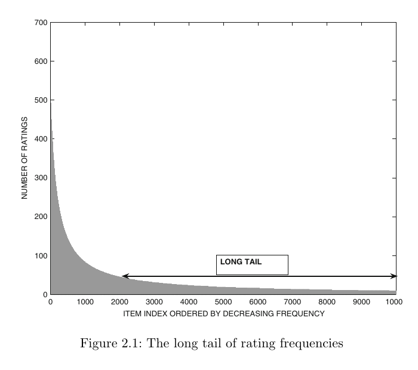

# 01 Overview {background-color="#EF7C00"}

```{=html}
<div aria-labelledby="w01-changelog-title" style="margin:1.2em auto 0;max-width:72%;padding:.55em .8em;border-left:3px solid #003D7C;border-radius:0 6px 6px 0;background:rgba(255,255,255,.78);color:#003D7C;font-family:Arial,Helvetica,sans-serif;font-size:.42em;line-height:1.35;">
  <h5 id="w01-changelog-title" style="margin:0 0 .25em;font-size:1em;font-weight:700;letter-spacing:.04em;text-transform:uppercase;">Changelog</h5>
  <ul style="margin:0;padding-left:1.2em;">
    <li><strong class="cp-text--teal">20 Aug 2026</strong> — Refined content and classroom layouts for this release.</li>
  </ul>
</div>
```

## <span style="color:#ffffff;">🎥 Video: Spotify Recommendations</span> {background-color="#000000"}

```{=html}
<div style="display:flex;align-items:center;justify-content:center;width:100%;height:76vh;background:#000;">
  <a href="https://www.youtube.com/watch?v=pGntmcy_HX8" target="_blank" rel="noopener" aria-label="Open video: How Spotify’s AI-Driven Recommendations Work">
    
  </a>
</div>
```

::: notes
:::

## Recommendations Everywhere

::: {.columns}
::: {.column width="52%"}
**Everyday surfaces**

Video, music, shopping, news, jobs, dating, maps, social feeds, and course resources.
:::
::: {.column width="48%"}
**Inputs** — behaviour, context, item attributes, social signals<br>
**Outputs** — a shortlist, ranking, or exposure decision
:::
:::

::: {.callout-warning}
A recommender does not merely retrieve information. It helps decide what receives attention — and what remains unseen.
:::

::: notes
:::

## CP Pilot Course

CP4285 is a **pilot** in the **CP428x Emerging Topics in Computer Science** series.

- We test and improve content, assessment, labs, tutorials, and delivery for future cohorts.
- Students help by self-learning, building **labs and tutorials**, **slide notes** for more comprehensive study.
- And documenting processes, gaps, and improvements.

::: {.callout-warning}
This means that your class notes will rarely be ready before class.  We have to create the materials from scratch.
:::

::: notes
:::

## <span style="color:#ffffff;">🎰 Bandit Time: Objectives</span> {background-color="#003D7C"}

```{=html}
<div class="cp-activity cp-activity--navy cp-activity--framed cp-grid cp-grid--2-aside">
  <div>
    <p style="font-size:1.35em;font-weight:bold;color:#EF7C00;margin:.35em 0;">Same data, different objective</p>
    <p style="margin:.4em 0;">Two systems use the same user data but optimise different objectives. What should we expect?</p>
    <div class="cp-choice-grid">
      <div class="cp-choice-card cp-choice-card--a"><strong>A.</strong> They should agree if they observe the same users and items.</div>
      <div class="cp-choice-card cp-choice-card--b"><strong>B.</strong> They may rank different items because the objective changes what gets exposed.</div>
      <div class="cp-choice-card cp-choice-card--c"><strong>C.</strong> They can differ only when one system has more user history.</div>
      <div class="cp-choice-card cp-choice-card--d"><strong>D.</strong> Different objectives change scores, but not the ordering of items.</div>
    </div>
    <p style="margin:.45em 0 0;"><strong>Choose an answer; justify it in one sentence.</strong></p>
  </div>
  <div style="text-align:center;">
    <svg width="140" height="140" viewBox="0 0 180 180" aria-label="Twenty second countdown timer"><circle cx="90" cy="90" r="75" fill="none" stroke="#ddd" stroke-width="14"/><circle cx="90" cy="90" r="62" fill="#fff"/><circle id="overview-mcq-ring" class="cp-timer__ring" cx="90" cy="90" r="75" fill="none" stroke="#EF7C00" stroke-width="14" stroke-dasharray="471.24" stroke-dashoffset="0" stroke-linecap="round" transform="rotate(-90 90 90)"/><text id="overview-mcq-text" class="cp-timer__text" x="90" y="98" text-anchor="middle" font-family="Arial" font-size="26" font-weight="bold" fill="#00796B">00:20</text></svg>
    <span id="overview-mcq-status" role="timer" aria-live="polite" class="cp-sr-only">00:20</span>
    <button id="overview-mcq-btn" type="button" class="cp-timer__button" data-cp-timer data-seconds="20" data-ring="overview-mcq-ring" data-text="overview-mcq-text" data-status="overview-mcq-status">▶ Start Timer</button>
  </div>
</div>

```

::: notes
:::

## 📶 AI Voice Mode

We are using AI Voice Mode experimentally to investigate the **ethics of recommenders**: how an interactive system explains trade-offs, frames uncertainty, and responds when we question who receives attention.

It is a conversation partner for inquiry, not an authority or a production recommender. Listen for what it assumes, what it leaves out, and how its wording could shape our judgement.

::: notes
:::

## <span style="color:#ffffff;">👥 Find the Recommender</span> {background-color="#003D7C"}

```{=html}
<div class="cp-activity cp-activity--navy cp-activity--framed cp-grid cp-grid--2-aside">
  <div>
    <p style="font-size:1.35em;font-weight:bold;color:#EF7C00;margin:.35em 0;">Audit one recommendation</p>
    <ol style="margin:.4em 0;padding-left:1.2em;line-height:1.35;">
      <li>Name one recommendation you received recently.</li>
      <li>What signals might the system have used?</li>
      <li>What objective might it be optimising?</li>
      <li>Who or what might be left unseen?</li>
    </ol>
    <p style="margin:.45em 0 0;"><strong>Compare with a partner; share one observation.</strong></p>
  </div>
  <div style="text-align:center;">
    <svg width="140" height="140" viewBox="0 0 180 180" aria-label="Three minute countdown timer"><circle cx="90" cy="90" r="75" fill="none" stroke="#ddd" stroke-width="14"/><circle cx="90" cy="90" r="62" fill="#fff"/><circle id="overview-activity-ring" class="cp-timer__ring" cx="90" cy="90" r="75" fill="none" stroke="#EF7C00" stroke-width="14" stroke-dasharray="471.24" stroke-dashoffset="0" stroke-linecap="round" transform="rotate(-90 90 90)"/><text id="overview-activity-text" class="cp-timer__text" x="90" y="98" text-anchor="middle" font-family="Arial" font-size="26" font-weight="bold" fill="#00796B">03:00</text></svg>
    <span id="overview-activity-status" role="timer" aria-live="polite" class="cp-sr-only">03:00</span>
    <button id="overview-activity-btn" type="button" class="cp-timer__button" data-cp-timer data-seconds="180" data-ring="overview-activity-ring" data-text="overview-activity-text" data-status="overview-activity-status">▶ Start Timer</button>
  </div>
</div>

```

::: notes
:::

## 📶 Ethics Thread

Recommendation systems allocate **attention, visibility, and opportunity**.

Historical data and engagement objectives can reproduce or amplify **bias**.

Personalisation raises questions about **privacy, transparency, exposure, fairness, and stakeholder impact**.

::: notes
Frame ethics as a recurring motif rather than a standalone final topic. Ask students to listen for the same questions whenever a later lecture introduces a new model or metric. Keep the optional recommendation-algorithm video in the instructor’s delivery notes as a backup.
:::

# 02 Schedule {background-color="#EF7C00"}

## 🛣️ Roadmap: Course Learning Outcomes

By the end of CP4285, you should be able to:

::: {.columns}
::: {.column width="50%"}
- **CLO 1:** Compare classical, content-based, collaborative-filtering, and hybrid methods.
- **CLO 2:** Implement matrix-factorization and neural recommenders.
- **CLO 3:** Design rigorous offline evaluation using ranking metrics.
- **CLO 4:** Analyse cold start and propose appropriate remedies.
:::
::: {.column width="50%"}
- **CLO 5:** Critique systems through fairness, privacy, transparency, and stakeholder impact.
- **CLO 6:** Explain sequential, graph-based, multi-objective, and LLM-enhanced systems.
- **CLO 7:** Design and justify an end-to-end recommender pipeline.
- **CLO 8:** Communicate and defend technical designs and results.
:::
:::

::: notes
:::

## Course Library

```{=html}
<div style="display:grid;grid-template-columns:minmax(250px,1fr) minmax(0,2.6fr);gap:1.3em;align-items:center;height:67vh;">
  <figure style="margin:0;text-align:center;">
    
    <figcaption style="margin-top:.45em;color:#003D7C;font-size:.62em;"><strong>Core textbook</strong><br>Charu C. Aggarwal, <em>Recommender Systems: The Textbook</em><br/>Focus of the first third of the course.</figcaption>
  </figure>
  <div style="min-width:0;">
    <p style="margin:0 0 .55em;color:#003D7C;font-size:.72em;font-weight:bold;">A course library for going deeper</p>
    <div style="display:grid;grid-template-columns:repeat(5,minmax(0,1fr));gap:.45em;align-items:start;">
      
      
      
      
      
      
      
      
      
      
    </div>
  </div>
</div>
```

::: notes
:::

## Weekly Topics

| Week | <span class="cp-text--teal">Date</span> | Topic |
|------|------|-------|
| 01 | <span class="cp-text--teal">11 Aug</span> | Recommendation Problems and Classical Methods |
| 02 | <span class="cp-text--teal">18 Aug</span> | Latent Factor Models |
| 03 | <span class="cp-text--teal">25 Aug</span> | Evaluation of Recommendation Systems |
| 04 | <span class="cp-text--teal">1 Sep</span> | Neural Recommendation Models |
| 05 | <span class="cp-text--teal">8 Sep</span> | Sequential and Session-Based Recommendation |
| 06 | <span class="cp-text--teal">15 Sep</span> | Retrieval and Ranking Architectures |

::: notes
:::

## Weekly Topics (cont.)

| Week | <span class="cp-text--teal">Date</span> | Topic |
|------|------|-------|
| — | <span class="cp-text--teal">22 Sep</span> | *Recess Week — No Class* |
| 07 | <span class="cp-text--teal">29 Sep</span> | Project Design Critique Workshop |
| 08 | <span class="cp-text--teal">6 Oct</span> | Learning-to-Rank |
| 09 | <span class="cp-text--teal">13 Oct</span> | Graph-Based Recommendation |
| 10 | <span class="cp-text--teal">20 Oct</span> | Multi-Objective Recommendation |
| 11 | <span class="cp-text--teal">27 Oct</span> | Exploration and Online Learning |
| 12 | <span class="cp-text--teal">3 Nov</span> | LLMs, Generative Recommendation, Research Frontiers |
| 13 | <span class="cp-text--teal">10 Nov</span> | **Final Project Presentations** @ 29th STePS |

::: notes
:::

## Class Meetings

- Time: Every <strong class="cp-text--teal">Tue, 10:00–12:00 SGT</strong>
- Venue: **Seminar Room 12, COM3-01-21**

Lectures will be recorded where technology permits — recordings are for **revision only**, not a substitute for attendance

There are **no tutorial sessions** for this course — We'll be building the materials for the next cohort.

::: notes
:::

# 03 Assignments & Grading {background-color="#EF7C00"}

## Grading Overview

| Component | Weight |
|-----------|--------|
| Class Participation | 10% |
| Essays | 20% |
| Group Project | 30% |
| In-Class Quizzes| 10% |
| Final Exam (<span class="cp-text--teal">Mon, 23 Nov 2026, 13:00–15:00</span>) | 30% |

## Class Participation (10%)
1. **In-lecture activities**
2. **Pre-lecture activities**
3. **Pre-Flight Survey** and **Midterm Survey**
    - *Pre-Flight Survey* (due Week 02; <span class="cp-text--teal">Mon, 17 Aug 2026 23:59 SGT</span>)
    - *Midterm Survey* (due Week 08; <span class="cp-text--teal">Mon, 5 Oct 2026 23:59 SGT</span>)

    Complete these on time — they are **free marks**

::: {.callout-warning}
Missing the Pre-Flight or Midterm Survey will directly reduce your participation grade. Don't forget to do them!
:::

::: notes
<!-- TODO (students): Did Min elaborate on how participation is tracked or what counts towards it? -->
:::

## Essays (20%)

**Two individual take-home essays**, each worth **10%**

  - **Essay 1:** Due Week 03; <span class="cp-text--teal">Mon, 24 Aug 2026 23:59 SGT</span>
  - **Essay 2:** Due Week 08; <span class="cp-text--teal">Mon 5 Oct 2026 23:59 SGT</span>

Short written analyses of recommender-system methods, evaluation choices, and social implications (8%).  Randomised peer review counts towards the remaining 2%.

AI tools are **permitted as a resource** — but an AI declaration is **mandatory** for each submission

::: {.callout-note}
Essays assess your own critical thinking. AI may assist but must not substitute your analysis.  So do them on your own, and don't let AI do the hard work of understanding; the process is more important than the outcome.
:::

::: notes
<!-- TODO (students): Were the essay topics or any example prompts discussed? -->
:::

## Project (30%)

- Groups have **2–4 students**
- Define a clear problem anchored on a selected **recommendation system dataset**

**Milestones:**

::: {.incremental}
- **Week 03:** Project Mini-team Declaration — <span class="cp-text--teal">Mon, 24 Aug 2026 23:59 SGT</span>
  - Submit a self-formed team or indicate that you need instructor placement
  - Min has the final decision on group formation (may override student-formed groups)
- **Week 07:** Project Design Critique Workshop
- **Week 13:** Final Project Presentation at 29th STePS: <span class="cp-text--teal">Wed, 11 Nov</span>
  - Teams presenting at 29th STePS do **not** submit a project report; other teams submit a report instead, due same <span class="cp-text--teal">Wed, 11 Nov 2026 23:59 SGT</span>
:::

::: notes
<!-- TODO (students): Did Min give any guidance on what makes a good project topic or dataset choice? -->
:::

## Recommendation Dataset Catalogue

<div style="height:68vh;display:flex;flex-direction:column;align-items:center;justify-content:center;">
  <a href="https://github.com/RUCAIBox/RecSysDatasets" target="_blank" rel="noopener" style="display:block;width:min(1120px,88%);">
    
  </a>
  <p style="margin:.7em 0 0;font-size:.68em;color:#00796B;font-weight:bold;">Click the screenshot to open the live dataset catalogue.</p>
  <p style="margin:.22em 0 0;font-size:.45em;color:#6b7280;">RUCAIBox. (n.d.). <em>RecSysDatasets</em> [GitHub repository]. <a href="https://github.com/RUCAIBox/RecSysDatasets" target="_blank" rel="noopener" class="cp-text--teal">github.com/RUCAIBox/RecSysDatasets</a></p>
</div>

::: notes
Click the screenshot to open the repository live. It is a useful starting point—not a recommendation to use any dataset without checking its documentation, licence, provenance, and representation risks.

[Sources]
- RUCAIBox. (n.d.). *RecSysDatasets* [GitHub repository]. https://github.com/RUCAIBox/RecSysDatasets
:::

## Quizzes (10%)

- Quizzes are **jointly created by peers and instructors**
- Peers contribute candidate questions, answers, and plausible distractors from their self-learning
  - Min will assign peers randomly to a week and section responsible.
  - Min will curate, verify, and finalise questions so that the assessments remains fair, accurate, and aligned with the course learning outcomes
- Combined worth **10%** of total marks
- **AI tools must not be used during in-class quizzes.**

::: {.callout-note}
Co-creation makes quizzes part of the pilot course: students help build better learning materials for this cohort and future cohorts.  
:::

::: notes
:::

## Authority Chain

Our slides will be the most authoritative source of truth.

While the we will try to get the slides synced with the website or Canvas, use information introduced in lecture as **the definitive source**.

There will likely be errors in the lecture, so check any doubts or questions with Min.

Unless a slide or Canvas announcement specifies otherwise, assignment deadlines are <strong class="cp-text--teal">Mondays, 23:59 SGT</strong>.

::: {.callout-note}
The slide deck built in Quarto and rendered through `reveal.js`.  The website is also built Hugo and served using Github Pages.  This means any student, member of the public, or AI can inspect all details of the course.  Use this to your advantage.
:::


## {background-color="#000000"}

```{=html}
<div style="display:grid;grid-template-columns:minmax(0,1.15fr) minmax(260px,.85fr);align-items:center;gap:5vw;height:72vh;padding:0 5vw;color:#fff;font-family:Arial,Helvetica,sans-serif;">
  <div style="max-width:700px;">
    <p style="margin:0 0 .45em;color:#EF7C00;font-size:.72em;font-weight:bold;letter-spacing:.12em;text-transform:uppercase;">☕ Break · the recommendation desk</p>
    
    <p style="margin:.55em 0 0;color:#d1d5db;font-size:.56em;line-height:1.35;">Mrs. Arabella Murray, librarian, works at her desk while five girls read at a nearby table.</p>
    <p style="margin:.45em 0 0;color:#aeb6c2;font-size:.34em;line-height:1.2;">Digital Public Library of America. (n.d.). <em>Photograph of a librarian at the Dunbar Branch Library, Athens, Georgia, 1944–1948</em> [Photograph]. <a href="https://dp.la/item/622d044817a76960015abe2bb69673f4" target="_blank" rel="noopener" class="cp-text--orange">Source</a></p>
  </div>
  <div style="display:flex;flex-direction:column;align-items:center;text-align:center;">
    <svg width="210" height="210" viewBox="0 0 180 180" aria-label="Five minute break countdown timer">
      <circle cx="90" cy="90" r="75" fill="none" stroke="#444" stroke-width="14"/>
      <circle cx="90" cy="90" r="62" fill="#fff"/>
      <circle id="w01-break-ring" class="cp-timer__ring" cx="90" cy="90" r="75" fill="none" stroke="#EF7C00" stroke-width="14" stroke-dasharray="471.24" stroke-dashoffset="0" stroke-linecap="round" transform="rotate(-90 90 90)"/>
      <text id="w01-break-text" class="cp-timer__text" x="90" y="98" text-anchor="middle" font-family="Arial,Helvetica,sans-serif" font-size="30" font-weight="bold" fill="#00796B">05:00</text>
    </svg>
    <span id="w01-break-status" role="timer" aria-live="polite" class="cp-sr-only">05:00</span>
    <button id="w01-break-button" type="button" class="cp-timer__button" data-cp-timer data-seconds="300" data-ring="w01-break-ring" data-text="w01-break-text" data-status="w01-break-status">▶ Start Timer</button>
  </div>
</div>

```

::: notes
Start the five-minute timer when announcing the break.

[Sources]
- Digital Public Library of America. (n.d.). *Photograph of a librarian at the Dunbar Branch Library, Athens, Georgia, 1944–1948* [Photograph]. https://dp.la/item/622d044817a76960015abe2bb69673f4
:::

# 04 Recommendation Problems and Decision Goals {background-color="#EF7C00"}

- User–item matrices, feedback, and missingness
- Prediction, top-*k* ranking, and useful lists
- Signals and classical recommendation strategies
- Cold start and heavy-head/long-tail exposure
- Treatment lenses and safeguards

::: notes
Orient students to the decision problem before introducing methods. This section draws on Chapters 1, 2, and 5 of Aggarwal (2016).

[Sources]
- Aggarwal, C. C. (2016). *Recommender systems: The textbook*. Springer. Chapters 1, 2, 5.
:::

## The User–Item Matrix

::: {.columns}
::: {.column width="60%"}

<div style="font-size:.84em;line-height:1.1;">

| $R$ | $i_1$ | $i_2$ | $i_3$ | $i_4$ | $i_5$ |
|---|:---:|:---:|:---:|:---:|:---:|
| $u_1$ | 5 | ? | 2 | 4 | ? |
| $u_2$ | ? | 4 | ? | 1 | 3 |
| $u_3$ | ? | ? | ? | ? | ? |
| $u_4$ | 3 | ? | 4 | ? | 2 |
| $u_5$ | ? | 2 | ? | 5 | ? |
| $u_6$ | 5 | 4 | 5 | 2 | 4 |
| $u_7$ | 5 | 1 | 5 | 1 | 5 |
| $u_8$ | ? | ? | 4 | ? | ? |

</div>

:::
::: {.column width="40%"}

$$R \in \mathbb{R}^{|U|\times|I|}$$

- $u \in U$: user; $i \in I$: item
- $r_{ui}$: observed feedback
- $\Omega$: observed $(u,i)$ pairs

::: {.callout-warning}
A `?` is usually **unobserved**, not a negative rating.
:::

::: {.callout-tip .to-think-about title="To think about"}
What user types might be represented in the matrix? <BR/>
What other forms can “ratings” take?
:::
:::
:::

::: notes
Introduce the standard user–item notation now, because it anchors later neighbourhood and latent-factor models. Use the added rows as hypotheses, not diagnoses: a dense row may be a power rater; an extreme patterned row may warrant a shill/robustness question; a sparse row may reflect occasional use rather than dislike. Explain that a static rating row cannot establish a social, novelty, or metadata-driven treatment need by itself.

[Sources]
- Aggarwal, C. C. (2016). *Recommender systems: The textbook*, Chapters 1–2.
:::

## From a Score to a Useful List

::: {.columns}
::: {.column width="45%"}
### Prediction

Estimate a value such as $\widehat{r}_{ui}$ for one user–item pair.

*Question:* “Will this user rate this film highly?”
:::
::: {.column width="10%"}
&nbsp;
:::
::: {.column width="45%"}
### Top-*k* ranking

Order candidate items and present a short list.

*Question:* “Which five films should appear first, now?”

<u>Accurate scores do not automatically make a useful list.</u>
:::
:::

::: {.callout-tip .to-think-about title="To think about"}
Does top-*k* apply to users as well as items?
:::

::: notes
Combine the earlier prediction-versus-ranking distinction with usefulness. Explain that ranking is the usual product surface: users see a small, ordered set rather than a score for every item.

[Sources]
- Aggarwal, C. C. (2016). *Recommender systems: The textbook*, Chapter 1.
:::

## Signals and Usefulness

::: {.columns}
::: {.column width="52%"}
<div style="display:grid;grid-template-columns:1.35fr 1fr;gap:.35em;color:#fff;font-size:.73em;line-height:1.2;">
  <div style="grid-row:span 2;padding:.85em;border-radius:8px;background:#003D7C;"><strong>Interaction signals</strong><br><span style="font-size:.85em">ratings · clicks · saves · purchases</span></div>
  <div style="padding:.65em;border-radius:8px;background:#EF7C00;"><strong>Item signals</strong><br><span style="font-size:.85em">metadata · text · images</span></div>
  <div style="padding:.65em;border-radius:8px;background:#6b7280;"><strong>Context</strong><br><span style="font-size:.85em">time · device · place</span></div>
  <div style="grid-column:span 2;padding:.65em;border-radius:8px;background:#4b7f52;"><strong>Social and operational signals</strong><br><span style="font-size:.85em">friends · availability · constraints</span></div>
</div>

::: {.callout-note}
The right evaluation follows the intended usefulness — not just the available data.
:::
:::
::: {.column width="48%"}
### A useful recommendation can be …

- **relevant** to the task
- **novel** or serendipitous
- **diverse** across the list
- **well covered** across a catalogue
- **explainable** and constraint-respecting
:::
:::

::: notes
Use the treemap as a compact taxonomy of inputs. On the right, reprise the distinction between system signals and the properties by which a list should be judged. Avoid presenting any single objective as universally correct.

[Sources]
- Aggarwal, C. C. (2016). *Recommender systems: The textbook*, Chapters 1 and 5.
:::

## {background-color="#003D7C"}

```{=html}
<div class="cp-frame-bg cp-frame-orange"></div>
<div class="cp-frame-content" style="color:#fff;">
  <div class="cp-frame-title" class="cp-text--orange">👥 Signal Hunt</div>
  <div class="cp-frame-body" style="font-size:.72em;line-height:1.3;display:grid;grid-template-columns:minmax(0,1fr) minmax(0,1fr) 190px;gap:1.15em;align-items:center;color:#fff;">
  <div style="display:grid;grid-template-columns:1.35fr 1fr;gap:.35em;color:#fff;font-size:.92em;line-height:1.2;">
    <div style="grid-row:span 2;padding:.85em;border-radius:8px;background:#003D7C;border:1px solid rgba(255,255,255,.5);"><strong>Interaction signals</strong><br><span style="font-size:.85em">ratings · clicks · saves · purchases</span></div>
    <div style="padding:.65em;border-radius:8px;background:#EF7C00;"><strong>Item signals</strong><br><span style="font-size:.85em">metadata · text · images</span></div>
    <div style="padding:.65em;border-radius:8px;background:#6b7280;"><strong>Context</strong><br><span style="font-size:.85em">time · device · place</span></div>
    <div style="grid-column:span 2;padding:.65em;border-radius:8px;background:#4b7f52;"><strong>Social and operational signals</strong><br><span style="font-size:.85em">friends · availability · constraints</span></div>
  </div>
  <div>
    <p style="font-size:1.18em;font-weight:bold;color:#EF7C00;margin:.25em 0;">What else could a recommender capture?</p>
    <ol style="margin:.45em 0;padding-left:1.15em;line-height:1.38;">
      <li>Name <strong>three</strong> additional signals.</li>
      <li>Place each in a box at left — or argue for a new box.</li>
      <li>For one signal, name a benefit and a privacy, fairness, or manipulation risk.</li>
    </ol>
    <p style="margin:.4em 0 0;"><strong>Pairs: prepare one signal to report.<br/>📶 to critique ethical standpoint.</strong></p>
  </div>
  <div style="text-align:center;">
    <svg width="140" height="140" viewBox="0 0 180 180" aria-label="Two minute countdown timer"><circle cx="90" cy="90" r="75" fill="none" stroke="#ddd" stroke-width="14"/><circle cx="90" cy="90" r="62" fill="#fff"/><circle id="signal-hunt-ring" class="cp-timer__ring" cx="90" cy="90" r="75" fill="none" stroke="#EF7C00" stroke-width="14" stroke-dasharray="471.24" stroke-dashoffset="0" stroke-linecap="round" transform="rotate(-90 90 90)"/><text id="signal-hunt-text" class="cp-timer__text" x="90" y="98" text-anchor="middle" font-family="Arial" font-size="26" font-weight="bold" fill="#00796B">02:00</text></svg>
    <span id="signal-hunt-status" role="timer" aria-live="polite" class="cp-sr-only">02:00</span>
    <button id="signal-hunt-btn" type="button" class="cp-timer__button" data-cp-timer data-seconds="120" data-ring="signal-hunt-ring" data-text="signal-hunt-text" data-status="signal-hunt-status">▶ Start Timer</button>
  </div>
</div>
</div>

```

::: notes
Small-group activity, 2-minute timer plus two minutes for sharing and synthesis. Expected examples include skips, dwell time, completion rate, search queries or reformulations, repeated views, price sensitivity, stock or availability, reports/blocks, creator relationships, and accessibility preferences. Ask students to distinguish what is technically collectable from what is appropriate to collect or infer.
:::

## {background-color="#003D7C"}

```{=html}
<div class="cp-frame-bg cp-frame-orange"></div>
<div class="cp-frame-content" style="color:#fff;">
  <div class="cp-frame-title" class="cp-text--orange">👥 Complete the Classical Methods Table</div>
  <div class="cp-frame-body" style="font-size:.75em;line-height:1.28;color:#fff;">
  <p style="font-size:1.15em;font-weight:bold;color:#EF7C00;margin:.2em 0 .55em;">In pairs, complete the four orange cells. Be ready to justify one answer from the evidence each method uses.</p>
  <table style="width:100%;border-collapse:separate;border-spacing:0;border-radius:8px;overflow:hidden;background:#fff;color:#003D7C;font-size:.92em;">
    <thead><tr style="background:#fff;color:#003D7C;"><th class="cp-table__cell--section">Approach</th><th class="cp-table__cell--section">Main evidence</th><th class="cp-table__cell--section">Useful when</th><th class="cp-table__cell--section">Early limitation</th></tr></thead>
    <tbody>
      <tr><td class="cp-table__cell"><strong>Popularity</strong></td><td class="cp-table__cell">aggregate interactions</td><td class="cp-table__cell cp-table__cell--highlight">________</td><td class="cp-table__cell">reinforces the head</td></tr>
      <tr><td class="cp-table__cell"><strong>Content-based</strong></td><td class="cp-table__cell">item attributes + one user</td><td class="cp-table__cell">features are meaningful</td><td class="cp-table__cell cp-table__cell--highlight">________</td></tr>
      <tr><td class="cp-table__cell"><strong>Collaborative filtering</strong></td><td class="cp-table__cell">patterns across users</td><td class="cp-table__cell cp-table__cell--highlight">________</td><td class="cp-table__cell">sparse or cold data</td></tr>
      <tr><td style="padding:.48em .65em;"><strong>Knowledge-based</strong></td><td style="padding:.48em .65em;">requirements and constraints</td><td style="padding:.48em .65em;">history is weak</td><td style="padding:.48em .65em;background:#fff3e0;color:#9a4d00;font-weight:bold;">________</td></tr>
    </tbody>
  </table>
</div>
</div>
```

::: notes
Small-group table-completion activity, deliberately untimed at the instructor's direction. Ask students to complete the two missing "Useful when" cells and the two missing "Early limitation" cells before advancing. Prompt: what evidence does each approach need, and what does it systematically fail to see? Take one justification before advancing to the debrief.

[Sources]
- Aggarwal, C. C. (2016). *Recommender systems: The textbook*, Chapters 1, 2, and 5.
:::

## Four Classical Starting Points

| Approach | Main evidence | Useful when | Early limitation |
|---|---|---|---|
| Popularity | aggregate interactions | little personal data | reinforces the head |
| Content-based | item attributes + one user | features are meaningful | narrow, familiar lists |
| Collaborative filtering | patterns across users | history is available | sparse or cold data |
| Knowledge-based | requirements and constraints | history is weak | needs elicitation |

::: notes
Discussion debrief. Reveal the complete table, draw out why popularity can be a sensible fallback but reinforces the heavy head, and position knowledge-based recommendation as a requirements-driven alternative for Section 06.

[Sources]
- Aggarwal, C. C. (2016). *Recommender systems: The textbook*, Chapters 1, 2, and 5.
:::

## When the Matrix Has No Answer

::: {.columns}
::: {.column width="50%"}
### ❄️ Cold start

- **New user:** no observed preferences
- **New item:** no interaction evidence
- **New system:** few observations overall
:::
::: {.column width="50%"}
### A response is a design choice

- ask for requirements or examples
- use item metadata
- use a transparent popularity fallback
- reserve exposure for new or long-tail items
:::
:::

::: notes
Treat cold start as an information problem rather than a bug. The response changes what the system learns and which items can become visible.

[Sources]
- Aggarwal, C. C. (2016). *Recommender systems: The textbook*, Chapters 1 and 5.
:::

## 🎰 Bandit Time: What should this system optimise? {background-color="#003D7C"}

```{=html}
<div class="cp-activity cp-activity--navy cp-activity--framed cp-grid cp-grid--2-aside">
  <div>
    <p style="font-size:1.2em;font-weight:bold;color:#EF7C00;margin:.25em 0;">A campus library has sparse borrowing history and a student asks for “a short, accessible book on climate migration.”</p>
    <div class="cp-choice-grid">
      <div class="cp-choice-card cp-choice-card--a"><strong>A.</strong> Maximise predicted rating from the sparse matrix only.</div>
      <div class="cp-choice-card cp-choice-card--b"><strong>B.</strong> Use stated requirements and explain the match.</div>
      <div class="cp-choice-card cp-choice-card--c"><strong>C.</strong> Show the globally most-borrowed books.</div>
      <div class="cp-choice-card cp-choice-card--d"><strong>D.</strong> Remove every item with little interaction history.</div>
    </div>
  </div>
  <div style="text-align:center;">
    <svg width="140" height="140" viewBox="0 0 180 180" aria-label="Twenty second countdown timer"><circle cx="90" cy="90" r="75" fill="none" stroke="#ddd" stroke-width="14"/><circle cx="90" cy="90" r="62" fill="#fff"/><circle id="section04-mcq-ring" class="cp-timer__ring" cx="90" cy="90" r="75" fill="none" stroke="#EF7C00" stroke-width="14" stroke-dasharray="471.24" stroke-dashoffset="0" stroke-linecap="round" transform="rotate(-90 90 90)"/><text id="section04-mcq-text" class="cp-timer__text" x="90" y="98" text-anchor="middle" font-family="Arial" font-size="26" font-weight="bold" fill="#00796B">00:20</text></svg>
    <span id="section04-mcq-status" role="timer" aria-live="polite" class="cp-sr-only">00:20</span>
    <button id="section04-mcq-btn" type="button" class="cp-timer__button" data-cp-timer data-seconds="20" data-ring="section04-mcq-ring" data-text="section04-mcq-text" data-status="section04-mcq-status">▶ Start Timer</button>
  </div>
</div>

```

::: notes
MCQ. Allow 20 seconds for an individual response, then ask for one justification. Best answer: B. It responds to stated requirements and can explain the match; it still needs careful handling of the student’s terms and catalogue coverage. A, C, and D are plausible fallbacks but do not answer the stated task well.

[Sources]
- Aggarwal, C. C. (2016). *Recommender systems: The textbook*, Chapter 5.
:::

## {background-color="#003D7C"}

<div style="height:72vh;display:flex;align-items:center;justify-content:center;text-align:center;color:#fff;">
  <p style="max-width:1100px;margin:0;font-size:2.05em;line-height:1.18;font-weight:bold;color:#fff;">“What types of users are there?”</p>
</div>

::: notes
Pause before introducing the treatment lenses. Let the question hang briefly; do not solicit demographic labels or assume that a person has one fixed recommender identity. The next slides reframe the answer as situational treatment lenses.
:::

## 🃏 Key Users to Consider

We'll use **card suits** as *User Archetypes* (treatment lenses) to reason about the outcomes. These are not demographic labels or permanent personalities. They are **situational lenses** for asking what a recommender should protect or provide.

| User Archetype | Ask the system to consider |
|---|---|
| ♣ **Clubs — adversarial / shill** | manipulation, coordinated abuse, robustness |
| <span style="color:#D32F2F;">♥</span> **Hearts — social** | social evidence, influence, conformity risk |
| <span style="color:#D32F2F;">♦</span> **Diamonds — novelty seeker** | freshness, diversity, serendipity, new-item exposure |
| ♠ **Spades — loyalist / metadata-driven** | stable attributes, filters, consistency, explanation |

::: notes
This combines the introduction and definition of the card-suit lenses. Stress that a student can shift lenses between a routine purchase, a social discovery task, and a high-stakes requirement-driven search.
:::

## 🃏 Four Different Safeguards

::: {.columns}
::: {.column width="50%"}
### <span style="color:#000000;">♣</span> Clubs

Can coordinated ratings force a target item into the list?

### <span style="color:#D32F2F;">♥</span> Hearts

Does a social cue inform the user without creating unwanted exposure or conformity?
:::
::: {.column width="50%"}
### <span style="color:#D32F2F;">♦</span> Diamonds

Does the list include genuinely new, long-tail, or emerging options?

### <span style="color:#000000;">♠</span> Spades

Can the user keep an important attribute fixed and understand why an item appears?
:::
:::

<u>“Good recommendation” changes when the risk, task, and user situation change.</u>

::: notes
Combine the prior mapping and safeguards slide. Keep the examples concrete but do not suggest that a method maps permanently to one user type. These lenses are carried forward into later technical sections.
:::

## {background-color="#003D7C"}

```{=html}
<div class="cp-frame-bg cp-frame-orange"></div>
<div class="cp-frame-content" style="color:#fff;">
  <div class="cp-frame-title" class="cp-text--orange">👥 Reprise: Find the Recommender</div>
  <div class="cp-frame-body" style="font-size:.70em;line-height:1.3;display:grid;grid-template-columns:minmax(0,1fr) 190px;gap:1.3em;align-items:center;color:#fff;">
  <div>
    <p style="font-size:1.18em;font-weight:bold;color:#EF7C00;margin:.25em 0;">Return to the recommendation you audited in Section 01.</p>
    <ol style="margin:.35em 0;padding-left:1.2em;line-height:1.35;">
      <li>Name the likely signal and objective.</li>
      <li>Is it predicting a response or ranking a shortlist?</li>
      <li>Choose one user archetype to critique: a requirement, diversity/coverage target, explanation, or abuse check.</li>
    </ol>
    <p style="margin:.4em 0 0;"><strong>Pairs: write a four-line audit.<BR/>📶 critique one omitted stakeholder or assumption; challenge its answer.</strong></p>
  </div>
  <div style="text-align:center;">
    <svg width="140" height="140" viewBox="0 0 180 180" aria-label="Three minute countdown timer"><circle cx="90" cy="90" r="75" fill="none" stroke="#ddd" stroke-width="14"/><circle cx="90" cy="90" r="62" fill="#fff"/><circle id="section04-activity-ring" class="cp-timer__ring" cx="90" cy="90" r="75" fill="none" stroke="#EF7C00" stroke-width="14" stroke-dasharray="471.24" stroke-dashoffset="0" stroke-linecap="round" transform="rotate(-90 90 90)"/><text id="section04-activity-text" class="cp-timer__text" x="90" y="98" text-anchor="middle" font-family="Arial" font-size="26" font-weight="bold" fill="#00796B">03:00</text></svg>
    <span id="section04-activity-status" role="timer" aria-live="polite" class="cp-sr-only">03:00</span>
    <button id="section04-activity-btn" type="button" class="cp-timer__button" data-cp-timer data-seconds="180" data-ring="section04-activity-ring" data-text="section04-activity-text" data-status="section04-activity-status">▶ Start Timer</button>
  </div>
</div>
</div>

```

::: notes
Small-group activity, 3-minute timer. Students reprise the Section 01 audit with a more precise vocabulary: signal, objective, prediction/ranking, heavy head/long tail, and a safeguard. Invite the AI Voice agent only after pairs have written their own audit. Ask it: “Whose interests might this recommendation overlook, and what assumption are you making?” Treat its reply as an object of critique, not an answer. Reserve one minute for two groups to report and correct the idea that a missing interaction is a negative preference.
:::

# 05 Neighborhood-Based Collaborative Filtering (CF) {background-color="#EF7C00"}

- Rating types, sparse matrices, and long-tail evidence
- User–user and item–item neighbourhoods
- Similarity measures: Pearson, raw cosine, adjusted cosine, and confidence
- Worked examples: from shared evidence to a similarity score
- From a chosen neighbourhood to a prediction

::: notes
Introduce collaborative filtering as a way to use patterns in observed entries rather than item descriptions or stated rules. Focus first on the mechanics and assumptions of neighbourhood methods; the suit lenses return in the closing discussion to test how a context changes the modelling choice.

[Sources]
- Aggarwal, C. C. (2016). *Recommender systems: The textbook*, Chapter 2, pp. 31-43.
:::

## Rating Types

::: {.columns}
::: {.column width="50%"}

- Continuous ratings
- Forced-choice ratings
- Ordinal ratings
- Binary ratings
:::
::: {.column width="50%"}

- Unary ratings
- Explicit ratings
- Implicit ratings
:::
:::

::: {.callout-note}
**Missing-value imputation:** do not treat an unobserved explicit rating as a default score; pre-substitution can introduce bias.
:::

::: {.callout-tip .to-think-about title="To think about"}
How do missing values impact training and testing in recommendation systems?
:::

::: notes
Open Chapter 2 by recalling what an observed entry can mean. Keep this slide to the textbook's terms only; do not explain each type here. The scale and observation process determine what a missing entry means. For unary/implicit data, a zero substitution is sometimes used as a practical initial assumption, but it remains a modelling choice rather than an observed dislike.

[Sources]
- Aggarwal, C. C. (2016). *Recommender systems: The textbook*, Section 1.3.1.1-1.3.1.2, pp. 10-13.
:::

## The Long Tail

::: {.columns}
::: {.column width="39%"}

<div style="font-size:.82em;line-height:1.32;">
<ul>
<li>A small heavy head receives most ratings.</li>
<li>The long tail holds many items with little evidence.</li>
<li>Thin overlap makes neighbourhood similarity uncertain.</li>
<li>Head-only ranking can reinforce what is already visible.</li>
</ul>
<p style="margin:.65em 0 0;color:#EF7C00;font-weight:bold;">The tail is under-observed, not empty.</p>
</div>
:::
::: {.column width="61%"}



<p style="margin:.25em 0 0;text-align:center;font-size:.48em;color:#6b7280;">Source: Aggarwal (2016), p. 33.</p>
:::
:::

::: notes
Read the figure literally: item frequency falls sharply, then extends across a long tail of lightly rated items. Connect this to the matrix: rare items and sparse users reduce overlap, while a head-only ranking policy can concentrate exposure further. Do not imply that every tail item is good; the point is that a lack of ratings is not a lack of catalogue value.

[Sources]
- Aggarwal, C. C. (2016). *Recommender systems: The textbook*, Figure 2.1, p. 33.
:::

## From a Sparse Matrix to a Neighborhood

::: {.columns}
::: {.column width="52%"}
```{=html}
<table style="width:100%;border-collapse:collapse;text-align:center;">
  <thead style="background:#003D7C;color:#fff;">
    <tr><th style="padding:.28em;text-align:left;">User</th><th style="padding:.28em;border:3px solid #D32F2F;"><i>i</i><sub>1</sub></th><th style="padding:.28em;"><i>i</i><sub>2</sub></th><th style="padding:.28em;border:3px solid #D32F2F;"><i>i</i><sub>3</sub></th><th style="padding:.28em;border:3px solid #D32F2F;"><i>i</i><sub>4</sub></th><th style="padding:.28em;"><i>i</i><sub>5</sub></th></tr>
  </thead>
  <tbody>
    <tr style="background:#F0F8F6;color:#00796B;font-weight:700;"><th style="padding:.24em;text-align:left;"><i>u</i><sub>1</sub> (<i>u</i>)</th><td class="cp-divider--red">5</td><td>?</td><td class="cp-divider--red">2</td><td class="cp-divider--red">4</td><td>?</td></tr>
    <tr style="background:#FFF5EA;color:#A24B00;font-weight:700;"><th style="padding:.24em;text-align:left;"><i>u</i><sub>6</sub> (<i>v</i>)</th><td class="cp-divider--red" style="border-bottom:3px solid #D32F2F;">5</td><td>4</td><td class="cp-divider--red" style="border-bottom:3px solid #D32F2F;">5</td><td class="cp-divider--red" style="border-bottom:3px solid #D32F2F;">2</td><td>4</td></tr>
  </tbody>
</table>
```

<div style="font-size:.82em;line-height:1.35;margin-top:.5em;">
<p><span class="cp-text--orange cp-text--strong">Mutual evidence</span></p>
</div>

$$
I_{\color{teal}{u_1}} \cap I_{\color{orange}{u_6}} = \{i_1,i_3,i_4\}
$$

<div style="font-size:.82em;line-height:1.35;">
<p><span class="cp-text--teal cp-text--strong">User-based CF</span><br/>
Find users who rate overlapping items similarly.</p>
<p><span class="cp-text--navy cp-text--strong">Item-based CF</span><br/>
Transpose the question: find items that receive similar patterns of ratings.</p>
</div>
:::
::: {.column width="48%"}

### Standard notation

- $I_u$: items observed for user $u$
- $U_i$: users who observed item $i$
- $I_u \cap I_v$: shared evidence for a user pair
- $P_u(j)$: the neighbours of $u$ who rated target item $j$

::: {.callout-warning}
### Similarity is not a fact

It is an estimate from a partial overlap. With sparse data, two users may have no common ratings at all.
:::
:::
:::

::: notes
[Sources]
- Aggarwal, C. C. (2016). *Recommender systems: The textbook*, Chapter 2, Section 2.3, pp. 33-35.
:::

## Similarity I: Pearson Correlation

$$
\operatorname{Pearson}(u,v)=
\frac{\sum_{\color{orange}{k\in I_u\cap I_v}}\!\bigl(\color{teal}{r_{uk}-\mu_u}\bigr)\bigl(\color{teal}{r_{vk}-\mu_v}\bigr)}
{\color{navy}{\sqrt{\sum_{\color{orange}{k\in I_u\cap I_v}}\!\bigl(r_{uk}-\mu_u\bigr)^2}\;\sqrt{\sum_{\color{orange}{k\in I_u\cap I_v}}\!\bigl(r_{vk}-\mu_v\bigr)^2}}}
$$

::: {.columns}
::: {.column width="61%"}

<div style="font-size:.78em;line-height:1.35;">
<p><span class="cp-text--orange cp-text--strong">Overlap:</span> only mutually rated items contribute.</p>
<p><span class="cp-text--teal cp-text--strong">Centred Rating:</span> rating minus that user's mean, so generous and harsh raters are put on a comparable baseline.</p>
<p><span class="cp-text--navy cp-text--strong">Normalisation:</span> turns aligned variation into a bounded correlation-like score.</p>
</div>
:::
::: {.column width="44%"}

### Use it when

Rating-scale differences matter.

### Watch for

Very small overlap can create an unstable correlation.
:::
:::

::: notes
Read the equation by colour, not symbol by symbol. Orange selects comparable evidence; teal removes each user's baseline; navy normalises the result. Pearson is usually preferable to raw cosine in explicit-rating settings because mean-centering adjusts for different levels of rating generosity.

[Sources]
- Aggarwal, C. C. (2016). *Recommender systems: The textbook*, Equation 2.2 and Section 2.3.1.1, pp. 35, 37.
:::

## Worked Example I: Pearson Correlation

### User–user example: users 1 and 6

::: {.columns}
::: {.column width="45%"}
**Excerpt from the user-item matrix $R$**

| User | $i_1$ | $i_2$ | $i_3$ | $i_4$ | $i_5$ |
|---|:---:|:---:|:---:|:---:|:---:|
| $u_1$ | 5 | ? | 2 | 4 | ? |
| $u_6$ | 5 | 4 | 5 | 2 | 4 |
:::
::: {.column width="55%"}
::: {style="font-size:.78em;line-height:1.15;"}
**Step 1 — begin with the same overlap**

$$I_{u_1}\cap I_{u_6}=\{i_1,i_3,i_4\}$$

::: {.fragment}
**Step 2 — subtract each user's own mean**

$$\mu_1=\frac{11}{3},\quad \mu_6=4$$
$$\mathbf s_1=\left(\frac{4}{3},-\frac{5}{3},\frac{1}{3}\right),\quad \mathbf s_6=(1,1,-2)$$
:::

::: {.fragment}
**Step 3 — correlate the centred vectors**

$$\operatorname{Pearson}(u_1,u_6)=\frac{-1}{\sqrt{14/3}\sqrt{6}}=-0.189$$
:::
:::
:::
:::

::: notes
Advance through the fragments. The overlap is $\{i_1,i_3,i_4\}$; Pearson's adjustment is the centring step. Compare the negative Pearson score with raw cosine on the next pair of slides: centring reveals that the users' deviations from their own baselines do not align.

[Sources]
- Aggarwal, C. C. (2016). *Recommender systems: The textbook*, Equation 2.2 and Section 2.3.1.1, pp. 35, 37.
:::

## Similarity II: Raw Cosine

$$
\operatorname{raw\text{-}cosine}(u,v)=
\frac{\sum_{\color{orange}{k\in I_u\cap I_v}} \color{teal}{r_{uk}\,r_{vk}}}
{\color{navy}{\sqrt{\sum_{\color{orange}{k\in I_u\cap I_v}}r_{uk}^{2}}\;\sqrt{\sum_{\color{orange}{k\in I_u\cap I_v}}r_{vk}^{2}}}}
$$

::: {.columns}
::: {.column width="56%"}

<div style="font-size:.78em;line-height:1.35;">
<p><span class="cp-text--orange cp-text--strong">Overlap:</span> compare only entries both users supplied.</p>
<p><span class="cp-text--teal cp-text--strong">Dot Product:</span> large ratings in the same positions increase similarity.</p>
<p><span class="cp-text--navy cp-text--strong">Vector Length:</span> corrects for the overall magnitude of each observed rating vector.</p>
</div>
:::
::: {.column width="44%"}

### Use it when

Raw magnitude is meaningful or ratings are already on a comparable scale.

### Watch for

It does not remove a user's tendency to rate high or low.
:::
:::

::: notes
Cosine asks whether two observed rating vectors point in a similar direction. Unlike Pearson, it uses raw ratings. Make the limitation concrete: two generous raters may look close partly because both values are high. The textbook describes Pearson as generally preferable when this generosity bias is relevant.

[Sources]
- Aggarwal, C. C. (2016). *Recommender systems: The textbook*, Equation 2.5 and Section 2.3.1.1, pp. 37-38.
:::

## Worked Example II: Raw Cosine

### Users 1 and 6

::: {.columns}
::: {.column width="45%"}
**Excerpt from the user-item matrix $R$**

| User | $i_1$ | $i_2$ | $i_3$ | $i_4$ | $i_5$ |
|---|:---:|:---:|:---:|:---:|:---:|
| $u_1$ | 5 | ? | 2 | 4 | ? |
| $u_6$ | 5 | 4 | 5 | 2 | 4 |

::: {.callout-tip .to-think-about title="To think about"}
What are the differences between cosine and Pearson here?
:::
:::
::: {.column width="55%"}
**Step 1 — keep only shared ratings**

$$I_{u_1}\cap I_{u_6}=\{i_1,i_3,i_4\}$$

::: {.fragment}
**Step 2 — form the two rating vectors**

$$\mathbf r_1=(5,2,4)\qquad \mathbf r_6=(5,5,2)$$
:::

::: {.fragment}
**Step 3 — normalise their dot product**

$$\operatorname{raw\text{-}cosine}(u_1,u_6)=\frac{43}{\sqrt{45}\sqrt{54}}=0.872$$
:::
:::
:::

::: notes
Advance through the three fragments. The important simplification is that the raw cosine is applied only to the three shared ratings, not to missing entries. Point out that the numerator is the dot product 43 and the denominator normalises the two vector lengths.

[Sources]
- Aggarwal, C. C. (2016). *Recommender systems: The textbook*, Equation 2.5 and Section 2.3.1.1, pp. 37-38.
:::

## Similarity III: Adjusted Cosine for Items

$$
\operatorname{adjusted\text{-}cosine}(i,j)=
\frac{\sum_{\color{orange}{u\in U_i\cap U_j}} \color{teal}{s_{ui}\,s_{uj}}}
{\color{navy}{\sqrt{\sum_{\color{orange}{u\in U_i\cap U_j}}s_{ui}^{2}}\;\sqrt{\sum_{\color{orange}{u\in U_i\cap U_j}}s_{uj}^{2}}}}
\qquad \color{teal}{s_{ui}=r_{ui}-\mu_u}
$$

::: {.columns}
::: {.column width="56%"}

<div style="font-size:.78em;line-height:1.35;">
<p><span class="cp-text--orange cp-text--strong">Shared Raters:</span> users who rated both items.</p>
<p><span class="cp-text--teal cp-text--strong">User-Centred Rating $s_{ui}$:</span> remove each rater's personal baseline before comparing item columns.</p>
<p><span class="cp-text--navy cp-text--strong">Normalisation:</span> compare the centred item vectors fairly.</p>
</div>
:::
::: {.column width="44%"}

### Use it when

Building item-to-item neighbourhoods from explicit ratings.

### Watch for

It still needs sufficient shared raters; centring does not solve sparse overlap.
:::
:::

::: {.callout-tip .to-think-about title="To think about"}
What makes this an “adjusted” metric? Why don't we need a similar adjustment for user-based cosine?
:::

::: notes
The change is conceptual as well as notational: compare columns, so the overlap is now users, U_i intersection U_j. The textbook calls this adjusted cosine because each user's ratings are mean-centred before item similarity is calculated, and notes that it generally outperforms Pearson on item columns.

[Sources]
- Aggarwal, C. C. (2016). *Recommender systems: The textbook*, Equation 2.14 and Section 2.3.2, pp. 40-41.
:::

## Worked Example III: Item–Item

### Items $i_1$ and $i_5$ after user mean-centring

::: {.columns}
::: {.column width="35%"}
**Original user-item matrix $R$**

```{=html}
<table style="width:100%;border-collapse:collapse;text-align:center;font-size:.72em;line-height:1.12;">
  <thead style="background:#003D7C;color:#fff;"><tr><th style="padding:.28em;"><i>R</i></th><th style="padding:.28em;border:3px solid #D32F2F;"><i>i</i><sub>1</sub></th><th style="padding:.28em;"><i>i</i><sub>2</sub></th><th style="padding:.28em;"><i>i</i><sub>3</sub></th><th style="padding:.28em;"><i>i</i><sub>4</sub></th><th style="padding:.28em;border:3px solid #D32F2F;"><i>i</i><sub>5</sub></th></tr></thead>
  <tbody>
    <tr><th style="padding:.24em;text-align:left;"><i>u</i><sub>1</sub></th><td class="cp-divider--red">5</td><td>?</td><td>2</td><td>4</td><td class="cp-divider--red">?</td></tr>
    <tr><th style="padding:.24em;text-align:left;"><i>u</i><sub>2</sub></th><td class="cp-divider--red">?</td><td>4</td><td>?</td><td>1</td><td class="cp-divider--red">3</td></tr>
    <tr><th style="padding:.24em;text-align:left;"><i>u</i><sub>3</sub></th><td class="cp-divider--red">?</td><td>?</td><td>?</td><td>?</td><td class="cp-divider--red">?</td></tr>
    <tr><th style="padding:.24em;text-align:left;"><i>u</i><sub>4</sub></th><td class="cp-divider--red">3</td><td>?</td><td>4</td><td>?</td><td class="cp-divider--red">2</td></tr>
    <tr><th style="padding:.24em;text-align:left;"><i>u</i><sub>5</sub></th><td class="cp-divider--red">?</td><td>2</td><td>?</td><td>5</td><td class="cp-divider--red">?</td></tr>
    <tr><th style="padding:.24em;text-align:left;"><i>u</i><sub>6</sub></th><td class="cp-divider--red">5</td><td>4</td><td>5</td><td>2</td><td class="cp-divider--red">4</td></tr>
    <tr><th style="padding:.24em;text-align:left;"><i>u</i><sub>7</sub></th><td class="cp-divider--red">5</td><td>1</td><td>5</td><td>1</td><td class="cp-divider--red">5</td></tr>
    <tr><th style="padding:.24em;text-align:left;"><i>u</i><sub>8</sub></th><td style="border:3px solid #D32F2F;border-top:0;">?</td><td>?</td><td>4</td><td>?</td><td style="border:3px solid #D32F2F;border-top:0;">?</td></tr>
  </tbody>
</table>
```

:::
::: {.column width="15%"}
:::
::: {.column width="50%"}
| User | $\mathbf{s}_{i_1}$ | $\mathbf{s}_{i_5}$ |
|---|---:|---:|
| 4 | $0$ | $-1$ |
| 6 | $1$ | $0$ |
| 7 | $1.6$ | $1.6$ |

<div style="font-size:.88em;">

$$\operatorname{adjusted\text{-}cosine}(\mathbf{s}_{i_1},\mathbf{s}_{i_5})=\frac{2.56}{\sqrt{3.56}\sqrt{3.56}}=0.719$$

</div>

::: {.callout-note}
The item vectors are $\mathbf{s}_{i_1}$ and $\mathbf{s}_{i_5}$; their entries are user-centred ratings for the shared raters. This is the same cosine operation, but across item columns rather than user rows.
:::
:::
:::

::: notes
Work from the Section 04 user-item matrix. The three users who rated both items provide the centred item vectors. Their dot product is 2.56 and both vector lengths are square root 3.56, giving adjusted cosine 0.719. Contrast the axis with the previous slide: user-user similarity compares rows; item-item similarity compares columns.

[Sources]
- Aggarwal, C. C. (2016). *Recommender systems: The textbook*, Equation 2.14 and Section 2.3.2, pp. 40-41.
:::

## From Item Neighbours to a Prediction

<div style="font-size:.82em;">

$$
\widehat{r}_{ut}=
\frac{\sum_{\color{orange}{i\in Q_t(u)}} \color{navy}{\operatorname{sim}(t,i)}\,\color{teal}{r_{ui}}}
{\sum_{\color{orange}{i\in Q_t(u)}}\left|\color{navy}{\operatorname{sim}(t,i)}\right|}
$$

</div>

::: {.columns}
::: {.column width="45%"}

[$Q_t(u)$ — valid item neighbours]{class="cp-text--orange cp-text--strong"}<br>
of target $t$ that user $u$ rated

[Similarity $\operatorname{sim}(t,i)$]{class="cp-text--navy cp-text--strong"}<br>
adjusted-cosine similarity between target and neighbour item

[Observed rating $r_{ui}$]{class="cp-text--teal cp-text--strong"}<br>
the user's rating of that neighbour item

::: {.callout-note}
The neighbourhood changes with the target item and with the ratings that the user has actually supplied.
:::
:::
::: {.column width="55%"}

### Target: recommend $i_5$ to $u_1$

<div style="font-size:.95em;line-height:1.3;">
<p style="margin:.25em 0;"><span class="cp-text--orange cp-text--strong">Valid evidence:</span></p>

$$\color{orange}{Q_{i_5}(u_1)}=\{i_1,i_3,i_4\}$$

<p style="margin:.5em 0 0;">These are items that <strong>both</strong> resemble target item $i_5$ and have an observed rating from $u_1$.</p>

<p style="margin:.55em 0 0;color:#003D7C;font-weight:bold;">Weight $u_1$'s rating of each item by its similarity to $i_5$.</p>
</div>
:::
:::

::: notes
This is the corresponding item-based prediction step. Start with the target item i5 and user u1: use only item neighbours of i5 that u1 has rated. Unlike the mean-centred user-based form, the textbook presents this baseline item-based prediction as a weighted average of u1's raw neighbour-item ratings. Emphasise that adjusted cosine was used to construct the item-to-item similarities; the prediction then weights the user's own evidence.

[Sources]
- Aggarwal, C. C. (2016). *Recommender systems: The textbook*, Equation 2.15 and Section 2.3.2, pp. 40-41.
:::

## Similarity IV: Significance Weighting

$$
\operatorname{discounted\text{-}sim}(u,v)=
\color{navy}{\operatorname{sim}(u,v)}\;\cdot\;
\frac{\min\!\left\{\color{orange}{|I_u\cap I_v|},\,\color{teal}{\beta}\right\}}{\color{teal}{\beta}}
$$

::: {.columns}
::: {.column width="56%"}

<div style="font-size:.78em;line-height:1.35;">
<p><span class="cp-text--navy cp-text--strong">Base Similarity:</span> Pearson, cosine, or another chosen score.</p>
<p><span class="cp-text--orange cp-text--strong">Evidence Count:</span> how many items both users rated.</p>
<p><span class="cp-text--teal cp-text--strong">Threshold \($\beta$\):</span> the overlap at which no further discount applies.</p>
</div>

::: {.callout-tip .to-think-about title="To think about"}
This is a discount factor for users. Does it make sense for items?
:::
:::
::: {.column width="44%"}

### Interpretation

One striking shared rating should not carry the same weight as twenty.

### Role

This is a confidence modifier, not a replacement for the underlying similarity measure.
:::
:::

::: notes
Significance weighting multiplies an existing similarity by a discount based on the number of common ratings. State the boundary: once overlap reaches beta, the factor is one. This is a direct response to an otherwise high but unreliable score from very thin evidence.

[Sources]
- Aggarwal, C. C. (2016). *Recommender systems: The textbook*, Equation 2.7 and Section 2.3.1.1, p. 38.
:::

## Worked Example IV: Significance Weighting

### User–user example: users 1 and 6

**Step 1 — start from the user-user Pearson score**

$$\operatorname{Pearson}(u_1,u_6)=-0.189$$

::: {.fragment}
**Step 2 — count the overlap and set a threshold**

$$|I_{u_1}\cap I_{u_6}|=3\qquad \beta=10$$
:::

::: {.fragment}
**Step 3 — apply the confidence discount**

$$\operatorname{discounted\text{-}sim}_{\beta=10}=-0.189\left(\frac{3}{10}\right)=-0.057$$
:::

::: notes
Advance through the fragments. Emphasise that significance weighting does not calculate a different pattern of taste: it shrinks confidence in the base Pearson score. Beta equal to 10 is only an illustrative design choice; it makes the three-overlap multiplier 0.3.

[Sources]
- Aggarwal, C. C. (2016). *Recommender systems: The textbook*, Equation 2.7, p. 38.
:::

## User–User KNN in RecBole

::: {.columns}
::: {.column width="56%"}

~~~~python
from recbole.quick_start import run_recbole

run_recbole(
    model="ItemKNN",
    dataset="ml-100k",
    config_dict={
        "knn_method": "user",
        "k": 50,
        "shrink": 100,
    },
)
~~~~

<p style="margin:.3em 0 .18em;font-size:.8em;color:#00796B;font-weight:bold;">After training: score user 196 on item 242</p>

~~~~python
user = dataset.token2id["user_id"]["196"]
item = dataset.token2id["item_id"]["242"]
query = Interaction({
    "user_id": torch.tensor([user]),
    "item_id": torch.tensor([item]),
}).to(config["device"])
score = model.predict(query)
~~~~

::: {.callout-note}
`196` and `242` are MovieLens 100K raw IDs. Convert them to RecBole's internal IDs before prediction.
:::
:::
::: {.column width="39%"}

**`knn_method: user`**<br>
Compare user rows, instead of its default items.

**`k: 50`**<br>
Retain 50 neighbours.

**`shrink: 100`**<br>
Regularise thin overlap.

`model.predict(query)` returns the estimated score for that one user–item pair. A recommender would repeat this over candidate items, then rank them.
:::
:::

::: notes
This is deliberately a minimal invocation, not a full experiment recipe. The class is called ItemKNN in RecBole, but its `knn_method` configuration controls whether the interaction matrix is compared by item columns or user rows. The source builds a user-by-user similarity matrix for `knn_method="user"` and then multiplies it by the interaction matrix to form scores. `shrink` is an additive denominator regulariser in RecBole's cosine calculation; do not conflate it exactly with the textbook's significance-weighting formula, though both address overconfidence from weak evidence. The prediction snippet assumes a trained `model`, `dataset`, and `config` are available and illustrates RecBole's required conversion from raw MovieLens IDs to internal IDs.
[Sources]
- RecBole documentation: *ItemKNN* (v1.2.1). https://recbole.io/docs/recbole/recbole.model.general_recommender.itemknn.html
- RUCAIBox. (n.d.). *itemknn.py* [Source code]. https://github.com/RUCAIBox/RecBole/blob/master/recbole/model/general_recommender/itemknn.py
:::

## {background-color="#003D7C"}

```{=html}
<div class="cp-frame-bg cp-frame-orange"></div>
<div class="cp-frame-content" style="color:#fff;">
  <div class="cp-frame-title" class="cp-text--orange">👥 Discussion: Which Similarity Axis?</div>
  <div class="cp-frame-body" style="font-size:.79em;line-height:1.28;display:grid;grid-template-columns:minmax(0,1fr) 185px;gap:1.25em;align-items:center;color:#fff;">
  <div>
    <p style="font-size:1.22em;font-weight:bold;color:#EF7C00;margin:0 0 .6em;">When would user-based or item-based similarity be more effective?</p>
    <div style="display:grid;grid-template-columns:1fr 1fr;gap:1.15em;">
      <div style="padding:.75em .9em;border:1px solid rgba(255,255,255,.55);border-radius:8px;">
        <p style="font-size:1.1em;font-weight:bold;margin:0 0 .3em;color:#fff;">User-based: compare rows</p>
        <p style="margin:0;">When might a person's nearest neighbours be reliable enough to recommend from?</p>
      </div>
      <div style="padding:.75em .9em;border:1px solid rgba(255,255,255,.55);border-radius:8px;">
        <p style="font-size:1.1em;font-weight:bold;margin:0 0 .3em;color:#fff;">Item-based: compare columns</p>
        <p style="margin:0;">When might relationships between items be more stable or useful?</p>
      </div>
    </div>
    <div style="margin-top:.8em;padding:.68em .9em;background:#fff;color:#293241;border-radius:8px;">
      <strong class="cp-text--navy">Pairs:</strong> choose a setting, make a claim for one axis, then give one condition that could reverse your choice.<br/>
      <strong class="cp-text--navy">Optional:</strong> Consider User Archetypes ♣ · <span style="color:#D32F2F;">♥</span> · <span style="color:#D32F2F;">♦</span> · ♠
    </div>
  </div>
  <div style="text-align:center;">
    <svg width="140" height="140" viewBox="0 0 180 180" aria-label="Three minute countdown timer"><circle cx="90" cy="90" r="75" fill="none" stroke="#ddd" stroke-width="14"/><circle cx="90" cy="90" r="62" fill="#fff"/><circle id="similarity-axis-ring" class="cp-timer__ring" cx="90" cy="90" r="75" fill="none" stroke="#EF7C00" stroke-width="14" stroke-dasharray="471.24" stroke-dashoffset="0" stroke-linecap="round" transform="rotate(-90 90 90)"/><text id="similarity-axis-text" class="cp-timer__text" x="90" y="98" text-anchor="middle" font-family="Arial" font-size="26" font-weight="bold" fill="#00796B">03:00</text></svg>
    <span id="similarity-axis-status" role="timer" aria-live="polite" class="cp-sr-only">03:00</span>
    <button id="similarity-axis-btn" type="button" class="cp-timer__button" data-cp-timer data-seconds="180" data-ring="similarity-axis-ring" data-text="similarity-axis-text" data-status="similarity-axis-status">▶ Start Timer</button>
  </div>
</div>
</div>

```

::: notes
Start the three-minute timer. Invite one user-based and one item-based argument. Productive reasons include the number and stability of items, changing user tastes, repeatability of item relationships, sparsity patterns, and computational update costs. Make the suit lenses concrete: Clubs foreground robustness and shills; Hearts social evidence and conformity; Diamonds novelty and long-tail exposure; Spades metadata, constraints, and explanation. Make clear that “more effective” depends on the data and use case, not a universal rule.

[Sources]
- Aggarwal, C. C. (2016). *Recommender systems: The textbook*, Sections 2.3.1–2.3.2, pp. 37–41.
:::

## 🔑 Key Point: Similarity Is a Modelling Choice {background-color="#003D7C"}

<div style="color:#fff;font-size:.92em;line-height:1.35;margin-top:.55em;">
<p style="font-size:1.16em;"><u>Choose similarity for the evidence you have—not because one metric is universally best.</u></p>
<div style="display:grid;grid-template-columns:repeat(3,1fr);gap:1.1em;margin-top:1em;">
  <div><p style="margin:0;color:#EF7C00;font-weight:bold;">Pearson</p><p style="margin:.25em 0 0;">Corrects for rating generosity; thin overlap is still unstable.</p></div>
  <div><p style="margin:0;color:#EF7C00;font-weight:bold;">Raw cosine</p><p style="margin:.25em 0 0;">Keeps raw magnitude; it also keeps scale bias.</p></div>
  <div><p style="margin:0;color:#EF7C00;font-weight:bold;">Adjusted cosine + weighting</p><p style="margin:.25em 0 0;">Changes the comparison axis or discounts weak overlap.</p></div>
</div>
<p style="margin-top:1.25em;color:#EF7C00;font-weight:bold;">🤞 Ask which entries, baselines, and confidence assumptions shape the neighbours.</p>
</div>

::: {.callout-tip .to-think-about title="To think about"}
We can use similarity thresholds to calculate a neighbourhood instead of truncating to top $k$. When is that a good idea?
:::

::: notes
Use this key slide to contrast methods rather than declare one universal winner. Pearson and adjusted cosine both centre ratings but on different comparison axes; raw cosine preserves the original scale; significance weighting adjusts confidence in any base similarity. Ask when a similarity threshold is preferable to a fixed top-$k$: for example, when a score has a meaningful quality boundary, while noting that the number of neighbours can then vary sharply across users or items.

[Sources]
- Aggarwal, C. C. (2016). *Recommender systems: The textbook*, Sections 2.3.1.1-2.3.2, pp. 37-41.
:::

## Neighbourhood Choices

::: {.columns}
::: {.column width="50%"}

### Who enters the neighbourhood?

**Top-$k$**<br>
Keep the closest fixed number of valid neighbours.

**Similarity threshold**<br>
Keep everyone above a meaningful score; the neighbourhood size can vary.

**Filter weak or negative scores**<br>
Avoid letting low-confidence or oppositional evidence dominate an estimate.

:::
::: {.column width="50%"}

### How should their evidence count?

**Mean-centred prediction**<br>
Account for different user rating baselines.

**Z-score normalisation** <span style="color:#00796B;font-style:italic;">(not covered)</span><br>
Also account for how widely each user uses the rating scale.

**Other variants**<br>
Amplify stronger similarities or aggregate votes for categorical ratings.

::: {.callout-tip .to-think-about title="To think about"}
Which choice changes *who* is eligible, and which changes *how* their evidence is aggregated?
:::
:::
:::

::: notes
Make the distinction explicit. Top-k, thresholds, and filters construct the peer group; centring, z-score normalisation, similarity exponentiation, and categorical voting alter aggregation or representation. The textbook also notes that negative or low correlations can be omitted. This is a map of the variants, not a derivation of each equation.

[Sources]
- Aggarwal, C. C. (2016). *Recommender systems: The textbook*, Sections 2.3.1.2-2.3.1.3, pp. 38-39.
:::

## From Neighbours to a Prediction

$$
\widehat{r}_{uj}=\color{teal}{\mu_u}+
\frac{\sum_{\color{orange}{v\in P_u(j)}} \color{navy}{\operatorname{sim}(u,v)}\,\bigl(\color{teal}{r_{vj}-\mu_v}\bigr)}
{\sum_{\color{orange}{v\in P_u(j)}}\left|\color{navy}{\operatorname{sim}(u,v)}\right|}
$$

::: {.columns}
::: {.column width="55%"}

[Neighbourhood $P_u(j)$]{class="cp-text--orange cp-text--strong"}: the top-$k$ similar users who rated item $j$.

[Similarity weight]{class="cp-text--navy cp-text--strong"}: closer neighbours contribute more.

[Baseline and deviation]{class="cp-text--teal cp-text--strong"}: predict a deviation, then add the target user's own mean back.
:::
::: {.column width="45%"}

### Pipeline

1. choose a similarity
2. select valid top-$k$ neighbours
3. aggregate their evidence
4. rank candidate items by $\widehat{r}_{uj}$
:::
:::

::: notes
Return to the coloured scheme. The equation is the mean-centred user-based prediction in the textbook. Stress that P_u(j) is item-specific: it includes only the k closest users who actually rated j, so the valid neighbours can change with the target item. The hat identifies a prediction rather than an observed rating.

[Sources]
- Aggarwal, C. C. (2016). *Recommender systems: The textbook*, Equation 2.4 and Section 2.3, pp. 35-36.
:::

## Practicality: Making Neighbourhoods Work

::: {.columns}
::: {.column width="50%"}

### Offline: prepare the neighbourhoods

- Compute user-user or item-item similarities.
- Store selected peer groups rather than every possible comparison when appropriate.
- Refresh them as ratings, users, and items change.

::: {.callout-note}
User-based similarity scales with user pairs; item-based similarity scales with item pairs.
:::
:::
::: {.column width="50%"}

### Online: serve a recommendation

- Combine the target's valid neighbours to make one prediction.
- Score many candidate items to produce a ranked top-$k$ list.
- Balance latency, memory, freshness, and coverage—not accuracy alone.

::: {.callout-tip .to-think-about title="To think about"}
Which work can be done before a request arrives, and which work must wait for the target user and item?
:::
:::
:::

::: notes
Contrast offline similarity construction and peer-group maintenance with online prediction. The textbook gives pairwise complexity in terms of the number of users, items, and average observed ratings, and notes that ranking many candidates is more expensive than making a single prediction. Avoid treating this as a fixed implementation recipe: exact costs depend on sparsity, cached neighbours, updates, and candidate generation.

[Sources]
- Aggarwal, C. C. (2016). *Recommender systems: The textbook*, Section 2.3.3, pp. 41-42.
:::

## Section 05 Summary: Neighbourhood CF

<div style="font-size:.92em;line-height:1.32;">
<div style="display:grid;grid-template-columns:repeat(3,1fr);gap:1em;">
  <div style="padding:.8em 1em;border-left:6px solid #003D7C;background:#F2F6FA;"><strong class="cp-text--navy">1. Represent</strong><br/>Start with sparse user-item evidence and make missingness visible.</div>
  <div style="padding:.8em 1em;border-left:6px solid #00796B;background:#F0F8F6;"><strong class="cp-text--teal">2. Compare</strong><br/>Choose an axis, similarity, centring rule, and confidence treatment.</div>
  <div style="padding:.8em 1em;border-left:6px solid #EF7C00;background:#FFF6ED;"><strong style="color:#B85F00;">3. Predict &amp; rank</strong><br/>Select valid neighbours, aggregate evidence, then rank candidates.</div>
</div>
<p style="margin:1.2em 0 .35em;font-size:1.12em;"><u>Neighbourhood CF is transparent and local—but its outputs inherit the data's sparsity, exposure patterns, and modelling choices.</u></p>
</div>

::: notes
Use this as the section close. Ask students to say the three verbs: represent, compare, predict and rank. Reconnect the constraints: sparsity limits overlap, the long tail limits evidence and exposure, and practical deployments must make the method timely as well as accurate.

[Sources]
- Aggarwal, C. C. (2016). *Recommender systems: The textbook*, Sections 2.3.1-2.3.5, pp. 34-44.
:::

## 🔑 Summary {background-color="#003D7C"}

```{=html}
<div style="color:#fff;font-size:.96em;line-height:1.32;">
  <p style="margin:.05em 0 .75em;font-size:1.12em;"><u>A recommender is never only an algorithm: it is a choice about evidence, objectives, and consequences.</u></p>
  <div style="padding:.9em 1.05em;border-left:6px solid #EF7C00;background:#174F88;">
    <p style="margin:0 0 .45em;color:#EF7C00;font-weight:bold;">🔑 Three ideas to carry forward</p>
    <ul style="margin:.1em 0 0 1.1em;padding:0;">
      <li><strong>Frame:</strong> define users, items, evidence, and usefulness.</li>
      <li><strong>Compare:</strong> neighbourhood CF turns sparse overlap into a local estimate.</li>
      <li><strong>Question:</strong> ask who is missing and whose outcome is served.</li>
    </ul>
  </div>
</div>
```

::: notes
This is the course-level close for Week 01. It bridges the problem framing from Section 04 and the method from Section 05. Do not imply that neighbourhood methods resolve missingness or long-tail issues on their own; they make the assumptions and evidence demands explicit.
:::

## {background-color="#ffffff"}

```{=html}
<div class="cp-frame-bg cp-frame-navy"></div>
<div class="cp-frame-content">
  <div class="cp-frame-label" style="background:#003D7C;color:#EF7C00;">Next Week Pre-Lecture Exercise</div>
  <div class="cp-frame-title" class="cp-text--navy">Look for Hidden Structure</div>
  <div class="cp-frame-body" style="color:#333;font-size:.82em;line-height:1.25;">
    <p style="font-weight:bold;color:#003D7C;margin:0 0 .45em;">Canvas discussion board · post before <span class="cp-text--teal">Mon, 17 Aug 23:59 SGT</span></p>
    <p style="margin:.15em 0 .65em;">Post a short, concrete response to this question; then reply constructively to one classmate.</p>
    <div style="margin:.2em 0 .75em;padding:1em 1.15em;border-left:7px solid #00796B;background:#F0F8F6;font-size:1.18em;line-height:1.3;color:#003D7C;font-weight:bold;">
      Name one latent dimension that could explain several ratings—but is not an item metadata label.
    </div>
    <p style="margin:.7em 0 0;color:#003D7C;font-weight:bold;">Next week: turn this intuition into latent-factor representations of the user-item matrix.</p>
  </div>
</div>
```

::: notes
Direct students to Canvas and state the deadline: Monday, 23:59 SGT. Students answer the single displayed prompt with one concrete latent dimension and distinguish it from an observed metadata label, then make one constructive reply. This is a pre-lecture activation task, not an assessment of prior technical knowledge. The distinction matters: a latent factor is inferred from patterns of ratings, whereas metadata is an observed item attribute.

[Sources]
- Aggarwal, C. C. (2016). *Recommender systems: The textbook*, Sections 2.5-2.5.2, pp. 47-50.
:::

## {background-color="#002a26"}

```{=html}
<div class="cp-frame-bg cp-frame-teal"></div>
<div class="cp-frame-content" style="color:#fff;">
  <div class="cp-frame-label" style="background:#00796B;color:#fff;">Next Week Preview — Week 02</div>
  <div class="cp-frame-title" style="color:#80cbc4;">Latent Factor Models</div>
  <div class="cp-frame-body" style="color:#cce8e5;">
    <p style="font-size:1.08em;margin:0 0 .55em;"><u>What if useful similarities are not directly visible in a sparse matrix?</u></p>
    <ul style="margin:.3em 0 0;line-height:1.55;">
      <li><strong>Move beyond local overlap</strong> — infer compact user and item representations from many ratings together.</li>
      <li><strong>Interpret sparse evidence</strong> — ask which hidden preferences may explain observed patterns.</li>
      <li><strong>Keep the same questions</strong> — what evidence is represented, what does the model optimise, and who might it leave unseen?</li>
    </ul>
  </div>
</div>
```

::: notes
Preview Week 02 without teaching factorisation yet. The contrast is local visible overlap versus inferred latent structure. Carry forward the course's problem-framing questions so the transition is conceptual, not merely mathematical.

[Sources]
- Aggarwal, C. C. (2016). *Recommender systems: The textbook*, Sections 2.5-2.5.2, pp. 47-50.
:::
