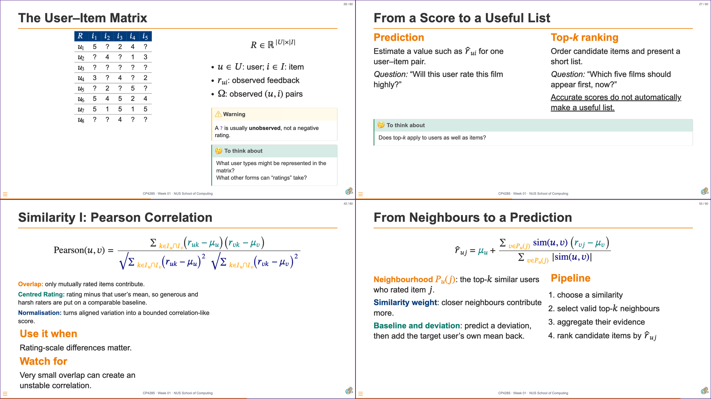

# 01 Announcements and Context {background-color="#EF7C00"}

```{=html}
<div aria-labelledby="w02-changelog-title" style="margin:1.2em auto 0;max-width:72%;padding:.55em .8em;border-left:3px solid #003D7C;border-radius:0 6px 6px 0;background:rgba(255,255,255,.78);color:#003D7C;font-family:Arial,Helvetica,sans-serif;font-size:.42em;line-height:1.35;">
  <h5 id="w02-changelog-title" style="margin:0 0 .25em;font-size:1em;font-weight:700;letter-spacing:.04em;text-transform:uppercase;">Changelog</h5>
  <ul style="margin:0;padding-left:1.2em;">
    <li><strong style="color:#EF7C00;">5 Sep 2026</strong> — Standardised week labels and deadline date-time formatting across the course materials.</li>
    <li><strong style="color:#EF7C00;">20 Aug 2026</strong> — Refined content and classroom layouts; added the linked Week 03 evaluation preview image and attribution.</li>
  </ul>
</div>
```

## {background-color="#1a0a2e"}

```{=html}
<div class="cp-frame-bg cp-frame-purple"></div>
<div class="cp-frame-content cp-thumbnail-recap-content" style="color:white;">
  <div class="cp-frame-label" style="background:#5C2D91;color:white;margin-bottom:0;">WEEK 01 RECAP</div>
  <div class="cp-thumbnail-composite-wrap">
    
  </div>
</div>
```

::: notes
:::

## Pre-Flight Survey · Metadata Summary {background-color="#ffffff"}

<p style="margin:0 0 .5em;color:#A24B00;font-size:.62em;letter-spacing:.04em;"><strong style="text-transform:uppercase;">Pre-flight survey · 26 submissions</strong> — cohort signals</p>

```{=html}
<div class="cp-grid cp-grid--3">
  <div class="cp-metric"><span class="cp-metric__label">Computer Sciences</span><strong class="cp-metric__value">85%</strong><span class="cp-metric__meta">22 of 26</span></div>
  <div class="cp-metric"><span class="cp-metric__label">Balance / practice</span><strong class="cp-metric__value">81%</strong><span class="cp-metric__meta">lecture preference</span></div>
  <div class="cp-metric cp-metric--orange"><span class="cp-metric__label">IR knowledge</span><strong class="cp-metric__value">15%</strong><span class="cp-metric__meta">4 of 26</span></div>
  <div class="cp-metric cp-metric--orange"><span class="cp-metric__label">Embeddings exposure</span><strong class="cp-metric__value">73%</strong><span class="cp-metric__meta">19 of 26</span></div>
  <div class="cp-metric"><span class="cp-metric__label">DSA knowledge</span><strong class="cp-metric__value">92%</strong><span class="cp-metric__meta">strong / decent</span></div>
  <div class="cp-metric"><span class="cp-metric__label">AI knowledge</span><strong class="cp-metric__value">100%</strong><span class="cp-metric__meta">strong / decent</span></div>
  <div class="cp-metric"><span class="cp-metric__label">Industry cases</span><strong class="cp-metric__value">42%</strong><span class="cp-metric__meta">10 of 24 responses</span></div>
  <div class="cp-metric"><span class="cp-metric__label">Retrieval / architectures</span><strong class="cp-metric__value">38%</strong><span class="cp-metric__meta">9 of 24 responses</span></div>
  <div class="cp-metric"><span class="cp-metric__label">Build / deploy</span><strong class="cp-metric__value">33%</strong><span class="cp-metric__meta">8 of 24 responses</span></div>
</div>
```

<p style="margin-top:.38em;color:#5F6B7A;font-size:.40em;line-height:1.18;">Source: Canvas pre-flight survey. Programme selections were multi-select; learning-expectation themes were coded from 24 substantive answers.</p>

::: notes
Slide 4 compact survey-signal grid with percentage-led labels.
:::

## Pre-Flight Survey · Voices in the Room {background-color="#ffffff"}

<p style="margin:0 0 .5em;color:#A24B00;font-size:.62em;letter-spacing:.04em;"><strong style="text-transform:uppercase;">Open responses · representative anonymous phrases</strong> — larger phrases indicate central themes, not frequency</p>

```{=html}
<div style="display:flex;min-height:8.55em;max-width:94%;margin:.20em auto .14em;padding:.54em .66em;align-content:space-evenly;justify-content:center;flex-wrap:wrap;gap:.22em .42em;border-top:2px solid #D8E0EA;border-bottom:2px solid #D8E0EA;">
  <span style="width:100%;color:#003D7C;font-size:.82em;font-weight:600;line-height:1.13;text-align:center;">“retrieval and ranking architectures”</span><span style="color:#B45200;font-size:.42em;font-weight:600;">“more application based”</span><span style="width:100%;color:#00796B;font-size:.82em;font-weight:600;line-height:1.13;text-align:center;">“deployment and productionization”</span><span style="width:47%;color:#003D7C;font-size:.66em;font-weight:600;line-height:1.13;text-align:center;">“TikTok / Instagram … real-world case studies”</span><span style="width:47%;color:#003D7C;font-size:.66em;font-weight:600;line-height:1.13;text-align:center;">“YouTube and Spotify”</span><span style="max-width:46%;color:#003D7C;font-size:.52em;font-weight:600;line-height:1.13;text-align:center;">“modern search alongside recommendation”</span><span style="width:47%;color:#003D7C;font-size:.66em;font-weight:600;line-height:1.13;text-align:center;">“recommendation algorithms … real-world datasets”</span><span style="width:100%;color:#003D7C;font-size:.82em;font-weight:600;line-height:1.13;text-align:center;">“end-to-end recommender … project”</span><span style="max-width:46%;color:#003D7C;font-size:.52em;font-weight:600;">“Two Tower Model”</span><span style="max-width:46%;color:#003D7C;font-size:.52em;font-weight:600;">“LLMs for recommendation … RAG or fine-tuning”</span><span style="color:#003D7C;font-size:.42em;font-weight:600;">“replicate papers”</span><span style="color:#003D7C;font-size:.42em;font-weight:600;">“create and deploy MCP server”</span><span style="color:#B45200;font-size:.42em;font-weight:600;">“Heavy workload”</span><span style="max-width:46%;color:#003D7C;font-size:.52em;font-weight:600;">“system design … production”</span><span style="width:47%;color:#00796B;font-size:.66em;font-weight:600;line-height:1.13;text-align:center;">“PyTorch … building and training”</span><span style="max-width:46%;color:#003D7C;font-size:.52em;font-weight:600;">“latest research and progress”</span><span style="color:#B45200;font-size:.42em;font-weight:600;">“form our own groups”</span><span style="color:#B45200;font-size:.42em;font-weight:600;">“ethics … history and context”</span>
</div>
<div aria-label="Phrase cloud colour legend" style="display:flex;justify-content:center;flex-wrap:wrap;gap:.22em .80em;margin:.08em auto .22em;max-width:94%;font-size:.37em;font-weight:700;letter-spacing:.025em;line-height:1.15;"><span class="cp-text--navy">● Systems and concepts</span><span class="cp-text--teal">● Building and deployment</span><span style="color:#B45200;">● Expectations and concerns</span></div>
```
<p style="margin-top:.38em;color:#5F6B7A;font-size:.40em;line-height:1.18;">Source: Canvas pre-flight survey, anonymous open responses. Phrases are abbreviated from representative excerpts for slide readability.</p>

::: notes
Expanded weighted phrase cloud. Font size represents thematic centrality in the open responses, not a quantitative count. Colour distinguishes systems/concepts, building/deployment, and expectations/concerns.
:::

## Essay 1: Micro Case Study: Designing a Production Recommender Surface

<div style="display:grid;grid-template-columns:minmax(0,1fr) 2.2em minmax(0,1fr) 2.2em minmax(0,1fr);gap:.35em;align-items:stretch;margin:.55em 0;">
  <div class="cp-flow-card"><strong>Focus</strong><br>One approved user-facing recommendation surface.</div>
  <div class="cp-flow-arrow">→</div>
  <div class="cp-flow-card"><strong>Reason</strong><br>One or two consequential Week 01–02 choices.</div>
  <div class="cp-flow-arrow">→</div>
  <div class="cp-flow-card"><strong>Defend</strong><br>Evidence, limits, and a substantive suit lens.</div>
</div>

- ⚠️ (Short) **1,500 words** · Due **Mon, 24 Aug 2026 · 23:59 SGT**.
- Use no more than **two external sources**; distinguish platform facts from your reasoned proposal.
- Feature a card-suit lens in the technical design, objective, constraint, or evaluation criterion.
- Include an AI-use declaration; AI may assist inquiry but you need to own the argument.

# 02 From Neighbours to Features to Latent Structure {background-color="#EF7C00"}

::: notes
:::

## {background-color="#ffffff"}

```{=html}
<div class="cp-frame-bg cp-frame-navy"></div>
<div class="cp-frame-content">
  <div class="cp-frame-label" style="background:#003D7C;color:#EF7C00;">Last Week Pre-Lecture Exercise</div>
  <div class="cp-frame-title" class="cp-text--navy">Look for Hidden Structure</div>
  <div class="cp-frame-body" style="color:#333;font-size:.82em;line-height:1.25;">
    <p style="font-weight:bold;color:#003D7C;margin:0 0 .45em;">Canvas discussion board · post before <span class="cp-text--teal">Mon, 24 Aug 2026 · 23:59 SGT</span></p>
    <p style="margin:.15em 0 .65em;">Post a short, concrete response to this question; then reply constructively to one classmate.</p>
    <div style="margin:.2em 0 .75em;padding:1em 1.15em;border-left:7px solid #00796B;background:#F0F8F6;font-size:1.18em;line-height:1.3;color:#003D7C;font-weight:bold;">
      Name one latent dimension that could explain several ratings—but is not an item metadata label.
    </div>
    <p style="margin:.7em 0 0;color:#003D7C;font-weight:bold;">Next week: turn this intuition into latent-factor representations of the user–item matrix.</p>
  </div>
</div>
```

::: notes
Direct students to Canvas and state the deadline: Monday, 23:59 SGT. Students answer the single displayed prompt with one concrete latent dimension and distinguish it from an observed metadata label, then make one constructive reply. This is a pre-lecture activation task, not an assessment of prior technical knowledge. The distinction matters: a latent factor is inferred from patterns of ratings, whereas metadata is an observed item attribute.

[Sources]
- Aggarwal, C. C. (2016). *Recommender systems: The textbook*, Sections 2.5-2.5.2, pp. 47-50.
:::

## {background-color="#ffffff"}

```{=html}
<div class="cp-frame-bg cp-frame-navy"></div>
<div class="cp-frame-content" style="padding-top:28px;">
  <div class="cp-frame-label" style="background:#003D7C;color:#EF7C00;">Last Week Pre-Lecture Exercise · Canvas Voices</div>
  <div class="cp-frame-title" style="margin-bottom:.30em;color:#003D7C;">Latent dimensions students noticed 📶</div>
  <div aria-label="Four anonymised student quotations and relevant replies from the Canvas discussion" style="display:grid;grid-template-columns:minmax(0,1fr) minmax(0,1fr);grid-template-rows:minmax(0,1fr) minmax(0,1fr);align-content:stretch;align-items:start;gap:1.55em 2.05em;flex:1 1 auto;min-height:0;padding:.66em .62em .95em .88em;margin:.08em 0 .18em;">
    <article style="position:relative;display:block;justify-self:end;width:82%;min-width:0;padding:.38em .48em .38em .56em;border:2px solid #D8E0EA;border-radius:13px;background:#F8FAFD;color:#273244;overflow:visible;transform:translate(-.16em,-.22em);">
      
      <p style="margin:0;font-size:.36em;font-style:italic;line-height:1.12;">“Quality: Unlike a metadata like price or like count, you can't really quantify quality from the item itself.”</p>
      <p style="margin:.24em 0 0;padding-top:.18em;border-top:1px solid rgba(0,61,124,.18);color:#516175;font-size:.30em;font-style:normal;line-height:1.12;"><span style="margin-right:.22em;color:#003D7C;font-size:.90em;font-weight:800;letter-spacing:.07em;text-transform:uppercase;">Reply</span>“Quality is also subjective and can potentially be influenced by trendiness.”</p>
      <span style="display:block;margin-top:.12em;color:#003D7C;font-size:.27em;font-weight:800;letter-spacing:.08em;line-height:1.05;text-transform:uppercase;">Quality</span>
    </article>
    <article style="position:relative;display:block;justify-self:end;width:82%;min-width:0;padding:.38em .48em .38em .56em;border:2px solid #D6C8E8;border-radius:13px;background:#F4F0FA;color:#273244;overflow:visible;transform:translate(.38em,.48em);">
      
      <p style="margin:0;font-size:.36em;font-style:italic;line-height:1.12;">“Nostalgia. It's a property of the relationship between a user and an item which is driven by the user's personal history …”</p>
      <p style="margin:.24em 0 0;padding-top:.18em;border-top:1px solid rgba(0,61,124,.18);color:#516175;font-size:.30em;font-style:normal;line-height:1.12;"><span style="margin-right:.22em;color:#5C2D91;font-size:.90em;font-weight:800;letter-spacing:.07em;text-transform:uppercase;">Reply</span>“Could it be modelled by grouping users into distinct age groups?”</p>
      <span style="display:block;margin-top:.12em;color:#5C2D91;font-size:.27em;font-weight:800;letter-spacing:.08em;line-height:1.05;text-transform:uppercase;">Nostalgia</span>
    </article>
    <article style="position:relative;display:block;justify-self:end;width:82%;min-width:0;padding:.38em .48em .38em .56em;border:2px solid #B9DDD4;border-radius:13px;background:#F0F8F6;color:#273244;overflow:visible;transform:translate(-.42em,-.36em);">
      
      <p style="margin:0;font-size:.36em;font-style:italic;line-height:1.12;">“Trust: It is not an item metadata label because it is an underlying, subjective perception that is not directly observable.”</p>
      <p style="margin:.24em 0 0;padding-top:.18em;border-top:1px solid rgba(0,61,124,.18);color:#516175;font-size:.30em;font-style:normal;line-height:1.12;"><span style="margin-right:.22em;color:#00796B;font-size:.90em;font-weight:800;letter-spacing:.07em;text-transform:uppercase;">Reply</span>“The degree of trust cannot be readily quantified and it may vary widely …”</p>
      <span style="display:block;margin-top:.12em;color:#00796B;font-size:.27em;font-weight:800;letter-spacing:.08em;line-height:1.05;text-transform:uppercase;">Trust</span>
    </article>
    <article style="position:relative;display:block;justify-self:end;width:82%;min-width:0;padding:.38em .48em .38em .56em;border:2px solid #F1C78E;border-radius:13px;background:#FFF5EA;color:#273244;overflow:visible;transform:translate(.52em,.42em);">
      
      <p style="margin:0;font-size:.36em;font-style:italic;line-height:1.12;">“One latent dimension is how emotionally provocative an item is? Some items naturally stimulate our excitement, motivation or pleasure …”</p>
      <p style="margin:.24em 0 0;padding-top:.18em;border-top:1px solid rgba(0,61,124,.18);color:#516175;font-size:.30em;font-style:normal;line-height:1.12;"><span style="margin-right:.22em;color:#A24B00;font-size:.90em;font-weight:800;letter-spacing:.07em;text-transform:uppercase;">Reply</span>“Psychological emotions are subjective … and it is tough to quantify.”</p>
      <span style="display:block;margin-top:.12em;color:#A24B00;font-size:.27em;font-weight:800;letter-spacing:.08em;line-height:1.05;text-transform:uppercase;">Emotion</span>
    </article>
  </div>
</div>
```

::: notes
Use the replies to show that students did not only name possible latent dimensions; they also tested subjectivity, measurement, segmentation, and variability. Bridge from this discussion to how latent-factor models represent interaction patterns rather than simply relabel item metadata.
:::

## Three Routes to a Recommendation

::: {.columns}
::: {.column width="31%"}
<div style="height:100%;box-sizing:border-box;display:flex;flex-direction:column;min-height:5.4em;align-items:center;justify-content:center;border:3px solid #003D7C;border-radius:8px;padding:.6em .7em;background:#fff;color:#003D7C;font-size:.70em;line-height:1.22;text-align:center;">
  <strong class="cp-text--navy">Collaborative filtering<br>(CF; last week)</strong><br><br>
  <strong>Evidence</strong><br>User–item interactions<br><br>
  <strong>Mechanism</strong><br>Borrow from similar users or items<br><br>
  <strong>Watch</strong><br>Thin local overlap can leave a neighbourhood silent.
</div>
:::
::: {.column width="3%"}
<div style="padding-top:3.6em;display:flex;align-items:center;justify-content:center;color:#EF7C00;font-size:2.05em;font-weight:700;line-height:1;">|</div>
:::
::: {.column width="32%"}
<div style="height:100%;box-sizing:border-box;display:flex;flex-direction:column;min-height:5.4em;align-items:center;justify-content:center;border:3px solid #003D7C;border-radius:8px;padding:.6em .7em;background:#fff;color:#003D7C;font-size:.70em;line-height:1.22;text-align:center;">
  <strong class="cp-text--orange">Content-based filtering<br>(CBF)</strong><br><br>
  <strong>Evidence</strong><br>Explicit item, user, or context features<br><br>
  <strong>IR mechanism</strong><br>Encode and match genres, tags, and text<br><br>
  <strong>Watch</strong><br>Feature coverage and encoding quality set the limit.
</div>
:::
::: {.column width="3%"}
<div style="padding-top:3.6em;display:flex;align-items:center;justify-content:center;color:#EF7C00;font-size:2.05em;font-weight:700;line-height:1;">|</div>
:::
::: {.column width="31%"}
<div style="height:100%;box-sizing:border-box;display:flex;flex-direction:column;min-height:5.4em;align-items:center;justify-content:center;border:3px solid #003D7C;border-radius:8px;padding:.6em .7em;background:#fff;color:#003D7C;font-size:.70em;line-height:1.22;text-align:center;">
  <strong style="color:#5C2D91;">Latent-factor model<br>(LFM)</strong><br><br>
  <strong>Evidence</strong><br>User–item interactions<br><br>
  <strong>Mechanism</strong><br>Learn shared hidden coordinates from many interactions<br><br>
  <strong>Watch</strong><br>A factor is a learned pattern, not a personal fact.
</div>
:::
:::

## Explicit Features Can Be Weighted

**Observed or stated fields** can enter a recommender score before any latent factors are learned.

::: {.columns}
::: {.column width="32%"}
### User / context fields

`student` · `Singapore` · `vegetarian`<br>
`weekday evening` · `budget: low`

Supplied, measured, or declared—not inferred from interaction patterns.
:::
::: {.column width="5%"}
<div style="font-size:2em;text-align:center;padding-top:1.25em;color:#EF7C00;">+</div>
:::
::: {.column width="32%"}
### Item fields

`cuisine: Thai` · `price: $$`<br>
`genre: comedy` · `duration: 90 min`

Observed descriptions of a candidate item.
:::
::: {.column width="5%"}
<div style="font-size:2em;text-align:center;padding-top:1.25em;color:#EF7C00;">→</div>
:::
::: {.column width="26%"}
### Weighted score

$$
\color{navy}{\operatorname{score}(u,i,c)}=\color{teal}{\mathbf{w}^{\top}}\color{orange}{\mathbf{x}(u,i,c)}
$$

Vector **_x_** represents an item or a user.  Use a similarity metric (Week 01) to define similarities.
:::
:::

::: {.callout-tip .to-think-about title="Features as explicit and implict"}
An explicit field is an input we choose to represent.  They can be fed as features to create latent factors later.
:::

::: notes
Bridge from global patterns to feature-aware recommendation. Separate observed/stated properties from learned latent factors: the former are supplied as model inputs; the latter are inferred from interaction evidence. Explain that $c$ can denote context. The point is not that a single linear score is universally sufficient, but that models need a representation and may weight observed fields. Text is the next example of a field that must be encoded before it can contribute.
[Sources]
- Ricci, F., Rokach, L., & Shapira, B. (eds.). *Recommender Systems Handbook*, 3rd ed., Chapters 4 and 12.
:::

## Text Is One Possible Feature Source

Text can be an **item field**, **user field**, or **contextual need**.

::: {.columns}
::: {.column width="31%"}
### User / context text

`“animated family film”`<br>
`“a light comedy tonight”`

Profiles, reviews, queries, and session descriptions can express a need.
:::
::: {.column width="6%"}
<div style="font-size:2.1em;text-align:center;padding-top:1.25em;color:#EF7C00;">↔</div>
:::
::: {.column width="31%"}
### Movie item text

`Toy Story (1995)`<br>
`Animation · Children’s · Comedy`

Titles, genres, tags, synopses, and reviews can describe a candidate.
:::
::: {.column width="6%"}
<div style="font-size:2.1em;text-align:center;padding-top:1.25em;color:#EF7C00;">→</div>
:::
::: {.column width="24%"}
### Encoded feature

$$
\color{teal}{\mathbf{x}_{\text{text}}}=\operatorname{encode}(\color{orange}{\text{text}})
$$

Encoding maps words to coordinates for comparison or combination.
:::
:::

> **IR** matches text representations; the same encoding can furnish recommender features.

::: notes
Use the familiar MovieLens-style fields to make text a recommender input rather than a special-purpose retrieval object. A query is only one possible source of text; item text can also be represented and compared. Do not imply that every recommender needs text or that item text establishes a preference.
[Sources]
- Harper, F. M., & Konstan, J. A. (2015). “The MovieLens Datasets: History and Context.” *ACM Transactions on Interactive Intelligent Systems*, 5(4).
- Manning, C. D., Raghavan, P., & Schütze, H. (2008). *Introduction to Information Retrieval*, Chapter 6.
:::

## A Bag of Words Is Sparse and Literal

<div style="display:grid;grid-template-columns:1.8fr repeat(6,.66fr);gap:4px;width:86%;margin:.1em auto .2em;font-size:.70em;text-align:center;">
  <div class="cp-chip cp-chip--navy">text / term</div><div class="cp-chip cp-chip--navy">animated</div><div class="cp-chip cp-chip--navy">family</div><div class="cp-chip cp-chip--navy">light</div><div class="cp-chip cp-chip--navy">comedy</div><div class="cp-chip cp-chip--navy">animation</div><div class="cp-chip cp-chip--navy">children</div>
  <div class="cp-chip cp-chip--navy">need: animated family film</div><div class="cp-chip cp-chip--warning">1</div><div class="cp-chip cp-chip--warning">1</div><div class="cp-chip cp-chip--muted">0</div><div class="cp-chip cp-chip--muted">0</div><div class="cp-chip cp-chip--muted">0</div><div class="cp-chip cp-chip--muted">0</div>
  <div class="cp-chip cp-chip--navy">need: light comedy tonight</div><div class="cp-chip cp-chip--muted">0</div><div class="cp-chip cp-chip--muted">0</div><div class="cp-chip cp-chip--warning">1</div><div class="cp-chip cp-chip--warning">1</div><div class="cp-chip cp-chip--muted">0</div><div class="cp-chip cp-chip--muted">0</div>
  <div class="cp-chip cp-chip--navy">item: Toy Story (1995)</div><div class="cp-chip cp-chip--muted">0</div><div class="cp-chip cp-chip--muted">0</div><div class="cp-chip cp-chip--muted">0</div><div class="cp-chip cp-chip--warning">1</div><div class="cp-chip cp-chip--warning">1</div><div class="cp-chip cp-chip--warning">1</div>
</div>

- One coordinate per vocabulary term; most coordinates are zero.
- The second need shares `comedy`; the first shares no exact coordinate with the listed movie genres.
- `animated` and `animation`, and `family` and `children`, remain separate until another mechanism relates them.

::: notes
Keep the exact two user/context needs and the Toy Story item text from the previous slide. First show that “a light comedy tonight” shares the exact word *comedy*. Then contrast it with “animated family film”: its words are semantically related to the movie’s genre terms, but a bag of words records no shared coordinate. This prepares the need for TF–IDF and later dense embeddings.
[Sources]
- Manning, C. D., Raghavan, P., & Schütze, H. (2008). *Introduction to Information Retrieval*, Chapters 1 and 6.
:::

## TF and IDF Signal Different Things

::: {.columns}
::: {.column width="47%"}
### <span class="cp-text--orange">TF: local evidence</span>

$$
\color{orange}{\operatorname{tf}(t,d)}=\text{count of term }t\text{ in document }d
$$

Repeated occurrence can strengthen a term's contribution **within one document**.
:::
::: {.column width="47%"}
### <span class="cp-text--navy">IDF: collection discrimination</span>

$$
\color{navy}{\operatorname{idf}(t)}=\log\frac{N}{df_t}
$$

A term found in almost every document contributes less to distinguishing documents.
:::
:::

::: {.tfidf-equation style="text-align:center;font-size:1.22em;margin-top:.55em;"}
[$\operatorname{tf}$]{style="color:#EF7C00;font-weight:700;"}[$\!\mbox{ - }\!$]{style="color:#6b6b6b;"}[$\operatorname{idf}(t,d)$]{style="color:#003D7C;font-weight:700;"}
[$=$]{style="color:#6b6b6b;"}
[$\operatorname{tf}(t,d)$]{style="color:#EF7C00;font-weight:700;"} [$\times$]{style="color:#6b6b6b;"} [$\operatorname{idf}(t)$]{style="color:#003D7C;font-weight:700;"}
:::

::: notes
First identify the two signals, then read the combined expression left to right: document-local occurrence times collection-level discrimination. The notation distinguishes the two contributions without changing the definition. Do not say a high-frequency word is always irrelevant; it is less discriminative when it appears everywhere.
[Sources]
- Manning, C. D., Raghavan, P., & Schütze, H. (2008). *Introduction to Information Retrieval*, Chapter 6.
:::

## Worked TF–IDF: Two Titles, One Interest Profile

```{=html}
<div style="color:#273244;font-size:1.08em;">
  <p style="margin:.04em 0 .30em;color:#003D7C;font-size:.58em;line-height:1.28;"><strong>User interest:</strong> <code style="color:#5C2D91;">animated family comedy</code><br><strong>A:</strong> <em>Toy Story</em> · Animation · Children’s · Comedy &nbsp; <strong>B:</strong> <em>The Lego Movie</em> · Animation · Family · Comedy</p>
  <div style="display:grid;grid-template-columns:1fr 1fr;gap:.78em;align-items:stretch;">
    <div>
      <h3 style="margin:0 0 .20em;color:#003D7C;font-size:.58em;line-height:1.05;">Vocabulary coordinates</h3>
      <table style="width:100%;margin:0;border-collapse:collapse;font-size:.52em;line-height:1.18;text-align:center;"><thead><tr><th class="cp-table__cell cp-table--compact cp-table__cell--head">term</th><th class="cp-table__cell cp-table--compact cp-table__cell--head">IDF</th><th class="cp-table__cell cp-table--compact cp-table__cell--head">U</th><th class="cp-table__cell cp-table--compact cp-table__cell--head">A</th><th class="cp-table__cell cp-table--compact cp-table__cell--head">B</th></tr></thead><tbody>
        <tr><td class="cp-table__cell cp-table--compact cp-table__cell--label"><code style="color:#5C2D91;">animated</code></td><td class="cp-table__cell cp-table--compact">1.8</td><td class="cp-table__cell cp-table--compact">1</td><td class="cp-table__cell cp-table--compact">0</td><td class="cp-table__cell cp-table--compact">0</td></tr>
        <tr><td class="cp-table__cell cp-table--compact cp-table__cell--label"><code style="color:#5C2D91;">animation</code></td><td class="cp-table__cell cp-table--compact">1.8</td><td class="cp-table__cell cp-table--compact">0</td><td class="cp-table__cell cp-table--compact">1</td><td class="cp-table__cell cp-table--compact">1</td></tr>
        <tr><td class="cp-table__cell cp-table--compact cp-table__cell--label"><code style="color:#5C2D91;">family</code></td><td class="cp-table__cell cp-table--compact">1.4</td><td class="cp-table__cell cp-table--compact">1</td><td class="cp-table__cell cp-table--compact">0</td><td class="cp-table__cell cp-table--compact">1</td></tr>
        <tr><td class="cp-table__cell cp-table--compact cp-table__cell--label"><code style="color:#5C2D91;">children</code></td><td class="cp-table__cell cp-table--compact">1.4</td><td class="cp-table__cell cp-table--compact">0</td><td class="cp-table__cell cp-table--compact">1</td><td class="cp-table__cell cp-table--compact">0</td></tr>
        <tr><td class="cp-table__cell cp-table--compact cp-table__cell--label"><code style="color:#5C2D91;">comedy</code></td><td class="cp-table__cell cp-table--compact">1.2</td><td class="cp-table__cell cp-table--compact">1</td><td class="cp-table__cell cp-table--compact">1</td><td class="cp-table__cell cp-table--compact">1</td></tr>
      </tbody></table>
      <p style="margin:.22em 0 0;color:#657286;font-size:.42em;line-height:1.22;"><code style="color:#5C2D91;">animated</code> ≠ <code style="color:#5C2D91;">animation</code>; <code style="color:#5C2D91;">family</code> ≠ <code style="color:#5C2D91;">children</code>.</p>
    </div>
    <div style="padding:.48em .55em;border-left:5px solid #00796B;background:#F0F8F6;">
      <h3 style="margin:0 0 .14em;color:#003D7C;font-size:.58em;line-height:1.05;">Cosine = dot product ÷ (two vector norms)</h3>
      <p style="margin:0 0 .24em;padding:.22em .30em;background:#E6F3F0;color:#003D7C;font-size:.46em;line-height:1.18;text-align:center;">\(\cos(\mathbf{u},\mathbf{t})=\dfrac{\mathbf{u}\cdot\mathbf{t}}{\lVert\mathbf{u}\rVert\,\lVert\mathbf{t}\rVert}\)</p>
      <div style="margin:0 0 .24em;padding:.30em .34em;border:1px solid #CFE4DF;background:#fff;color:#003D7C;"><strong style="display:block;font-size:.54em;line-height:1.15;">A · Toy Story <b style="float:right;color:#A24B00;font-size:1.22em;">0.217</b></strong><span style="display:block;margin-top:.05em;color:#657286;font-size:.42em;line-height:1.18;">dot: 1.2 × 1.2 = 1.44</span><span style="display:block;margin-top:.05em;color:#657286;font-size:.42em;line-height:1.18;">norms: ‖U‖ = 2.577; ‖A‖ = 2.577</span><span style="display:block;margin-top:.05em;color:#A24B00;font-size:.42em;font-weight:800;line-height:1.18;">1.44 ÷ (2.577 × 2.577)</span></div>
      <div style="margin:0;padding:.30em .34em;border:1px solid #00796B;background:#fff;color:#003D7C;"><strong style="display:block;font-size:.54em;line-height:1.15;">B · The Lego Movie <b style="float:right;color:#A24B00;font-size:1.22em;">0.512</b></strong><span style="display:block;margin-top:.05em;color:#657286;font-size:.42em;line-height:1.18;">dot: 1.4² + 1.2² = 3.40</span><span style="display:block;margin-top:.05em;color:#657286;font-size:.42em;line-height:1.18;">norms: ‖U‖ = 2.577; ‖B‖ = 2.577</span><span style="display:block;margin-top:.05em;color:#A24B00;font-size:.42em;font-weight:800;line-height:1.18;">3.40 ÷ (2.577 × 2.577)</span></div>
    </div>
  </div>
</div>
```

::: notes
This is a deliberately small, illustrative vocabulary with TF equal to one for each displayed tag. Compute each present TF–IDF coordinate from the IDF table. First identify the dot product as the sum of shared-coordinate products, then divide by the two vector lengths: normalisation prevents a longer vector from receiving an advantage merely because it has more nonzero coordinates. Both candidates use the stored token `animation`, but it remains separate from the user’s `animated`; The Lego Movie still wins because it shares the exact `family` and `comedy` tokens. The contrast motivates the next dense-embedding slide.
[Sources]
- Manning, C. D., Raghavan, P., & Schütze, H. (2008). *Introduction to Information Retrieval*, Chapter 6.
:::

## Dense Word Embeddings Learn Neighbourhoods

<div style="display:grid;grid-template-columns:minmax(0,1fr) 2.2em minmax(0,1fr) 2.2em minmax(0,1fr);gap:.35em;align-items:stretch;margin:.55em 0;">
  <div class="cp-flow-card"><strong>Training contexts</strong><br>Words that occur in related contexts provide a learning signal.</div>
  <div class="cp-flow-arrow">→</div>
  <div class="cp-flow-card"><strong>Dense vectors</strong><br>Each word receives a short, continuous learned representation.</div>
  <div class="cp-flow-arrow">→</div>
  <div class="cp-flow-card"><strong>Neighbourhoods</strong><br>Related usage can place vectors closer together.</div>
</div>

- A sparse document–term vector has dimension \(\color{navy}{V}\): one coordinate per vocabulary term, with most coordinates equal to zero.
  - **Typical scale:** $\color{navy}{V} = \sim50,000{–}100,000$ terms after tokenisation and filtering.
- Dense word embeddings use a much smaller learned dimension $\color{teal}{d} \ll \color{navy}{V}$, while retaining continuous coordinates for semantic similarity.
- Their coordinates are learned patterns, **not human-readable facts or ground truth**.

::: notes
Introduce word2vec as an historically influential example, not as the only embedding approach. State the limitation: a single static vector cannot solve every context, phrase, ambiguity, or bias issue.
[Sources]
- Mikolov, T. et al. (2013). “Efficient Estimation of Word Representations in Vector Space.”
- Mikolov, T. et al. (2013). “Distributed Representations of Words and Phrases and their Compositionality.”
:::

## Sparse and Dense Make Different Trade-offs

| Question | TF–IDF | Dense word embedding |
|---|---|---|
| What is represented? | Exact vocabulary-term evidence | Learned continuous coordinates |
| Main strength | Transparent lexical matching | Can generalise across related usage |
| Main limitation | Synonyms remain separate terms | Learned proximity can be opaque or misleading |
| Typical score | Cosine similarity over sparse vectors | Cosine/dot-product similarity over dense vectors |

> **Bridge:** IR turns **text into comparable vectors**. LFM will turn **interaction history into comparable user and item vectors**.

::: notes
This comparison is the central bridge. Avoid presenting dense embeddings as a universal upgrade: retrieval systems commonly combine sparse and dense signals.
[Sources]
- Manning, C. D., Raghavan, P., & Schütze, H. (2008). *Introduction to Information Retrieval*.
- Mikolov, T. et al. (2013). “Efficient Estimation of Word Representations in Vector Space.”
:::

## Break — 5 minutes {background-color="#000000"}

```{=html}

<div style="display:grid;grid-template-columns:1.25fr .75fr;gap:3em;align-items:center;min-height:62vh;color:#fff;">
  <div>
    <div style="color:#EF7C00;font-size:.76em;font-weight:700;letter-spacing:.12em;text-transform:uppercase;margin-bottom:.8em;">IR history · 1958</div>
    <h2 style="color:#fff;margin:.1em 0 .45em;">Keyword search predates the Web</h2>
    <p style="font-size:1.08em;line-height:1.42;margin:0;">At IBM, <strong class="cp-text--orange">Hans Peter Luhn</strong> demonstrated <strong class="cp-text--orange">Key Word in Context (KWIC)</strong>: an automatic index that rearranged keywords while preserving their textual context.</p>
    <p style="font-size:.86em;line-height:1.35;color:#d8d8d8;margin-top:1em;">By the early 1960s, KWIC had become central to hundreds of computerised indexing systems—a useful reminder that retrieval began with finding useful words, not with the Web.</p>
  </div>
  <div style="display:flex;flex-direction:column;align-items:center;justify-content:center;text-align:center;">
    <svg width="180" height="180" viewBox="0 0 180 180" aria-label="Five-minute break timer">
      <circle cx="90" cy="90" r="75" fill="none" stroke="#333" stroke-width="14"/>
      <circle id="donut-ring-w02ir" class="cp-timer__ring" cx="90" cy="90" r="75" fill="none" stroke="#EF7C00" stroke-width="14" stroke-dasharray="471.24" stroke-dashoffset="0" stroke-linecap="round" transform="rotate(-90 90 90)"/>
      <text id="timer-text-w02ir" class="cp-timer__text" x="90" y="98" text-anchor="middle" font-family="Arial, Helvetica, sans-serif" font-size="32" font-weight="bold" fill="white">05:00</text>
    </svg>
    <span id="timer-status-w02ir" role="timer" aria-live="polite" class="cp-sr-only">05:00</span>
    <button id="break-btn-w02ir" type="button" class="cp-timer__button" data-cp-timer data-seconds="300" data-ring="donut-ring-w02ir" data-text="timer-text-w02ir" data-status="timer-status-w02ir">▶ Start Timer</button>
  </div>
</div>


```


::: notes
Break slide. Start the timer when announcing the break. KWIC fact source: Hallam Stevens, “Hans Peter Luhn and the Birth of the Hashing Algorithm,” *IEEE Spectrum* (2018).
:::

# 03 Latent Factor Models {background-color="#EF7C00"}

## One Vector-Space Idea, Two Evidence Sources

| Retrieval | Latent-factor recommendation |
|---|---|
| Query and document vectors | User and item vectors |
| Evidence: words in text | Evidence: observed interactions |
| Score: lexical/semantic match | Score: predicted affinity |
| Goal: rank relevant documents | Goal: rank plausible items |

> **Analogy, not equivalence:** a latent factor is not a word, a recorded metadata field, or a fact about a person.

::: notes
Use the preceding IR section to make LFM less mysterious. The geometry is analogous: represent objects in a common vector space, then score a relationship. The data-generating processes and interpretations are different.
:::

## 🎥 Video: SVD for Movie Recommendations {background-color="#000000"}

```{=html}
<div style="display:flex;align-items:center;justify-content:center;width:100%;height:76vh;background:#000;">
  <a href="https://www.youtube.com/watch?v=8wLKuscyO9I" target="_blank" rel="noopener" aria-label="Open video: SVD for Movie Recommendations">
    
  </a>
</div>
```

::: notes
Use this as a short applied bridge from the two factorisation lenses to the worked signed-residual example. Ask students to listen for the move from a sparse movie-rating matrix to compact user and movie coordinates; the following slide supplies the precise signed-matrix lens. Do not let the clip substitute for the distinction between a mathematical SVD and the regularised matrix-factorisation models used later in the lecture.
[Sources]
- Video: Sundog Education with Frank Kane, “Using Singular Value Decomposition (SVD) for Movie Recommendations.” https://www.youtube.com/watch?v=8wLKuscyO9I
- Thumbnail: https://img.youtube.com/vi/8wLKuscyO9I/maxresdefault.jpg
:::

## Two Factorisation Lenses: Signed or Additive?

Both methods approximate a matrix with fewer factors, but their **constraints change the meaning** of those factors.

::: {.columns}
::: {.column width="47%"}

### SVD-style lens

$$
R \approx U_k\Sigma_kV_k^{\top}
$$

- Factors may be **positive or negative**.
- Natural for centred residuals: above- and below-baseline evidence can offset.
- The singular values in \(\Sigma_k\) scale the retained directions.

:::
::: {.column width="47%"}

### NMF lens

$$
X \approx WH, \qquad W,H\geq0
$$

- Factors are **nonnegative and additive**.
- Natural for counts, intensities, or “parts” interpretations.
- Components combine; they do not cancel one another.

:::
:::

> **Shared goal:** compress matrix structure. **Different question:** may a factor subtract, or must it add?

::: notes
Position this after the general regularised matrix-factorisation objective. SVD is a decomposition with orthogonality and signed directions; NMF is a constrained factorisation whose factors remain nonnegative. Neither description makes a factor a personal trait. Keep the distinction operational: centred deviations invite signed values, while counts and additive signals invite nonnegative factors.
[Sources]
- Trefethen, L. N., & Bau, D. (1997). *Numerical Linear Algebra*, Chapters 1–2.
- Lee, D. D., & Seung, H. S. (1999). “Learning the parts of objects by non-negative matrix factorization.”
:::

## Worked SVD: One Signed Contrast

**Centred diner–restaurant residuals** — $+$ means above a diner’s baseline; $-$ means below it.

::: {.factor-example-math style="font-size:.86em;margin-top:-.25em;"}
$$
R=
\begin{bmatrix}
1&1&-2\\
1&1&-2\\
-2&-2&4
\end{bmatrix}
=
\underbrace{\frac{1}{\sqrt6}\begin{bmatrix}1\\1\\-2\end{bmatrix}}_{U_1}
\underbrace{[6]}_{\Sigma_1}
\underbrace{\frac{1}{\sqrt6}\begin{bmatrix}1&1&-2\end{bmatrix}}_{V_1^\top}
$$

$$
\text{Exact rank 1:}\quad U_1\in\mathbb{R}^{3\times1},\quad \Sigma_1\in\mathbb{R}^{1\times1},\quad V_1^\top\in\mathbb{R}^{1\times3}.
$$
:::

::: {.columns style="font-size:.78em;line-height:1.18;margin-top:-.45em;"}
::: {.column width="47%"}
### Read the direction

- Diners 1–2 load positively; Diner 3 loads negatively at twice the magnitude.
- Restaurants 1–2 lie on one side of the contrast; Restaurant 3 lies on the other.
:::
::: {.column width="47%"}
### Why this is an SVD

- $U_1$ and $V_1$ are unit-length directions; $\Sigma_1=6$ carries the scale.
- Signed residuals are baseline deviations, not negative ratings.
:::
:::

::: notes
Treat this as an exact rank-one SVD. The normalization is deliberate: both vectors have norm one, so the singular value is 6. Read the sign pattern as a contrast in centred residuals, never as an identity label or observed rating. For example, entry (3,3) is 4 because the two negative loadings reinforce each other.
[Sources]
- Trefethen, L. N., & Bau, D. (1997). *Numerical Linear Algebra*, Chapters 1–2.
:::

## Worked NMF: Two Additive Components

**Nonnegative diner–restaurant intensities** — components add; they never cancel.

::: {.factor-example-math style="font-size:.86em;margin-top:-.25em;"}
$$
X=
\begin{bmatrix}
2&2&2\\
2&3&4\\
4&3&2
\end{bmatrix}
=
\underbrace{\begin{bmatrix}
1&1\\
1&2\\
2&1
\end{bmatrix}}_{W}
\underbrace{\begin{bmatrix}
2&1&0\\
0&1&2
\end{bmatrix}}_{H}
$$

$$
\text{Exact rank 2:}\quad W\in\mathbb{R}_{\ge0}^{3\times2},\qquad H\in\mathbb{R}_{\ge0}^{2\times3}.
$$
:::

::: {.columns style="font-size:.78em;line-height:1.18;margin-top:-.45em;"}
::: {.column width="47%"}
### Components in $H$

- Component 1 is strongest at Restaurant 1: $[2,1,0]$.
- Component 2 is strongest at Restaurant 3: $[0,1,2]$.
:::
::: {.column width="47%"}
### Mixtures in $W$

- Diner mixtures are $[1,1]$, $[1,2]$, and $[2,1]$.
- $X_{23}=1\times0+2\times2=4$: nonnegative contributions add.
:::
:::

::: notes
This is an exact rank-two NMF reconstruction. Use it to teach additive structure, not parameter compression at this tiny 3×3 scale: the factor matrices display 12 numbers for 9 entries. The point is that multiple nonnegative components combine to produce the observed intensity. Mention that practical compression emerges as the original matrix grows.
[Sources]
- Lee, D. D., & Seung, H. S. (1999). “Learning the parts of objects by non-negative matrix factorization.”
:::

## 🎰 Bandit Time: What Does Factorisation Learn? {background-color="#003D7C"}

<p style="color:#fff;"><strong>A restaurant app has a sparse matrix of diner ratings. Which description best matches latent-factor factorisation?</strong></p>

<div class="cp-choice-grid">
  <div class="cp-choice-card cp-choice-card--a"><strong style="display:inline-block;min-width:1.35em;">A.</strong> It sorts restaurants only by their recorded cuisine label.</div>
  <div class="cp-choice-card cp-choice-card--b"><strong style="display:inline-block;min-width:1.35em;">B.</strong> It learns compact vectors for diners and restaurants from many observed interactions, then uses their alignment to estimate affinity.</div>
  <div class="cp-choice-card cp-choice-card--c"><strong style="display:inline-block;min-width:1.35em;">C.</strong> It treats every unvisited restaurant as a one-star rating.</div>
  <div class="cp-choice-card cp-choice-card--d"><strong style="display:inline-block;min-width:1.35em;">D.</strong> It copies the rating of the geographically nearest diner.</div>
</div>

::: notes
MCQ. The correct answer is **B**. Invite an individual choice, then ask pairs to identify the evidence and representation implied by their selected answer. Reveal verbally: factorisation approximates the interaction matrix with learned user and item coordinates. Cuisine can be useful metadata, but it is not what the latent vectors are restricted to represent. Do not display the answer or an answer explanation on the student-facing slide.
[Sources]
- Koren, Y., Bell, R., & Volinsky, C. (2009). “Matrix Factorization Techniques for Recommender Systems.” *Computer*, 42(8), 30–37.
:::

## A Dot Product Turns Factors into a Score

$$
\color{navy}{\hat r_{ui}}=\color{teal}{\mathbf{u}_u^\top}\color{orange}{\mathbf{v}_i}
$$

::: {.columns}
::: {.column width="48%"}
### User vector
$$
\color{teal}{\mathbf{u}_u}=[\color{teal}{u_{u1}},\color{teal}{u_{u2}},\ldots,\color{teal}{u_{uk}}]
$$
A learned location in the model’s preference space.
:::
::: {.column width="48%"}
### Item vector
$$
\color{orange}{\mathbf{v}_i}=[\color{orange}{v_{i1}},\color{orange}{v_{i2}},\ldots,\color{orange}{v_{ik}}]
$$
How an item aligns with the learned interaction patterns.
:::
:::

The dot product produces a **model score**. A production recommender can still filter, diversify, or re-rank the resulting candidates.

::: notes
Make the bridge to cosine from IR carefully: both use vector geometry, but the factor score is learned from interactions and need not be normalised like a retrieval cosine.
:::

## Worked Calculation: Two Items, One Score

$$
\color{teal}{\mathbf{u}_u}=[\color{teal}{0.8},\color{teal}{0.2}], \qquad \color{orange}{\mathbf{v}_A}=[\color{orange}{0.9},\color{orange}{0.1}], \qquad \color{orange}{\mathbf{v}_B}=[\color{orange}{0.4},\color{orange}{0.8}]
$$

::: {.columns}
::: {.column width="48%"}
### Item A
$$
\color{navy}{\hat r_{uA}}=\color{teal}{0.8}\color{orange}{(0.9)}+\color{teal}{0.2}\color{orange}{(0.1)}=\color{navy}{\mathbf{0.74}}
$$
:::
::: {.column width="48%"}
### Item B
$$
\color{navy}{\hat r_{uB}}=\color{teal}{0.8}\color{orange}{(0.4)}+\color{teal}{0.2}\color{orange}{(0.8)}=\color{navy}{\mathbf{0.48}}
$$
:::
:::

**Current model verdict:** Item A scores higher.
**Still unresolved:** diversity, constraints, uncertainty, exposure, and the rest of the candidate list.

::: notes
Ask students to verify each product before showing the totals. Reiterate that score comparison is not a full ranking policy.
:::

## Training Fits Evidence, Regularisation Limits It

$$
\min_{\color{teal}{U},\color{orange}{V}}\; \sum_{\color{navy}{(u,i)\in\Omega}}\left(\color{navy}{r_{ui}}-\color{teal}{\mathbf{u}_u^\top}\color{orange}{\mathbf{v}_i}\right)^2 + \color{navy}{\lambda}\left(\lVert \color{teal}{U}\rVert_F^2+\lVert \color{orange}{V}\rVert_F^2\right)
$$

- <span class="cp-text--navy"><strong>Observed interaction set Ω:</strong></span> explicit ratings or implicit events select the evidence the objective fits.
- <span class="cp-text--teal"><strong>User factors U and their row vectors:</strong></span> are adjusted together with the item factors to explain the selected evidence.
- <span class="cp-text--orange"><strong>Item factors V and their row vectors:</strong></span> align with user factors to produce the model score.
- <span class="cp-text--navy"><strong>Regularisation strength λ:</strong></span> limits convenient memorisation by penalising excessively large factor values.

::: notes
Read the term key before narrating the equation: distinguish observed evidence, user factors, item factors, and the regularisation control. The objective and sampling scheme are design choices, not generic facts about user preference.
[Sources]
- Koren, Y., Bell, R., & Volinsky, C. (2009). “Matrix Factorization Techniques for Recommender Systems.”
:::

## {background-color="#003D7C"}

<div style="height:72vh;display:flex;align-items:center;justify-content:center;text-align:center;color:#fff;">
  <p style="max-width:1100px;margin:0;font-size:2.05em;line-height:1.18;font-weight:bold;color:#fff;">👥 “Which factorisation lens fits the evidence?”<br><span style="display:block;margin-top:.62em;font-size:.38em;line-height:1.35;font-weight:normal;">In groups of 3–4: choose <strong>SVD</strong> or <strong>NMF</strong>, name the data property that supports the choice, and state one caveat. <strong>Time: 5 minutes.</strong></span></p>
</div>
::: notes
Expected direction: Case A supports a signed SVD-style residual view; Case B supports NMF’s nonnegative additive components; Case C requires groups to state that unobserved interactions should not be silently treated as zero evidence. Put the three cases on the board or read them aloud before displaying this prompt. Invite one short report per case, then bridge back to fitting only the observed set Ω.
:::

## {background-color="#ffffff"}

```{=html}
<div class="cp-frame-bg cp-frame-navy"></div>
<div class="cp-frame-content">
  <div class="cp-frame-label" style="background:#003D7C;color:#EF7C00;">Next Week Pre-Lecture Exercise</div>
  <div class="cp-frame-title" class="cp-text--navy">What Should Evaluation Be Responsible For?</div>
  <div class="cp-frame-body" style="color:#333;display:grid;grid-template-columns:minmax(270px,.82fr) minmax(0,1.48fr);gap:1em;align-items:stretch;">
    <section aria-label="Assigned reading" style="font-size:.88em;padding:.46em;border:2px solid #D5DEE9;background:#F8FAFD;">
      <a href="https://www.straitstimes.com/singapore/singapore-studying-restrictions-on-direct-messaging-auto-play-on-social-media" target="_blank" rel="noopener" aria-label="Open the assigned Straits Times article">
        
      </a>
      <p style="margin-top:.22em;color:#657286;font-size:.54em;letter-spacing:.06em;">PHOTO: ST FILE</p>
      <p style="font-size:.88em"><strong>Read:</strong> <a href="https://www.straitstimes.com/singapore/singapore-studying-restrictions-on-direct-messaging-auto-play-on-social-media" target="_blank" rel="noopener">“S’pore studying restrictions on direct messaging, auto-play on social media to protect kids”</a></p>
    </section>
    <section aria-label="Canvas comment task" style="font-size:.88em">
      <p><strong class="cp-text--navy">Canvas discussion board</strong> · post one individual comment before <strong class="cp-text--teal">Mon, 23:59 SGT</strong></p>
      <div style="margin:0 0 .62em;padding:.72em .82em;border-left:7px solid #00796B;background:#F0F8F6;color:#003D7C;font-weight:bold;line-height:1.28;font-size:.54em">A recommender may be evaluated using whether people watch, click, or continue interacting with suggested content. What is <strong>one responsibility</strong> that evaluation should include for younger users, beyond predicting continued engagement?</div>
      <p>In <strong>120–160 words</strong>, choose and name <strong>one card-suit lens</strong>, cite one article detail, and propose one piece of evidence, safeguard, or user control the platform should examine.</p>
      <p style="margin-bottom:0;color:#A24B00;font-weight:bold;text-align:center;"><strong>No classmate reply this week.</strong> Next week: protocols, ranking metrics, and what a score leaves out.</p>
    </section>
  </div>
</div>
```

::: notes
[Sources]
- Koh, S. (2026, 31 March). “S’pore studying restrictions on direct messaging, auto-play on social media to protect kids.” *The Straits Times*. Photo: ST FILE.
:::

## {background-color="#002a26"}

```{=html}
<div class="cp-frame-bg cp-frame-teal"></div>
<div class="cp-frame-content" style="color:white;background:#002a26;inset:60px;padding:26px 32px 22px;font-size:.92em;">
  <div class="cp-frame-label" style="background:#00796B;color:white;">Next Week Preview — Week 03</div>
  <div class="cp-frame-title" style="color:#80cbc4;">Evaluation of Recommendation Systems</div>
  <div class="cp-frame-body" style="color:#cce8e5;">
    <div class="cp-grid cp-grid--2" style="align-items:center;">
      <div>
        <p style="margin:0 0 .35em;font-size:.88em;line-height:1.24;">An offline metric tells us how a list performed. Next, we ask whether the recommendation process performs well under a scenario.</p>
        <p style="margin:.16em 0;"><strong style="color:#ffffff;">In Week 03:</strong></p>
        <ul style="margin:.18em 0;line-height:1.25;">
          <li>design an evaluation protocol;</li>
          <li>interpret ranked-list quality; and</li>
          <li>identify what a score does not capture.</li>
          <li>Bring the Week 01 four-suit lens</strong> <b>♣ ♥ ♦ ♠</b> into the picture.</li>
        </ul>
      </div>
      <figure style="margin:0;text-align:right;">
        <a href="https://unsplash.com/photos/turned-on-monitoring-screen-qwtCeJ5cLYs" target="_blank" rel="noopener" aria-label="Open Stephen Dawson's monitoring dashboard photo on Unsplash">
          
        </a>
        <figcaption style="margin-top:.3em;color:#80cbc4;font-size:.53em;text-align:right;"><a href="https://unsplash.com/photos/turned-on-monitoring-screen-qwtCeJ5cLYs" target="_blank" rel="noopener" style="color:#80cbc4;">Photo: Stephen Dawson / Unsplash</a></figcaption>
      </figure>
  </div>
</div>
```

::: notes
Preview Week 03 as a transition from representation to evaluation. Use the dashboard image as an editorial illustration of monitoring and reporting; it is not evidence of a recommendation metric or a real system evaluation.

[Sources]
- Dawson, Stephen. (2018). “turned on monitoring screen.” *Unsplash*. https://unsplash.com/photos/turned-on-monitoring-screen-qwtCeJ5cLYs. Licensed under the Unsplash License.
:::
