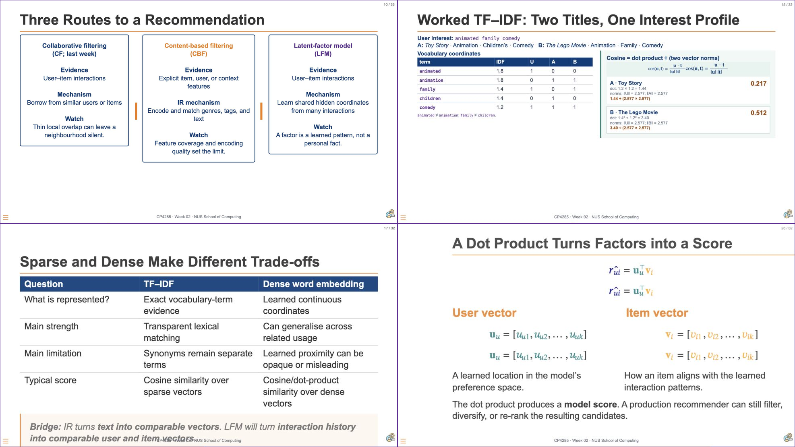

# 01 Announcements and Context {background-color="#EF7C00"}

```{=html}
<div aria-labelledby="w03-changelog-title" style="margin:1.2em auto 0;max-width:72%;padding:.55em .8em;border-left:3px solid #003D7C;border-radius:0 6px 6px 0;background:rgba(255,255,255,.78);color:#003D7C;font-family:Arial,Helvetica,sans-serif;font-size:.42em;line-height:1.35;">
  <h5 id="w03-changelog-title" style="margin:0 0 .25em;font-size:1em;font-weight:700;letter-spacing:.04em;text-transform:uppercase;">Changelog</h5>
  <ul style="margin:0;padding-left:1.2em;">
    <li><strong style="color:#EF7C00;">5 Sep 2026</strong> — Corrected the split-design response timer and standardised week labels and deadline date-time formatting.</li>
    <li><strong class="cp-text--navy">25 Aug 2026</strong> — Added the Week 02 Canvas Voices review and guardrail discussion, plus the Week 04 pre-lecture activity and linked preview image.</li>
    <li><strong class="cp-text--navy">24 Aug 2026</strong> — Refreshed the Week 03 evaluation deck and course changelog.</li>
  </ul>
</div>
```

::: notes
Delivery: 30 seconds. Briefly flag the new Canvas Voices discussion and the Week 04 bridge for students returning to an earlier copy of the deck.
:::

## {background-color="#1a0a2e"}

```{=html}
<div class="cp-frame-bg cp-frame-purple"></div>
<div class="cp-frame-content cp-thumbnail-recap-content" style="color:white;">
  <div class="cp-frame-label" style="background:#5C2D91;color:white;margin-bottom:0;">WEEK 02 RECAP</div>
  <div class="cp-thumbnail-composite-wrap">
    
  </div>
</div>
```

::: notes
Delivery: 3-minute recap. Read the thumbnails clockwise: (1) alternative recommendation routes, (2) TF-IDF as an exact text representation and ranking calculation, (3) the sparse-versus-dense trade-off, and (4) the LFM dot product. Ask: “What evidence shows that the resulting list is good?” Do not attempt to reteach the individual methods.

[Sources]
- Week 02 slides: “Three Routes to a Recommendation,” “Worked TF-IDF: Two Titles, One Interest Profile,” “Sparse and Dense Make Different Trade-offs,” and “A Dot Product Turns Factors into a Score.”
:::

## Recap: Yesterday’s deadlines

<p style="margin:.05em 0 .62em;color:#A24B00;font-size:.48em;font-weight:700;letter-spacing:.045em;text-transform:uppercase;">Mon, 24 Aug 2026 · 23:59 SGT</p>

```{=html}
<div aria-label="Yesterday's deadlines checklist" style="display:grid;grid-template-columns:1fr 1fr;grid-template-rows:1fr 1fr;gap:.58em .76em;max-width:88%;min-height:11em;margin:.30em auto 0;">
  <div style="display:flex;align-items:center;gap:.54em;padding:.86em .94em;border-left:8px solid #003D7C;background:#F2F6FB;color:#003D7C;font-size:1em;font-weight:700;"><span aria-hidden="true" style="display:inline-grid;place-items:center;flex:0 0 auto;width:1.62em;height:1.62em;border-radius:50%;background:#003D7C;color:white;font-size:.88em;">✓</span>Essay e1</div>
  <div style="display:flex;align-items:center;gap:.54em;padding:.86em .94em;border-left:8px solid #00796B;background:#F0F8F6;color:#005E54;font-size:1em;font-weight:700;"><span aria-hidden="true" style="display:inline-grid;place-items:center;flex:0 0 auto;width:1.62em;height:1.62em;border-radius:50%;background:#00796B;color:white;font-size:.88em;">✓</span>Mini-team formation</div>
  <div style="display:flex;align-items:center;gap:.54em;padding:.86em .94em;border-left:8px solid #5C2D91;background:#F4F0FA;color:#4B2378;font-size:1em;font-weight:700;"><span aria-hidden="true" style="display:inline-grid;place-items:center;flex:0 0 auto;width:1.62em;height:1.62em;border-radius:50%;background:#5C2D91;color:white;font-size:.88em;">✓</span>Personal ID</div>
  <div style="display:flex;align-items:center;gap:.54em;padding:.86em .94em;border-left:8px solid #EF7C00;background:#FFF5EA;color:#A24B00;font-size:1em;font-weight:700;"><span aria-hidden="true" style="display:inline-grid;place-items:center;flex:0 0 auto;width:1.62em;height:1.62em;border-radius:50%;background:#EF7C00;color:white;font-size:.88em;">✓</span>Pre-lecture exercise</div>
</div>
```

::: notes
Delivery: 45 seconds. Confirm the four items that were due yesterday, then transition immediately to the peer-review logistics on the next slide. Do not imply that late submission remains available.
:::

## Essay `e1` Peer Review

```{=html}
<div style="display:grid;grid-template-columns:minmax(0,1.12fr) minmax(0,.88fr);gap:1.1em;align-items:stretch;margin:.38em .06em .54em;">
  <div role="group" aria-label="Peer review task" style="padding:.72em .82em;border-top:6px solid #003D7C;background:#F2F6FB;color:#273244;">
    <p style="margin:0 0 .42em;color:#003D7C;font-size:.50em;font-weight:800;letter-spacing:.055em;text-transform:uppercase;">Your task</p>
    <p style="margin:0 0 .55em;font-size:.55em;line-height:1.24;"><span style="white-space:nowrap;font-weight:700;color:#003D7C;">TA Sahaj </span> will manually assign you another student’s essay that is on a different recommendation platform.</p>
    <ol style="margin:0;padding-left:1.18em;font-size:.55em;line-height:1.35;">
      <li>Read the assigned essay.</li>
      <li>Review and critique that essay only for the card suit lens.</li>
    </ol>
  </div>
  <div role="group" aria-label="Focus of critique" style="padding:.72em .82em;border-top:6px solid #00796B;background:#F0F8F6;color:#273244;">
    <p style="margin:0 0 .42em;color:#00796B;font-size:.50em;font-weight:800;letter-spacing:.055em;text-transform:uppercase;">Focus of critique</p>
    <p style="margin:0;font-size:.55em;line-height:1.24;">Assess the quality of the essay’s <strong style="color:#003D7C;">🃏 card suit</strong> lens' quality.</p>  <p style="font-size:.55em;line-height:1.24;"> - How well does it match the recommendation surface?  <br/> - How useful is the insight?</p>
  </div>
</div>
```
<p style="font-size:.55em;line-height:1.24;">The two marks for the <strong>peer review</strong> are for the completion of your peer review and its quality.</p>

<p style="font-size:.55em;line-height:1.24;">Your essay's quality will be assessed by the eight marks given by the instruction staff.</p>

<p style="font-size:.55em;line-height:1.24;"><strong>Due:</strong> <span class="cp-text--teal">Mon, 31 Aug 2026 · 23:59 SGT</span></p>

```{=html}
<div role="note" style="margin:.12em .06em .55em;padding:.48em .68em;border-left:5px solid #5C2D91;background:#F4F0FA;color:#40374B;font-size:.55em;line-height:1.24;"><strong style="color:#5C2D91;">AI-use note.</strong> As per the <code>e1</code> specification, remember AI should not be used in completing the peer review.</div>
```

::: notes
Delivery: 2 minutes. Explain that TA Sahaj will assign each target essay. The review is limited to the quality of the card-suit lens; students do not need to critique every part of the essay. Encourage independent review and remind students that any AI use must be credited. State the deadline clearly.

[Sources]
- Canvas People: Sahajpreet Singh profile thumbnail (L1 CP4285 TA, accessed 25 Aug 2026).
:::

## {background-color="#ffffff"}

```{=html}
<div class="cp-frame-bg cp-frame-navy"></div>
<div class="cp-frame-content">
  <div class="cp-frame-label" style="background:#003D7C;color:#EF7C00;">Last Week Pre-Lecture Exercise</div>
  <div class="cp-frame-title" class="cp-text--navy">What Should Evaluation Be Responsible For?</div>
  <div class="cp-frame-body" style="color:#333;display:grid;grid-template-columns:minmax(270px,.82fr) minmax(0,1.48fr);gap:1em;align-items:stretch;">
    <div role="group" aria-label="Assigned reading" style="font-size:.88em;padding:.46em;border:2px solid #D5DEE9;background:#F8FAFD;">
      <a href="https://www.straitstimes.com/singapore/singapore-studying-restrictions-on-direct-messaging-auto-play-on-social-media" target="_blank" rel="noopener" aria-label="Open the assigned Straits Times article">
        
      </a>
      <p style="margin-top:.22em;color:#657286;font-size:.54em;letter-spacing:.06em;">PHOTO: ST FILE</p>
      <p style="font-size:.88em"><strong>Read:</strong> <a href="https://www.straitstimes.com/singapore/singapore-studying-restrictions-on-direct-messaging-auto-play-on-social-media" target="_blank" rel="noopener">“S’pore studying restrictions on direct messaging, auto-play on social media to protect kids”</a></p>
    </div>
    <div role="group" aria-label="Canvas comment task" style="font-size:.88em">
      <p><strong class="cp-text--navy">Canvas discussion board</strong> · post one individual comment before <strong class="cp-text--teal">Mon, 24 Aug 2026 · 23:59 SGT</strong></p>
      <div style="margin:0 0 .62em;padding:.72em .82em;border-left:7px solid #00796B;background:#F0F8F6;color:#003D7C;font-weight:bold;line-height:1.28;font-size:.54em">A recommender may be evaluated using whether people watch, click, or continue interacting with suggested content. What is <strong>one responsibility</strong> that evaluation should include for younger users, beyond predicting continued engagement?</div>
      <p>In <strong>120–160 words</strong>, choose and name <strong>one card-suit lens</strong>, cite one article detail, and propose one piece of evidence, safeguard, or user control the platform should examine.</p>
      <p style="margin-bottom:0;color:#A24B00;font-weight:bold;text-align:center;">No classmate reply this week. Today: protocols, ranking metrics, and what a score leaves out.</p>
    </div>
  </div>
</div>
```

::: notes
Delivery: 5-minute review. This is copied from the Week 02 pre-lecture exercise and relabelled as a review. Show the original prompt before discussing selected Canvas responses on the following slide. Ask students to identify the responsibility, lens, and evidence/safeguard in one response; do not evaluate individual contributions publicly.

[Sources]
- Koh, S. (2026, 31 March). “S’pore studying restrictions on direct messaging, auto-play on social media to protect kids.” *The Straits Times*. https://www.straitstimes.com/singapore/singapore-studying-restrictions-on-direct-messaging-auto-play-on-social-media
:::

## {background-color="#ffffff"}

```{=html}
<div class="cp-frame-bg cp-frame-navy"></div>
<div class="cp-frame-content" style="padding-top:28px;">
  <div class="cp-frame-label" style="background:#003D7C;color:#EF7C00;">Last Week Pre-Lecture Exercise · Canvas Voices</div>
  <div class="cp-frame-title" style="margin-bottom:.22em;color:#003D7C;">Diamond and Clubs guardrails students proposed ♦ ♣</div>
  <div aria-label="Two jointly attributed Canvas quotations about Diamond and Clubs evaluation guardrails" style="display:grid;grid-template-columns:minmax(0,1fr);grid-template-rows:auto auto;align-content:center;gap:.66em;flex:1 1 auto;min-height:0;padding:.18em 1.9em .38em 1.35em;margin:0;">
    <article style="position:relative;display:block;justify-self:stretch;min-width:0;padding:.52em .78em .46em 1.02em;border:2px solid #B8D2EF;border-radius:16px;background:#EEF6FF;color:#273244;overflow:visible;transform:translate(-.15em,-.10em);">
      <div aria-label="Canvas contributor avatars" style="position:absolute;z-index:2;left:-32px;bottom:-17px;display:flex;align-items:center;">
        
        
      </div>
      <p style="margin:0;font-size:.50em;font-style:italic;line-height:1.15;">“For younger users, evaluation should be responsible for limiting repetitive, compulsive exposure while still preserving meaningful discovery...</p>
      <p style="margin:.11em 0 0;font-size:.50em;font-style:italic;line-height:1.15;">[evaluate] whether the ranked list provides genuine diversity and serendipity instead of trapping the user in one narrow content cluster...</p>
      <p style="margin:.11em 0 0;font-size:.50em;font-style:italic;line-height:1.15;">Evaluation should therefore track content-drift within a session... [with] a session-level cap on category/intensity drift for accounts flagged as minors.”</p>
      <span style="display:block;margin-top:.22em;color:#2A76DD;font-size:.32em;font-weight:800;letter-spacing:.05em;line-height:1.05;text-transform:uppercase;">♦ Diamonds (novelty)</span>
    </article>
    <article style="position:relative;display:block;justify-self:stretch;min-width:0;padding:.52em .78em .46em 1.02em;border:2px solid #B9DDD4;border-radius:16px;background:#F0F8F6;color:#273244;overflow:visible;transform:translate(.32em,.08em);">
      <div aria-label="Canvas contributor avatars" style="position:absolute;z-index:2;left:-32px;bottom:-17px;display:flex;align-items:center;">
        
        
      </div>
      <p style="margin:0;font-size:.50em;font-style:italic;line-height:1.15;">“Evaluation for recommender systems should be responsible in preventing dogpiling and coordinated cyberbullying...</p>
      <p style="margin:.11em 0 0;font-size:.50em;font-style:italic;line-height:1.15;">It is essential to guard against manipulation and content built to defeat the system...</p>
      <p style="margin:.11em 0 0;font-size:.50em;font-style:italic;line-height:1.15;">Evaluation should therefore include adversarial robustness tests that simulate coordinated attempts to create and spread new coded trends, measuring how quickly the platform detects and limits their propagation among younger users.”</p>
      <span style="display:block;margin-top:.22em;color:#00796B;font-size:.32em;font-weight:800;letter-spacing:.05em;line-height:1.05;text-transform:uppercase;">♣ Clubs (adversarial / shill)</span>
    </article>
  </div>
</div>
```

::: notes
Delivery: 3-minute guided discussion. Read each jointly attributed quotation in full. Use the Diamond quotation to contrast meaningful discovery with session-level exposure limits; use the Clubs quotation to distinguish organic harmful behaviour from coordinated, evasive manipulation. Ask: “Which of these guardrails is visible in an offline log, and which needs a stress test or an intervention?”

[Sources]
- Canvas discussion: R Arulkumaran and Poh Yu Wen (Diamonds); Brendan Ng Jingjie, Yang Yatong, and Zhang Ming Jun (Clubs) (Week 03 pre-lecture exercise, accessed 25 Aug 2026).
:::

## Evaluation makes a claim about success

> A model can score user–item pairs. An evaluation protocol decides whether those scores support a useful, defensible decision.

::: {.callout-note}
Today: design the protocol, read ranking metrics, and ask what the metrics leave out.
:::

::: notes
Delivery: 1 minute. Use this as the bridge from Week 02's score to Week 03's evidence. Do not introduce every metric yet.
:::

## 🔑 Key Point: Evaluation Is More Than a Score {background-color="#003D7C"}

```{=html}
<div style="color:#fff;font-size:.92em;line-height:1.35;margin-top:.55em;">
  <p style="margin:.05em 0 .72em;font-size:1.16em;"><u>Defensible evaluation connects a protocol, a ranking metric, and the limits of the evidence.</u></p>
  <div style="display:grid;grid-template-columns:repeat(4,1fr);gap:1.1em;margin-top:.9em;">
    <div><p style="margin:0;color:#EF7C00;font-weight:bold;">1. Design</p><p style="margin:.25em 0 0;">evaluation protocols</p></div>
    <div><p style="margin:0;color:#EF7C00;font-weight:bold;">2. Compute</p><p style="margin:.25em 0 0;">ranking metrics</p></div>
    <div><p style="margin:0;color:#EF7C00;font-weight:bold;">3. Critique</p><p style="margin:.25em 0 0;">metric selection</p></div>
    <div><p style="margin:0;color:#EF7C00;font-weight:bold;">4. Explain</p><p style="margin:.25em 0 0;">limitations of offline evaluation</p></div>
  </div>
  <p style="margin-top:1.25em;color:#EF7C00;font-weight:bold;">🤞 Ask what the recommender is being credited for—and what the evidence cannot establish.</p>
</div>
```

::: notes
Delivery: 1 minute. Point to the sequence: protocol first, metrics second, critique throughout, and limitations before deployment claims. Use the final prompt to signal that evaluation claims must remain proportional to their evidence.
:::

## 🎰 Bandit Time: What did the model learn? {background-color="#003D7C"}

```{=html}
<div class="cp-activity cp-activity--navy cp-activity--framed cp-grid cp-grid--2-aside">
  <div>
    <p class="cp-activity__prompt">A user has never clicked a recommended film. Which conclusion is justified?</p>
    <div class="cp-choice-grid">
      <div class="cp-choice-card cp-choice-card--a"><strong class="cp-choice-card__letter">A.</strong><span class="cp-choice-card__text">The user dislikes the film.</span></div>
      <div class="cp-choice-card cp-choice-card--b"><strong class="cp-choice-card__letter">B.</strong><span class="cp-choice-card__text">The film was shown and ignored for a known reason.</span></div>
      <div class="cp-choice-card cp-choice-card--c"><strong class="cp-choice-card__letter">C.</strong><span class="cp-choice-card__text">The log alone cannot separate preference from exposure or interface effects.</span></div>
      <div class="cp-choice-card cp-choice-card--d"><strong class="cp-choice-card__letter">D.</strong><span class="cp-choice-card__text">The latent-factor model has no prediction for this user.</span></div>
    </div>
  </div>
  <div class="cp-activity__timer cp-center">
    <div class="cp-timer">
      <svg width="140" height="140" viewBox="0 0 180 180" aria-label="Thirty-second countdown timer"><circle cx="90" cy="90" r="75" fill="none" stroke="#ddd" stroke-width="14"></circle><circle id="w03-tempo-ring" class="cp-timer__ring" cx="90" cy="90" r="75" fill="none" stroke="#EF7C00" stroke-width="14" stroke-dasharray="471.24" stroke-dashoffset="0" stroke-linecap="round" transform="rotate(-90 90 90)"></circle><text id="w03-tempo-text" class="cp-timer__text" x="90" y="98" text-anchor="middle" font-family="Arial" font-size="26" font-weight="bold" fill="#00796B">00:30</text></svg>
      <span id="w03-tempo-status" role="timer" aria-live="polite" class="cp-sr-only">00:30</span>
      <button id="w03-tempo-btn" type="button" class="cp-timer__button" data-cp-timer data-seconds="30" data-ring="w03-tempo-ring" data-text="w03-tempo-text" data-status="w03-tempo-status">▶ Start Timer</button>
    </div>
  </div>
</div>
```

::: notes
Activity mode: TempoQuiz MCQ. Timebox: 30 seconds for response; use the remaining time for a quick poll. Expected output: C. Instructor synthesis: an unclicked item is observationally ambiguous; evaluation must specify what was exposed, what was observed, and what outcome is claimed.
:::

## TempoQuiz debrief: absence is not a label

```{=html}
<div class="cp-grid cp-grid--2">
  <div class="cp-card cp-card--warning"><p class="cp-card__title">Tempting shortcut</p><p style="margin:0;">“No click” means dislike, so treat it as a negative label.</p></div>
  <div class="cp-card cp-card--soft"><p class="cp-card__title">Evaluation-aware view</p><p style="margin:0;">No click may mean no exposure, poor placement, wrong time, inattention, or lack of interest. The protocol must say which interpretation is defensible.</p></div>
</div>
```

::: notes
Delivery: 1 minute. Confirm C and link this ambiguity to the end-of-lecture offline-evaluation limitations.
:::

# 02 Evaluation Design {background-color="#EF7C00"}

## The evaluation contract

```{=html}
<div style="display:grid;grid-template-columns:1fr 2.1em 1fr 2.1em 1fr 2.1em 1fr;gap:.35em;align-items:stretch;margin:.65em 0;">
  <div class="cp-flow-card"><strong>Scenario</strong><br>Who is deciding, and on which surface?</div><div class="cp-flow-arrow">→</div>
  <div class="cp-flow-card"><strong>Candidates</strong><br>Which items could have appeared?</div><div class="cp-flow-arrow">→</div>
  <div class="cp-flow-card"><strong>Relevance</strong><br>What counts as a useful outcome?</div><div class="cp-flow-arrow">→</div>
  <div class="cp-flow-card"><strong>Decision</strong><br>What is shown at top-<em>K</em>?</div>
</div>
```

> Do not choose a metric until these four terms are explicit.

::: notes
Delivery: 2.5 minutes. Use a music-homepage example: a returning listener, 20 candidates, a saved/played track as relevance, and a five-item shelf. The same model may need a different protocol for a push notification.
:::

## 🎰 Bandit Time: Which split supports this claim? {background-color="#003D7C"}

```{=html}
<div class="cp-activity cp-activity--navy cp-activity--framed cp-grid cp-grid--2-aside">
  <div>
    <p class="cp-activity__prompt">You claim a news recommender will work next week. Which test design best supports that claim?</p>
    <div class="cp-choice-grid">
      <div class="cp-choice-card cp-choice-card--a"><strong class="cp-choice-card__letter">A.</strong><span class="cp-choice-card__text">Train and test on the same logged clicks.</span></div>
      <div class="cp-choice-card cp-choice-card--b"><strong class="cp-choice-card__letter">B.</strong><span class="cp-choice-card__text">Randomly split all interactions, including future events and features.</span></div>
      <div class="cp-choice-card cp-choice-card--c"><strong class="cp-choice-card__letter">C.</strong><span class="cp-choice-card__text">Train on earlier interactions; tune on a later validation period; test on an untouched future period.</span></div>
      <div class="cp-choice-card cp-choice-card--d"><strong class="cp-choice-card__letter">D.</strong><span class="cp-choice-card__text">Choose the split after seeing which one gives the highest NDCG.</span></div>
    </div>
  </div>
  <div class="cp-activity__timer cp-center">
    <div class="cp-timer">
      <svg width="140" height="140" viewBox="0 0 180 180" aria-label="Forty-five-second countdown timer"><circle cx="90" cy="90" r="75" fill="none" stroke="#ddd" stroke-width="14"></circle><circle id="w03-split-ring" class="cp-timer__ring" cx="90" cy="90" r="75" fill="none" stroke="#EF7C00" stroke-width="14" stroke-dasharray="471.24" stroke-dashoffset="0" stroke-linecap="round" transform="rotate(-90 90 90)"></circle><text id="w03-split-text" class="cp-timer__text" x="90" y="98" text-anchor="middle" font-family="Arial" font-size="26" font-weight="bold" fill="#00796B">00:45</text></svg>
      <span id="w03-split-status" role="timer" aria-live="polite" class="cp-sr-only">00:45</span>
      <button id="w03-split-btn" type="button" class="cp-timer__button" data-cp-timer data-seconds="45" data-ring="w03-split-ring" data-text="w03-split-text" data-status="w03-split-status">▶ Start Timer</button>
    </div>
  </div>
</div>
```

::: notes
Activity mode: MCQ/response. Timebox: 45 seconds. Expected output: C. Instructor synthesis: a temporal split better matches a forward-looking claim, while validation must remain separate from the final test set.
:::

## Training, validation, and testing serve different decisions

```{=html}
<div class="cp-grid cp-grid--3">
  <div class="cp-card"><p class="cp-card__title">Train</p><p style="margin:0;">Fit the recommender using only information available at the training cutoff.</p></div>
  <div class="cp-card cp-card--soft"><p class="cp-card__title">Validate</p><p style="margin:0;">Choose hyperparameters, thresholds, and model variants without touching the final test period.</p></div>
  <div class="cp-card cp-card--warning"><p class="cp-card__title">Test once</p><p style="margin:0;">Estimate performance of the chosen system on an untouched period; do not tune again after seeing it.</p></div>
</div>
```

::: notes
Delivery: 3.5 minutes, including the MCQ debrief. Explain leakage as information that would not have existed at recommendation time, including future clicks, popularity statistics, or labels.

[Sources]
- Aggarwal, C. C. (2016). *Recommender Systems: The Textbook*, Sections 7.2 and 7.4, pp. 227-240.
:::

# 03 Ranked Lists, Not Just Scores {background-color="#EF7C00"}

## {background-color="#003D7C"}

```{=html}
<div class="cp-frame-bg cp-frame-orange"></div>
<div class="cp-frame-content" style="color:#fff;">
  <div class="cp-frame-title">👥 Complete the Metric Lens Table</div>
  <div class="cp-frame-body" style="font-size:.75em;line-height:1.28;color:#fff;">
    <p style="font-size:1.15em;font-weight:bold;color:#EF7C00;margin:.2em 0 .55em;">In pairs, complete the four orange cells. Be ready to justify one choice from the ranking behaviour it measures.</p>
    <table style="width:100%;border-collapse:separate;border-spacing:0;border-radius:8px;overflow:hidden;background:#fff;color:#003D7C;font-size:.92em;">
      <thead><tr style="background:#fff;color:#003D7C;"><th class="cp-table__cell--section">Metric / signal</th><th class="cp-table__cell--section">Question answered</th><th class="cp-table__cell--section">Useful when</th></tr></thead>
      <tbody>
        <tr><td class="cp-table__cell"><strong>Precision@K</strong></td><td class="cp-table__cell">Of the <em>K</em> shown items, how many were relevant?</td><td class="cp-table__cell cp-table__cell--highlight">________</td></tr>
        <tr><td class="cp-table__cell"><strong>Recall@K</strong></td><td class="cp-table__cell">How much of the relevant set was retrieved?</td><td class="cp-table__cell cp-table__cell--highlight">________</td></tr>
        <tr><td class="cp-table__cell"><strong>Mean Average Precision (MAP)</strong></td><td class="cp-table__cell">Are relevant items repeatedly placed early?</td><td class="cp-table__cell cp-table__cell--highlight">________</td></tr>
        <tr><td class="cp-table__cell"><strong>Normalised Discounted Cumulative Gain (NDCG)</strong></td><td class="cp-table__cell">Are the most valuable items at the top?</td><td class="cp-table__cell cp-table__cell--highlight">________</td></tr>
      </tbody>
    </table>
  </div>
</div>
```

::: notes
Activity mode: paired table completion. Timebox: 2 minutes. Expected output: one proposed use case for each metric, tied to the ranking behaviour it measures. Instructor synthesis: collect one justification, then reveal the completed reference table on the next slide. These are offline ranking metrics; the orange cells deliberately withhold every “Useful when” entry.

[Sources]
- Aggarwal, C. C. (2016). *Recommender Systems: The Textbook*, Section 7.5, pp. 240–250.
:::

## Offline ranking metrics

```{=html}
<table class="cp-table cp-table--compact" style="font-size:.76em;line-height:1.16;"><thead><tr><th>Metric / signal</th><th>Question answered</th><th>Useful when</th></tr></thead><tbody>
<tr><td class="cp-table__cell cp-table__cell--label">Precision@K</td><td class="cp-table__cell">Of the shown <em>K</em>, how many were relevant?</td><td class="cp-table__cell">Visible space is scarce.</td></tr>
<tr><td class="cp-table__cell cp-table__cell--label">Recall@K</td><td class="cp-table__cell">How much relevant content was retrieved?</td><td class="cp-table__cell">Missing useful items is costly.</td></tr>
<tr><td class="cp-table__cell cp-table__cell--label">MAP</td><td class="cp-table__cell">Are binary-relevant items repeatedly early?</td><td class="cp-table__cell">Several relevant items may matter.</td></tr>
<tr><td class="cp-table__cell cp-table__cell--label">NDCG</td><td class="cp-table__cell">Are higher-value items early?</td><td class="cp-table__cell">Relevance is graded; rank matters.</td></tr>
</tbody></table>
```

::: {.callout-tip .to-think-about title="To think about"}
How do precision and recall evolve as <em>k</em> increases? When is P@K or R@K more useful as an evaluation lens?
:::

::: notes
Delivery: 4 minutes. Students already know precision and recall; use them only as anchors. Explain MAP as repeated early precision over relevant items and NDCG as discounted, graded gain. Do not derive the formulas in full.

[Sources]
- Aggarwal, C. C. (2016). *Recommender Systems: The Textbook*, Section 7.5, pp. 240-250.
:::

## 👥 Which recommender wins? {background-color="#003D7C"}

```{=html}
<div class="cp-activity cp-activity--navy cp-activity--framed cp-grid cp-grid--2-aside">
  <div>
    <p class="cp-activity__prompt">For a five-item music shelf, choose the better recommender and defend one metric.</p>
    <div class="cp-grid cp-grid--2" style="font-size:1em;">
      <div class="cp-card" style="color:#273244;"><p class="cp-card__title">A: early high-value hit</p><p style="margin:0;">1. <span style="color:#F4C430;text-shadow:0 1px 0 #8A6500;">★★★★★</span> &nbsp; 2. ○ &nbsp; 3. ○ &nbsp; 4. <span style="color:#F4C430;text-shadow:0 1px 0 #8A6500;">★★</span> &nbsp; 5. ○</p></div>
      <div class="cp-card" style="color:#273244;"><p class="cp-card__title">B: more binary hits</p><p style="margin:0;">1. <span style="color:#F4C430;text-shadow:0 1px 0 #8A6500;">★★</span> &nbsp; 2. <span style="color:#F4C430;text-shadow:0 1px 0 #8A6500;">★★</span> &nbsp; 3. ○ &nbsp; 4. <span style="color:#F4C430;text-shadow:0 1px 0 #8A6500;">★★</span> &nbsp; 5. ○</p></div>
    </div>
    <p class="cp-activity__instructions" style="margin-top:.7em;">In groups of 3–4: name the surface assumption, the metric, and one reason the other system might still be preferred.</p>
  </div>
  <div class="cp-activity__timer cp-center"><div class="cp-timer"><svg width="140" height="140" viewBox="0 0 180 180" aria-label="Three-minute countdown timer"><circle cx="90" cy="90" r="75" fill="none" stroke="#ddd" stroke-width="14"></circle><circle id="w03-ranking-ring" class="cp-timer__ring" cx="90" cy="90" r="75" fill="none" stroke="#EF7C00" stroke-width="14" stroke-dasharray="471.24" stroke-dashoffset="0" stroke-linecap="round" transform="rotate(-90 90 90)"></circle><text id="w03-ranking-text" class="cp-timer__text" x="90" y="98" text-anchor="middle" font-family="Arial" font-size="26" font-weight="bold" fill="#00796B">03:00</text></svg><span id="w03-ranking-status" role="timer" aria-live="polite" class="cp-sr-only">03:00</span><button id="w03-ranking-btn" type="button" class="cp-timer__button" data-cp-timer data-seconds="180" data-ring="w03-ranking-ring" data-text="w03-ranking-text" data-status="w03-ranking-status">▶ Start Timer</button></div></div>
</div>
```

::: notes
Activity mode: small-group discussion. Timebox: 3 minutes, followed by a 1-minute report. Expected output: an explicit metric choice tied to a stated interface goal. Instructor synthesis: A may dominate on NDCG if the five-star item is uniquely valuable; B may win on binary recall or MAP. No metric is a universal winner.
:::

## Worked MAP@5: binary relevance

```{=html}
<div class="cp-grid cp-grid--2" style="margin:.12em 0 .28em;font-size:.72em;">
  <div class="cp-card cp-card--compact" style="padding:.36em .55em;"><strong class="cp-text--navy">A</strong> · 1. <span style="color:#F4C430;text-shadow:0 1px 0 #8A6500;">★★★★★</span> · 2. ○ · 3. ○ · 4. <span style="color:#F4C430;text-shadow:0 1px 0 #8A6500;">★★</span> · 5. ○</div>
  <div class="cp-card cp-card--compact" style="padding:.36em .55em;"><strong class="cp-text--navy">B</strong> · 1. <span style="color:#F4C430;text-shadow:0 1px 0 #8A6500;">★★</span> · 2. <span style="color:#F4C430;text-shadow:0 1px 0 #8A6500;">★★</span> · 3. ○ · 4. <span style="color:#F4C430;text-shadow:0 1px 0 #8A6500;">★★</span> · 5. ○</div>
</div>
```

```{=html}
<p style="margin:.18em 0 .30em;">For MAP, <span style="color:#F4C430;text-shadow:0 1px 0 #8A6500;">★★</span> and <span style="color:#F4C430;text-shadow:0 1px 0 #8A6500;">★★★★★</span> are both binary hits.</p>
```

$$\color{navy}{AP@5} = \frac{1}{\color{teal}{R}}\sum_{i=1}^{5} \color{orange}{P@i} \times \color{teal}{rel_i}$$

```{=html}
<div class="cp-grid cp-grid--2" style="margin-top:.18em;">
  <div class="cp-card cp-card--soft" style="padding:.46em .62em;"><p class="cp-card__title" style="margin:0 0 .12em;">A: hits at ranks 1 and 4</p><p style="margin:.08em 0 .18em;">Relevant ranks: <strong>1, 4</strong></p><p style="margin:0;font-size:.84em;">\(\color{navy}{AP@5}=\frac{\color{orange}{P@1}+\color{orange}{P@4}}{\color{teal}{2}}=\frac{1+\frac{2}{4}}{2}=\color{navy}{\mathbf{.750}}\)</p></div>
  <div class="cp-card cp-card--soft" style="padding:.46em .62em;"><p class="cp-card__title" style="margin:0 0 .12em;">B: hits at ranks 1, 2, and 4</p><p style="margin:.08em 0 .18em;">Relevant ranks: <strong>1, 2, 4</strong></p><p style="margin:0;font-size:.84em;">\(\color{navy}{AP@5}=\frac{\color{orange}{P@1}+\color{orange}{P@2}+\color{orange}{P@4}}{\color{teal}{3}}=\frac{1+1+\frac{3}{4}}{3}=\color{navy}{\mathbf{.917}}\)</p></div>
</div>
```

::: {.callout-tip .to-think-about title="Would graded relevance change the result? 📶"}
Yes—but then this is no longer standard MAP. A different relevance threshold changes AP; inserting rating grades directly creates a different graded metric and may favour A.
:::

::: notes
Delivery: 2 minutes. Revisit the two original shelves before making the binary threshold explicit: both two-star and five-star items are relevant for this MAP calculation. Walk the class through the orange precision terms at each relevant rank only; non-relevant ranks contribute zero. Explain that AP is calculated per shelf/user, and MAP averages AP across many shelves/users. Use the final callout to distinguish changing the relevance threshold from changing MAP into a graded metric.

[Sources]
- Aggarwal, C. C. (2016). *Recommender Systems: The Textbook*, Section 7.5, pp. 240–250.
:::

## Worked NDCG@5: graded relevance

```{=html}
<div class="cp-grid cp-grid--2" style="margin:.12em 0 .25em;font-size:.72em;">
  <div class="cp-card cp-card--compact" style="padding:.36em .55em;"><strong class="cp-text--navy">A</strong> · 1. <span style="color:#F4C430;text-shadow:0 1px 0 #8A6500;">★★★★★</span> · 2. ○ · 3. ○ · 4. <span style="color:#F4C430;text-shadow:0 1px 0 #8A6500;">★★</span> · 5. ○</div>
  <div class="cp-card cp-card--compact" style="padding:.36em .55em;"><strong class="cp-text--navy">B</strong> · 1. <span style="color:#F4C430;text-shadow:0 1px 0 #8A6500;">★★</span> · 2. <span style="color:#F4C430;text-shadow:0 1px 0 #8A6500;">★★</span> · 3. ○ · 4. <span style="color:#F4C430;text-shadow:0 1px 0 #8A6500;">★★</span> · 5. ○</div>
</div>
```

```{=html}
<p style="margin:.18em 0 .35em;">Grades: ○ = 0, <span style="color:#F4C430;text-shadow:0 1px 0 #8A6500;">★★</span> = 2, <span style="color:#F4C430;text-shadow:0 1px 0 #8A6500;">★★★★★</span> = 5. The gain term preserves their difference.</p>
```

$$\color{navy}{\mathrm{NDCG@5}}=\frac{\color{teal}{\mathrm{DCG@5}}}{\color{orange}{\mathrm{IDCG@5}}},\qquad \color{teal}{\mathrm{DCG@5}}=\sum_{i=1}^{5}\frac{\color{orange}{2^{\mathrm{rel}_i}-1}}{\log_2(i+1)}$$

```{=html}
<div class="cp-grid cp-grid--2" style="margin-top:.28em;">
  <div class="cp-card cp-card--soft" style="padding:.46em .62em;"><p class="cp-card__title" style="margin:0 0 .10em;">A: <span style="color:#F4C430;text-shadow:0 1px 0 #8A6500;">★★★★★</span> at 1; <span style="color:#F4C430;text-shadow:0 1px 0 #8A6500;">★★</span> at 4</p><p style="margin:.07em 0;font-size:.76em;">\(\color{teal}{\mathrm{DCG}}=31+\frac{\color{orange}{3}}{\log_2 5}=32.292\)</p><p style="margin:.07em 0;font-size:.76em;">\(\color{orange}{\mathrm{IDCG}}=31+\frac{3}{\log_2 3}=32.893\)</p><p style="margin:.07em 0 0;font-size:.84em;">\(\color{navy}{\mathrm{nDCG@5}}=\color{navy}{\mathbf{.982}}\)</p></div>
  <div class="cp-card cp-card--soft" style="padding:.46em .62em;"><p class="cp-card__title" style="margin:0 0 .10em;">B: <span style="color:#F4C430;text-shadow:0 1px 0 #8A6500;">★★</span> at 1, 2, and 4</p><p style="margin:.07em 0;font-size:.76em;">\(\color{teal}{\mathrm{DCG}}=3+\frac{\color{orange}{3}}{\log_2 3}+\frac{3}{\log_2 5}=6.185\)</p><p style="margin:.07em 0;font-size:.76em;">\(\color{orange}{\mathrm{IDCG}}=3+\frac{3}{\log_2 3}+\frac{3}{2}=6.393\)</p><p style="margin:.07em 0 0;font-size:.84em;">\(\color{navy}{\mathrm{nDCG@5}}=\color{navy}{\mathbf{.968}}\)</p></div>
</div>
```

::: {.callout-note}
IDCG == Idealised Discounted Cumulative Gain.  An oracular value that simulates the best possible outcome
:::

::: notes
Delivery: 2 minutes. Revisit the two original shelves, then contrast this directly with MAP: nDCG retains the difference between two and five stars, then gives early ranks more weight. Use navy for the final normalized score, teal for observed DCG, and orange for the ideal comparator and gain. Define IDCG as the best possible DCG for the same ratings, which makes the score comparable on a zero-to-one scale. Confirm that the gain, discount, and normalization follow the textbook; its displayed DCG averages over users, while this worked example shows the per-shelf calculation before aggregation.

[Sources]
- Aggarwal, C. C. (2016). *Recommender Systems: The Textbook*, Section 7.5, pp. 240–250.
:::

## Click-through rate (CTR): an <span class="cp-text--orange">online</span> metric

```{=html}
<div class="cp-grid cp-grid--2" style="align-items:stretch;margin-top:.28em;">
  <div class="cp-card cp-card--soft" style="padding:.76em .88em;"><p class="cp-card__title">Calculation</p><p style="margin:.28em 0 .52em;font-size:1.26em;text-align:center;">\(\color{navy}{\mathrm{CTR}}=\frac{\color{teal}{\mathrm{clicks}}}{\color{orange}{\mathrm{impressions}}}\times100\%\)</p><p style="margin:0;line-height:1.3;"><strong>Impression:</strong> a visible recommendation opportunity.<br><strong>Click:</strong> an opening or action that your instrumentation counts.</p></div>
  <div class="cp-card cp-card--prompt" style="padding:.76em .88em;"><p class="cp-card__title">Worked example</p><p style="margin:.28em 0 .45em;font-size:1.04em;text-align:center;">\(\frac{\color{teal}{28\ \mathrm{clicks}}}{\color{orange}{400\ \mathrm{impressions}}}\times100\%=\color{navy}{\mathbf{7\%}}\)</p><p style="margin:0;line-height:1.3;">CTR asks whether people acted after seeing the recommendation. It is measured <strong>online</strong>, after a deployed surface creates impressions.</p></div>
</div>
```

::: {.callout-tip .to-think-about title="To think about"}
How do you apply CTR to our two use cases?  What assumptions should you make?
:::

::: notes
Delivery: 2 minutes. Position CTR after the offline ranking measures and before the summary: it is an online behavioural metric, not another offline relevance metric. Define the denominator carefully, then calculate the worked example. Do not claim that a higher CTR is automatically a better user or product outcome; the next section introduces beyond-relevance criteria and guardrails.
:::

## 🔑 Key Point: A Metric Orders Priorities {background-color="#003D7C"}

```{=html}
<div style="color:#fff;font-size:.92em;line-height:1.35;margin-top:.55em;">
  <p style="margin:.05em 0 .72em;font-size:1.16em;"><u>A system can be better at the top, across many relevant items, or at avoiding wasted slots.</u></p>
  <div style="display:grid;grid-template-columns:repeat(3,1fr);gap:1.1em;margin-top:.9em;">
    <div><p style="margin:0;color:#EF7C00;font-weight:bold;">Top of the list</p><p style="margin:.25em 0 0;">Reward especially valuable items that appear early.</p></div>
    <div><p style="margin:0;color:#EF7C00;font-weight:bold;">Repeated relevance</p><p style="margin:.25em 0 0;">Reward several relevant items placed early.</p></div>
    <div><p style="margin:0;color:#EF7C00;font-weight:bold;">Wasted slots</p><p style="margin:.25em 0 0;">Penalise irrelevant items in scarce visible space.</p></div>
  </div>
  <p style="margin-top:1.25em;color:#EF7C00;font-weight:bold;">🤞 Your metric makes one of these priorities count most.</p>
</div>
```

::: notes
Delivery: 1 minute. Use the three columns to restate the ranking trade-offs students saw in the activity and worked calculations. Make the bridge to the next section: even a well-chosen ranking metric is not the entire evaluation.
:::

## Break — 5 minutes {background-color="#000000"}

```{=html}
<div style="display:grid;grid-template-columns:minmax(0,1.15fr) minmax(260px,.85fr);align-items:center;gap:5vw;height:72vh;padding:0 5vw;color:#fff;font-family:Arial,Helvetica,sans-serif;">
  <div style="max-width:700px;">
    <p style="margin:0 0 .45em;color:#EF7C00;font-size:.72em;font-weight:bold;letter-spacing:.12em;text-transform:uppercase;">☕ Break · CTR depends on the surface</p>
    <p style="margin:0 0 .62em;color:#d1d5db;font-size:.68em;line-height:1.35;">The same recommendation can earn different click-through rates because the surface changes the user’s intent, the competing choices, and the meaning of an impression.</p>
    <div aria-label="Illustrative click-through-rate benchmarks by communication surface" style="display:grid;grid-template-columns:repeat(3,1fr);gap:.58em;margin:.22em 0 .56em;">
      <div style="min-height:8.4em;padding:.52em .58em;border-top:4px solid #EF7C00;background:#171717;"><strong style="color:#fff;">Paid search ads</strong><br><span style="display:block;margin:.14em 0;color:#EF7C00;font-size:1.48em;font-weight:bold;">6.64%</span><span style="display:block;color:#d1d5db;font-size:.47em;line-height:1.23;">Overall CTR across 13,000 U.S. campaigns.</span><a href="https://www.wordstream.com/ppc-benchmarks" target="_blank" rel="noopener" style="display:block;margin-top:.34em;color:#EF7C00;font-size:.42em;">WordStream (2026)</a></div>
      <div style="min-height:8.4em;padding:.52em .58em;border-top:4px solid #EF7C00;background:#171717;"><strong style="color:#fff;">Social traffic ads</strong><br><span style="display:block;margin:.14em 0;color:#EF7C00;font-size:1.48em;font-weight:bold;">1.71%</span><span style="display:block;color:#d1d5db;font-size:.47em;line-height:1.23;">Average CTR for Facebook traffic campaigns.</span><a href="https://www.wordstream.com/blog/facebook-ads-benchmarks-2025" target="_blank" rel="noopener" style="display:block;margin-top:.34em;color:#EF7C00;font-size:.42em;">WordStream (2025)</a></div>
      <div style="min-height:8.4em;padding:.52em .58em;border-top:4px solid #EF7C00;background:#171717;"><strong style="color:#fff;">Email</strong><br><span style="display:block;margin:.14em 0;color:#EF7C00;font-size:.96em;font-weight:bold;">Context matters</span><span style="display:block;color:#d1d5db;font-size:.47em;line-height:1.23;">Audience, message, and timing shape the response.</span><a href="https://mailchimp.com/resources/email-marketing-benchmarks/" target="_blank" rel="noopener" style="display:block;margin-top:.34em;color:#EF7C00;font-size:.42em;">Mailchimp (n.d.)</a></div>
    </div>
    <p style="margin:.42em 0 0;color:#fff;font-size:.55em;line-height:1.28;"><strong style="color:#EF7C00;">Rule:</strong> compare CTR only across like-for-like surfaces, placements, audiences, and impression definitions.</p>
    <p style="margin:.62em 0 0;color:#aeb6c2;font-size:.30em;line-height:1.3;"><strong style="color:#d1d5db;">Sources (APA).</strong> WordStream. (2026). <em>PPC benchmarks</em>. <a href="https://www.wordstream.com/ppc-benchmarks" target="_blank" rel="noopener" class="cp-text--orange">Source</a> · WordStream. (2025). <em>Facebook ads benchmarks 2025</em>. <a href="https://www.wordstream.com/blog/facebook-ads-benchmarks-2025" target="_blank" rel="noopener" class="cp-text--orange">Source</a> · Mailchimp. (n.d.). <em>Email marketing benchmarks and industry statistics</em>. <a href="https://mailchimp.com/resources/email-marketing-benchmarks/" target="_blank" rel="noopener" class="cp-text--orange">Source</a></p>
  </div>
  <div style="display:flex;flex-direction:column;align-items:center;text-align:center;">
    <svg width="210" height="210" viewBox="0 0 180 180" aria-label="Five-minute break countdown timer">
      <circle cx="90" cy="90" r="75" fill="none" stroke="#444" stroke-width="14"/>
      <circle cx="90" cy="90" r="62" fill="#fff"/>
      <circle id="w03-ctr-break-ring" class="cp-timer__ring" cx="90" cy="90" r="75" fill="none" stroke="#EF7C00" stroke-width="14" stroke-dasharray="471.24" stroke-dashoffset="0" stroke-linecap="round" transform="rotate(-90 90 90)"/>
      <text id="w03-ctr-break-text" class="cp-timer__text" x="90" y="98" text-anchor="middle" font-family="Arial,Helvetica,sans-serif" font-size="30" font-weight="bold" fill="#00796B">05:00</text>
    </svg>
    <span id="w03-ctr-break-status" role="timer" aria-live="polite" class="cp-sr-only">05:00</span>
    <button id="w03-ctr-break-btn" type="button" class="cp-timer__button" data-cp-timer data-seconds="300" data-ring="w03-ctr-break-ring" data-text="w03-ctr-break-text" data-status="w03-ctr-break-status">▶ Start Timer</button>
  </div>
</div>
```

::: notes
Start the five-minute timer when announcing the break. The first two values are illustrative advertising benchmarks rather than recommender-system targets: paid search has explicit query intent, while Facebook traffic campaigns compete with feed attention. The email panel deliberately gives no numerical rate because the cited resource emphasizes context-specific strategy rather than a directly comparable benchmark. Return by restating the rule: never treat cross-surface CTR as like-for-like evidence of recommendation quality.

[Sources]
- WordStream. (2026). *PPC benchmarks*. https://www.wordstream.com/ppc-benchmarks
- WordStream. (2025). *Facebook ads benchmarks 2025*. https://www.wordstream.com/blog/facebook-ads-benchmarks-2025
- Mailchimp. (n.d.). *Email marketing benchmarks and industry statistics*. https://mailchimp.com/resources/email-marketing-benchmarks/
:::

# 04 Beyond Accuracy {background-color="#EF7C00"}

## Accuracy is a proxy, not a verdict

::: {.callout-warning}
An observed click can be a useful signal without being a complete account of benefit, consent, satisfaction, or long-term welfare.
:::

## Same precision, different catalogue

```{=html}
<div class="cp-grid cp-grid--2"><div class="cp-card cp-card--soft"><p class="cp-card__title">System P: popular repeat</p><p style="margin:0;">Every user sees familiar blockbusters. Precision@5 is high, but the catalogue is barely touched.</p><p class="cp-card__meta">Likely risk: repeated exposure and narrow discovery.</p></div><div class="cp-card cp-card--soft"><p class="cp-card__title">System D: relevant discovery</p><p style="margin:0;">Each user sees useful, less familiar options across the catalogue. Precision@5 is the same.</p><p class="cp-card__meta">Potential value: novelty, diversity, and long-tail exposure.</p></div></div>
```

::: notes
Delivery: 3 minutes. Ask which system the original ranking metrics prefer: they may be tied. Introduce catalogue coverage as the fraction of the catalogue that reaches at least one user, but distinguish it from within-list diversity.
:::

## 👥 Metric design clinic: choose the guardrails {background-color="#003D7C"}

```{=html}
<div class="cp-activity cp-activity--navy cp-activity--framed cp-grid cp-grid--2-aside">
  <div>
    <p class="cp-activity__prompt">Your group is assigned one card lens. Design a minimal evaluation plan for a recommendation surface.</p>
    <div class="cp-grid cp-grid--2" style="margin-top:.55em;">
      <div class="cp-card cp-card--soft"><p class="cp-card__title">♣ Clubs — adversarial / shill</p><p style="margin:0;">Can coordinated activity manipulate the list? Consider attack impact, anomaly detection, and stability.</p></div>
      <div class="cp-card cp-card--soft"><p class="cp-card__title">♥ Hearts — social</p><p style="margin:0;">Does social evidence help without unwanted exposure or conformity? Consider privacy, welfare, and subgroup outcomes.</p></div>
      <div class="cp-card cp-card--soft"><p class="cp-card__title">♦ Diamonds — novelty seeker</p><p style="margin:0;">Does the list enable discovery? Consider novelty, diversity, serendipity, and catalogue coverage.</p></div>
      <div class="cp-card cp-card--soft"><p class="cp-card__title">♠ Spades — loyalist / metadata-driven</p><p style="margin:0;">Are important requirements stable and visible? Consider constraints, consistency, calibration, and explanation.</p></div>
    </div>
    <p class="cp-activity__instructions" style="margin-top:.62em;">Name: (1) one primary metric; (2) two guardrails; and (3) one evidence gap that offline logs cannot resolve. Prepare a two-sentence report.</p>
  </div>
  <div class="cp-activity__timer cp-center"><div class="cp-timer"><svg width="140" height="140" viewBox="0 0 180 180" aria-label="Three-minute countdown timer"><circle cx="90" cy="90" r="75" fill="none" stroke="#ddd" stroke-width="14"></circle><circle id="w03-lens-ring" class="cp-timer__ring" cx="90" cy="90" r="75" fill="none" stroke="#EF7C00" stroke-width="14" stroke-dasharray="471.24" stroke-dashoffset="0" stroke-linecap="round" transform="rotate(-90 90 90)"></circle><text id="w03-lens-text" class="cp-timer__text" x="90" y="98" text-anchor="middle" font-family="Arial" font-size="26" font-weight="bold" fill="#00796B">03:00</text></svg><span id="w03-lens-status" role="timer" aria-live="polite" class="cp-sr-only">03:00</span><button id="w03-lens-btn" type="button" class="cp-timer__button" data-cp-timer data-seconds="180" data-ring="w03-lens-ring" data-text="w03-lens-text" data-status="w03-lens-status">▶ Start Timer</button></div></div>
</div>
```

::: notes
Activity mode: small-group discussion. Timebox: 3 minutes, followed by 2 minutes of reports. Delivery: introduce the four cards as contextual treatment lenses, not fixed demographic categories; one person can shift lenses across tasks. Expected output: one primary metric, two guardrails, and one evidence gap. Instructor synthesis: no group should claim that a single offline metric resolves its lens.
:::

## Debrief: metric choices distribute attention

```{=html}
<table class="cp-table cp-table--compact"><thead><tr><th>Lens</th><th>Possible primary measure</th><th>Example guardrail</th></tr></thead><tbody><tr><td class="cp-table__cell cp-table__cell--label">♣</td><td class="cp-table__cell">Ranking utility under attack</td><td class="cp-table__cell">Attack impact / stability</td></tr><tr><td class="cp-table__cell cp-table__cell--label">♥</td><td class="cp-table__cell">Task completion or satisfaction</td><td class="cp-table__cell">Privacy, opt-outs, welfare signal</td></tr><tr><td class="cp-table__cell cp-table__cell--label">♦</td><td class="cp-table__cell">NDCG or utility</td><td class="cp-table__cell">Novelty, diversity, coverage</td></tr><tr><td class="cp-table__cell cp-table__cell--label">♠</td><td class="cp-table__cell">Constraint-satisfied relevance</td><td class="cp-table__cell">Consistency / explanation quality</td></tr></tbody></table>
```

::: notes
Delivery: 5 minutes. Populate or compare this table with the room's answers. The row entries are examples, not a formula; the correct choice depends on the surface and stakeholders.
:::

## Evaluation criteria map

```{=html}
<div class="cp-grid cp-grid--3"><div class="cp-metric"><span class="cp-metric__label">Useful now</span><strong class="cp-metric__value">Relevance & utility</strong><span class="cp-metric__meta">Precision, recall, MAP, NDCG, task completion</span></div><div class="cp-metric"><span class="cp-metric__label">Beyond relevance</span><strong class="cp-metric__value">Engagement, exposure & discovery</strong><span class="cp-metric__meta">CTR, dwell time, exposure distribution, coverage, intra-list diversity, novelty, serendipity</span></div><div class="cp-metric cp-metric--orange"><span class="cp-metric__label">Safe and dependable</span><strong class="cp-metric__value">Trust & resilience</strong><span class="cp-metric__meta">Confidence, robustness, stability, scalability</span></div></div>
```

::: {.callout-tip .to-think-about title="To think about"}
Where should the computation budget sit—candidate generation, ranking, or re-ranking? What end-to-end latency can this surface tolerate before a useful recommendation arrives too late?
:::

::: {.callout-note}
<strong>Measure the three ideas separately.</strong> <em>Dwell time</em> captures depth after an interaction; <em>exposure distribution</em> records who and what receives impressions; <em>intra-list diversity</em> asks how varied one ranked list is. None is interchangeable with relevance.
:::

::: notes
Delivery: 4 minutes. Connect each group of criteria to a question raised in the W02 exercise. Stress that some criteria are harder to quantify, not less important. Use the final prompt only as a bridge: a strong evaluation design must also respect computation budgets and serving latency; the operational details return near the product-decision section.

[Sources]
- Aggarwal, C. C. (2016). *Recommender Systems: The Textbook*, Section 7.3, pp. 229-235.
:::

## Beyond relevance: measure what receives attention

```{=html}
<div class="cp-grid cp-grid--3" style="margin-top:.48em;">
  <div class="cp-card cp-card--soft"><p class="cp-card__title">Engagement</p><p style="margin:0 0 .28em;"><strong class="cp-text--navy">CTR · dwell time</strong></p><p class="cp-card__meta">Did people act after a visible recommendation opportunity?</p></div>
  <div class="cp-card cp-card--soft"><p class="cp-card__title">Exposure</p><p style="margin:0 0 .28em;"><strong class="cp-text--navy">Impression share · coverage</strong></p><p class="cp-card__meta">Who and what receives a place in the ranked list?</p></div>
  <div class="cp-card cp-card--soft"><p class="cp-card__title">Discovery</p><p style="margin:0 0 .28em;"><strong class="cp-text--navy">Diversity · novelty · serendipity</strong></p><p class="cp-card__meta">Does the list expand useful options beyond familiar repeats?</p></div>
</div>
```

::: {.callout-note}
These measures answer different questions. A system can earn clicks while concentrating exposure, or improve discovery while leaving CTR unchanged.
:::

::: notes
Delivery: 3 minutes. Introduce the three beyond-relevance concerns one at a time. CTR and dwell time require a visible, instrumented opportunity; exposure measures allocation; discovery measures the character of the list. Stress that none is a replacement for relevance, and none can be inferred from the others.

[Sources]
- Aggarwal, C. C. (2016). *Recommender Systems: The Textbook*, Section 7.3, pp. 229-235.
:::

## Intra List Diversity (ILD): how varied is one ranked list?

```{=html}
<div class="cp-grid cp-grid--2" style="align-items:stretch;margin-top:.28em;">
  <div class="cp-card cp-card--soft"><p class="cp-card__title">A three-item recommendation list</p><p style="margin:.12em 0 .42em;"><strong>Item A, Item B, Item C</strong></p><p style="margin:0 0 .35em;">Use a content representation to estimate each pair’s cosine similarity.</p><div style="display:grid;grid-template-columns:repeat(3,1fr);gap:.42em;font-size:.79em;"><div style="padding:.35em;background:#eef5f8;"><strong>A–B</strong><br>similarity = 0.80<br><span class="cp-text--orange">distance = 0.20</span></div><div style="padding:.35em;background:#eef5f8;"><strong>A–C</strong><br>similarity = 0.20<br><span class="cp-text--orange">distance = 0.80</span></div><div style="padding:.35em;background:#eef5f8;"><strong>B–C</strong><br>similarity = 0.30<br><span class="cp-text--orange">distance = 0.70</span></div></div></div>
  <div class="cp-card cp-card--prompt"><p class="cp-card__title">Average pairwise dissimilarity</p><p style="margin:.32em 0;text-align:center;font-size:1.18em;">\(\mathrm{ILD}@3=\frac{0.20+0.80+0.70}{3}=\color{orange}{0.57}\)</p><p style="margin:.28em 0 0;"><strong>Interpretation:</strong> this list has moderate intra-list diversity on a 0–1 distance scale. A higher score means the items are less alike <em>under the chosen representation</em>.</p></div>
</div>
```

::: {.callout-tip .to-think-about title="To think about"}
What item representation would make two recommendations look more—or less—similar: genre labels, text embeddings, creator, or user interaction patterns?
What is the complexity of this calculation? Is it important to consider in practical service?
:::

::: notes
Delivery: 4 minutes. Define intra-list diversity as the average pairwise dissimilarity in one user’s top-k list. Work left to right: turn each similarity into a distance using 1 minus cosine similarity; average the three distances; then interpret 0.57. Emphasise that ILD is only as meaningful as the representation used to define similarity.

[Sources]
- Aggarwal, C. C. (2016). *Recommender Systems: The Textbook*, Chapter 7, “Evaluating Recommender Systems.” https://doi.org/10.1007/978-3-319-29659-3_7
- Fidelity Investments. (n.d.). *About recommender metrics* (Intra-List Diversity@k). Jurity documentation. https://fidelity.github.io/jurity/about_reco.html
:::

## Safe and dependable: measure whether the system holds up

```{=html}
<div class="cp-grid cp-grid--3" style="margin-top:.48em;">
  <div class="cp-card cp-card--warning"><p class="cp-card__title">Trust</p><p style="margin:0 0 .28em;"><strong class="cp-text--navy">Calibration · explanation coverage</strong></p><p class="cp-card__meta">Are confidence and explanations proportionate to what the system knows?</p></div>
  <div class="cp-card cp-card--warning"><p class="cp-card__title">Resilience</p><p style="margin:0 0 .28em;"><strong class="cp-text--navy">Attack impact · ranking stability</strong></p><p class="cp-card__meta">How much does the list change under manipulation or small perturbations?</p></div>
  <div class="cp-card cp-card--warning"><p class="cp-card__title">Scalability</p><p style="margin:0 0 .28em;"><strong class="cp-text--navy">p95 latency · throughput</strong></p><p class="cp-card__meta">Can the surface respond reliably under its expected traffic and catalogue size?</p></div>
</div>
```

::: {.callout-warning}
There is no universal safety score. Select operational and resilience checks that match the surface, the users affected, and the failure mode at stake.
:::

::: notes
Delivery: 3 minutes. Explain that dependable systems must be trustworthy, resilient to manipulation, and operationally viable. Use the terms as an introduction: later card lenses make the relevant risk more concrete. Ask which check would expose a failure that NDCG alone would miss.

[Sources]
- Aggarwal, C. C. (2016). *Recommender Systems: The Textbook*, Section 7.3, pp. 229-235.
:::

## 95% Percent Latency (p95): Protect the slow tail

```{=html}
<div class="cp-grid cp-grid--2" style="align-items:stretch;margin-top:.28em;">
  <div class="cp-card cp-card--soft"><p class="cp-card__title">20 sorted recommendation-response latencies (ms)</p><p style="margin:.28em 0;font-family:Arial,Helvetica,sans-serif;font-size:.76em;line-height:1.45;">120 · 125 · 128 · 130 · 135 · 140 · 145 · 148 · 150 · 152<br>155 · 160 · 165 · 170 · 175 · 180 · 190 · 205 · <strong class="cp-text--orange">240</strong> · 800</p><p class="cp-card__meta">Use the nearest-rank convention for this worked example.</p></div>
  <div class="cp-card cp-card--prompt"><p class="cp-card__title">Find the 95th percentile</p><p style="margin:.30em 0;text-align:center;font-size:1.18em;">\(\mathrm{rank}=\lceil0.95\times20\rceil=19\)</p><p style="margin:.18em 0;text-align:center;font-size:1.18em;">\(p95=L_{19}=\color{orange}{240\text{ ms}}\)</p><p style="margin:.34em 0 0;"><strong>Interpretation:</strong> 95% of requests completed in 240 ms or less; the slowest 5% took longer. The single 800 ms request still matters, but it is not p95.</p></div>
</div>
```
::: {.callout-tip .to-think-about title="To think about"}
What are appropriate interventions to address long latency as a result of a high p95?
:::

::: notes
Delivery: 4 minutes. Explain that p95 is a tail-latency measure: it asks about a near-worst experience rather than the average. Count to the 19th value in the sorted list using nearest rank; identify 240 ms; then contrast it with the 800 ms maximum. The response times are instructor-constructed for the calculation. The engineering decision still needs a target appropriate to the surface and user context.
:::

## The feedback loop hidden in a log

```{=html}
<div style="display:grid;grid-template-columns:1fr 2.1em 1fr 2.1em 1fr 2.1em 1fr 2.1em 1fr;gap:.25em;align-items:stretch;margin:.6em 0;"><div class="cp-flow-card"><strong>Exposure</strong><br>What the system displayed</div><div class="cp-flow-arrow">→</div><div class="cp-flow-card"><strong>Interaction</strong><br>Click, play, skip, save</div><div class="cp-flow-arrow">→</div><div class="cp-flow-card"><strong>Log</strong><br>Observed, selected data</div><div class="cp-flow-arrow">→</div><div class="cp-flow-card"><strong>Model</strong><br>Learns from the log</div><div class="cp-flow-arrow">→</div><div class="cp-flow-card"><strong>Future exposure</strong><br>Changes the next log</div></div>
```

::: {.callout-warning}
Unobserved is not random. The system's own past choices influence what can be learned and evaluated.
:::

::: notes
Delivery: 4.5 minutes. Introduce missing-not-at-random feedback, position/exposure bias, and popularity feedback. A held-out interaction is an approximation to future behavior, not ground truth for all unseen items.

[Sources]
- Aggarwal, C. C. (2016). *Recommender Systems: The Textbook*, Section 7.6, pp. 250-252.
:::

## Four offline failure modes

```{=html}
<div class="cp-grid cp-grid--2"><div class="cp-card cp-card--warning"><p class="cp-card__title">MNAR / selection bias</p><p style="margin:0;">Logged feedback reflects what users chose and what the system exposed. Mitigate with temporal realism, exposure data, and careful claims.</p></div><div class="cp-card cp-card--warning"><p class="cp-card__title">Temporal drift</p><p style="margin:0;">Preferences and catalogues change. Use forward-looking splits and report the evaluation window.</p></div><div class="cp-card cp-card--warning"><p class="cp-card__title">Leakage</p><p style="margin:0;">Future features or test-set tuning inflate results. Enforce a feature cutoff and final untouched test period.</p></div><div class="cp-card cp-card--warning"><p class="cp-card__title">Cold start and long tail</p><p style="margin:0;">Averages can hide new users, new items, and rare items. Report slices and coverage, not just one aggregate score.</p></div></div>
```

::: notes
Delivery: 5 minutes. Ask students to match each failure mode to a repair. Clarify that a repair reduces risk; it does not transform offline data into a user study.
:::

## Offline → online → user impact

```{=html}
<div style="display:grid;grid-template-columns:1fr 2.1em 1fr 2.1em 1fr;gap:.45em;align-items:stretch;margin:.65em 0;"><div class="cp-flow-card"><strong>Offline benchmark</strong><br>Compare candidates under a declared protocol; inspect coverage and intra-list diversity</div><div class="cp-flow-arrow">→</div><div class="cp-flow-card"><strong>Guarded online test</strong><br>Randomise exposure; monitor CTR, dwell time, exposure distribution, and safeguards</div><div class="cp-flow-arrow">→</div><div class="cp-flow-card"><strong>User / product impact</strong><br>Interpret retention, satisfaction, complaints, and long-term effects</div></div>
```

::: notes
Delivery: 2.5 minutes. Explain that A/B tests more directly measure user impact but still need the right outcomes, protection for affected users, and adequate duration. Name the beyond-relevance signals explicitly: diversity can be inspected before deployment; dwell time and exposure distribution need online measurement. Tie to Chapter 7.2's online evaluation discussion.
:::

# Summary {background-color="#003D7C"}

```{=html}
<div style="color:#fff;font-size:.78em;line-height:1.28;margin-top:.34em;">
  <p style="margin:0 0 .58em;color:#fff;font-size:1.20em;line-height:1.18;"><span style="color:#EF7C00;">🔑</span> <u>Evaluation choices define what counts as a good recommendation.</u></p>
  <div style="display:grid;grid-template-columns:repeat(2,1fr);gap:.62em .88em;">
    <div style="padding:.48em .62em;border-left:6px solid #EF7C00;background:rgba(255,255,255,.07);"><strong style="color:#EF7C00;">1 · Begin with the claim</strong><br><span style="color:#fff;">Name the surface, decision, candidates, and relevant outcome before choosing a split or metric.</span></div>
    <div style="padding:.48em .62em;border-left:6px solid #EF7C00;background:rgba(255,255,255,.07);"><strong style="color:#EF7C00;">2 · Judge ranked lists</strong><br><span style="color:#fff;">Match Precision@K, Recall@K, MAP, or NDCG to the ranking behaviour that matters.</span></div>
    <div style="padding:.48em .62em;border-left:6px solid #EF7C00;background:rgba(255,255,255,.07);"><strong style="color:#EF7C00;">3 · Add guardrails</strong><br><span style="color:#fff;">Pair utility with discovery, exposure, trust, robustness, and constraint checks that fit the card lens.</span></div>
    <div style="padding:.48em .62em;border-left:6px solid #EF7C00;background:rgba(255,255,255,.07);"><strong style="color:#EF7C00;">4 · Keep claims proportional</strong><br><span style="color:#fff;">Offline logs are a simulation: test forward in time, report evidence gaps, then validate with guarded online evidence.</span></div>
  </div>
  <p style="margin:.82em 0 0;color:#EF7C00;font-size:1.06em;font-weight:bold;text-align:center;">A metric orders priorities; an evaluation plan makes those priorities defensible.</p>
</div>
```

::: notes
Delivery: 2 minutes. Close by moving clockwise through the four panels. Reconnect the deployment claim to the evaluation contract, the metric choice to the visible ranked list, the guardrails to the card lenses, and the evidence gap to the limits of offline logs. End with the orange synthesis sentence: a metric expresses a priority, while the full plan makes its consequences visible and contestable.
:::


## {background-color="#ffffff"}

```{=html}
<div class="cp-frame-bg cp-frame-navy"></div>
<div class="cp-frame-content">
  <div class="cp-frame-label" style="background:#003D7C;color:#EF7C00;">Next Week Pre-Lecture Exercise</div>
  <div class="cp-frame-title cp-text--navy">What Does a Missing Interaction Mean?</div>
  <div class="cp-frame-body" style="color:#333;font-size:.82em;line-height:1.25;">
    <p style="font-weight:bold;color:#003D7C;margin:0 0 .45em;">Canvas discussion board · post before <span class="cp-text--teal">Mon, 31 Aug 2026 · 23:59 SGT</span></p>
    <p style="margin:.15em 0 .65em;">Post one concise response; then reply constructively to one classmate.</p>
    <div style="margin:.2em 0 .75em;padding:1em 1.15em;border-left:7px solid #00796B;background:#F0F8F6;font-size:1.18em;line-height:1.3;color:#003D7C;font-weight:bold;">
      A user has never clicked a recommended item. Give two plausible interpretations: one about preference and one about exposure or the interface.
    </div>
    <p style="margin:.7em 0 0;color:#003D7C;font-weight:bold;">Next week: neural recommenders can learn richer interaction patterns, but they still learn only from the evidence the system records.</p>
  </div>
</div>
```

::: notes
Delivery: introduce this as a pre-lecture activation task rather than a test of neural-network knowledge. Expected output: two distinct explanations for an unclicked recommendation (one preference-based and one exposure/interface-based), followed by a concise explanation that model capacity cannot identify information the logs do not contain. Ask students to make one constructive reply that either adds another plausible interpretation or identifies what evidence could distinguish the two accounts.

Instructor synthesis for Week 04: connect responses to the difference between a richer scoring function and better observational data. Use the replies to foreground exposure bias, missing-not-at-random feedback, and the transparency limits of a complex model.

[Sources]
- Aggarwal, C. C. (2016). *Recommender Systems: The Textbook*, Sections 1.3.1.1-1.3.1.3, pp. 10-14; Section 3.6.4.6, pp. 109-112.
:::

## {background-color="#002a26"}

```{=html}
<div class="cp-frame-bg cp-frame-teal"></div>
<div class="cp-frame-content" style="color:white;background:#002a26;inset:60px;padding:26px 32px 22px;font-size:.92em;">
  <div class="cp-frame-label" style="background:#00796B;color:white;">Next Week Preview — Week 04</div>
  <div class="cp-frame-title" style="color:#80cbc4;">Neural Recommendation Models</div>
  <div class="cp-frame-body" style="color:#cce8e5;">
    <div class="cp-grid cp-grid--2" style="align-items:center;">
      <div>
        <p style="margin:0 0 .35em;font-size:.88em;line-height:1.24;">A neural recommender can learn richer patterns from interactions. That does not make an unclicked item self-explanatory.</p>
        <p style="margin:.16em 0;"><strong style="color:#ffffff;">In Week 04:</strong></p>
        <ul style="margin:.18em 0;line-height:1.25;">
          <li>compare neural and latent-factor recommenders;</li>
          <li>examine deep ranking and representation learning; and</li>
          <li>ask what model complexity can—and cannot—explain.</li>
        </ul>
      </div>
      <figure style="margin:0;text-align:right;">
        <a href="https://www.pexels.com/photo/an-artist-s-illustration-of-artificial-intelligence-ai-this-image-was-inspired-neural-networks-used-in-deep-learning-it-was-created-by-novoto-studio-as-part-of-the-visualising-ai-proje-17483870/" target="_blank" rel="noopener" aria-label="Open the Google DeepMind neural-network illustration on Pexels">
          
        </a>
        <figcaption style="margin-top:.3em;color:#80cbc4;font-size:.53em;text-align:right;"><a href="https://www.pexels.com/photo/an-artist-s-illustration-of-artificial-intelligence-ai-this-image-was-inspired-neural-networks-used-in-deep-learning-it-was-created-by-novoto-studio-as-part-of-the-visualising-ai-proje-17483870/" target="_blank" rel="noopener" style="color:#80cbc4;">Illustration: Google DeepMind / Pexels</a></figcaption>
      </figure>
    </div>
  </div>
</div>
```

::: notes
Preview Week 04 as a transition from choosing what counts in evaluation to examining how a model turns recorded interactions into a score. The illustration is an editorial visual metaphor for layered representations and data flow; it is not a literal neural-recommender architecture. Both the image and its caption link to the source.

[Sources]
- Google DeepMind. “Abstract illustration depicting complex digital neural networks and data flow.” *Pexels*. https://www.pexels.com/photo/an-artist-s-illustration-of-artificial-intelligence-ai-this-image-was-inspired-neural-networks-used-in-deep-learning-it-was-created-by-novoto-studio-as-part-of-the-visualising-ai-proje-17483870/ (free to use).
:::
