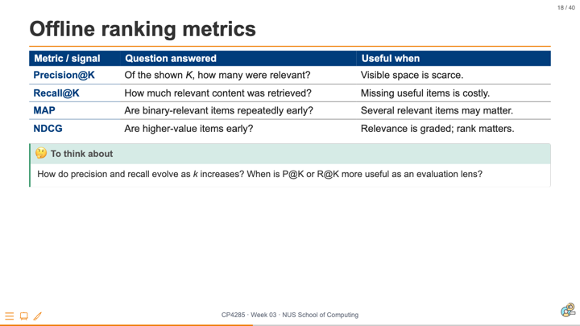
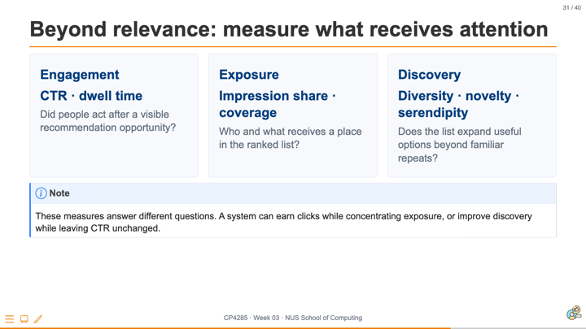
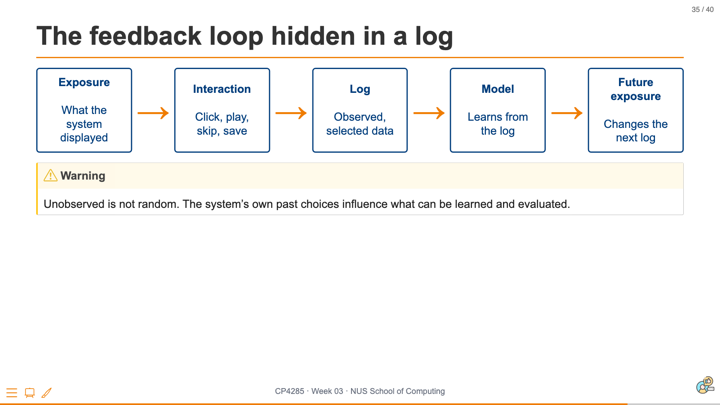

# 01 Overview {background-color="#EF7C00"}

## {background-color="#ffffff"}

```{=html}
<div style="height:100%;padding:14px 34px 18px;background:#fff;color:#273244;font-family:Arial,Helvetica,sans-serif;box-sizing:border-box;">
  <p style="margin:0 0 4px;color:#5C2D91;font-size:.38em;font-weight:800;letter-spacing:.08em;text-transform:uppercase;">Week 03 recap · Evaluation of Recommendation Systems</p>
  <h2 style="margin:0 0 10px;color:#003D7C;font-size:1.04em;line-height:1.08;">A richer model still needs <span style="color:#EF7C00;">defensible evidence</span></h2>
  <div style="display:grid;grid-template-columns:1fr 1fr;gap:15px 20px;align-items:start;">
    <figure style="margin:0;"><figcaption style="margin-top:4px;color:#5C2D91;font-size:.30em;font-weight:700;">1 · Evaluation is more than a score</figcaption></figure>
    <figure style="margin:0;"><figcaption style="margin-top:4px;color:#5C2D91;font-size:.30em;font-weight:700;">2 · Metrics answer different ranking questions</figcaption></figure>
    <figure style="margin:0;"><figcaption style="margin-top:4px;color:#5C2D91;font-size:.30em;font-weight:700;">3 · Measure what receives attention</figcaption></figure>
    <figure style="margin:0;"><figcaption style="margin-top:4px;color:#5C2D91;font-size:.30em;font-weight:700;">4 · Logged feedback is shaped by past exposure</figcaption></figure>
  </div>
</div>
```

::: notes
Delivery: 2 minutes. Read the four thumbnails clockwise. Remind students that Week 03 established an evaluation chain: state the claim and protocol, choose a ranking metric that matches the visible decision, add measures for attention and discovery, and interpret logged feedback as the product of earlier exposure. Bridge to today: a neural recommender can learn a richer scoring function, but it does not make the recorded evidence complete or self-explanatory.

[Sources]
- Week 03 slides 9, 18, 31, and 35: “Key Point: Evaluation Is More Than a Score,” “Offline ranking metrics,” “Beyond relevance: measure what receives attention,” and “The feedback loop hidden in a log.”
:::

## Week 4: Neural Recommendation Models

## Learning outcomes

- Build neural recommenders.
- Compare neural and latent-factor approaches.
- Analyze explainability challenges.
- Assess trade-offs between complexity and transparency.

::: notes
TODO (instructor): connect the outcomes to the lecture sequence.
:::

---

# 02 Neural Models {background-color="#EF7C00"}

## Neural collaborative filtering

> TODO: introduce model architectures, training, and comparisons.

::: notes
TODO (author): develop this concept with a worked example.
:::

## Ethics Thread: Explainability and performance

::: {.callout-warning}
TODO: examine transparency costs of increasingly complex models.
:::

::: notes
TODO (author): add a concrete stakeholder question.
:::

---

## {background-color="#ffffff"}

```{=html}
<div class="cp-frame-bg cp-frame-navy"></div>
<div class="cp-frame-content">
  <div class="cp-frame-label" style="background:#003D7C;color:#EF7C00;">Next Week Pre-Lecture Exercise</div>
  <div class="cp-frame-title cp-text--navy">What Does a Missing Interaction Mean?</div>
  <div class="cp-frame-body" style="color:#333;font-size:.82em;line-height:1.25;">
    <p style="font-weight:bold;color:#003D7C;margin:0 0 .45em;">Canvas discussion board · post before <span class="cp-text--teal">Mon, 31 Aug 23:59 SGT</span></p>
    <p style="margin:.15em 0 .65em;">Post one concise response; then reply constructively to one classmate.</p>
    <div style="margin:.2em 0 .75em;padding:1em 1.15em;border-left:7px solid #00796B;background:#F0F8F6;font-size:1.18em;line-height:1.3;color:#003D7C;font-weight:bold;">
      A user has never clicked a recommended item. Give two plausible interpretations: one about preference and one about exposure or the interface.
    </div>
    <p style="margin:.7em 0 0;color:#003D7C;font-weight:bold;">Next week: neural recommenders can learn richer interaction patterns, but they still learn only from the evidence the system records.</p>
  </div>
</div>
```

::: notes
Delivery: introduce this as a pre-lecture activation task rather than a test of neural-network knowledge. Expected output: two distinct explanations for an unclicked recommendation (one preference-based and one exposure/interface-based), followed by a concise explanation that model capacity cannot identify information the logs do not contain. Ask students to make one constructive reply that either adds another plausible interpretation or identifies what evidence could distinguish the two accounts.

Instructor synthesis for Week 04: connect responses to the difference between a richer scoring function and better observational data. Use the replies to foreground exposure bias, missing-not-at-random feedback, and the transparency limits of a complex model.

[Sources]
- Aggarwal, C. C. (2016). *Recommender Systems: The Textbook*, Sections 1.3.1.1-1.3.1.3, pp. 10-14; Section 3.6.4.6, pp. 109-112.
:::

## {background-color="#ffffff"}

```{=html}
<div class="cp-frame-bg cp-frame-navy"></div>
<div class="cp-frame-content">
  <div class="cp-frame-label" style="background:#003D7C;color:#EF7C00;">Next Week Pre-Lecture Exercise</div>
</div>
```

::: notes
Delivery: introduce this as a pre-lecture activation task rather than a test of neural-network knowledge. Expected output: two distinct explanations for an unclicked recommendation (one preference-based and one exposure/interface-based), followed by a concise explanation that model capacity cannot identify information the logs do not contain. Ask students to make one constructive reply that either adds another plausible interpretation or identifies what evidence could distinguish the two accounts.

Instructor synthesis for Week 04: connect responses to the difference between a richer scoring function and better observational data. Use the replies to foreground exposure bias, missing-not-at-random feedback, and the transparency limits of a complex model.

[Sources]
- Aggarwal, C. C. (2016). *Recommender Systems: The Textbook*, Sections 1.3.1.1-1.3.1.3, pp. 10-14; Section 3.6.4.6, pp. 109-112.
:::

# Summary {background-color="#003D7C"}

## 🔑 <u>Neural capacity changes both performance and interpretability.</u>

**Next week:** sequential and session-based recommendation.

::: notes
TODO (instructor): close with the stated transition.
:::
