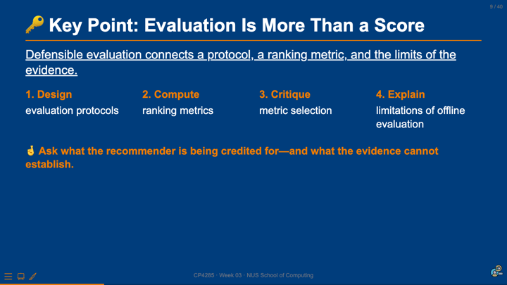

# 01 From Evaluation to Model {background-color="#EF7C00"}

::: notes
Delivery: 15 seconds. Introduce the transition: Week 03 asked what evidence supports a recommendation claim; Week 04 asks how a neural model turns the available evidence into a learned score.
:::

## {background-color="#1a0a2e"}

```{=html}
<div class="cp-frame-bg cp-frame-purple"></div>
<div class="cp-frame-content cp-thumbnail-recap-content" style="color:white;">
  <div class="cp-frame-label" style="background:#5C2D91;color:white;margin-bottom:0;">WEEK 03 RECAP</div>
  <div class="cp-thumbnail-composite-wrap">
    
  </div>
</div>
```

::: notes
Delivery: 2 minutes. Ask students to restate the Week 03 evaluation chain: make the recommendation claim explicit, define an evaluation protocol, choose a ranking metric that matches the decision, and report what the log cannot establish. Today changes the scoring function, not these responsibilities.

[Sources]
- Week 03 slide 9: “Key Point: Evaluation Is More Than a Score.”
:::

## Last Week's Pre-Lecture Exercise

```{=html}
<div class="cp-frame-bg cp-frame-navy"></div>
<div class="cp-frame-content">
  <div class="cp-frame-label" style="background:#003D7C;color:#EF7C00;">Week 04 Pre-Lecture Exercise</div>
  <div class="cp-frame-title cp-text--navy">What Does a Missing Interaction Mean?</div>
  <div class="cp-frame-body cp-stack" style="color:#333;font-size:.82em;line-height:1.25;">
    <p style="margin:0;color:#003D7C;font-weight:bold;">Canvas discussion board · submitted by <span class="cp-text--teal">Mon, 31 Aug · 23:59 SGT</span></p>
    <div class="cp-card cp-card--prompt">A user has never clicked a recommended item. Give two plausible interpretations: one about preference and one about exposure or the interface.</div>
    <p style="margin:0;">Use the responses as a constraint on today’s models: richer capacity can learn a more flexible interaction function, but it cannot recover information that the system never recorded.</p>
  </div>
</div>
```

::: notes
Delivery: 3 minutes. Invite two interpretations from the exercise. Keep the distinction crisp: a non-click can be consistent with disinterest, but also with no exposure, weak placement, poor timing, or inattention. Explain that neural collaborative filtering inherits this ambiguity whenever it learns from implicit logs.

[Sources]
- Week 03 slides: “TempoQuiz debrief: absence is not a label” and “What Does a Missing Interaction Mean?”
:::

## Week 04: Neural Recommendation Models

> A neural recommender does not replace the evaluation contract. It replaces a fixed interaction rule with a **learned function** of the representations and evidence available to it.

::: {.callout-note}
Today: compare latent-factor and neural interaction functions, reason about implicit-feedback training, and ask when a model’s score is not yet an explanation.
:::

::: notes
Delivery: 1 minute. Make the scope clear. The goal is not to memorise every neural architecture; it is to recognise the modelling choice that changes when an inner product becomes a learnable interaction function.
:::

## Learning outcomes

```{=html}
<div class="cp-grid cp-grid--2" style="margin-top:.42em;">
  <div class="cp-card cp-card--soft"><p class="cp-card__title">Build</p><p style="margin:0;">Describe a neural recommender as embeddings, an interaction function, and a training objective.</p></div>
  <div class="cp-card cp-card--soft"><p class="cp-card__title">Compare</p><p style="margin:0;">Contrast a latent-factor dot product with a learned non-linear interaction function.</p></div>
  <div class="cp-card cp-card--soft"><p class="cp-card__title">Interpret</p><p style="margin:0;">Identify what implicit feedback supports—and what an unobserved interaction cannot prove.</p></div>
  <div class="cp-card cp-card--soft"><p class="cp-card__title">Critique</p><p style="margin:0;">Assess whether a performance claim, explanation, and safeguard are aligned.</p></div>
</div>
```

::: notes
Delivery: 1 minute. Read the action verbs, then use them as signposts through the sections. The final outcome keeps the Week 03 evidence lens active throughout the technical material.
:::

# 02 Learning an Interaction Function {background-color="#EF7C00"}

::: notes
Delivery: 15 seconds. This section starts from the familiar latent-factor baseline before adding neural capacity.
:::

## 🔑 Key Point: Neural capacity changes the interaction function {background-color="#003D7C"}

```{=html}
<div style="color:#fff;font-size:.84em;line-height:1.3;margin-top:.42em;">
  <p style="margin:0 0 .68em;font-size:1.20em;line-height:1.18;"><span style="color:#EF7C00;">🔑</span> <u>Embeddings say what a user and item are like; the interaction function says how their match becomes a score.</u></p>
  <div class="cp-grid cp-grid--3" style="color:#fff;">
    <div class="cp-card" style="background:rgba(255,255,255,.08);border-color:rgba(255,255,255,.22);color:#fff;"><p class="cp-card__title" style="color:#EF7C00;">1 · Represent</p><p style="margin:0;">Learn a vector for each user and item from available signals.</p></div>
    <div class="cp-card" style="background:rgba(255,255,255,.08);border-color:rgba(255,255,255,.22);color:#fff;"><p class="cp-card__title" style="color:#EF7C00;">2 · Interact</p><p style="margin:0;">Use a dot product or a neural network to combine the vectors.</p></div>
    <div class="cp-card" style="background:rgba(255,255,255,.08);border-color:rgba(255,255,255,.22);color:#fff;"><p class="cp-card__title" style="color:#EF7C00;">3 · Learn</p><p style="margin:0;">Adjust parameters against an observed training signal and its assumptions.</p></div>
  </div>
  <p style="margin:.82em 0 0;color:#EF7C00;font-size:1.03em;font-weight:bold;text-align:center;">More expressive does not mean more informative: the model still learns from the evidence that enters its loss.</p>
</div>
```

::: notes
Delivery: 1.5 minutes. Use the three stages to distinguish representation from interaction and learning. The final sentence is the bridge from the Week 03 pre-lecture exercise: capacity changes what patterns can be represented, not what the log observed.

[Sources]
- He, X. et al. (2017). “Neural Collaborative Filtering.” *WWW ’17*, pp. 173–182.
:::

## A latent-factor baseline fixes the interaction rule

For a user vector \(\mathbf{p}_u\) and item vector \(\mathbf{q}_i\), matrix factorisation commonly scores a pair by:

$$\hat{y}_{ui} = \mathbf{p}_u^\top \mathbf{q}_i$$

```{=html}
<div class="cp-grid cp-grid--2" style="margin-top:.50em;">
  <div class="cp-card cp-card--soft"><p class="cp-card__title">What the embeddings learn</p><p style="margin:0;">Dimensions that help place users and items so compatible pairs receive a high inner product.</p></div>
  <div class="cp-card cp-card--warning"><p class="cp-card__title">What stays fixed</p><p style="margin:0;">The rule that combines the vectors: dimension-wise agreement is summarised by one dot product.</p></div>
</div>
```

::: notes
Delivery: 3 minutes. Refresh the Week 02 latent-factor model. An embedding dimension need not have a human-readable label; it is a learned coordinate useful for prediction. Focus the comparison on the fixed dot-product interaction, not on treating matrix factorisation as an obsolete model.

[Sources]
- Aggarwal, C. C. (2016). *Recommender Systems: The Textbook*, Chapter 3.
- Koren, Y., Bell, R., & Volinsky, C. (2009). “Matrix Factorization Techniques for Recommender Systems.” *Computer*, 42(8), 30–37.
:::

## Neural collaborative filtering learns the match

```{=html}
<div style="display:grid;grid-template-columns:1fr 1.55em 1fr 1.55em 1fr;gap:.30em;align-items:stretch;margin:.60em 0;">
  <div class="cp-flow-card"><strong class="cp-text--navy">User embedding</strong><br><span class="cp-text--muted">\(\mathbf{p}_u\)</span></div>
  <div class="cp-flow-arrow">+</div>
  <div class="cp-flow-card"><strong class="cp-text--navy">Item embedding</strong><br><span class="cp-text--muted">\(\mathbf{q}_i\)</span></div>
  <div class="cp-flow-arrow">→</div>
  <div class="cp-flow-card"><strong class="cp-text--navy">MLP interaction</strong><br><span class="cp-text--muted">\(f_\theta(\mathbf{p}_u,\mathbf{q}_i)\)</span></div>
</div>
```

> Neural collaborative filtering replaces the fixed inner product with a neural architecture that can learn an interaction function from data.

::: {.callout-note}
The model is still collaborative filtering when its central evidence is the pattern of user–item interactions; additional features can be added, but they are a separate modelling choice.
:::

::: notes
Delivery: 4 minutes. Walk left to right. The inputs may be the same embeddings used by matrix factorisation, but an MLP can learn non-linear combinations of them. Do not claim that a neural network automatically dominates every matrix-factorisation baseline; the useful question is whether the extra interaction capacity fits the task, data, latency, and maintenance constraints.

[Sources]
- He, X. et al. (2017). “Neural Collaborative Filtering.” *WWW ’17*, pp. 173–182.
:::

## Three related interaction choices

```{=html}
<div class="cp-grid cp-grid--3" style="margin-top:.42em;">
  <div class="cp-card"><p class="cp-card__title">GMF</p><p style="margin:0;">Generalised matrix factorisation preserves an element-wise interaction pathway before prediction.</p></div>
  <div class="cp-card cp-card--soft"><p class="cp-card__title">MLP</p><p style="margin:0;">Concatenates embeddings and learns layered non-linear transformations before prediction.</p></div>
  <div class="cp-card cp-card--soft"><p class="cp-card__title">NeuMF</p><p style="margin:0;">Combines the generalised matrix-factorisation and MLP pathways in a shared prediction model.</p></div>
</div>
```

::: {.callout-tip .to-think-about title="To think about"}
If two models use the same interaction log, what new evidence does a deeper interaction function add—and what does it only rearrange?
:::

::: notes
Delivery: 3 minutes. Present these as design variants, not a taxonomy to memorise. GMF retains a factorisation-like route; MLP learns a non-linear route; NeuMF combines both. Return to the reflective question: added layers can express different patterns, but they do not turn missing exposure data into observed preference.

[Sources]
- He, X. et al. (2017). “Neural Collaborative Filtering.” *WWW ’17*, pp. 173–182.
:::

## 🎰 Bandit Time: What changed in the neural model? {background-color="#003D7C"}

```{=html}
<div class="cp-activity cp-activity--navy cp-activity--framed cp-grid cp-grid--2-aside">
  <div>
    <p class="cp-activity__prompt">Compared with a latent-factor dot product, what does an MLP interaction layer primarily change?</p>
    <div class="cp-choice-grid">
      <div class="cp-choice-card cp-choice-card--a"><strong class="cp-choice-card__letter">A.</strong><span class="cp-choice-card__text">It observes every item the user was shown, even if the log omitted the exposure.</span></div>
      <div class="cp-choice-card cp-choice-card--b"><strong class="cp-choice-card__letter">B.</strong><span class="cp-choice-card__text">It can learn a more flexible, non-linear rule for combining user and item representations.</span></div>
      <div class="cp-choice-card cp-choice-card--c"><strong class="cp-choice-card__letter">C.</strong><span class="cp-choice-card__text">It guarantees a human-readable explanation for every recommended item.</span></div>
      <div class="cp-choice-card cp-choice-card--d"><strong class="cp-choice-card__letter">D.</strong><span class="cp-choice-card__text">It removes the need to define a target outcome or evaluation protocol.</span></div>
    </div>
  </div>
  <div class="cp-activity__timer cp-center">
    <div class="cp-timer">
      <svg width="140" height="140" viewBox="0 0 180 180" aria-label="Thirty-second countdown timer"><circle cx="90" cy="90" r="75" fill="none" stroke="#ddd" stroke-width="14"></circle><circle id="w04-interaction-ring" class="cp-timer__ring" cx="90" cy="90" r="75" fill="none" stroke="#EF7C00" stroke-width="14" stroke-dasharray="471.24" stroke-dashoffset="0" stroke-linecap="round" transform="rotate(-90 90 90)"></circle><text id="w04-interaction-text" class="cp-timer__text" x="90" y="98" text-anchor="middle" font-family="Arial" font-size="26" font-weight="bold" fill="#00796B">00:30</text></svg>
      <span id="w04-interaction-status" role="timer" aria-live="polite" class="cp-sr-only">00:30</span>
      <button id="w04-interaction-btn" type="button" class="cp-timer__button" data-cp-timer data-seconds="30" data-ring="w04-interaction-ring" data-text="w04-interaction-text" data-status="w04-interaction-status">▶ Start Timer</button>
    </div>
  </div>
</div>
```

::: notes
Activity mode: TempoQuiz MCQ. Timebox: 30 seconds for response, then 45 seconds for a show-of-hands poll. Expected output: B. Instructor synthesis: MLP capacity changes the parameterised rule that turns embeddings into a score. It does not repair missing exposure, automatically produce a reason, or remove the need for evaluation design.
:::

## TempoQuiz debrief: capacity is not observability

```{=html}
<div class="cp-grid cp-grid--2">
  <div class="cp-card cp-card--warning"><p class="cp-card__title">Overclaim</p><p style="margin:0;">“The neural model saw that the user disliked the item because there was no click.”</p></div>
  <div class="cp-card cp-card--soft"><p class="cp-card__title">Defensible claim</p><p style="margin:0;">“Given the recorded training signal and features, the model assigned this pair a low score.”</p></div>
</div>
```

::: notes
Delivery: 1.5 minutes. Confirm B. Contrast a model output with a claim about an unobserved human state. The model can estimate a score; the evidence may not identify whether an unclicked item was disliked, unseen, badly placed, or simply ignored.
:::

# 03 Training from Implicit Feedback {background-color="#EF7C00"}

::: notes
Delivery: 15 seconds. Shift from the interaction function to the source of the learning signal.
:::

## An interaction log is evidence, not a complete label set

```{=html}
<div class="cp-grid cp-grid--2" style="margin-top:.46em;">
  <div class="cp-card"><p class="cp-card__title">Observed positive signal</p><p style="margin:0;">A play, purchase, save, or other recorded action can be used as evidence of an interaction under a stated task definition.</p></div>
  <div class="cp-card cp-card--warning"><p class="cp-card__title">Unobserved pair</p><p style="margin:0;">No recorded action does not, by itself, separate non-exposure, inattention, friction, and lack of interest.</p></div>
</div>
```

```{=html}
<div class="cp-grid cp-grid--3" style="margin-top:.78em;">
  <div class="cp-metric"><span class="cp-metric__label">Representation</span><strong class="cp-metric__value">Users + items</strong><span class="cp-metric__meta">Vectors and any declared features</span></div>
  <div class="cp-metric"><span class="cp-metric__label">Learning signal</span><strong class="cp-metric__value">Observed interactions</strong><span class="cp-metric__meta">Defined by the task and the log</span></div>
  <div class="cp-metric cp-metric--orange"><span class="cp-metric__label">Critical assumption</span><strong class="cp-metric__value">Unobserved ≠ dislike</strong><span class="cp-metric__meta">Negatives and losses need careful interpretation</span></div>
</div>
```

::: notes
Delivery: 3 minutes. Describe implicit feedback as behaviour recorded by the system, not an unmediated preference label. The metrics on this slide name the components the class should inspect before discussing a loss: what is represented, what outcome trains the model, and what has to be assumed about unobserved pairs.

[Sources]
- He, X. et al. (2017). “Neural Collaborative Filtering.” *WWW ’17*, pp. 173–182.
- Aggarwal, C. C. (2016). *Recommender Systems: The Textbook*, Sections 1.3.1.1–1.3.1.3.
:::

## A training objective turns interactions into pressure on scores

$$\mathcal{L}(\theta) = - \sum_{(u,i) \in \mathcal{D}} \left[y_{ui}\log \hat{y}_{ui} + (1-y_{ui})\log(1-\hat{y}_{ui})\right]$$

```{=html}
<div class="cp-grid cp-grid--3" style="margin-top:.45em;">
  <div class="cp-card cp-card--soft"><p class="cp-card__title">Choose \(\mathcal{D}\)</p><p style="margin:0;">Specify which user–item pairs enter training and how they were selected.</p></div>
  <div class="cp-card cp-card--soft"><p class="cp-card__title">Define \(y_{ui}\)</p><p style="margin:0;">State what counts as a positive target and what construction supplies comparison pairs.</p></div>
  <div class="cp-card cp-card--warning"><p class="cp-card__title">Interpret \(\hat{y}_{ui}\)</p><p style="margin:0;">Treat the score as model output under those choices—not a direct measurement of preference.</p></div>
</div>
```

::: notes
Delivery: 4 minutes. Use the equation as a map rather than a derivation. A loss makes observed targets pull predicted scores up or down. The substantive choices are the dataset, target, and handling of unobserved pairs. Explain that sampled comparison pairs are often a practical training construction; they should not silently be reported as confirmed dislikes.

[Sources]
- He, X. et al. (2017). “Neural Collaborative Filtering.” *WWW ’17*, pp. 173–182.
:::

## 👥 Small-group discussion: What should the model be allowed to learn? {background-color="#003D7C"}

```{=html}
<div class="cp-activity cp-activity--navy cp-activity--framed cp-grid cp-grid--2-aside">
  <div class="cp-stack">
    <p class="cp-activity__prompt">A streaming service trains on completed plays and treats unplayed recommendations as comparison pairs. Name one plausible pattern the model may learn and one ambiguity it cannot resolve.</p>
    <p class="cp-activity__instructions">In groups of three: prepare a two-sentence response. Sentence one names a useful prediction pattern; sentence two names the exposure, interface, or preference assumption that limits the claim.</p>
  </div>
  <div class="cp-activity__timer cp-center">
    <div class="cp-timer">
      <svg width="140" height="140" viewBox="0 0 180 180" aria-label="Two-minute countdown timer"><circle cx="90" cy="90" r="75" fill="none" stroke="#ddd" stroke-width="14"></circle><circle id="w04-feedback-ring" class="cp-timer__ring" cx="90" cy="90" r="75" fill="none" stroke="#EF7C00" stroke-width="14" stroke-dasharray="471.24" stroke-dashoffset="0" stroke-linecap="round" transform="rotate(-90 90 90)"></circle><text id="w04-feedback-text" class="cp-timer__text" x="90" y="98" text-anchor="middle" font-family="Arial" font-size="26" font-weight="bold" fill="#00796B">02:00</text></svg>
      <span id="w04-feedback-status" role="timer" aria-live="polite" class="cp-sr-only">02:00</span>
      <button id="w04-feedback-btn" type="button" class="cp-timer__button" data-cp-timer data-seconds="120" data-ring="w04-feedback-ring" data-text="w04-feedback-text" data-status="w04-feedback-status">▶ Start Timer</button>
    </div>
  </div>
</div>
```

::: notes
Activity mode: small-group discussion. Timebox: 2 minutes, followed by a 1-minute report. Expected output: one pattern and one evidence limitation. Instructor synthesis: the model may learn associations between a user history and completed plays, but it cannot determine whether unplayed candidates were never displayed, poorly surfaced, or genuinely unappealing without further evidence.
:::

## From model score to decision requires a second layer of choices

```{=html}
<div style="display:grid;grid-template-columns:1fr 2.1em 1fr 2.1em 1fr;gap:.45em;align-items:stretch;margin:.68em 0;">
  <div class="cp-flow-card"><strong>Model score</strong><br>Estimate a pair under the training objective</div><div class="cp-flow-arrow">→</div>
  <div class="cp-flow-card"><strong>Ranking policy</strong><br>Apply constraints, diversity, and business rules</div><div class="cp-flow-arrow">→</div>
  <div class="cp-flow-card"><strong>Exposure</strong><br>Place items in a particular interface and context</div>
</div>
```

> A score is an input to a recommendation decision; it is not the decision, the explanation, or the user impact.

::: notes
Delivery: 3 minutes. Debrief the discussion with the pipeline. The learner produces scores; a ranking policy can modify candidates and constraints; the interface determines exposure. This distinction helps prevent an explanation of the score from being mistaken for an explanation of the full product decision.

[Sources]
- Zhang, Y., & Chen, X. (2020). “Explainable Recommendation: A Survey and New Perspectives.” *Foundations and Trends in Information Retrieval*, 14(1), 1–101.
:::

# 04 Explanation, Evidence, and Safeguards {background-color="#EF7C00"}

::: notes
Delivery: 15 seconds. Move from what a model can score to what teams can legitimately say about that score.
:::

## A high score is not yet a user-facing explanation

```{=html}
<div class="cp-grid cp-grid--3" style="margin-top:.46em;">
  <div class="cp-card"><p class="cp-card__title">Prediction</p><p style="margin:0;">“This pair received a high score under the model and input features.”</p></div>
  <div class="cp-card cp-card--soft"><p class="cp-card__title">Explanation</p><p style="margin:0;">“Here is an intelligible reason for the recommendation, appropriate for a user or system designer.”</p></div>
  <div class="cp-card cp-card--warning"><p class="cp-card__title">Justification risk</p><p style="margin:0;">A plausible story can sound causal or personal even when it does not reflect the full ranking decision.</p></div>
</div>
```

::: {.callout-note}
Explainable recommendation can use post-hoc explanations or models designed to expose understandable reasoning. Either approach should be evaluated for faithfulness, usefulness, and possible harms.
:::

::: notes
Delivery: 3 minutes. Separate the three terms. A prediction is a model output. An explanation is a communication designed for someone. A weak explanation can be persuasive without faithfully representing the model or product decision. Explainability is therefore an additional design and evaluation problem, not a label automatically earned by a model.

[Sources]
- Zhang, Y., & Chen, X. (2020). “Explainable Recommendation: A Survey and New Perspectives.” *Foundations and Trends in Information Retrieval*, 14(1), 1–101.
:::

## Ethics thread: a reason shown to a user is a product claim

::: {.callout-warning}
A polished “Because you liked…” explanation may conceal that the item was selected after multiple ranking rules, inventory constraints, paid placements, or exposure effects. Do not present a partial signal as a complete account of preference or causation.
:::

```{=html}
<div class="cp-grid cp-grid--2" style="margin-top:.62em;">
  <div class="cp-card cp-card--soft"><p class="cp-card__title">Check faithfulness</p><p style="margin:0;">Does the explanation correspond to a meaningful contributor to the served recommendation?</p></div>
  <div class="cp-card cp-card--soft"><p class="cp-card__title">Check consequences</p><p style="margin:0;">Could the framing overstate certainty, reveal sensitive inferences, narrow discovery, or mislead a user about control?</p></div>
</div>
```

::: notes
Delivery: 3 minutes. Treat the explanation as an interface claim. Ask students to distinguish a useful, appropriately limited reason from a story that suggests the system knows more about the user than the evidence supports. Tie this to the Week 03 ethical lenses: consider vulnerable users, adversarial incentives, novelty, and accumulated history where they materially affect the surface.

[Sources]
- Zhang, Y., & Chen, X. (2020). “Explainable Recommendation: A Survey and New Perspectives.” *Foundations and Trends in Information Retrieval*, 14(1), 1–101.
:::

## 👥 Evaluate this explanation {background-color="#003D7C"}

```{=html}
<div class="cp-activity cp-activity--navy cp-activity--framed cp-stack">
  <p class="cp-activity__prompt">A music app says: “Recommended because you love acoustic folk.” The item was also boosted for a new-release campaign and appears in the first visible slot. What should the explanation disclose, revise, or avoid?</p>
  <p class="cp-activity__instructions">In groups of three, prepare one revised explanation and one evidence or design check. Be ready to say how the revision avoids overstating the model’s certainty or hiding the ranking context.</p>
</div>
```

::: notes
Activity mode: small-group discussion. Timebox: 3 minutes, followed by a 1-minute report. Expected output: a revised explanation plus one check. Instructor synthesis: a reasonable response may say the system should avoid claiming that a single inferred preference fully explains the placement, distinguish sponsored or boosted content where relevant, and evaluate whether the statement is faithful and useful.
:::

## Before deployment: document the boundary of the claim

```{=html}
<table class="cp-table cp-table--compact" style="font-size:.76em;line-height:1.18;margin-top:.35em;">
  <thead><tr><th>Question</th><th>Minimum documentation</th><th>Why it matters</th></tr></thead>
  <tbody>
    <tr><td class="cp-table__cell cp-table__cell--label">What did the model learn from?</td><td class="cp-table__cell">Interaction window, target event, features, and treatment of unobserved pairs.</td><td class="cp-table__cell">Clarifies the evidence behind the score.</td></tr>
    <tr><td class="cp-table__cell cp-table__cell--label">What decision uses the score?</td><td class="cp-table__cell">Candidate set, ranking policy, constraints, and interface placement.</td><td class="cp-table__cell">Separates modelling from product delivery.</td></tr>
    <tr><td class="cp-table__cell cp-table__cell--label">What is communicated to users?</td><td class="cp-table__cell">Explanation text, known limitations, and evaluation checks.</td><td class="cp-table__cell">Prevents persuasive wording from becoming an unsupported claim.</td></tr>
  </tbody>
</table>
```

::: notes
Delivery: 3 minutes. Use this as a practical closure to the ethics thread. The table is a minimum checklist, not a substitute for governance. The key distinction is traceability: someone should be able to connect a product claim back to the evidence, model, ranking decision, and explanation evaluation.

[Sources]
- Zhang, Y., & Chen, X. (2020). “Explainable Recommendation: A Survey and New Perspectives.” *Foundations and Trends in Information Retrieval*, 14(1), 1–101.
:::

# Summary {background-color="#003D7C"}

::: notes
Delivery: 15 seconds. Signal that the final four panels consolidate the modelling, data, and explanation threads.
:::

```{=html}
<div style="color:#fff;font-size:.78em;line-height:1.28;margin-top:.34em;">
  <p style="margin:0 0 .58em;color:#fff;font-size:1.20em;line-height:1.18;"><span style="color:#EF7C00;">🔑</span> <u>Neural capacity can improve the score function; it does not replace evidence, evaluation, or accountability.</u></p>
  <div class="cp-grid cp-grid--2">
    <div class="cp-card" style="background:rgba(255,255,255,.07);border-left:6px solid #EF7C00;border-color:rgba(255,255,255,.20);color:#fff;"><p class="cp-card__title" style="color:#EF7C00;">1 · Learn the interaction</p><p style="margin:0;">Embeddings represent users and items; matrix factorisation fixes a dot product while neural collaborative filtering learns a richer interaction function.</p></div>
    <div class="cp-card" style="background:rgba(255,255,255,.07);border-left:6px solid #EF7C00;border-color:rgba(255,255,255,.20);color:#fff;"><p class="cp-card__title" style="color:#EF7C00;">2 · Keep the target explicit</p><p style="margin:0;">Training requires a declared dataset, event definition, and treatment of unobserved pairs. A non-click remains ambiguous.</p></div>
    <div class="cp-card" style="background:rgba(255,255,255,.07);border-left:6px solid #EF7C00;border-color:rgba(255,255,255,.20);color:#fff;"><p class="cp-card__title" style="color:#EF7C00;">3 · Separate score from delivery</p><p style="margin:0;">A model score enters a ranking policy and interface; it is not the complete product decision or user impact.</p></div>
    <div class="cp-card" style="background:rgba(255,255,255,.07);border-left:6px solid #EF7C00;border-color:rgba(255,255,255,.20);color:#fff;"><p class="cp-card__title" style="color:#EF7C00;">4 · Test explanations too</p><p style="margin:0;">A user-facing reason should be intelligible, appropriately limited, and evaluated for faithfulness and consequences.</p></div>
  </div>
  <p style="margin:.82em 0 0;color:#EF7C00;font-size:1.05em;font-weight:bold;text-align:center;">A more complex model can learn more patterns; a responsible system still states what those patterns support.</p>
</div>
```

::: notes
Delivery: 2 minutes. Close by moving through the four panels. Reinforce the recurrent contrast: representational capacity affects the score function; observational evidence constrains the target; product policy shapes exposure; explanations are claims that require their own evaluation.
:::

## {background-color="#ffffff"}

```{=html}
<div class="cp-frame-bg cp-frame-navy"></div>
<div class="cp-frame-content">
  <div class="cp-frame-label" style="background:#003D7C;color:#EF7C00;">Next Week Pre-Lecture Exercise</div>
  <div class="cp-frame-title cp-text--navy">When Does a Sequence Change the Recommendation?</div>
  <div class="cp-frame-body cp-stack" style="color:#333;font-size:.82em;line-height:1.25;">
    <p style="margin:0;color:#003D7C;font-weight:bold;">Canvas discussion board · post before <span class="cp-text--teal">Mon, 07 Sep · 23:59 SGT</span></p>
    <div class="cp-card cp-card--prompt">Choose one recommendation surface you use. Describe two different sequences of the same past interactions that should lead to different next-item recommendations. State what changed: order, recency, session goal, or context.</div>
    <p style="margin:0;">Write <strong>120–160 words</strong>. Give one concrete next-item prediction for each sequence and name one potential engagement or user-welfare trade-off.</p>
  </div>
</div>
```

::: notes
Delivery: 1.5 minutes. Frame this as preparation for sequence and session-based recommendation, not a neural-network implementation task. Expected output: two ordered histories containing the same events but implying different next actions, plus an explicit trade-off. Instructor synthesis for Week 05: use examples to distinguish static preference profiles from temporary intent, recency, and session context.
:::

## {background-color="#002a26"}

```{=html}
<div class="cp-frame-bg cp-frame-teal"></div>
<div class="cp-frame-content" style="color:white;background:#002a26;inset:60px;padding:26px 32px 22px;font-size:.92em;">
  <div class="cp-frame-label" style="background:#00796B;color:white;">Next Week Preview — Week 05</div>
  <div class="cp-frame-title" style="color:#80cbc4;">Sequential and Session-Based Recommendation</div>
  <div class="cp-frame-body" style="color:#cce8e5;">
    <div class="cp-grid cp-grid--2" style="align-items:center;">
      <div class="cp-stack">
        <p style="margin:0;font-size:.92em;line-height:1.28;">A static user embedding can summarise a history. A sequence model asks how <strong style="color:#fff;">order, recency, and session context</strong> change the next useful recommendation.</p>
        <ul style="margin:.10em 0;line-height:1.32;">
          <li>represent a changing sequence of interactions;</li>
          <li>predict the next item or action; and</li>
          <li>inspect when engagement objectives conflict with user goals.</li>
        </ul>
      </div>
      <div class="cp-card" style="background:rgba(255,255,255,.08);border:2px solid #80cbc4;color:#fff;">
        <p class="cp-kicker" style="color:#80cbc4;margin:0 0 .35em;">A sequence, not a bag</p>
        <p style="margin:0;font-size:1.10em;line-height:1.55;text-align:center;">Browse laptop<br><span style="color:#EF7C00;">→</span> Compare reviews<br><span style="color:#EF7C00;">→</span> Save accessories</p>
        <p style="margin:.45em 0 0;color:#cce8e5;font-size:.84em;text-align:center;">What should appear next—and why?</p>
      </div>
    </div>
  </div>
</div>
```

::: notes
Delivery: 1 minute. Preview Week 05 as a modelling shift from a fixed user–item pair to an ordered context. The visual is a conceptual sequence, not a literal architecture. Remind students to complete the pre-lecture exercise by naming the order or session signal that changes their prediction.
:::
