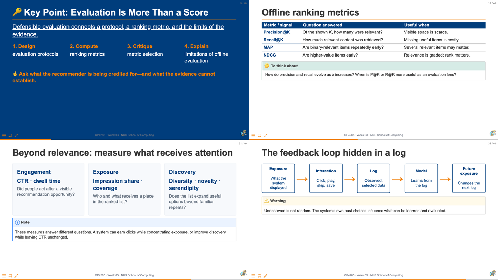

# 01 From Evaluation to Model {background-color="#EF7C00"}

::: notes
Delivery: 15 seconds. Introduce the transition: Week 03 asked what evidence supports a recommendation claim; Week 04 asks how a neural model turns the available evidence into a learned score.
:::

## {background-color="#1a0a2e"}

```{=html}
<div class="cp-frame-bg cp-frame-purple"></div>
<div class="cp-frame-content cp-thumbnail-recap-content" style="color:white;">
  <div class="cp-frame-label" style="background:#5C2D91;color:white;margin-bottom:0;">WEEK 03 RECAP</div>
  <div class="cp-thumbnail-composite-wrap">
    
  </div>
</div>
```

::: notes
Delivery: 3-minute recap. Read the thumbnails clockwise: (1) evaluation requires a protocol, suitable ranking metric, and defensible limits on the claim; (2) precision, recall, MAP, and NDCG answer different ranking questions; (3) engagement, exposure, and discovery show why relevance alone is not enough; and (4) the exposure–interaction–log loop shapes the evidence available for future learning. Ask: “What changes when we replace the scoring function with a neural model—and what must stay the same?” Answer: model capacity changes, but the evaluation contract and the limits of logged evidence remain.

[Sources]
- Week 03 slide 9: “Key Point: Evaluation Is More Than a Score.”
- Week 03 slide 18: “Offline ranking metrics.”
- Week 03 slide 31: “Beyond relevance: measure what receives attention.”
- Week 03 slide 35: “The feedback loop hidden in a log.”
:::

## 

```{=html}
<div class="cp-frame-bg cp-frame-navy"></div>
<div class="cp-frame-content">
  <div class="cp-frame-label" style="background:#003D7C;color:#EF7C00;">Week 04 Pre-Lecture Exercise</div>
  <div class="cp-frame-title cp-text--navy">What Does a Missing Interaction Mean?</div>
  <div class="cp-frame-body cp-stack" style="color:#333;font-size:.82em;line-height:1.25;">
    <p style="margin:0;color:#003D7C;font-weight:bold;">Canvas discussion board · submitted by <span class="cp-text--teal">Mon, 31 Aug · 23:59 SGT</span></p>
    <div class="cp-card cp-card--prompt">A user has never clicked a recommended item. Give two plausible interpretations: one about preference and one about exposure or the interface.</div>
    <p style="margin:0;">Use the responses as a constraint on today’s models: richer capacity can learn a more flexible interaction function, but it cannot recover information that the system never recorded.</p>
  </div>
</div>
```

::: notes
Delivery: 3 minutes. Invite two interpretations from the exercise. Keep the distinction crisp: a non-click can be consistent with disinterest, but also with no exposure, weak placement, poor timing, or inattention. Explain that neural collaborative filtering inherits this ambiguity whenever it learns from implicit logs.

[Sources]
- Week 03 slides: “TempoQuiz debrief: absence is not a label” and “What Does a Missing Interaction Mean?”
:::

## 

```{=html}
<div class="cp-frame-bg cp-frame-navy"></div>
<div class="cp-frame-content">
  <div class="cp-frame-label" style="background:#003D7C;color:#EF7C00;">Week 04 Pre-Lecture Exercise</div>
</div>
```

::: notes
:::

## Week 04: Neural Recommendation Models

> A neural recommender does not replace the evaluation contract. It replaces a fixed interaction rule with a **learned function** of the representations and evidence available to it.

::: {.callout-note}
Today: compare latent-factor and neural interaction functions, reason about implicit-feedback training, and ask when a model’s score is not yet an explanation.
:::

::: notes
Delivery: 1 minute. Make the scope clear. The goal is not to memorise every neural architecture; it is to recognise the modelling choice that changes when an inner product becomes a learnable interaction function.
:::

## Learning outcomes

```{=html}
<div class="cp-grid cp-grid--2" style="margin-top:.42em;">
  <div class="cp-card cp-card--soft"><p class="cp-card__title">Build</p><p style="margin:0;">Describe a neural recommender as embeddings, an interaction function, and a training objective.</p></div>
  <div class="cp-card cp-card--soft"><p class="cp-card__title">Compare</p><p style="margin:0;">Contrast a latent-factor dot product with a learned non-linear interaction function.</p></div>
  <div class="cp-card cp-card--soft"><p class="cp-card__title">Interpret</p><p style="margin:0;">Identify what implicit feedback supports—and what an unobserved interaction cannot prove.</p></div>
  <div class="cp-card cp-card--soft"><p class="cp-card__title">Critique</p><p style="margin:0;">Assess whether a performance claim, explanation, and safeguard are aligned.</p></div>
</div>
```

::: notes
Delivery: 1 minute. Read the action verbs, then use them as signposts through the sections. The final outcome keeps the Week 03 evidence lens active throughout the technical material.
:::

## Break — 5 minutes {background-color="#000000"}

```{=html}
<div class="cp-grid cp-grid--2-aside" style="min-height:62vh;align-items:center;color:#fff;">
  <div>
    <div class="cp-kicker cp-text--orange" style="margin-bottom:.8em;">While you pause</div>
    <h2 style="color:#fff;margin:.1em 0 .45em;">☕ TriRank</h2>
    <p style="font-size:1.05em;line-height:1.42;margin:0;color:#d8d8d8;">
      TriRank extends the user–item graph with review aspects, modelling users, items, and the aspects mentioned in reviews as a tripartite graph. That extra evidence can support explanations such as “recommended because you value battery life and display quality.”  
      TriRank was one of the final precursor works to Neural Collaborative Filtering (NeuCF) pioneered here at NUS.  
    </p>
  </div>
  <div class="cp-activity__timer">
    <div class="cp-timer">
      <svg width="180" height="180" viewBox="0 0 180 180" aria-label="Five-minute break timer">
        <circle cx="90" cy="90" r="75" fill="none" stroke="#333" stroke-width="14"></circle>
        <circle id="w04-break-ring" class="cp-timer__ring" cx="90" cy="90" r="75" fill="none" stroke="#EF7C00" stroke-width="14" stroke-dasharray="471.24" stroke-dashoffset="0" stroke-linecap="round" transform="rotate(-90 90 90)"></circle>
        <text id="w04-break-text" class="cp-timer__text" x="90" y="98" text-anchor="middle" font-family="Arial, Helvetica, sans-serif" font-size="32" font-weight="bold" fill="#00796B">05:00</text>
      </svg>
      <span id="w04-break-status" role="timer" aria-live="polite" class="cp-sr-only">05:00</span>
      <button id="w04-break-btn" type="button" class="cp-timer__button" data-cp-timer data-seconds="300" data-ring="w04-break-ring" data-text="w04-break-text" data-status="w04-break-status">▶ Start Timer</button>
    </div>
  </div>
</div>
```

::: notes
Delivery: announce a five-minute break and start the timer. TriRank was developed by Xiangnan He, Tao Chen, Min-Yen Kan, and Xiao Chen in the WING.NUS/NUS context. It models user-item-aspect relations extracted from reviews, making it a useful bridge from model structure to explainability. Invite students to consider whether an aspect-based rationale is evidence about the recommendation or simply a more persuasive presentation. The shared controller pauses the timer automatically if the slide is left.

[Source]
- He, X., Chen, T., Kan, M.-Y., & Chen, X. (2015). *TriRank: Review-aware Explainable Recommendation by Modeling Aspects*. CIKM. https://wing.comp.nus.edu.sg/publication/10-1145-2806416-2806504/
:::

## {background-color="#002a26"}

```{=html}
<div class="cp-frame-bg cp-frame-teal"></div>
<div class="cp-frame-content" style="color:white;background:#002a26;inset:60px;padding:26px 32px 22px;font-size:.92em;">
  <div class="cp-frame-label" style="background:#00796B;color:white;">Next Week Preview — Week 05</div>
  <div class="cp-frame-title" style="color:#80cbc4;">Sequential and Session-Based Recommendation</div>
  <div class="cp-frame-body" style="color:#cce8e5;">
    <div class="cp-grid cp-grid--2" style="align-items:center;">
      <div>
        <p style="margin:0 0 .35em;font-size:.88em;line-height:1.24;">A static user profile treats interactions as a collection. A sequence model asks whether <strong style="color:#fff;">order, recency, and session context</strong> change the next useful recommendation.</p>
        <p style="margin:.16em 0;"><strong style="color:#ffffff;">In Week 5:</strong></p>
        <ul style="margin:.18em 0;line-height:1.25;">
          <li>model temporal preferences;</li>
          <li>predict the next item; and</li>
          <li>critically assess engagement-driven objectives.</li>
        </ul>
      </div>
      <figure style="margin:0;text-align:right;">
        <a href="https://unsplash.com/photos/a-close-up-of-a-film-strip-on-a-white-surface-CLo6bHT0JMU" target="_blank" rel="noopener" aria-label="Open Markus Spiske's film-strip photograph on Unsplash">
          
        </a>
        <figcaption style="margin-top:.3em;color:#80cbc4;font-size:.53em;text-align:right;"><a href="https://unsplash.com/photos/a-close-up-of-a-film-strip-on-a-white-surface-CLo6bHT0JMU" target="_blank" rel="noopener" style="color:#80cbc4;">Photo: Markus Spiske / Unsplash</a></figcaption>
      </figure>
    </div>
  </div>
</div>
```

::: notes
Delivery: 1 minute. Preview Week 05 as a shift from a static user-item score to an ordered interaction history. The film strip is a visual metaphor for sequence, not a literal recommender architecture. Emphasise that the same events can imply different next actions when their order, recency, or session context changes. The image is credited to Markus Spiske and links to the Unsplash source page.

[Source]
- Markus Spiske, “A close up of a film strip on a white surface,” Unsplash. https://unsplash.com/photos/a-close-up-of-a-film-strip-on-a-white-surface-CLo6bHT0JMU
:::
