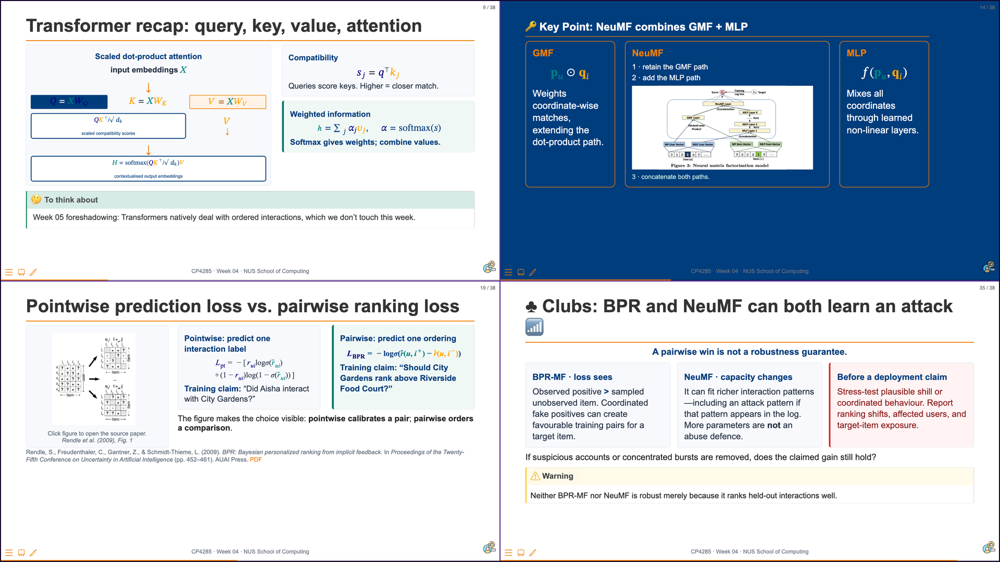
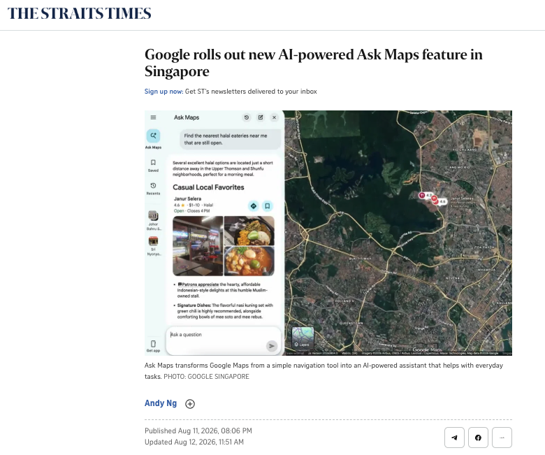

# 01 Overview {background-color="#EF7C00"}

```{=html}
<div aria-labelledby="w05-changelog-title" style="margin:1.2em auto 0;max-width:72%;padding:.55em .8em;border-left:3px solid #003D7C;border-radius:0 6px 6px 0;background:rgba(255,255,255,.78);color:#003D7C;font-family:Arial,Helvetica,sans-serif;font-size:.42em;line-height:1.35;">
  <h5 id="w05-changelog-title" style="margin:0 0 .25em;font-size:1em;font-weight:700;letter-spacing:.04em;text-transform:uppercase;">Changelog</h5>
  <ul style="margin:0;padding-left:1.2em;">
    <li><strong class="cp-text--navy">6 Sep 2026</strong> — Created the initial Week 05 deck.</li>
  </ul>
</div>
```

## {background-color="#1a0a2e"}

```{=html}
<div class="cp-frame-bg cp-frame-purple"></div>
<div class="cp-frame-content cp-thumbnail-recap-content" style="color:white;">
  <div class="cp-frame-label" style="background:#5C2D91;color:white;margin-bottom:0;">WEEK 04 RECAP</div>
  <div class="cp-thumbnail-composite-wrap">
    
  </div>
</div>
```

::: notes
Delivery: 3-minute recap. Read the quadrants clockwise: (1) attention turns queries, keys, and values into contextual representations; (2) NeuMF combines a coordinate-wise GMF path with a nonlinear MLP path; (3) the training objective matters - pointwise learning predicts an interaction label, while BPR learns an ordering between an observed and sampled item; and (4) neither architecture is inherently robust to coordinated manipulation in the log. Ask: “What does this leave out?” Answer: all four Week 04 models score a user-item relationship without representing the order of a user’s recent actions. Week 05 adds that sequence and session context.

[Sources]

- Week 04, slides 9, 14, 19, and 35.
:::

## {background-color="#ffffff"}

```{=html}
<div class="cp-frame-bg cp-frame-navy"></div>
<div class="cp-frame-content">
  <div class="cp-frame-label" style="background:#003D7C;color:#EF7C00;">Last Week Pre-Lecture Exercise</div>
  <div class="cp-frame-title cp-text--navy">Where Does One Session End?</div>
  <div class="cp-frame-body" style="color:#333;font-size:.72em;line-height:1.2;">
    <div class="cp-grid cp-grid--2" style="align-items:start;grid-template-columns:minmax(220px,.68fr) minmax(0,1.32fr);gap:1.05em;">
      <figure style="margin:0;text-align:center;">
        <a href="https://www.straitstimes.com/singapore/google-rolls-out-updated-ai-powered-ask-maps-feature-in-singapore" target="_blank" rel="noopener" aria-label="Open the Straits Times optional reading about Google Ask Maps">
          
        </a>
        <figcaption style="margin-top:.28em;color:#5F6B7A;font-size:.56em;line-height:1.15;"><a href="https://www.straitstimes.com/singapore/google-rolls-out-updated-ai-powered-ask-maps-feature-in-singapore" target="_blank" rel="noopener" style="color:#003D7C;">Optional reading: <em>The Straits Times</em>, 11 Aug 2026</a></figcaption>
      </figure>
      <div>
        <p style="font-weight:bold;color:#003D7C;margin:0 0 .36em;">Canvas discussion board · post before <span class="cp-text--teal">Mon, 7 Sep 23:59 SGT</span></p>
        <p style="margin:.10em 0 .42em;">Post one <strong>100–140 word</strong> decision memo. No classmate reply is required.</p>
        <div style="margin:.14em 0 .46em;padding:.62em .76em;border-left:7px solid #00796B;background:#F0F8F6;font-size:1em;line-height:1.22;color:#003D7C;font-weight:bold;">
          A person asks Ask Maps for a 2pm lunch route, explores nearby cultural sites, then later asks for a halal eatery open after 10pm. Does the late-evening query begin a new session? Answer yes or no and cite two trace details.
        </div>
        <p style="margin:.38em 0 0;color:#003D7C;font-weight:bold;font-size:.92em;">Next week: sequences make order, recency, and local context part of the recommendation signal.</p>
      </div>
    </div>
  </div>
</div>
```

::: notes
Delivery: introduce this as a pre-lecture activation task, not a test of GRU4Rec, SASRec, or Transformer knowledge. The optional article offers a familiar Singapore example of context-aware planning; it is a product illustration, not evidence that Ask Maps uses a particular sequence architecture. Expected output: one 100–140 word decision memo that answers yes or no and defends the proposed session boundary with two trace details. There is no classmate reply this week.

Instructor synthesis for Week 05: cluster the yes/no judgments around time gap, task shift, and contextual continuity. Establish that sessionisation is a modelling decision informed by observed traces, rather than direct proof of a person’s intent.

[Sources]
- Ng, A. (2026, 11 August). “Google rolls out new AI-powered Ask Maps feature in Singapore.” <em>The Straits Times</em>. Optional reading. https://www.straitstimes.com/singapore/google-rolls-out-updated-ai-powered-ask-maps-feature-in-singapore
:::

## {background-color="#ffffff"}

```{=html}
<div class="cp-frame-bg cp-frame-navy"></div>
<div class="cp-frame-content">
  <div class="cp-frame-label" style="background:#003D7C;color:#EF7C00;">Last Week Pre-Lecture Exercise · Canvas Voices</div>
</div>
```

::: notes
Delivery: introduce this as a pre-lecture activation task, not a test of GRU4Rec, SASRec, or Transformer knowledge. The optional article offers a familiar Singapore example of context-aware planning; it is a product illustration, not evidence that Ask Maps uses a particular sequence architecture. Expected output: one 100–140 word decision memo that answers yes or no and defends the proposed session boundary with two trace details. There is no classmate reply this week.

Instructor synthesis for Week 05: cluster the yes/no judgments around time gap, task shift, and contextual continuity. Establish that sessionisation is a modelling decision informed by observed traces, rather than direct proof of a person’s intent.

[Sources]
- Ng, A. (2026, 11 August). “Google rolls out new AI-powered Ask Maps feature in Singapore.” <em>The Straits Times</em>. Optional reading. https://www.straitstimes.com/singapore/google-rolls-out-updated-ai-powered-ask-maps-feature-in-singapore
:::

# 02 Sequence Models {background-color="#EF7C00"}

## From sessions to next-item prediction

> TODO: add GRU4Rec, SASRec, and Transformer recommender material.

::: notes
TODO (author): develop this concept with a worked example.
:::

## Ethics Thread: Engagement objectives

::: {.callout-warning}
TODO: examine manipulation risks in engagement optimization.
:::

::: notes
TODO (author): add a concrete stakeholder question.
:::

---

# Summary {background-color="#003D7C"}

## 🔑 <u>Time changes what a preference signal means.</u>

**Next week:** retrieval and ranking architectures.

::: notes
TODO (instructor): close with the stated transition.
:::

## {background-color="#ffffff"}

```{=html}
<div class="cp-frame-bg cp-frame-navy"></div>
<div class="cp-frame-content">
  <div class="cp-frame-label" style="background:#003D7C;color:#EF7C00;">Next Week Pre-Lecture Exercise</div>
  <div class="cp-frame-title cp-text--navy">When Should the Current Session Outweigh History?</div>
  <div class="cp-frame-body" style="color:#333;font-size:.79em;line-height:1.24;">
    <p style="font-weight:bold;color:#003D7C;margin:0 0 .42em;">Canvas discussion board · post before <span class="cp-text--teal">Mon, 14 Sep 23:59 SGT</span></p>
    <p style="margin:.1em 0 .46em;">Post one <strong>120–140 word</strong> response. No classmate reply is required.</p>
    <div style="margin:.16em 0 .52em;padding:.72em .86em;border-left:7px solid #00796B;background:#F0F8F6;color:#003D7C;font-weight:bold;line-height:1.28;">
      A user's long-term history is vegetarian cafés. In their current session, they search “late-night halal food”, open nearby restaurant pages, and check delivery times. What should the app consider now - and what should it not assume?
    </div>
    <ol style="margin:.25em 0 0;padding-left:1.25em;">
      <li>Name two item types the app should consider, even if the long-term profile would not prioritise them.</li>
      <li>Explain one risk of treating this session as a permanent preference.</li>
      <li>Name one <strong>non-click</strong> outcome that would show the list was helpful.</li>
    </ol>
    <p style="margin:.54em 0 0;color:#003D7C;font-weight:bold;">Next week: a system must make session-relevant options available before it can decide how to order the final list.</p>
  </div>
</div>
```

::: notes
Delivery: introduce this as a pre-lecture activation task, not a test of retrieval, ranking, or re-ranking terminology. Timebox: 4-6 minutes to introduce and clarify before the deadline. Expected output: one 120-140 word response that names two session-relevant item types, distinguishes a short-lived task from a durable preference, and proposes a non-click indicator of helpfulness.

Instructor synthesis for Week 06: begin by grouping responses into (a) items that become relevant from the recent sequence, (b) reasons not to overwrite the stable profile, and (c) evidence beyond clicks. Use these distinctions to motivate why a large catalogue needs a staged path from possible options to a final displayed list, without claiming that the activity itself teaches the architecture.

[Sources]

- CP4285 Week 03: Evaluation of Recommendation Systems (offline metrics and the limits of click-based evidence).
- CP4285 Week 04: Neural Recommendation Models (observability limits in interaction logs).
- CP4285 Week 05: Sequential and Session-Based Recommendation (temporal preferences and static versus dynamic representations).
:::

## {background-color="#002a26"}

```{=html}
<div class="cp-frame-bg cp-frame-teal"></div>
<div class="cp-frame-content" style="color:white;background:#002a26;inset:60px;padding:26px 32px 22px;font-size:.92em;">
  <div class="cp-frame-label" style="background:#00796B;color:white;">Next Week Preview — Week 06</div>
  <div class="cp-frame-title" style="color:#80cbc4;">Retrieval and Ranking Architectures</div>
  <div class="cp-frame-body" style="color:#cce8e5;">
    <div class="cp-grid cp-grid--2" style="align-items:center;">
      <div>
        <p style="margin:0 0 .35em;font-size:.88em;line-height:1.24;">A production recommender cannot compare every catalogue item in one step. It first <strong style="color:#fff;">retrieves</strong> plausible candidates, then <strong style="color:#fff;">ranks</strong> and re-ranks the short list for the user and situation.</p>
        <p style="margin:.16em 0;"><strong style="color:#ffffff;">In Week 06:</strong></p>
        <ul style="margin:.18em 0;line-height:1.25;">
          <li>trace the candidate-generation → ranking → re-ranking pipeline;</li>
          <li>compare retrieval and ranking objectives; and</li>
          <li>examine two-tower architectures and visibility trade-offs.</li>
        </ul>
      </div>
      <figure style="margin:0;text-align:right;">
        <a href="https://unsplash.com/photos/a-couple-of-dogs-playing-with-a-stuffed-animal-in-a-grassy-area-0lBR9AYzZ18" target="_blank" rel="noopener" aria-label="Open Barnabas Davoti's golden retrievers photograph on Unsplash">
          
        </a>
        <figcaption style="margin-top:.3em;color:#80cbc4;font-size:.53em;text-align:right;"><a href="https://unsplash.com/photos/a-couple-of-dogs-playing-with-a-stuffed-animal-in-a-grassy-area-0lBR9AYzZ18" target="_blank" rel="noopener" style="color:#80cbc4;">Photo: Barnabas Davoti / Unsplash</a></figcaption>
      </figure>
    </div>
  </div>
</div>
```

::: notes
Delivery: 1 minute. Use the two retrievers as a retrieval metaphor: a system must first bring a manageable set of plausible items into play before it can decide their final order. The photograph is illustrative, not a literal retrieval architecture. Preview the Week 6 distinction between fast candidate generation and more expressive ranking or re-ranking, then flag that this allocation of visibility has stakeholder consequences. The image is credited to Barnabas Davoti and links to the Unsplash source page.

[Source]

- Barnabas Davoti, “A couple of dogs playing with a stuffed animal in a grassy area,” Unsplash. https://unsplash.com/photos/a-couple-of-dogs-playing-with-a-stuffed-animal-in-a-grassy-area-0lBR9AYzZ18 (free to use under the Unsplash License).
:::
