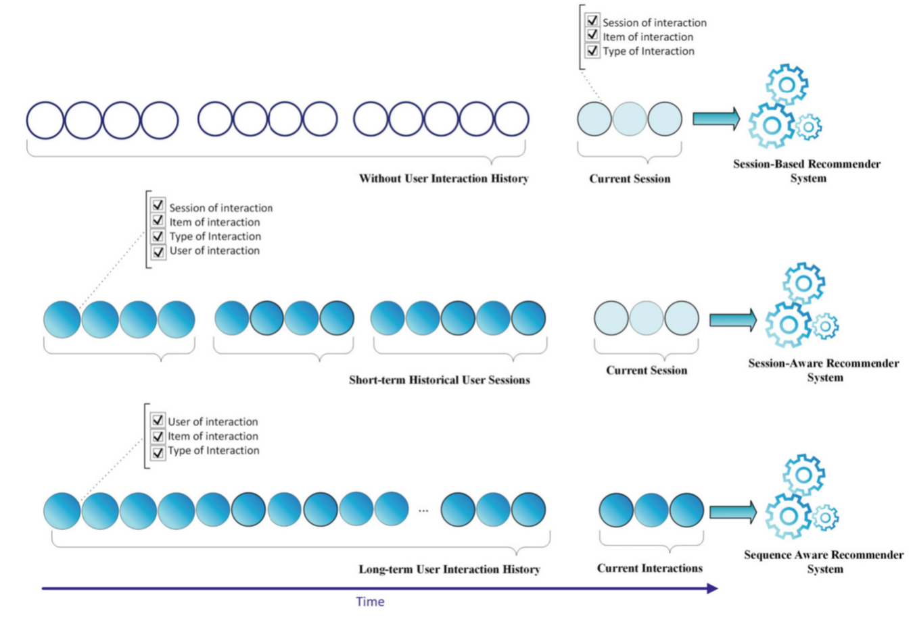

# 01 Announcements and Context {background-color="#EF7C00"}

::: notes
Delivery: 30 seconds. Welcome students, flag the quiz co-creation notice, and state that the opening moves quickly into the Week 04-to-Week 05 bridge.
:::

```{=html}
<div aria-labelledby="w05-changelog-title" style="margin:1.2em auto 0;max-width:72%;padding:.55em .8em;border-left:3px solid #003D7C;border-radius:0 6px 6px 0;background:rgba(255,255,255,.78);color:#003D7C;font-family:Arial,Helvetica,sans-serif;font-size:.42em;line-height:1.35;">
  <h5 id="w05-changelog-title" style="margin:0 0 .25em;font-size:1em;font-weight:700;letter-spacing:.04em;text-transform:uppercase;">Changelog</h5>
  <ul style="margin:0;padding-left:1.2em;">
    <li><strong class="cp-text--navy">6 Sep 2026</strong> — Added the Weeks 01–05 quiz-question contribution and Week 07 quiz details.</li>
    <li><strong class="cp-text--navy">5 Sep 2026</strong> — Added the Week 04 recap and Week 06 preview.</li>
  </ul>
</div>
```

## {background-color="#1a0a2e"}

```{=html}
<div class="cp-frame-bg cp-frame-purple"></div>
<div class="cp-frame-content cp-thumbnail-recap-content" style="color:white;">
  <div class="cp-frame-label" style="background:#5C2D91;color:white;margin-bottom:0;">WEEK 04 RECAP</div>
  <div class="cp-thumbnail-composite-wrap">
    
  </div>
</div>
```

::: notes
Delivery: 3-minute recap. Read the quadrants clockwise: (1) attention turns queries, keys, and values into contextual representations; (2) NeuMF combines a coordinate-wise GMF path with a nonlinear MLP path; (3) the training objective matters - pointwise learning predicts an interaction label, while BPR learns an ordering between an observed and sampled item; and (4) neither architecture is inherently robust to coordinated manipulation in the log. Ask: “What does this leave out?” Answer: all four Week 04 models score a user-item relationship without representing the order of a user’s recent actions. Week 05 adds that sequence and session context.

[Sources]

- Week 04, slides 9, 14, 19, and 35.
:::

## Quizzes - From Week 01 (10%)

- Quizzes are **jointly created by peers and instructors**
- Peers contribute candidate questions, answers, and worked solutions where needed
  - Min assigns each student a week, lecture section, difficulty, and question format.
  - Min curates, verifies, and finalises questions so that assessments remain fair, accurate, and aligned with the course learning outcomes.
- Combined worth **10%** of total marks
- **AI tools must not be used during in-class quizzes.**

::: {.callout-note}
Co-creation makes quizzes part of the pilot course: students help build better learning materials for this cohort and future cohorts.
:::

::: notes
Delivery: 1 minute. Keep this administrative notice to its essential policy: peers propose questions, instructors curate them, and in-class quizzes are AI-free.
:::

## Peer Quiz Question-Bank Contribution {background-color="#ffffff"}

```{=html}
<div style="font-size:.82em;line-height:1.22;">
  <p style="margin:.05em 0 .42em;">Covers <strong>Weeks 01–05</strong>. Your identifier determines one lecture section and one difficulty: <strong>easy, medium, or hard</strong>.</p>
  <p style="margin:.1em 0 .22em;color:#003D7C;font-weight:bold;">Your assigned contribution</p>
  <ul style="margin:.08em 0 .4em;padding-left:1.15em;">
    <li><strong>Two MCQ/MRQ questions</strong>, <strong>two fill-in-the-blank questions</strong>, or <strong>one calculation question</strong> with full working</li>
    <li>Include the answer for every question.</li>
  </ul>
  <p style="margin:.2em 0 .58em;">Submit on Canvas by <strong><span class="cp-text--teal">Mon, 21 Sep 2026, 23:59 SGT</span></strong>. You have two weeks to prepare.</p>
  <div class="cp-card cp-card--soft" style="padding:.55em .72em;">
    <p class="cp-card__title" style="margin-bottom:.18em;">Week 07 (Open Book) Quiz <span class="cp-text--teal">· Tue, 28 Sep 2026</span></p>
    <p style="margin:0;"><strong><span class="cp-text--teal">~30 minutes</span></strong> at the beginning of class. A mix of instructor and peer questions, completed on paper and proctored.</p>
  </div>
</div>
```

# 02 Lecture Overview {background-color="#EF7C00"}

## {background-color="#ffffff"}

```{=html}
<div class="cp-frame-bg cp-frame-navy"></div>
<div class="cp-frame-content">
  <div class="cp-frame-label" style="background:#003D7C;color:#EF7C00;">Last Week Pre-Lecture Exercise</div>
  <div class="cp-frame-title cp-text--navy">Where Does One Session End?</div>
  <div class="cp-frame-body" style="color:#333;font-size:.72em;line-height:1.2;">
    <div class="cp-grid cp-grid--2" style="align-items:start;grid-template-columns:minmax(220px,.68fr) minmax(0,1.32fr);gap:1.05em;">
      <figure style="margin:0;text-align:center;">
        <a href="https://www.straitstimes.com/singapore/google-rolls-out-updated-ai-powered-ask-maps-feature-in-singapore" target="_blank" rel="noopener" aria-label="Open the Straits Times optional reading about Google Ask Maps">
          
        </a>
        <figcaption style="margin-top:.28em;color:#5F6B7A;font-size:.56em;line-height:1.15;"><a href="https://www.straitstimes.com/singapore/google-rolls-out-updated-ai-powered-ask-maps-feature-in-singapore" target="_blank" rel="noopener" style="color:#003D7C;">Optional reading: <em>The Straits Times</em>, 11 Aug 2026</a></figcaption>
      </figure>
      <div>
        <p style="font-weight:bold;color:#003D7C;margin:0 0 .36em;">Canvas discussion board · post before <span class="cp-text--teal">Mon, 7 Sep 2026 · 23:59 SGT</span></p>
        <p style="margin:.10em 0 .42em;">Post one <strong>100–140 word</strong> decision memo. No classmate reply is required.</p>
        <div style="margin:.14em 0 .46em;padding:.62em .76em;border-left:7px solid #00796B;background:#F0F8F6;font-size:1em;line-height:1.22;color:#003D7C;font-weight:bold;">
          A person asks Ask Maps for a 2pm lunch route, explores nearby cultural sites, then later asks for a halal eatery open after 10pm. Does the late-evening query begin a new session? Answer yes or no and cite two trace details.
        </div>
        <p style="margin:.38em 0 0;color:#003D7C;font-weight:bold;font-size:.92em;">Next week: sequences make order, recency, and local context part of the recommendation signal.</p>
      </div>
    </div>
  </div>
</div>
```

::: notes
Delivery: introduce this as a pre-lecture activation task, not a test of GRU4Rec, SASRec, or Transformer knowledge. The optional article offers a familiar Singapore example of context-aware planning; it is a product illustration, not evidence that Ask Maps uses a particular sequence architecture. Expected output: one 100–140 word decision memo that answers yes or no and defends the proposed session boundary with two trace details. There is no classmate reply this week.

Instructor synthesis for Week 05: cluster the yes/no judgments around time gap, task shift, and contextual continuity. Establish that sessionisation is a modelling decision informed by observed traces, rather than direct proof of a person’s intent.

[Sources]
- Ng, A. (2026, 11 August). “Google rolls out new AI-powered Ask Maps feature in Singapore.” <em>The Straits Times</em>. Optional reading. https://www.straitstimes.com/singapore/google-rolls-out-updated-ai-powered-ask-maps-feature-in-singapore
:::

## {background-color="#ffffff"}

```{=html}
<div class="cp-frame-bg cp-frame-navy"></div>
<div class="cp-frame-content">
  <div class="cp-frame-label" style="background:#003D7C;color:#EF7C00;">Last Week Pre-Lecture Exercise</div>
  <div class="cp-frame-title cp-text--navy">Where Does One Session End?</div>
  <div class="cp-frame-body" style="color:#333;font-size:.72em;line-height:1.2;">
  </div>
</div>
```

::: notes
:::

## Which interaction history is available?

```{=html}
<div class="cp-grid cp-grid--2" style="grid-template-columns:minmax(0,1.75fr) minmax(235px,.65fr);align-items:center;gap:.75em;">
  <figure style="margin:0;">
    
  </figure>
  <div class="cp-stack" style="font-size:.72em;line-height:1.14;">
    <div class="cp-card cp-card--soft" style="padding:.42em .55em;"><p class="cp-card__title">Session-based</p><p style="margin:0;">Use the ordered events in the current session when no durable history is available.</p></div>
    <div class="cp-card cp-card--soft" style="padding:.42em .55em;"><p class="cp-card__title">Session-aware</p><p style="margin:0;">Combine the current session with earlier sessions from an identified user.</p></div>
    <div class="cp-card cp-card--soft" style="padding:.42em .55em;"><p class="cp-card__title">Sequence-aware</p><p style="margin:0;">Model a longer ordered history when earlier interactions may still matter.</p></div>
  </div>
</div>
<p style="margin:.35em 0 0;padding-top:.25em;border-top:1px solid #c8d5df;color:#5F6B7A;font-size:.34em;line-height:1.15;">Source: Ravanmehr, R., &amp; Mohamadrezaei, R. (2024). <em>Session-based recommender systems using deep learning</em> (Fig. 1.3, p. 15). Springer. <a href="https://doi.org/10.1007/978-3-031-42559-2" target="_blank" rel="noopener" style="color:#003D7C;">https://doi.org/10.1007/978-3-031-42559-2</a></p>
```

::: notes
Delivery: 3 minutes. Use the figure to separate three questions that the literature sometimes names inconsistently. Session-based recommendation sees only the current ordered session. Session-aware recommendation joins that local evidence to earlier sessions. Sequence-aware recommendation draws on a longer ordered interaction history. The three settings can all predict a next item, but they justify different claims about what evidence the model may use.

[Source]
- Ravanmehr and Mohamadrezaei (2024), <em>Session-Based Recommender Systems Using Deep Learning</em>, Fig. 1.3, p. 15. The original rotated figure has been extracted and rotated for legibility.
:::

## Week 05: What changes when interactions have an order?

<div class="cp-grid cp-grid--2">
  <div class="cp-card cp-card--soft"><p class="cp-card__title">Week 04</p><p style="margin:0;">Attention selected useful features for a user-item score.</p></div>
  <div class="cp-card cp-card--soft"><p class="cp-card__title">Week 05</p><p style="margin:0;">A sequence model selects useful <strong>earlier actions</strong> to predict the next item.</p></div>
</div>

<p style="margin-top:.8em;">By the end of today, you should be able to:</p>

- model temporal preferences;
- implement next-item prediction;
- compare static and dynamic representations; and
- critically assess engagement-driven objectives.

::: notes
Delivery: 3 minutes. This is a bridge, not a second Transformer lecture. The recurring question is whether a system should use durable history, current-session evidence, or both.
:::

# 03 Session-Based Models {background-color="#EF7C00"}

::: notes
Delivery: 30 seconds. Frame this half as a response to immediate, often anonymous intent; its question is what to use right now without making a lasting claim about the person.
:::

## The immediate-intent problem

<div class="cp-grid cp-grid--2">
  <div class="cp-card cp-card--soft"><p class="cp-card__title">Observed now</p><p style="margin:0;">“late-night halal food” → nearby restaurant pages → delivery times</p></div>
  <div class="cp-card cp-card--warning"><p class="cp-card__title">Do not infer too much</p><p style="margin:0;">A short trace can reveal a task without revealing a permanent identity or preference.</p></div>
</div>

<p style="margin-top:.8em;"><strong>Session-based recommendation:</strong> predict a next item from the ordered interactions in the current, often anonymous, session.</p>

::: notes
Delivery: 2.5 minutes. Tie this directly to the Ask Maps exercise. A session can be short, incomplete, and ambiguous; it is still often the strongest available signal for the immediate task.
:::

## Sessionisation is a modelling decision

```{=html}
<div class="cp-grid cp-grid--3">
  <div class="cp-flow-card"><strong>1. Time gap</strong><br><span>Has enough inactivity elapsed to make a new task plausible?</span></div>
  <div class="cp-flow-card"><strong>2. Task shift</strong><br><span>Did the intent move from museum planning to food delivery?</span></div>
  <div class="cp-flow-card"><strong>3. Continuity</strong><br><span>Do location, timing, and actions still support one coherent task?</span></div>
</div>
```

::: {.callout-note}
The boundary is an operational rule, not direct proof of intent.
:::

::: notes
Delivery: 3 minutes. Make the distinction explicit: a thirty-minute timeout is a policy choice. It should be evaluated against task coherence and product consequences.
:::

## From an event log to next-item examples

```{=html}
<div class="cp-flow-card">view ramen <span class="cp-flow-arrow">→</span> open halal filter <span class="cp-flow-arrow">→</span> inspect delivery time <span class="cp-flow-arrow">→</span> <strong>predict: late-night restaurant</strong></div>
```

<table class="cp-table cp-table--compact" style="margin-top:.75em;"><thead><tr><th>Observed prefix</th><th>Training target</th></tr></thead><tbody><tr><td class="cp-table__cell">[ramen]</td><td class="cp-table__cell cp-table__cell--highlight">halal filter</td></tr><tr><td class="cp-table__cell">[ramen, halal filter]</td><td class="cp-table__cell cp-table__cell--highlight">delivery time</td></tr></tbody></table>

::: notes
Delivery: 3 minutes. Read this as a minimal implementation contract: preserve order, form prefix-target pairs, train only on earlier events, and evaluate on later withheld events.
:::

## Start with baselines worth beating

<div class="cp-grid cp-grid--3">
  <div class="cp-card cp-card--soft"><p class="cp-card__title">Session popularity</p><p style="margin:0;">What is commonly consumed in a comparable context?</p></div>
  <div class="cp-card cp-card--soft"><p class="cp-card__title">Co-occurrence</p><p style="margin:0;">What is often seen after the current item?</p></div>
  <div class="cp-card cp-card--soft"><p class="cp-card__title">Nearest session</p><p style="margin:0;">Which previous sessions have a similar prefix?</p></div>
</div>

::: notes
Delivery: 2.5 minutes. A neural model earns its complexity only when these transparent baselines are insufficient under the same future-facing evaluation protocol.
:::

## 🎰 Bandit Time: What should this system use? {background-color="#003D7C"}

```{=html}
<div class="cp-activity cp-activity--navy cp-activity--framed cp-grid cp-grid--2-aside"><div><p class="cp-activity__prompt">An anonymous visitor opens three late-night restaurant pages. What is the best starting representation?</p><div class="cp-choice-grid"><div class="cp-choice-card cp-choice-card--a"><strong class="cp-choice-card__letter">A.</strong><span class="cp-choice-card__text">A permanent demographic profile</span></div><div class="cp-choice-card cp-choice-card--b"><strong class="cp-choice-card__letter">B.</strong><span class="cp-choice-card__text">The ordered current-session prefix</span></div><div class="cp-choice-card cp-choice-card--c"><strong class="cp-choice-card__letter">C.</strong><span class="cp-choice-card__text">An unordered set of all site clicks</span></div><div class="cp-choice-card cp-choice-card--d"><strong class="cp-choice-card__letter">D.</strong><span class="cp-choice-card__text">A random unseen item</span></div></div></div><div class="cp-activity__timer cp-center"><div class="cp-timer"><svg width="140" height="140" viewBox="0 0 180 180" aria-label="Twenty-second countdown timer"><circle cx="90" cy="90" r="75" fill="none" stroke="#ddd" stroke-width="14"></circle><circle id="w05-session-mcq-ring" class="cp-timer__ring" cx="90" cy="90" r="75" fill="none" stroke="#EF7C00" stroke-width="14" stroke-dasharray="471.24" stroke-dashoffset="0" stroke-linecap="round" transform="rotate(-90 90 90)"></circle><text id="w05-session-mcq-text" class="cp-timer__text" x="90" y="98" text-anchor="middle" font-family="Arial" font-size="26" font-weight="bold" fill="#00796B">00:20</text></svg><span id="w05-session-mcq-status" role="timer" aria-live="polite" class="cp-sr-only">00:20</span><button id="w05-session-mcq-btn" type="button" class="cp-timer__button" data-cp-timer data-seconds="20" data-ring="w05-session-mcq-ring" data-text="w05-session-mcq-text" data-status="w05-session-mcq-status">▶ Start Timer</button></div></div></div>
```

::: notes
Activity mode: MCQ/response. Timebox: 20 seconds, then a 1 minute 40 second debrief. Expected answer: B. The current ordered prefix represents immediate evidence without converting a brief task into a permanent profile. A infers too much; C loses order; D ignores evidence.
:::

## GRU4Rec: carry a changing session state

```{=html}
<div class="cp-flow-card"><strong>item 1</strong> <span class="cp-flow-arrow">→</span> GRU state <span class="cp-flow-arrow">→</span> <strong>item 2</strong> <span class="cp-flow-arrow">→</span> updated GRU state <span class="cp-flow-arrow">→</span> <strong>score next items</strong></div>
```

<div class="cp-grid cp-grid--2" style="margin-top:.8em;"><div class="cp-card cp-card--soft"><p class="cp-card__title">Update gate</p><p style="margin:0;">How much useful context should the model retain?</p></div><div class="cp-card cp-card--soft"><p class="cp-card__title">Reset gate</p><p style="margin:0;">Which old context should stop dominating the state?</p></div></div>

::: notes
Delivery: 4 minutes. Do not derive GRU equations. Explain the state as a learned, changing summary of a session prefix. GRU4Rec scores candidate next items from that state.

[Source]
- Hidasi et al. (2016), “Session-based Recommendations with Recurrent Neural Networks.”
:::

## Watch for the GRU intuition

<div class="cp-grid cp-grid--2"><div><iframe width="100%" height="430" src="https://www.youtube-nocookie.com/embed/IBs8D8PWMc8?start=282&end=402&rel=0" title="Gated Recurrent Unit explanation" allow="accelerometer; autoplay; clipboard-write; encrypted-media; gyroscope; picture-in-picture" allowfullscreen></iframe></div><div class="cp-card cp-card--prompt"><p class="cp-card__title">While you watch</p><p style="margin:0;">Which gate would help after a user abruptly shifts from planning museums to finding food delivery?</p><p class="cp-card__meta">The clip explains GRUs generally; the instructor maps the idea to GRU4Rec.</p></div></div>

::: notes
Delivery: 2 minutes. Play 4:42–6:42 only. Stop on time. Ask for one gate-based explanation; do not treat this external video as an authority on recommender systems.

[Source]
- Learn With Jay, “Gated Recurrent Unit | GRU | Explained in detail,” YouTube, 2024. https://www.youtube.com/watch?v=IBs8D8PWMc8
:::

## GRU4Rec implementation and evaluation lens

<div class="cp-grid cp-grid--3"><div class="cp-card cp-card--soft"><p class="cp-card__title">Batch</p><p style="margin:0;">Advance many active sessions together; reset a state when a session ends.</p></div><div class="cp-card cp-card--soft"><p class="cp-card__title">Score</p><p style="margin:0;">Compare the state with candidate-item representations.</p></div><div class="cp-card cp-card--soft"><p class="cp-card__title">Evaluate</p><p style="margin:0;">Use future sessions and report Hit Rate, MRR, or NDCG at K.</p></div></div>

::: notes
Delivery: 2.5 minutes. This is a blueprint, not live coding. Remind students that a held-out final event must not leak into the representation that predicts it.
:::

## 👥 Card-suit design clinic: current intent, accountable treatment {background-color="#003D7C"}

```{=html}
<div class="cp-activity cp-activity--navy cp-activity--framed cp-grid cp-grid--2-aside"><div><p class="cp-activity__prompt">Your group receives one card-suit lens. For the late-night halal-food session, propose one recommendation policy, one safeguard, and one evidence gap.</p><div class="cp-grid cp-grid--2" style="margin-top:.5em;"><div class="cp-card cp-card--soft"><strong>♣ Clubs</strong><br>How might manipulated activity distort the session?</div><div class="cp-card cp-card--soft"><strong>♥ Hearts</strong><br>Can social context help without conformity or privacy harm?</div><div class="cp-card cp-card--soft"><strong>♦ Diamonds</strong><br>Can the list support discovery beyond the popular head?</div><div class="cp-card cp-card--soft"><strong>♠ Spades</strong><br>Which stated requirement must remain visible and stable?</div></div><p class="cp-activity__instructions" style="margin-top:.55em;">Write a two-sentence report before the timer ends. These are situational treatment lenses, not demographic labels.</p></div><div class="cp-activity__timer cp-center"><div class="cp-timer"><svg width="140" height="140" viewBox="0 0 180 180" aria-label="Three-minute group discussion timer"><circle cx="90" cy="90" r="75" fill="none" stroke="#ddd" stroke-width="14"></circle><circle id="w05-session-lens-ring" class="cp-timer__ring" cx="90" cy="90" r="75" fill="none" stroke="#EF7C00" stroke-width="14" stroke-dasharray="471.24" stroke-dashoffset="0" stroke-linecap="round" transform="rotate(-90 90 90)"></circle><text id="w05-session-lens-text" class="cp-timer__text" x="90" y="98" text-anchor="middle" font-family="Arial" font-size="26" font-weight="bold" fill="#00796B">03:00</text></svg><span id="w05-session-lens-status" role="timer" aria-live="polite" class="cp-sr-only">03:00</span><button id="w05-session-lens-btn" type="button" class="cp-timer__button" data-cp-timer data-seconds="180" data-ring="w05-session-lens-ring" data-text="w05-session-lens-text" data-status="w05-session-lens-status">▶ Start Timer</button></div></div></div>
```

::: notes
Activity mode: small-group discussion. Total timebox: 10 minutes; use the displayed timer for the first 3 minutes of group writing, then reserve 2 minutes for reports, 2 minutes for AI Voice critique, 1 minute for student critique, and 2 minutes for instructor synthesis. Expected output: one policy, one safeguard, one evidence gap.

After groups have written, ask AI Voice: “For this session-based recommendation policy, whose interests might be overlooked, and what unsafe assumption could it be making?” Treat the reply as an object of critique, not an answer. Instructor synthesis: session evidence can be useful without becoming a permanent identity claim.
:::

## Session model selection: relevance is not a profile rewrite

<table class="cp-table cp-table--compact"><thead><tr><th>Situation</th><th>Useful starting point</th><th>Guardrail</th></tr></thead><tbody><tr><td class="cp-table__cell">Anonymous, short session</td><td class="cp-table__cell">Co-occurrence or GRU4Rec</td><td class="cp-table__cell cp-table__cell--highlight">Do not overclaim durable preference</td></tr><tr><td class="cp-table__cell">Sharp task shift</td><td class="cp-table__cell">Session-aware hybrid</td><td class="cp-table__cell cp-table__cell--highlight">Keep stated constraints visible</td></tr></tbody></table>

::: {.callout-warning}
Optimising the next click can reward urgency, repetition, or curiosity without showing that the task was genuinely helped.
:::

::: notes
Delivery: 3 minutes. A session-based model uses only current-session events. A session-aware hybrid combines that local evidence with persistent user or contextual history, while keeping the two roles distinct. Close the first half by separating predictive fit from an acceptable treatment of the user.
:::

# Break — 5 minutes {background-color="#000000"}

```{=html}
<div class="cp-grid cp-grid--2-aside" style="min-height:62vh;align-items:center;color:#fff;"><div><div class="cp-kicker cp-text--orange" style="margin-bottom:.8em;">While you pause</div><h2 style="color:#fff;margin:.1em 0 .45em;">☕ BREAK</h2><p style="font-size:1.05em;line-height:1.42;margin:0;color:#d8d8d8;">A session is a useful operational window, not a complete story about a person.</p></div><div class="cp-activity__timer"><div class="cp-timer"><svg width="180" height="180" viewBox="0 0 180 180" aria-label="Five-minute break timer"><circle cx="90" cy="90" r="75" fill="none" stroke="#333" stroke-width="14"></circle><circle id="w05-break-ring" class="cp-timer__ring" cx="90" cy="90" r="75" fill="none" stroke="#EF7C00" stroke-width="14" stroke-dasharray="471.24" stroke-dashoffset="0" stroke-linecap="round" transform="rotate(-90 90 90)"></circle><text id="w05-break-text" class="cp-timer__text" x="90" y="98" text-anchor="middle" font-family="Arial" font-size="32" font-weight="bold" fill="#00796B">05:00</text></svg><span id="w05-break-status" role="timer" aria-live="polite" class="cp-sr-only">05:00</span><button id="w05-break-btn" type="button" class="cp-timer__button" data-cp-timer data-seconds="300" data-ring="w05-break-ring" data-text="w05-break-text" data-status="w05-break-status">▶ Start Timer</button></div></div></div>
```

::: notes
Delivery: start the shared five-minute timer. It pauses automatically if the slide is left.
:::

# 04 Sequential Recommendation {background-color="#EF7C00"}

::: notes
Delivery: 30 seconds. Move from an immediate local task to ordered history that can reveal durable preferences, drift, and exceptions.
:::

## From the current session to a user sequence

<div class="cp-grid cp-grid--2"><div class="cp-card cp-card--soft"><p class="cp-card__title">Session state</p><p style="margin:0;">What seems useful for the task happening now?</p></div><div class="cp-card cp-card--soft"><p class="cp-card__title">Sequential user state</p><p style="margin:0;">Which earlier actions still matter after preferences evolve?</p></div></div>

::: notes
Delivery: 3 minutes. A long history can contain routine preferences, drift, and exceptions. Sequence models should not give every earlier action equal weight.
:::

## Preserve chronology in the learning pipeline

```{=html}
<div class="cp-flow-card">earlier history <span class="cp-flow-arrow">→</span> train sequence model <span class="cp-flow-arrow">→</span> later held-out interaction <span class="cp-flow-arrow">→</span> rank candidates</div>
```

<p style="margin-top:.8em;">A random split lets the model learn from actions that had not happened at recommendation time.</p>

::: notes
Delivery: 3 minutes. The implementation contract remains the same: form ordered prefixes, reserve later events for testing, and ensure features such as popularity are computed only from training-time evidence.
:::

## Static history and Markov baselines

<div class="cp-grid cp-grid--2"><div class="cp-card cp-card--soft"><p class="cp-card__title">Static representation</p><p style="margin:0;">Treat past actions as an unordered set or aggregate.</p></div><div class="cp-card cp-card--soft"><p class="cp-card__title">First-order Markov model</p><p style="margin:0;">Use the latest item to estimate the next transition.</p></div></div>

::: notes
Delivery: 2.5 minutes. Markov models preserve local order but can miss an older action that becomes relevant again. This motivates recurrent and attention-based representations.
:::

## 🎰 Bandit Time: Which evaluation is future-facing? {background-color="#003D7C"}

```{=html}
<div class="cp-activity cp-activity--navy cp-activity--framed cp-grid cp-grid--2-aside"><div><p class="cp-activity__prompt">Which design best supports a claim about next-item performance after deployment?</p><div class="cp-choice-grid"><div class="cp-choice-card cp-choice-card--a"><strong class="cp-choice-card__letter">A.</strong><span class="cp-choice-card__text">Randomly split all events from every date</span></div><div class="cp-choice-card cp-choice-card--b"><strong class="cp-choice-card__letter">B.</strong><span class="cp-choice-card__text">Train on earlier events and test on later events</span></div><div class="cp-choice-card cp-choice-card--c"><strong class="cp-choice-card__letter">C.</strong><span class="cp-choice-card__text">Train and test on each user's complete history</span></div><div class="cp-choice-card cp-choice-card--d"><strong class="cp-choice-card__letter">D.</strong><span class="cp-choice-card__text">Hide a random item but retain future popularity features</span></div></div></div><div class="cp-activity__timer cp-center"><div class="cp-timer"><svg width="140" height="140" viewBox="0 0 180 180" aria-label="Twenty-second countdown timer"><circle cx="90" cy="90" r="75" fill="none" stroke="#ddd" stroke-width="14"></circle><circle id="w05-seq-mcq-ring" class="cp-timer__ring" cx="90" cy="90" r="75" fill="none" stroke="#EF7C00" stroke-width="14" stroke-dasharray="471.24" stroke-dashoffset="0" stroke-linecap="round" transform="rotate(-90 90 90)"></circle><text id="w05-seq-mcq-text" class="cp-timer__text" x="90" y="98" text-anchor="middle" font-family="Arial" font-size="26" font-weight="bold" fill="#00796B">00:20</text></svg><span id="w05-seq-mcq-status" role="timer" aria-live="polite" class="cp-sr-only">00:20</span><button id="w05-seq-mcq-btn" type="button" class="cp-timer__button" data-cp-timer data-seconds="20" data-ring="w05-seq-mcq-ring" data-text="w05-seq-mcq-text" data-status="w05-seq-mcq-status">▶ Start Timer</button></div></div></div>
```

::: notes
Activity mode: MCQ/response. Timebox: 20 seconds, then a 1 minute 40 second debrief. Expected answer: B. It mirrors the direction of a production prediction. A and D can leak future evidence; C is not an out-of-sample test.
:::

## Why self-attention?

<div class="cp-grid cp-grid--2"><div class="cp-card cp-card--soft"><p class="cp-card__title">Recurrent encoding</p><p style="margin:0;">Compress the prefix into a changing hidden state.</p></div><div class="cp-card cp-card--soft"><p class="cp-card__title">Self-attention</p><p style="margin:0;">Let the current prediction selectively use different earlier actions.</p></div></div>

::: notes
Delivery: 2.5 minutes. Reconnect to the bridge: attention over actions is useful when the latest click is not the only useful context.
:::

## SASRec: causal self-attention for next-item prediction

```{=html}
<div class="cp-flow-card">item embeddings + position embeddings <span class="cp-flow-arrow">→</span> masked self-attention <span class="cp-flow-arrow">→</span> contextual sequence representation <span class="cp-flow-arrow">→</span> score next items</div>
```

<div class="cp-grid cp-grid--2" style="margin-top:.8em;"><div class="cp-card cp-card--soft"><p class="cp-card__title">Causal mask</p><p style="margin:0;">At position <em>t</em>, the model cannot inspect future actions.</p></div><div class="cp-card cp-card--soft"><p class="cp-card__title">Position matters</p><p style="margin:0;">The same items in a different order can imply a different next item.</p></div></div>

::: notes
Delivery: 4.5 minutes. Work one trace on the chalkboard: museum → vegetarian café → “late-night halal” → delivery time. For shifted targets, the input through item <em>i</em><sub>t</sub> scores <em>i</em><sub>t+1</sub>. Ask which actions should receive attention for predicting the next item, and why the causal mask protects the training task.

[Source]
- Kang and McAuley (2018), “Self-Attentive Sequential Recommendation.”
:::

## Transformer recommenders: related tasks, different masks

<table class="cp-table cp-table--compact"><thead><tr><th>Model framing</th><th>Training visibility</th><th>Natural use</th></tr></thead><tbody><tr><td class="cp-table__cell cp-table__cell--label">SASRec</td><td class="cp-table__cell">Causal: past only</td><td class="cp-table__cell cp-table__cell--highlight">Next-item prediction</td></tr><tr><td class="cp-table__cell cp-table__cell--label">BERT4Rec-style</td><td class="cp-table__cell">Masked positions with bidirectional context</td><td class="cp-table__cell cp-table__cell--highlight">Masked-item training; adapted to next-item ranking at inference</td></tr></tbody></table>

::: notes
Delivery: 3 minutes. Avoid a family taxonomy. SASRec uses unidirectional/causal self-attention; BERT4Rec uses bidirectional context around masked positions. The point is that masking expresses a learning task; an architecture name does not choose the task or objective for us.
:::

## Worked trace: what should the model attend to?

<div class="cp-card cp-card--prompt"><p class="cp-card__title">Trace</p><p style="margin:0;">vegetarian café → museum ticket → “late-night halal food” → delivery-time check → <strong>?</strong></p></div>

<p style="margin-top:.7em;">Name one action likely to be highly relevant, one action that may be weakly relevant, and one uncertainty that a log alone cannot resolve.</p>

::: notes
Delivery: 2 minutes. Take two rapid answers before the group activity. Keep the difference between “attention weight” and “truth about a person” explicit.
:::

## 👥 Long-term profile or sharp current intent? {background-color="#003D7C"}

```{=html}
<div class="cp-activity cp-activity--navy cp-activity--framed cp-grid cp-grid--2-aside"><div><p class="cp-activity__prompt">For the worked trace, decide what should influence the next recommendation, what must not overwrite the profile, and one non-click outcome that would show helpfulness.</p><p class="cp-activity__instructions">Write a two-sentence answer. Be ready to name one temporal signal, one uncertainty, and one risk of optimizing only engagement.</p></div><div class="cp-activity__timer cp-center"><div class="cp-timer"><svg width="140" height="140" viewBox="0 0 180 180" aria-label="Three-minute group discussion timer"><circle cx="90" cy="90" r="75" fill="none" stroke="#ddd" stroke-width="14"></circle><circle id="w05-seq-intent-ring" class="cp-timer__ring" cx="90" cy="90" r="75" fill="none" stroke="#EF7C00" stroke-width="14" stroke-dasharray="471.24" stroke-dashoffset="0" stroke-linecap="round" transform="rotate(-90 90 90)"></circle><text id="w05-seq-intent-text" class="cp-timer__text" x="90" y="98" text-anchor="middle" font-family="Arial" font-size="26" font-weight="bold" fill="#00796B">03:00</text></svg><span id="w05-seq-intent-status" role="timer" aria-live="polite" class="cp-sr-only">03:00</span><button id="w05-seq-intent-btn" type="button" class="cp-timer__button" data-cp-timer data-seconds="180" data-ring="w05-seq-intent-ring" data-text="w05-seq-intent-text" data-status="w05-seq-intent-status">▶ Start Timer</button></div></div></div>
```

::: notes
Activity mode: small-group discussion. Total timebox: 10 minutes; use the displayed timer for 3 minutes of group writing, then 2 minutes for reports, 3 minutes to map claims onto durable preference, short-term intent, and uncertainty, and 2 minutes for synthesis. Expected output: one temporal signal, one non-overwrite rule, and one non-click helpfulness measure. Instructor synthesis: compare a static aggregate with this dynamic sequence representation; a dynamic representation is not permission to turn every recent action into a durable profile.
:::

## Choose the smallest sufficient temporal model

<table class="cp-table cp-table--compact"><thead><tr><th>Evidence and need</th><th>Reasonable starting point</th></tr></thead><tbody><tr><td class="cp-table__cell">One immediately preceding action is enough</td><td class="cp-table__cell">Markov / co-occurrence baseline</td></tr><tr><td class="cp-table__cell">Short, changing anonymous intent</td><td class="cp-table__cell">GRU4Rec or session-aware method</td></tr><tr><td class="cp-table__cell">Long ordered history with selective dependencies</td><td class="cp-table__cell">SASRec-style sequential Transformer</td></tr></tbody></table>

::: notes
Delivery: 2 minutes. Model choice is a data-and-goal decision, not a race toward the newest architecture.
:::

# 05 Summary {background-color="#003D7C"}

::: notes
Delivery: 30 seconds. Signal that this is a distinct five-minute close: consolidate the representation, evaluation, and objective choices before previewing Week 06.
:::

## 🔑 <u>Time changes what a preference signal means.</u>

<div class="cp-grid cp-grid--3"><div class="cp-card cp-card--soft"><p class="cp-card__title">Session</p><p style="margin:0;">Local intent can be useful without defining a person.</p></div><div class="cp-card cp-card--soft"><p class="cp-card__title">Sequence</p><p style="margin:0;">Order and recency can change which history matters.</p></div><div class="cp-card cp-card--soft"><p class="cp-card__title">Objective</p><p style="margin:0;">A next click is not the whole definition of help.</p></div></div>

::: notes
Delivery: 3 minutes. Revisit the four stated outcomes and ask students to distinguish the model representation from the product claim.
:::

## {background-color="#ffffff"}

```{=html}
<div class="cp-frame-bg cp-frame-navy"></div><div class="cp-frame-content"><div class="cp-frame-label" style="background:#003D7C;color:#EF7C00;">Next Week Pre-Lecture Exercise</div><div class="cp-frame-title cp-text--navy">When should the current session outweigh history?</div><div class="cp-frame-body" style="color:#333;"><div class="cp-card cp-card--prompt"><p style="margin:0;">A user’s long-term history is vegetarian cafés. In their current session, they search “late-night halal food”, open nearby restaurant pages, and check delivery times. What should the app consider now—and what should it not assume?</p></div><p style="margin:.6em 0 0;"><strong>Canvas:</strong> 120–140 words by Mon, 14 Sep 2026, 23:59 SGT. Name two session-relevant item types, one risk of overwriting durable preference, and one non-click helpfulness signal.</p><p style="margin:.5em 0 0;color:#003D7C;"><strong>Next week:</strong> retrieve plausible options before ranking and re-ranking them.</p></div></div>
```

::: notes
Delivery: 2 minutes. This is a pre-lecture activation task, not a test of Week 06 terminology. Week 06 will use the responses to motivate retrieval, ranking, and re-ranking.
:::
## {background-color="#002a26"}

```{=html}
<div class="cp-frame-bg cp-frame-teal"></div>
<div class="cp-frame-content" style="color:white;background:#002a26;inset:60px;padding:26px 32px 22px;font-size:.92em;">
  <div class="cp-frame-label" style="background:#00796B;color:white;">Next Week Preview — Week 06</div>
  <div class="cp-frame-title" style="color:#80cbc4;">Retrieval and Ranking Architectures</div>
  <div class="cp-frame-body" style="color:#cce8e5;">
    <div class="cp-grid cp-grid--2" style="align-items:center;">
      <div>
        <p style="margin:0 0 .35em;font-size:.88em;line-height:1.24;">A production recommender cannot compare every catalogue item in one step. It first <strong style="color:#fff;">retrieves</strong> plausible candidates, then <strong style="color:#fff;">ranks</strong> and re-ranks the short list for the user and situation.</p>
        <p style="margin:.16em 0;"><strong style="color:#ffffff;">In Week 06:</strong></p>
        <ul style="margin:.18em 0;line-height:1.25;">
          <li>trace the candidate-generation → ranking → re-ranking pipeline;</li>
          <li>compare retrieval and ranking objectives; and</li>
          <li>examine two-tower architectures and visibility trade-offs.</li>
        </ul>
      </div>
      <figure style="margin:0;text-align:right;">
        <a href="https://unsplash.com/photos/a-couple-of-dogs-playing-with-a-stuffed-animal-in-a-grassy-area-0lBR9AYzZ18" target="_blank" rel="noopener" aria-label="Open Barnabas Davoti's golden retrievers photograph on Unsplash">
          
        </a>
        <figcaption style="margin-top:.3em;color:#80cbc4;font-size:.53em;text-align:right;"><a href="https://unsplash.com/photos/a-couple-of-dogs-playing-with-a-stuffed-animal-in-a-grassy-area-0lBR9AYzZ18" target="_blank" rel="noopener" style="color:#80cbc4;">Photo: Barnabas Davoti / Unsplash</a></figcaption>
      </figure>
    </div>
  </div>
</div>
```

::: notes
Delivery: 2 minutes. Preview the retrieval, ranking, and re-ranking pipeline as the next design problem. The fetching image is a visual bridge: retrieval finds plausible candidates, while ranking and re-ranking decide what reaches the user.
:::
