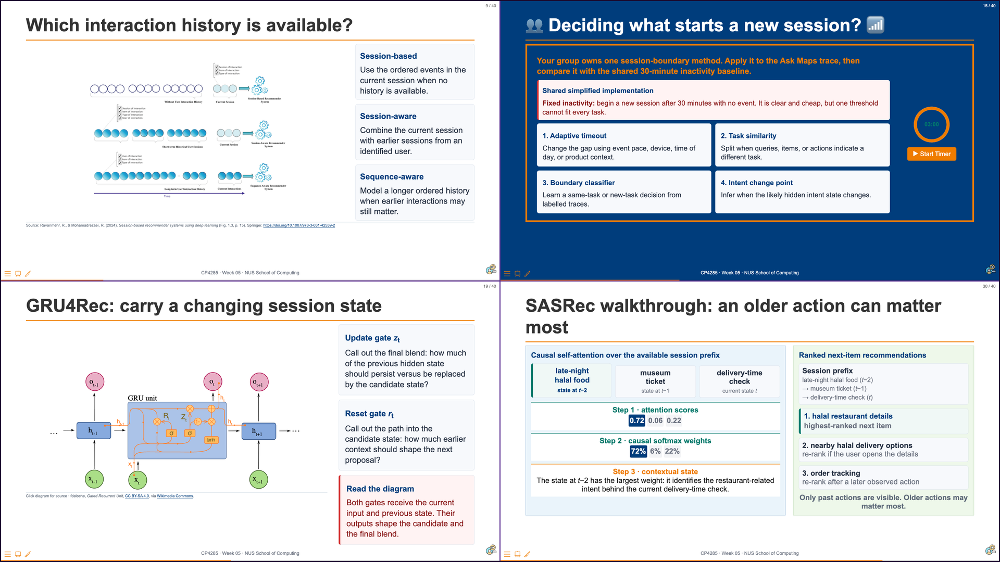
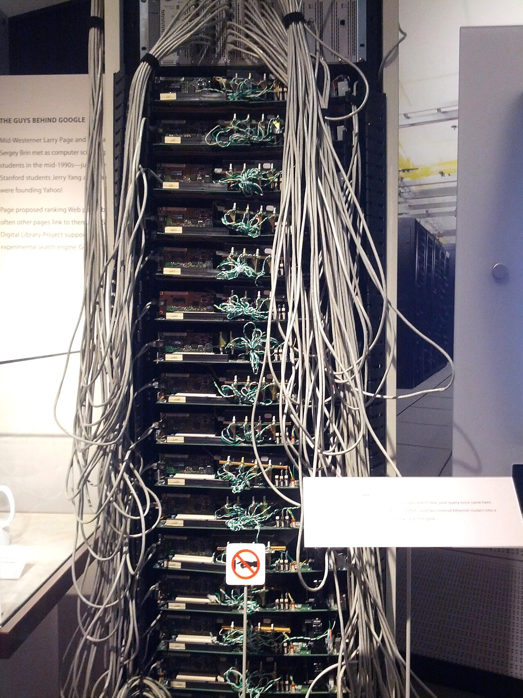
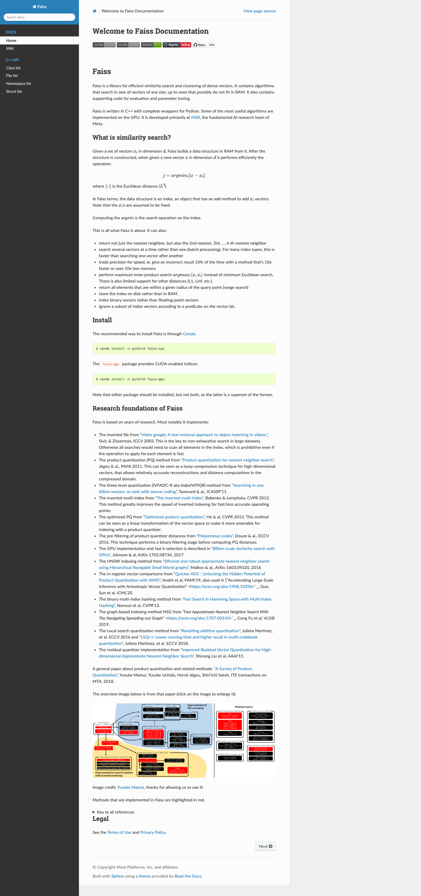
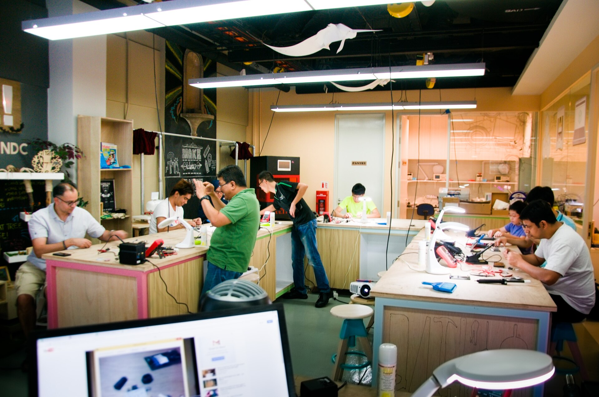

# 01 Announcements and Context {background-color="#EF7C00"}

```{=html}
<div aria-labelledby="w06-changelog-title" style="margin:1.2em auto 0;max-width:72%;padding:.55em .8em;border-left:3px solid #003D7C;border-radius:0 6px 6px 0;background:rgba(255,255,255,.78);color:#003D7C;font-family:Arial,Helvetica,sans-serif;font-size:.42em;line-height:1.35;">
  <h5 id="w06-changelog-title" style="margin:0 0 .25em;font-size:1em;font-weight:700;letter-spacing:.04em;text-transform:uppercase;">Changelog</h5>
  <ul style="margin:0;padding-left:1.2em;">
    <li><strong class="cp-text--navy">15 Sep 2026</strong> — Added the project-milestone discussion and the complete ranking, re-ranking, and visibility section, including code walks and the four treatment lenses.</li>
    <li><strong class="cp-text--navy">24 Aug 2026</strong> — Refreshed the course slide deck and changelog.</li>
  </ul>
</div>
```

## 🎰 Bandit Time: Start TempoQuiz {background-color="#003D7C"}

```{=html}
<div class="cp-activity cp-activity--navy cp-activity--framed cp-grid cp-grid--2" style="align-items:stretch;">
  <div class="cp-card cp-card--soft" style="display:flex;flex-direction:column;justify-content:space-between;min-height:10.2em;">
    <div>
      <span class="cp-kicker">TempoQuiz host launch</span>
      <p class="cp-card__title" style="font-size:1.25em;margin-top:.38em;">Open the room before Question 1</p>
      <p style="margin:.35em 0 0;font-size:.94em;line-height:1.3;">Open the host dashboard, then ask students to join with the <strong>live QR code or room code shown there</strong>.</p>
    </div>
    <div aria-label="Placeholder for the live TempoQuiz QR code and room code" style="margin-top:.68em;padding:.5em .65em;border:2px dashed #003D7C;border-radius:7px;text-align:center;color:#003D7C;font-weight:700;line-height:1.2;">
      LIVE QR + ROOM CODE<br><span style="font-size:.72em;font-weight:400;">Use the host dashboard — do not add a static code here.</span>
    </div>
  </div>
  <div class="cp-card" style="min-height:10.2em;">
    <span class="cp-kicker">Host dashboard cue</span>
    <p class="cp-card__title" style="font-size:1.25em;margin-top:.38em;">Week 05 Recap</p>
    <div class="cp-grid cp-grid--2" style="margin:.48em 0 .68em;column-gap:.55em;">
      <div class="cp-metric"><span class="cp-metric__label">Room</span><span class="cp-metric__value">Open</span><span class="cp-metric__meta">students can join</span></div>
      <div class="cp-metric cp-metric--orange"><span class="cp-metric__label">Question</span><span class="cp-metric__value">1</span><span class="cp-metric__meta">ready to release</span></div>
    </div>
    <div style="padding:.52em .7em;border-radius:6px;background:#EF7C00;color:#fff;text-align:center;font-weight:700;">▶ Release question 1</div>
    <p class="cp-card__meta">Wait for the room to settle, then release the first recap question.</p>
  </div>
</div>
```

::: notes
Instructor cue only. Before the recap starts, open the TempoQuiz host dashboard and verify that the room is open. Task: ask students to join using the live QR code or room code, confirm that responses are arriving, then release Question 1. Timebox: 1 minute for joining, followed by the configured question time. Expected output: students are connected and ready to answer the Week 05 recap. Instructor synthesis: use the result to retrieve the distinction between a current session and a longer ordered sequence before introducing production retrieval and ranking. The slide intentionally contains no static QR code or room code because those are live host-session details.
:::

## {background-color="#1a0a2e"}

```{=html}
<div class="cp-frame-bg cp-frame-purple"></div>
<div class="cp-frame-content cp-thumbnail-recap-content" style="color:white;">
  <div class="cp-frame-label" style="background:#5C2D91;color:white;margin-bottom:0;">WEEK 05 RECAP</div>
  <div class="cp-thumbnail-composite-wrap">
    
  </div>
</div>
```

::: notes
Delivery: 3-minute recap. Use the four tiles as retrieval cues rather than re-teaching them. Name the source slides in reading order: (1) Slide 09, *Which interaction history is available?*; (2) Slide 15, *From an event log to next-item examples*; (3) Slide 19, *GRU4Rec architecture: one event in, scores out*; and (4) Slide 30, *Preserve chronology in the learning pipeline*. The Slide 30 thumbnail is captured after its complete build is revealed.

:::

## {background-color="#ffffff"}

```{=html}
<div class="cp-frame-bg cp-frame-navy"></div><div class="cp-frame-content"><div class="cp-frame-label" style="background:#003D7C;color:#EF7C00;">Last Week Pre-Lecture Exercise</div><div class="cp-frame-title cp-text--navy">When should the current session outweigh history?</div><div class="cp-frame-body" style="color:#333;"><div class="cp-card cp-card--prompt"><p style="margin:0;">A user’s long-term history is vegetarian cafés. In their current session, they search “late-night halal food”, open nearby restaurant pages, and check delivery times. What should the app consider now—and what should it not assume?</p></div><p style="margin:.6em 0 0;"><strong>Canvas:</strong> 120–140 words by Mon, 14 Sep 2026, 23:59 SGT. Name two session-relevant item types, one risk of overwriting durable preference, and one non-click helpfulness signal.</p><p style="margin:.5em 0 0;color:#003D7C;"><strong>Next week:</strong> retrieve plausible options before ranking and re-ranking them.</p></div></div>
```

::: notes
Delivery: 2 minutes. This is a pre-lecture activation task, not a test of Week 06 terminology. Week 06 will use the responses to motivate retrieval, ranking, and re-ranking.
:::

## {background-color="#ffffff"}

```{=html}
<div class="cp-frame-bg cp-frame-navy"></div>
<div class="cp-frame-content">
  <div class="cp-frame-label" style="background:#003D7C;color:#EF7C00;">PROJECT MILESTONES</div>
  <div class="cp-frame-title cp-text--navy" style="margin-bottom:.26em;">Use today to make the next project decision clearer.</div>
  <div class="cp-grid cp-grid--2" style="align-items:stretch;margin-top:.10em;">
    <section class="cp-card cp-card--soft" style="display:flex;flex-direction:column;justify-content:space-between;">
      <div><span class="cp-kicker">Next checkpoint</span><p class="cp-card__title">Project Design Critique Update</p><p class="cp-card__meta">Show the team’s <strong>scope</strong>, proposed <strong>method</strong>, progress toward the goal, and any preliminary results.</p></div>
      <p style="margin:.7em 0 0;"><a href="https://docs.google.com/presentation/d/1Wj6qe-yio_LDeFvqZV6OtDxxpCHTV6HmyJyvkjqkFZk/edit?slide=id.g5e3f920791_0_0#slide=id.g5e3f920791_0_0" target="_blank" rel="noopener">Open the critique template ↗</a></p>
    </section>
    <section class="cp-card cp-card--warning" style="display:flex;flex-direction:column;justify-content:space-between;">
      <div><span class="cp-kicker">Where it is heading</span><p class="cp-card__title">STePS portrait poster · 11 Nov</p><p class="cp-card__meta">The poster should carry forward the critique’s core components. Be ready for a short 5–10 minute conversation about the work; STePS teams submit the poster PDF in Canvas.</p></div>
      <p style="margin:.7em 0 0;"><a href="https://docs.google.com/presentation/d/1Qu57hUkf6qWFL4gZ7eUNruN3ecDwTyE9Gu7cguILj30/edit?slide=id.p#slide=id.p" target="_blank" rel="noopener">Open the poster template ↗</a></p>
    </section>
  </div>
  <div class="cp-activity" style="margin-top:.62em;"><div class="cp-activity__prompt"><strong>Discuss now:</strong> What is one decision, risk, or evidence gap for which your team needs feedback?</div></div>
</div>
```

::: notes
Slide 05.

Delivery: 3 minutes. Invite teams to name one decision, risk, or evidence gap before opening questions to the room. Position the Project Design Critique Update as a feedback milestone: it should make scope, method, progress, and preliminary evidence discussable. Then connect it forward to STePS: the poster is the public-facing continuation of the same argument, with a short staff conversation. State the 11 November 2026 STePS date and clarify that STePS teams submit the poster PDF in Canvas rather than an eight-page report.

[Sources]
- [CP4285 Project Design Critique Template](https://docs.google.com/presentation/d/1Wj6qe-yio_LDeFvqZV6OtDxxpCHTV6HmyJyvkjqkFZk/edit?slide=id.g5e3f920791_0_0#slide=id.g5e3f920791_0_0), accessed 15 Sep 2026.
- [CP4285 STePS Portrait Poster Template](https://docs.google.com/presentation/d/1Qu57hUkf6qWFL4gZ7eUNruN3ecDwTyE9Gu7cguILj30/edit?slide=id.p#slide=id.p), accessed 15 Sep 2026.
:::

## {background-color="#ffffff"}

```{=html}
<div class="cp-frame-bg cp-frame-navy"></div>
<div class="cp-frame-content" style="padding-top:20px;">
  <div class="cp-frame-label" style="background:#003D7C;color:#EF7C00;">Last Week Pre-Lecture Exercise · Canvas Voices</div>
  <div class="cp-frame-title cp-text--navy" style="margin-bottom:.16em;">Three Canvas views on session and history</div>
  <div aria-label="Three anonymised full Canvas responses about using current-session signals without overwriting long-term preference" style="display:flex;width:100%;min-width:0;box-sizing:border-box;align-items:stretch;gap:1%;flex:1 1 auto;padding:.04em 1.38em .18em 1.12em;margin:0;">
    <article style="position:relative;flex:0 0 30%;width:30%;min-width:0;box-sizing:border-box;padding:.42em .58em .48em .80em;border-top:5px solid #2A76DD;background:#EEF6FF;color:#273244;">
      
      <div style="padding-bottom:.26em;border-bottom:1px solid #B8D2EF;"><div style="margin:0 0 .12em;color:#2A76DD;font-size:.235em;font-weight:800;letter-spacing:.05em;text-transform:uppercase;">Session-relevant signals</div><p style="margin:0;font-size:.315em;font-style:italic;line-height:1.16;">“The current session signals a shift in intent, so the app should retrieve on session-relevant item types rather than history. The two main ones are late-night restaurants and halal restaurants. They should also be weighted jointly rather than hard-intersected so candidates matching either still surface.</p></div>
      <div style="margin-top:.26em;padding-bottom:.26em;border-bottom:1px solid #B8D2EF;"><div style="margin:0 0 .12em;color:#2A76DD;font-size:.235em;font-weight:800;letter-spacing:.05em;text-transform:uppercase;">Risk to durable preference</div><p style="margin:0;font-size:.315em;font-style:italic;line-height:1.16;">The app should not, however, treat this as a durable change and overwrite the user’s long-term profile of vegetarian cafés. Doing that will risk overwriting a stable preference with a one-off context, perhaps they might be ordering for a friend, or a rare late-night exception and corrupts who the system thinks they are.</p></div>
      <div style="margin-top:.26em;"><div style="margin:0 0 .12em;color:#2A76DD;font-size:.235em;font-weight:800;letter-spacing:.05em;text-transform:uppercase;">Non-click helpfulness</div><p style="margin:0;font-size:.315em;font-style:italic;line-height:1.16;">Finally, one non-click helpfulness signal is the user checking delivery times of a particular restaurant, even if they did not click the final order button, as this indicates that they are interested in the restaurant but the intent was not strong enough, perhaps they might order for future sessions.”</p></div>
    </article>
    <article style="position:relative;flex:0 0 30%;width:30%;min-width:0;box-sizing:border-box;padding:.42em .58em .48em .80em;border-top:5px solid #00796B;background:#F0F8F6;color:#273244;">
      
      <div style="padding-bottom:.26em;border-bottom:1px solid #B9DDD4;"><div style="margin:0 0 .12em;color:#00796B;font-size:.235em;font-weight:800;letter-spacing:.05em;text-transform:uppercase;">Session-relevant signals</div><p style="margin:0;font-size:.315em;font-style:italic;line-height:1.16;">“Two session-relevant item types:</p><ul style="margin:.12em 0 0;padding-left:1.08em;font-size:.315em;font-style:italic;line-height:1.16;"><li>halal certified late night restaurants</li><li>fast delivery and currently open venues nearby</li></ul></div>
      <div style="margin-top:.26em;padding-bottom:.26em;border-bottom:1px solid #B9DDD4;"><div style="margin:0 0 .12em;color:#00796B;font-size:.235em;font-weight:800;letter-spacing:.05em;text-transform:uppercase;">Risk to durable preference</div><p style="margin:0;font-size:.315em;font-style:italic;line-height:1.16;">The risk overwriting durable preference is that if the system updates the long term profile just from this session, it may permanently suppress vegetarian recommendations which corrupts a stable preferences just from a one time atypical context.</p></div>
      <div style="margin-top:.26em;"><div style="margin:0 0 .12em;color:#00796B;font-size:.235em;font-weight:800;letter-spacing:.05em;text-transform:uppercase;">Non-click helpfulness</div><p style="margin:0;font-size:.315em;font-style:italic;line-height:1.16;">One non-click helpfulness signal could be the scroll depth and revisiting of the same listing. If the user looks at a restaurant page, leaves, then comes back to it again later or scrolls back up to do some kind of comparison, it signals active deliberation and comparison shopping and not some idle browsing. Revisiting together with signals like dwell time, can tell us that the item is strong enough to warrant a second look.”</p></div>
    </article>
    <article style="position:relative;flex:0 0 30%;width:30%;min-width:0;box-sizing:border-box;padding:.42em .58em .48em .80em;border-top:5px solid #D87900;background:#FFF7EC;color:#273244;">
      
      <div style="padding-bottom:.26em;border-bottom:1px solid #F3C88B;"><div style="margin:0 0 .12em;color:#D87900;font-size:.235em;font-weight:800;letter-spacing:.05em;text-transform:uppercase;">Session-relevant signals</div><p style="margin:0;font-size:.315em;font-style:italic;line-height:1.16;">“A user might have ‘bursty’ research in the current session that is not relevant to the history. In the context of Ask Map, meta-data (e.g. when and where did the user search these restaurant) might preserve a strong intent even though it’s non-click.</p></div>
      <div style="margin-top:.26em;padding-bottom:.26em;border-bottom:1px solid #F3C88B;"><div style="margin:0 0 .12em;color:#D87900;font-size:.235em;font-weight:800;letter-spacing:.05em;text-transform:uppercase;">Risk to durable preference</div><p style="margin:0;font-size:.315em;font-style:italic;line-height:1.16;">For example: Researching restaurant in Pasir Ris when the user’s current location is NUS. Should avoid overwriting the history with this session because it is a rare occurrence. (assume that the user don’t usually search restaurants near Pasir Ris)</p></div>
      <div style="margin-top:.26em;"><div style="margin:0 0 .12em;color:#D87900;font-size:.235em;font-weight:800;letter-spacing:.05em;text-transform:uppercase;">Non-click helpfulness</div><p style="margin:0;font-size:.315em;font-style:italic;line-height:1.16;">always searching ‘Gelato’ after dinner hours, probably just want to check what are the Gelato restaurants that still open at that hour. That shows that the user has a preference of Gelato over other dessert restaurants.”</p></div>
    </article>
  </div>
</div>
```

::: notes
Slide 06.

Delivery: 2 minutes. The three labelled bands make the exercise structure visible without repeating its questions. Read across one response at a time: current-session signals, risk to durable preference, then non-click helpfulness. Poh Yu Wen identifies a retrieval choice: preserve plausible candidates through soft, jointly weighted constraints. Brandon Kang identifies a ranking signal: revisit and scroll behaviour may indicate active comparison. Chen Jianxi makes the contextual-data point: place and time can explain an atypical session without warranting a permanent profile update. Bridge: “Week 06 asks where each kind of evidence can enter the pipeline and what is lost when it enters too late.”

[Sources]
- Canvas discussion: Poh Yu Wen (candidate retrieval); Brandon Kang (behavioural evidence); Chen Jianxi (context metadata), Week 06 pre-lecture exercise, accessed 15 Sep 2026. Quotations are reproduced in full; portraits are copied from the participants’ accompanying Canvas profile images, while names remain off-slide.
:::

## Week 6: Retrieval and Ranking Architectures

```{=html}
<p class="cp-kicker" style="margin:0 0 .35em;">Week 06 · Retrieval and ranking systems</p>
<div class="cp-card cp-card--prompt" style="margin:0 0 .8em;">
  Preserve useful evidence early, then spend expensive computation only where it can change the final recommendation.
</div>
<div class="cp-grid cp-grid--2" style="align-items:stretch;">
  <div class="cp-card cp-card--soft"><span class="cp-kicker">System reasoning</span><p class="cp-card__title">Trace the cascade</p><p class="cp-card__meta">Explain the distinct jobs of retrieval, ranking, re-ranking, and context assembly.</p></div>
  <div class="cp-card cp-card--soft"><span class="cp-kicker">Complexity reasoning</span><p class="cp-card__title">Budget the work</p><p class="cp-card__meta">Reason about runtime, memory, candidate depth, embedding dimension, and token budget.</p></div>
  <div class="cp-card cp-card--soft"><span class="cp-kicker">Architecture reasoning</span><p class="cp-card__title">Design the hand-offs</p><p class="cp-card__meta">Choose what an index, a lightweight ranker, and a deep re-ranker should each know.</p></div>
  <div class="cp-card cp-card--warning"><span class="cp-kicker">Stakeholder reasoning</span><p class="cp-card__title">Audit what is lost</p><p class="cp-card__meta">Evaluate recall, provenance, visibility, and source diversity—not only a final relevance score.</p></div>
  </div>
```

::: notes
Delivery: 2 minutes. State the outcomes as design capabilities rather than a list to memorise. Connect the prior exercise to the first hand-off: current-session signals may be valuable, but they must be available and affordable at the stage where they are used. Preview the notation used today: corpus size N, candidate depths K1, K2, and K3, embedding dimension d, joint sequence length L, and context token budget B.
:::

# 02 Pipeline Design {background-color="#EF7C00"}

::: notes
Delivery: 20 seconds. Introduce the section as the architectural response to the Week 06 outcomes: a useful system does not make one decision over the whole corpus. The next two slides establish why stages are necessary; the remaining slides specify what must cross their boundaries.
:::

## Maya’s current intent: a five-day trip

```{=html}
<div class="cp-grid cp-grid--2" style="width:100%;margin:.30em auto 0;align-items:stretch;zoom:.86;">
  <div class="cp-card cp-card--soft" style="display:flex;flex-direction:column;justify-content:space-between;padding:.78em .90em;">
    <div>
      <span class="cp-kicker">Shopping session</span>
      <p class="cp-card__title">Maya’s long-term purchases are mostly electronics and stationery.</p>
      <p style="margin:.55em 0 0;line-height:1.38;">Today she searches for luggage, opens cabin-bag dimensions, compares wheels and weight, and checks delivery before Friday.</p>
    </div>
    <div style="margin-top:.62em;padding:.52em .64em;border-left:5px solid #EF7C00;background:#fff7ed;color:#003D7C;">
      <span style="display:block;font-size:.72em;font-weight:700;letter-spacing:.04em;text-transform:uppercase;">Current query</span>
      <strong style="font-size:1.08em;line-height:1.2;">“compact carry-on luggage for a five-day trip”</strong>
    </div>
  </div>
  <div class="cp-card cp-card--warning" style="padding:.78em .90em;">
    <span class="cp-kicker">Fictional product catalogue</span>
    <p class="cp-card__title">N ≈ 5,000,000 active SKUs</p>
    <p class="cp-card__meta" style="margin:.25em 0 0;">Illustrative catalogue records—not retrieved candidates.</p>
    <div class="cp-grid cp-grid--2" style="margin-top:.36em;gap:.28em;font-size:.62em;line-height:1.14;">
      <div class="cp-chip cp-chip--navy">SKU-LUG-204<br><span style="font-weight:400;">Compact Carry-on Spinner · strong overlap</span></div>
      <div class="cp-chip cp-chip--navy">SKU-BPK-619<br><span style="font-weight:400;">40L Cabin Backpack · strong overlap</span></div>
      <div class="cp-chip cp-chip--navy">SKU-LUG-118<br><span style="font-weight:400;">Hard-shell Carry-on · strong overlap</span></div>
      <div class="cp-chip cp-chip--navy">SKU-CHK-841<br><span style="font-weight:400;">28-inch Checked Suitcase · too large</span></div>
      <div class="cp-chip cp-chip--navy">SKU-TOT-730<br><span style="font-weight:400;">Travel Tote · travel, not luggage</span></div>
      <div class="cp-chip cp-chip--navy">SKU-ORG-501<br><span style="font-weight:400;">Packing Cubes · accessory</span></div>
      <div class="cp-chip cp-chip--navy">SKU-PAS-338<br><span style="font-weight:400;">Passport Wallet · accessory</span></div>
      <div class="cp-chip cp-chip--navy">SKU-BPK-280<br><span style="font-weight:400;">Laptop Backpack · nearby category</span></div>
    </div>
  </div>
</div>
<div class="cp-card cp-card--prompt" style="max-width:94%;margin:.42em auto 0;padding:.62em .78em;"><strong>Question:</strong> before selecting Maya’s final list, which products must enter the candidate set?</div>
```

::: notes
Delivery: 90 seconds. Read Maya’s query and session trace aloud, then give students 20 seconds to scan the illustrative records from the five-million-SKU fictional catalogue. Ask for one strong overlap and one nearby-but-weaker record; do not ask for a final order. Synthesize: shown records are not already the candidate set. Current session evidence should influence the search, but the next two slides explain why the system cannot make the final decision across every catalogue item. These fictional product labels will be used consistently throughout Sections 02 and 03.
:::

## Why candidate generation cannot choose final products

```{=html}
<div class="cp-stack" style="max-width:92%;margin:0 auto;">
  <p style="margin:0;color:#425466;font-size:.88em;">Each stage receives fewer products and is allowed to use richer query and session evidence. A product removed early cannot be recovered later.</p>
  <div style="display:grid;grid-template-columns:1fr .14fr 1fr .14fr 1fr .14fr 1fr;align-items:stretch;gap:.32em;">
    <div class="cp-flow-card"><span class="cp-kicker">Product catalogue</span><strong>Catalogue N</strong><span class="cp-card__meta">Titles, descriptions, attributes, images</span></div>
    <div class="cp-flow-arrow" aria-hidden="true">→</div>
    <div class="cp-flow-card"><span class="cp-kicker">Candidate set</span><strong>K₁</strong><span class="cp-card__meta">Broad, plausible product matches</span></div>
    <div class="cp-flow-arrow" aria-hidden="true">→</div>
    <div class="cp-flow-card"><span class="cp-kicker">Lightweight ranking</span><strong>K₂</strong><span class="cp-card__meta">Price, popularity, and session features</span></div>
    <div class="cp-flow-arrow" aria-hidden="true">→</div>
    <div class="cp-flow-card"><span class="cp-kicker">Deep re-ranking</span><strong>K₃</strong><span class="cp-card__meta">Richer query-product fit</span></div>
  </div>
  <div class="cp-card cp-card--prompt" style="margin-top:.25em;"><strong>Then present:</strong> remove near-duplicates, explain the ordering, and return a manageable product shortlist for Maya.</div>
</div>
```

::: notes
Delivery: 3 minutes. Candidate generation is deliberately broad: it should retain products that could suit Maya’s current trip, not make the final preference distinction. The lightweight ranker makes a first precision-oriented cut with features that are more expensive or less indexable than candidate-generation features. The deep re-ranker uses richer query-product interaction, so it is reserved for a shortlist. Ask: “If a suitable carry-on bag falls outside K1, can a perfect re-ranker rescue it?” No.
:::

## Why not use one deep query-product scoring stage? {background-color="#ffffff"}

```{=html}
<div class="cp-grid cp-grid--2" style="align-items:stretch;">
  <div class="cp-card cp-card--warning">
    <span class="cp-kicker">Single-stage deep scoring</span>
    <p class="cp-card__title">Apply joint attention to every candidate product</p>
    <p style="margin:.45em 0;"><strong>Input:</strong> \(\color{orange}{K_1}\) products, each with a query-product sequence of length \(\color{teal}{L}\).</p>
    <div class="cp-metric cp-metric--orange"><span class="cp-metric__label">Approximate attention compute</span><span class="cp-metric__value">\(\operatorname{O}(\color{orange}{K_1}\color{teal}{L}^{2}\color{navy}{d})\)</span><span class="cp-metric__meta">\(\color{orange}{K_1}\) products × quadratic query-product interaction × hidden dimension \(\color{navy}{d}\)</span></div>
    <p class="cp-card__meta" style="margin-top:.6em;">With \(\color{orange}{K_1}=1{,}000\), every request jointly processes 1,000 product descriptions with Maya’s query and session. The most expensive model is spent on many weak matches.</p>
  </div>
  <div class="cp-card cp-card--soft">
    <span class="cp-kicker">Staged product ranking</span>
    <p class="cp-card__title">Use deep query-product scoring only after cheaper cuts</p>
    <div class="cp-stack" style="gap:.35em;">
      <div><strong>Generate:</strong> \(\color{navy}{N}\to\color{orange}{K_1}\) with a lexical, dense, or hybrid candidate index.</div>
      <div><strong>Rank:</strong> \(\color{orange}{K_1}\to\color{teal}{K_2}\) with lightweight product and session features.</div>
      <div><strong>Re-rank:</strong> \(\color{teal}{K_2}\to\color{orange}{K_3}\) with joint query-product scoring, \(\operatorname{O}(\color{teal}{K_2}\color{teal}{L}^{2}\color{navy}{d})\).</div>
    </div>
    <div class="cp-metric"><span class="cp-metric__label">Deep-scoring reduction</span><span class="cp-metric__value">\(\color{orange}{K_1}/\color{teal}{K_2}\)</span><span class="cp-metric__meta">\(1{,}000\to20\) means 50× fewer query-product evaluations</span></div>
  </div>
</div>
```

::: notes
Delivery: 3 minutes. Contrast the columns carefully. The left is not merely slow because it has many products; self-attention makes each query-product comparison much more expensive than a cached-vector score. The right column does not claim a universal retrieval complexity bound: latency and recall depend on the index type, hardware, and configuration. The engineering claim is that stages reserve expensive query-product interaction for candidates that survived cheaper evidence. The next sections make these terms concrete with index, embedding, and ranking code.
:::

## What must be ready before Maya shops?

```{=html}
<div class="cp-grid cp-grid--2" style="align-items:stretch;">
  <div class="cp-card cp-card--soft" style="font-size:.82em;">
    <span class="cp-kicker">Before the query · offline</span>
    <p class="cp-card__title">Prepare the product catalogue</p>
    <ul style="margin:.45em 0 0;padding-left:1.05em;line-height:1.4;">
      <li>store product title, description, category, and attributes;</li>
      <li>attach price, availability, and stable product identifiers;</li>
      <li>build and cache searchable representations.</li>
    </ul>
    <p class="cp-card__meta" style="margin-top:.7em;"><strong>Output:</strong> an indexed product catalogue with stable IDs.</p>
  </div>
  <div class="cp-card cp-card--warning" style="font-size:.82em;">
    <span class="cp-kicker">When Maya searches · online</span>
    <p class="cp-card__title">Respond to her query and current session</p>
    <ul style="margin:.45em 0 0;padding-left:1.05em;line-height:1.4;">
      <li>encode the query and current-session signals;</li>
      <li>retrieve plausible product candidates;</li>
      <li>rank using product and session features; and</li>
      <li>return an explainable product list.</li>
    </ul>
    <p class="cp-card__meta" style="margin-top:.7em;"><strong>Output:</strong> a small, ranked product shortlist.</p>
  </div>
</div>
<div class="cp-card cp-card--prompt" style="margin-top:.65em;"><strong>Design boundary:</strong> cached product representations make broad retrieval possible; detailed query-product matching waits until the shortlist.</div>
```

::: notes
Delivery: 2 minutes. “Offline” is work performed before Maya searches; “online” is work that happens within her request’s latency budget. Reconnect to Week 05: the current session can change what the system retrieves even when long-term purchases say something different. Mention availability only as catalogue metadata; the teaching point is the representation boundary and the move from broad retrieval to richer matching. Do not introduce a specific index implementation yet.
:::

## Code walk: a lexical first pass

```{=html}
<style>
#code-walk-a-lexical-first-pass .cp-card--soft pre { background:#F4F7FA !important; color:#273244 !important; border:1px solid #C9D4DF; }
#code-walk-a-lexical-first-pass .cp-card--soft pre span[style*="color:#9cc3ff"] { color:#003D7C !important; }
#code-walk-a-lexical-first-pass .cp-card--soft pre span[style*="color:#d8dee9"] { color:#3F4C5A !important; }
#code-walk-a-lexical-first-pass .cp-card--soft pre span[style*="color:#c59bff"] { color:#5C2D91 !important; }
#code-walk-a-lexical-first-pass .cp-card--soft pre span[style*="color:#f6b56b"] { color:#9A4700 !important; }
#code-walk-a-lexical-first-pass .cp-card--soft pre span[style*="color:#73d0c2"] { color:#006B60 !important; }
#code-walk-a-lexical-first-pass .cp-card--soft pre span[style*="color:#efb16c"] { color:#8D4200 !important; }
</style>
<div class="cp-grid cp-grid--2" style="align-items:stretch;">
  <div class="cp-card cp-card--soft">
    <span class="cp-kicker">Candidate generation · lexical overlap</span>
    <pre style="margin:.42em 0 0;padding:.72em;border-radius:6px;background:#17212b;color:#ecf2f7;font-size:.59em;line-height:1.42;overflow:hidden;"><code><span style="color:#75808C;"># query + session terms</span><br><span style="color:#9cc3ff;">query_terms</span> <span style="color:#d8dee9;">=</span> <span style="color:#c59bff;">{</span><span style="color:#f6b56b;">"compact"</span><span style="color:#d8dee9;">,</span> <span style="color:#f6b56b;">"carry-on"</span><span style="color:#d8dee9;">,</span> <span style="color:#f6b56b;">"luggage"</span><span style="color:#d8dee9;">,</span><br>               <span style="color:#f6b56b;">"cabin"</span><span style="color:#d8dee9;">,</span> <span style="color:#f6b56b;">"travel"</span><span style="color:#c59bff;">}</span><br><br><span style="color:#75808C;"># score one product</span><br><span style="color:#c59bff;">def</span> <span style="color:#73d0c2;">lexical_score</span><span style="color:#d8dee9;">(</span><span style="color:#9cc3ff;">product</span><span style="color:#d8dee9;">):</span><br>    <span style="color:#75808C;"># count overlapping index terms</span><br>    <span style="color:#c59bff;">return</span> <span style="color:#9cc3ff;">len</span><span style="color:#d8dee9;">(</span><span style="color:#9cc3ff;">query_terms</span> <span style="color:#d8dee9;">&amp;</span> <span style="color:#9cc3ff;">product</span><span style="color:#d8dee9;">[</span><span style="color:#f6b56b;">"index_terms"</span><span style="color:#d8dee9;">])</span><br><br><span style="color:#75808C;"># sort and keep top four</span><br><span style="color:#9cc3ff;">top_k</span> <span style="color:#d8dee9;">=</span> <span style="color:#9cc3ff;">sorted</span><span style="color:#d8dee9;">(</span><span style="color:#9cc3ff;">catalogue</span><span style="color:#d8dee9;">,</span> <span style="color:#c59bff;">key</span><span style="color:#d8dee9;">=</span><span style="color:#73d0c2;">lexical_score</span><span style="color:#d8dee9;">,</span> <span style="color:#c59bff;">reverse</span><span style="color:#d8dee9;">=</span><span style="color:#c59bff;">True</span><span style="color:#d8dee9;">)[:</span><span style="color:#efb16c;">4</span><span style="color:#d8dee9;">]</span></code></pre>
  </div>
  <div class="cp-card cp-card--warning">
    <span class="cp-kicker">K₁ · plausible product candidates</span>
    <table class="cp-table cp-table--compact" style="margin:.42em 0 0;width:100%;font-size:.52em;line-height:1.2;"><thead><tr><th>Score</th><th>Product</th><th>Matching index terms</th></tr></thead><tbody><tr><td><strong>3</strong></td><td>SKU-LUG-204<br>Compact Carry-on Spinner</td><td>compact · carry-on · luggage</td></tr><tr><td><strong>1</strong></td><td>SKU-LUG-118<br>Hard-shell Carry-on</td><td>carry-on</td></tr><tr><td><strong>1</strong></td><td>SKU-BPK-619<br>40L Cabin Backpack</td><td>cabin</td></tr><tr><td><strong>1</strong></td><td>SKU-TOT-730<br>Travel Tote</td><td>travel</td></tr></tbody></table>
    <p class="cp-card__meta" style="margin:.58em 0 0;">The terms come from Maya’s query plus observable session language, such as the cabin-bag comparison.</p>
    <div aria-label="Low-score lexical distractors that also enter the broader candidate set" style="margin-top:.5em;padding-top:.42em;border-top:1px solid #cfd7df;color:#7a8794;font-size:.43em;line-height:1.22;">
      <strong style="color:#657586;">Other low-score matches in K₁ · lexical distractors</strong>
      <div style="display:flex;flex-wrap:wrap;gap:.22em;margin-top:.28em;"><span style="padding:.2em .34em;border:1px solid #cfd7df;border-radius:4px;background:#f0f3f5;">SKU-ACC-404 · Compact travel umbrella <em>(compact, travel)</em></span><span style="padding:.2em .34em;border:1px solid #cfd7df;border-radius:4px;background:#f0f3f5;">SKU-ACC-277 · Carry-on luggage scale <em>(carry-on, luggage)</em></span><span style="padding:.2em .34em;border:1px solid #cfd7df;border-radius:4px;background:#f0f3f5;">SKU-ACC-912 · Cabin packing cubes <em>(cabin)</em></span><span style="padding:.2em .34em;border:1px solid #cfd7df;border-radius:4px;background:#f0f3f5;">SKU-ACC-056 · Travel neck pillow <em>(travel)</em></span></div>
    </div>
  </div>
</div>
<p style="margin:.65em 0 0;color:#425466;font-size:.82em;"><strong>Interpret the score as retrieval evidence, not a recommendation score.</strong> The next stage can inspect price, dimensions, delivery, and richer query-product fit.</p>
```

::: notes
Delivery: 3 minutes. Walk down the code in order. `index_terms` are precomputed searchable words associated with each product; `query_terms` combines Maya’s explicit wording with observable session language, including her cabin-bag comparison. The table shows four plausible products that enter K1 because they share at least one term. The grey records also enter the broader K1 set: they share lexical evidence but are accessories rather than the luggage Maya seeks. Read the number as retrieval evidence, not a final preference score. Ask: “Does a score of three mean SKU-LUG-204 is Maya’s recommendation?” No. It only says that this product deserves later inspection alongside other plausible candidates and lexical distractors. Section 03 will compare lexical, dense, and hybrid ways to build K1.
:::

## A product candidate needs evidence for later ranking

```{=html}
<div class="cp-grid cp-grid--2" style="align-items:stretch;">
  <div class="cp-card cp-card--soft"><span class="cp-kicker">Catalogue → candidates</span><p class="cp-card__title">Retrieve a product at all</p><p class="cp-card__meta">Carry product ID, title, category, and cached representation.</p></div>
  <div class="cp-card cp-card--soft"><span class="cp-kicker">Candidates → ranker</span><p class="cp-card__title">Compare practical fit</p><p class="cp-card__meta">Make price, attributes, popularity, and session signals available.</p></div>
  <div class="cp-card cp-card--soft"><span class="cp-kicker">Ranker → re-ranker</span><p class="cp-card__title">Reserve a shortlist</p><p class="cp-card__meta">Pass only products worth richer query-product comparison.</p></div>
  <div class="cp-card cp-card--warning"><span class="cp-kicker">Re-ranker → Maya</span><p class="cp-card__title">Explain the shortlist</p><p class="cp-card__meta">Return product reasons, comparable alternatives, and near-duplicate control.</p></div>
</div>
<div class="cp-card cp-card--prompt" style="margin-top:.65em;"><strong>Failure to audit:</strong> if SKU-LUG-204 never enters the candidate set, no later ranker can recommend it.</div>
```

::: notes
Delivery: 2 minutes. Read the cards as interface contracts, not as four new models. Each hand-off states what the next stage is allowed to know and what it must preserve. Return to SKU-LUG-204: later ranking may demote it, but candidate generation is the only point at which the system can ensure it remains visible. Transition: “What representations let `index.search` find a product whose catalogue wording differs from Maya’s query?”
:::

# ☕ When Google results danced {background-color="#000000"}

```{=html}
<div class="cp-grid cp-grid--2" style="min-height:62vh;align-items:center;color:#fff;">
  <div class="cp-stack" style="display:flex;min-height:58vh;flex-direction:column;justify-content:center;">
    <div>
      <div class="cp-kicker cp-text--orange" style="margin-bottom:.7em;">While you pause · a search-history aside</div>
      <p style="margin:0;max-width:28em;color:#d8d8d8;font-size:1.02em;line-height:1.4;">In 2003, the <em>Google Dance</em> described a monthly index update. For several days, searches could alternate between old and new index versions—so rankings appeared to move.</p>
      <p style="margin:.7em 0 0;font-size:.68em;line-height:1.35;"><a href="https://www.webmoves.net/2003/07/19/google-dance-the-index-update-of-the-google-search-engine/" target="_blank" rel="noopener" style="color:#f6b56b;text-decoration:underline;">Read the contemporaneous 2003 account ↗</a></p>
    </div>
    <div class="cp-activity__timer cp-center" style="margin-top:1.2em;">
      <div class="cp-timer">
        <svg width="180" height="180" viewBox="0 0 180 180" aria-label="Five-minute break timer">
          <circle cx="90" cy="90" r="75" fill="none" stroke="#333" stroke-width="14"></circle>
          <circle id="w06-google-dance-break-ring" class="cp-timer__ring" cx="90" cy="90" r="75" fill="none" stroke="#EF7C00" stroke-width="14" stroke-dasharray="471.24" stroke-dashoffset="0" stroke-linecap="round" transform="rotate(-90 90 90)"></circle>
          <text id="w06-google-dance-break-text" class="cp-timer__text" x="90" y="98" text-anchor="middle" font-family="Arial, Helvetica, sans-serif" font-size="32" font-weight="bold" fill="#00796B">05:00</text>
        </svg>
        <span id="w06-google-dance-break-status" role="timer" aria-live="polite" class="cp-sr-only">05:00</span>
        <button id="w06-google-dance-break-btn" type="button" class="cp-timer__button" data-cp-timer data-seconds="300" data-ring="w06-google-dance-break-ring" data-text="w06-google-dance-break-text" data-status="w06-google-dance-break-status">▶ Start Timer</button>
      </div>
    </div>
  </div>
  <figure class="cp-center" style="margin:0;">
    <a href="https://commons.wikimedia.org/wiki/File:Google%27s_First_Server_Rack.jpg" target="_blank" rel="noopener" aria-label="Open the original Wikimedia Commons image of Google's first server rack">
      
    </a>
    <figcaption style="margin-top:.65em;color:#c6cbd3;font-size:.58em;line-height:1.35;">One of Google’s first production server racks (1998).<br><a href="https://commons.wikimedia.org/wiki/File:Google%27s_First_Server_Rack.jpg" target="_blank" rel="noopener" style="color:#f6b56b;text-decoration:underline;">Photographing Travis · CC BY 2.0 · Wikimedia Commons ↗</a></figcaption>
  </figure>
</div>
```

::: notes
Delivery: announce a five-minute break and start the `w06-google-dance-break` timer. The timer pauses automatically if the slide is left. No student output is required during the break. On return, use one bridge question: “If the whole index once changed in visible monthly waves, why would a modern system separate fast candidate retrieval from slower, richer ranking?”

Historical source: Philipp Lenssen, “Google Dance – The Index Update of the Google Search Engine,” Web Moves, 19 Jul 2003, https://www.webmoves.net/2003/07/19/google-dance-the-index-update-of-the-google-search-engine/.

Image source and attribution: “Google’s First Server Rack,” photograph by Photographing Travis, 12 Aug 2012, Wikimedia Commons, https://commons.wikimedia.org/wiki/File:Google%27s_First_Server_Rack.jpg, CC BY 2.0, https://creativecommons.org/licenses/by/2.0/. Resized for the slide; retain the on-slide credit and link.
:::

# 03 Retrieval Architectures {background-color="#EF7C00"}

::: notes
Delivery: 20 seconds. Resume from the break by returning to the opaque `index.search` call from Section 02. This section opens that component: first, how products become vectors and an index; then, how exact and approximate search trade work, storage, and candidate recall.
:::

## Keywords help—until the catalogue uses different words

```{=html}
<div class="cp-grid cp-grid--2" style="align-items:stretch;">
  <div class="cp-card cp-card--soft">
    <span class="cp-kicker">Maya’s current query</span>
    <p class="cp-card__title">“compact carry-on luggage for a five-day trip”</p>
    <p class="cp-card__meta">Exact terms make the carry-on spinners easy to find.</p>
    <div style="margin-top:.62em;padding:.52em .65em;background:#fff;border-left:4px solid #003D7C;"><strong>Lexical strength:</strong> product codes, dimensions, brands, and exact category terms.</div>
  </div>
  <div class="cp-card cp-card--warning">
    <span class="cp-kicker">Catalogue wording</span>
    <p class="cp-card__title">SKU-BPK-619 · “40L Cabin Backpack”</p>
    <p class="cp-card__meta">It may suit a five-day trip even though its title contains neither “compact” nor “luggage.”</p>
    <div style="margin-top:.62em;padding:.52em .65em;background:#fff;border-left:4px solid #EF7C00;"><strong>Retrieval question:</strong> can the system preserve semantic matches without losing exact constraints?</div>
  </div>
</div>
<div class="cp-card cp-card--prompt" style="margin-top:.65em;"><strong>Candidate generation needs complementary signals:</strong> lexical matching for exact language; dense matching for related meaning.</div>
```

::: notes
Delivery: 2 minutes. Contrast the exact phrase “carry-on luggage” with the catalogue title “Cabin Backpack.” Make the modest claim: dense retrieval can help preserve a semantic candidate, not prove that it should rank first. State that dimensions and product codes remain good lexical evidence, so the section will return to hybrid candidate generation at the end.
:::

## Two towers create a shared comparison space

```{=html}
<div style="display:grid;grid-template-columns:1fr .16fr 1fr .16fr 1fr;align-items:stretch;gap:.42em;max-width:94%;margin:0 auto;">
  <div class="cp-flow-card"><span class="cp-kicker">Offline · product tower</span><strong>Product title, description, attributes</strong><span class="cp-card__meta">SKU-LUG-204 → product vector \(\color{orange}{\mathbf{v}_p}\)</span></div>
  <div class="cp-flow-arrow" aria-hidden="true">→</div>
  <div class="cp-flow-card"><span class="cp-kicker">Shared vector space</span><strong>Comparable embeddings</strong><span class="cp-card__meta">nearer vectors = stronger semantic candidate fit</span></div>
  <div class="cp-flow-arrow" aria-hidden="true">←</div>
  <div class="cp-flow-card"><span class="cp-kicker">Online · query tower</span><strong>Maya’s query + current session</strong><span class="cp-card__meta">→ query vector \(\color{teal}{\mathbf{v}_q}\)</span></div>
</div>
<div class="cp-grid cp-grid--2" style="margin-top:.7em;align-items:stretch;">
  <div class="cp-card cp-card--soft"><strong>Training:</strong> historical sessions and observed product interactions teach the towers which query-product pairs belong near each other.</div>
  <div class="cp-card cp-card--warning"><strong>Retrieval:</strong> compare \(\color{teal}{\mathbf{v}_q}\) with cached \(\color{orange}{\mathbf{v}_p}\) vectors; do not run the product tower again for every query.</div>
</div>
```

::: notes
Delivery: 2 minutes. Separate learning from retrieval. The towers are trained offline from historical interactions; once trained, the product tower encodes catalogue products before Maya arrives. At request time the query tower encodes the current request and session. Do not suggest that a two-tower similarity is a final product ranking: it produces an efficient candidate signal.
:::

## FAISS: a library for dense-vector search

```{=html}
<div style="display:flex;min-height:64vh;flex-direction:column;align-items:center;justify-content:center;">
  <a href="https://faiss.ai/index.html" target="_blank" rel="noopener" aria-label="Open the official FAISS documentation" style="display:block;text-align:center;">
    
  </a>
  <p style="margin:.42em 0 0;color:#425466;font-size:.58em;"><a href="https://faiss.ai/index.html" target="_blank" rel="noopener">faiss.ai ↗</a> · efficient similarity search and clustering of dense vectors</p>
</div>
```

::: notes
Slide 19.

Delivery: 45 seconds. Use the official documentation as a visual introduction to the library that will hold and search Maya’s product vectors. Faiss supports efficient similarity search and clustering of dense vectors; its indexes make exact and approximate nearest-neighbour retrieval concrete. The next slide starts with its simple exact inner-product index as the baseline.

[Sources]
- [FAISS Documentation, “Welcome to Faiss Documentation”](https://faiss.ai/index.html), accessed 15 Sep 2026. Full-page screenshot captured from the source; retain the on-slide hyperlink.
:::

## Offline: build the dense product index

```{=html}
<style>
#offline-build-the-dense-product-index .cp-card--soft pre { background:#F4F7FA !important; color:#273244 !important; border:1px solid #C9D4DF; }
#offline-build-the-dense-product-index .cp-card--soft pre span[style*="color:#9cc3ff"] { color:#003D7C !important; }
#offline-build-the-dense-product-index .cp-card--soft pre span[style*="color:#d8dee9"] { color:#3F4C5A !important; }
#offline-build-the-dense-product-index .cp-card--soft pre span[style*="color:#c59bff"] { color:#5C2D91 !important; }
#offline-build-the-dense-product-index .cp-card--soft pre span[style*="color:#f6b56b"] { color:#9A4700 !important; }
#offline-build-the-dense-product-index .cp-card--soft pre span[style*="color:#73d0c2"] { color:#006B60 !important; }
#offline-build-the-dense-product-index .cp-card--soft pre span[style*="color:#efb16c"] { color:#8D4200 !important; }
#offline-build-the-dense-product-index .cp-card--soft pre a { color:#5C2D91 !important; }
</style>
<div class="cp-grid cp-grid--2" style="align-items:stretch;">
  <div class="cp-card cp-card--soft">
    <span class="cp-kicker">After training the towers</span>
    <pre style="margin:.42em 0 0;padding:.72em;border-radius:6px;background:#17212b;color:#ecf2f7;font-size:.59em;line-height:1.42;overflow:hidden;"><code><span style="color:#9cc3ff;">product_vectors</span> <span style="color:#d8dee9;">=</span> <span style="color:#9cc3ff;">product_tower</span><span style="color:#d8dee9;">.</span><span style="color:#73d0c2;">encode</span><span style="color:#d8dee9;">(</span><span style="color:#9cc3ff;">products</span><span style="color:#d8dee9;">)</span> <span style="color:#75808C;"># product → vector</span>
<span style="color:#9cc3ff;">faiss</span><span style="color:#d8dee9;">.</span><span style="color:#73d0c2;">normalize_L2</span><span style="color:#d8dee9;">(</span><span style="color:#9cc3ff;">product_vectors</span><span style="color:#d8dee9;">)</span> <span style="color:#75808C;"># IP = cosine</span>

<span style="color:#9cc3ff;">base</span> <span style="color:#d8dee9;">=</span> <span style="color:#9cc3ff;">faiss</span><span style="color:#d8dee9;">.</span><span style="color:#c59bff;">IndexFlatIP</span><span style="color:#d8dee9;">(</span><span style="color:#efb16c;">d</span><span style="color:#d8dee9;">)</span> <span style="color:#75808C;"># d = 768; exact IP</span>
<span style="color:#9cc3ff;">index</span> <span style="color:#d8dee9;">=</span> <span style="color:#9cc3ff;">faiss</span><span style="color:#d8dee9;">.</span><span style="color:#c59bff;">IndexIDMap</span><span style="color:#d8dee9;">(</span><span style="color:#9cc3ff;">base</span><span style="color:#d8dee9;">)</span> <span style="color:#75808C;"># retain SKU IDs</span>
<span style="color:#9cc3ff;">index</span><span style="color:#d8dee9;">.</span><span style="color:#73d0c2;">add_with_ids</span><span style="color:#d8dee9;">(</span><span style="color:#9cc3ff;">product_vectors</span><span style="color:#d8dee9;">,</span> <span style="color:#9cc3ff;">sku_ids</span><span style="color:#d8dee9;">)</span> <span style="color:#75808C;"># store vectors + SKUs</span></code></pre>
  </div>
  <div class="cp-card cp-card--warning">
    <span class="cp-kicker">What the index retains</span>
    <div class="cp-stack" style="gap:.42em;margin-top:.44em;">
      <div><strong>Vector:</strong> searchable representation of each product.</div>
      <div><strong>SKU ID:</strong> stable pointer back to title, price, image, and inventory metadata.</div>
      <div><strong>Refresh path:</strong> new or materially changed products need a new vector and index entry.</div>
    </div>
    <p class="cp-card__meta" style="margin-top:.62em;">The two-tower model creates vectors. FAISS stores and searches them.</p>
  </div>
</div>
<div class="cp-card cp-card--prompt" style="margin-top:.65em;"><strong>Normalised inner product:</strong> with L2-normalised vectors, <a href="https://faiss.ai/cpp_api/struct/structfaiss_1_1IndexFlatIP.html" target="_blank" rel="noopener" aria-label="Open the FAISS IndexFlatIP documentation" style="color:#003D7C;text-decoration:underline;text-underline-offset:.12em;"><code>IndexFlatIP</code></a> gives an exact cosine-similarity baseline.</div>
```

::: notes
Delivery: 3 minutes. Walk line by line. First encode all products with the product tower; then normalise vectors; then create a FAISS exact inner-product index; finally associate each vector with its stable SKU. Explain that the vector index does not replace product metadata: it returns SKU IDs that the retrieval service uses to fetch current details. Mention that changed products must be re-encoded and updated. [Source: FAISS, “Faiss indexes,” https://github.com/facebookresearch/faiss/wiki/Faiss-indexes]
:::

## Exact dense search is the baseline to beat

```{=html}
<div class="cp-grid cp-grid--2" style="align-items:stretch;">
  <div class="cp-card cp-card--soft">
    <span class="cp-kicker">Exact `IndexFlatIP` search</span>
    <p class="cp-card__title">Compare Maya’s vector with every product vector</p>
    <div class="cp-metric"><span class="cp-metric__label">Per-query work</span><span class="cp-metric__value">O(Nd)</span><span class="cp-metric__meta">5,000,000 products × 768 dimensions ≈ 3.84 billion dimension-wise comparisons</span></div>
    <p class="cp-card__meta" style="margin-top:.58em;">Exact search is often the correct baseline for a smaller catalogue or an offline audit.</p>
  </div>
  <div class="cp-card cp-card--warning">
    <span class="cp-kicker">Raw vector storage</span>
    <p class="cp-card__title">Float32 vectors occupy real memory</p>
    <div class="cp-metric cp-metric--orange"><span class="cp-metric__label">Vector store</span><span class="cp-metric__value">≈ 15.4 GB</span><span class="cp-metric__meta">5,000,000 × 768 × 4 bytes; before SKU IDs, metadata, and index overhead</span></div>
    <p class="cp-card__meta" style="margin-top:.58em;">The catalogue scale—not the presence of embeddings—motivates approximate search.</p>
  </div>
</div>
```

::: notes
Delivery: 2 minutes. Treat Flat search as the reference, not a failure. Derive the storage estimate aloud: five million times 768 times four bytes is about 15.4 GB in decimal units, before metadata. The per-query comparison count is a scale intuition, not a wall-clock latency claim; hardware and batching change elapsed time. State the evaluation rule: compare ANN candidate recall and latency against this exact baseline.
:::

## FAISS/HNSW: traverse promising product neighbours

```{=html}
<div class="cp-grid cp-grid--2" style="align-items:stretch;">
  <div class="cp-card cp-card--soft">
    <span class="cp-kicker">Graph ANN code walk</span>
    <pre style="margin:.42em 0 0;padding:.72em;border-radius:6px;background:#17212b;color:#ecf2f7;font-size:.59em;line-height:1.32;overflow:hidden;"><code>base = faiss.IndexHNSWFlat(d, 32)
index = faiss.IndexIDMap(base)
index.add_with_ids(product_vectors, sku_ids)

base.hnsw.efSearch = 64
scores, ids = index.search(maya_vector, k=100)</code></pre>
  </div>
  <div class="cp-card cp-card--warning">
    <span class="cp-kicker">HNSW trade-off</span>
    <p class="cp-card__title">Explore a graph, not every vector</p>
    <div class="cp-stack" style="gap:.4em;">
      <div><strong>M = 32:</strong> more graph links can improve recall but consume more memory.</div>
      <div><strong>efSearch = 64:</strong> more exploration usually improves recall but costs more time.</div>
      <div><strong>Storage:</strong> raw vectors still need ≈15.4 GB; 32 base-layer links add roughly 1.3 GB before overhead.</div>
    </div>
  </div>
</div>
<div class="cp-card cp-card--prompt" style="margin-top:.65em;"><strong>Candidate contract:</strong> HNSW may return fewer comparisons and lower latency, but its Recall@K₁ must be measured against `IndexFlatIP`.</div>
```

::: notes
Delivery: 3 minutes. Explain HNSW as a proximity graph: the search navigates promising neighbours rather than scanning all product vectors. M controls graph connectivity; `efSearch` controls query exploration. Use the storage arithmetic as an order-of-magnitude estimate: five million times 32 links times 8 bytes is about 1.28 GB before higher-layer and object overhead. Do not promise a fixed latency or recall. [Source: FAISS, “Faiss indexes,” https://github.com/facebookresearch/faiss/wiki/Faiss-indexes]
:::

## IVF: search selected vector clusters

```{=html}
<div class="cp-grid cp-grid--2" style="align-items:stretch;">
  <div class="cp-card cp-card--soft">
    <span class="cp-kicker">Inverted-file (IVF) intuition</span>
    <p class="cp-card__title">Cluster product vectors before queries arrive</p>
    <div style="display:grid;grid-template-columns:1fr .14fr 1fr .14fr 1fr;align-items:center;gap:.26em;margin-top:.52em;">
      <div class="cp-flow-card"><strong>5M vectors</strong><span class="cp-card__meta">offline k-means</span></div>
      <div class="cp-flow-arrow" aria-hidden="true">→</div>
      <div class="cp-flow-card"><strong>4,096 lists</strong><span class="cp-card__meta">coarse clusters</span></div>
      <div class="cp-flow-arrow" aria-hidden="true">→</div>
      <div class="cp-flow-card"><strong>Probe 32 lists</strong><span class="cp-card__meta">search a fraction</span></div>
    </div>
  </div>
  <div class="cp-card cp-card--warning">
    <span class="cp-kicker">Average-work estimate</span>
    <p class="cp-card__title">`nprobe` is a recall–latency control</p>
    <div class="cp-metric cp-metric--orange"><span class="cp-metric__label">Approximate vectors scanned</span><span class="cp-metric__value">≈ 39,000</span><span class="cp-metric__meta">5,000,000 × 32 / 4,096 ≈ 1/128 of a full scan, before coarse assignment</span></div>
    <p class="cp-card__meta" style="margin-top:.55em;">`IndexIVFFlat` keeps full vectors; IVF reduces search work, not raw-vector storage. IVF-PQ can reduce storage at additional approximation cost.</p>
  </div>
</div>
```

::: notes
Delivery: 2 minutes. Explain that IVF is a cluster-pruning strategy, not a graph. It trains a coarse quantizer offline, then examines only `nprobe` nearby lists at query time. Derive the 39,000 estimate from five million times 32 divided by 4,096; clarify it is an average list-balance estimate. Contrast with HNSW: HNSW navigates neighbours, whereas IVF selects clusters. Do not conflate `IndexIVFFlat`, which retains full vectors, with compressed IVF-PQ. [Source: FAISS, “Faiss indexes,” https://github.com/facebookresearch/faiss/wiki/Faiss-indexes]
:::

## 🎰 Bandit Time: What does `nprobe` change? {background-color="#003D7C"}

```{=html}
<div class="cp-activity cp-activity--navy cp-activity--framed cp-grid cp-grid--2-aside">
  <div>
    <p class="cp-activity__prompt">Maya’s five-million-product index has 4,096 IVF lists. The system raises `nprobe` from 32 to 128. What is the most defensible expectation?</p>
    <div class="cp-choice-grid">
      <div class="cp-choice-card cp-choice-card--a"><strong class="cp-choice-card__letter">A.</strong><span class="cp-choice-card__text">The vectors are automatically compressed, so storage falls.</span></div>
      <div class="cp-choice-card cp-choice-card--b"><strong class="cp-choice-card__letter">B.</strong><span class="cp-choice-card__text">More lists are searched, so recall may rise and query work usually rises.</span></div>
      <div class="cp-choice-card cp-choice-card--c"><strong class="cp-choice-card__letter">C.</strong><span class="cp-choice-card__text">The ranker can recover every product omitted by IVF.</span></div>
      <div class="cp-choice-card cp-choice-card--d"><strong class="cp-choice-card__letter">D.</strong><span class="cp-choice-card__text">The two-tower model no longer needs product vectors.</span></div>
    </div>
  </div>
  <div class="cp-activity__timer cp-center"><div class="cp-timer"><svg width="140" height="140" viewBox="0 0 180 180" aria-label="Forty-five-second countdown timer"><circle cx="90" cy="90" r="75" fill="none" stroke="#ddd" stroke-width="14"></circle><circle id="w06-ivf-mcq-ring" class="cp-timer__ring" cx="90" cy="90" r="75" fill="none" stroke="#EF7C00" stroke-width="14" stroke-dasharray="471.24" stroke-dashoffset="0" stroke-linecap="round" transform="rotate(-90 90 90)"></circle><text id="w06-ivf-mcq-text" class="cp-timer__text" x="90" y="98" text-anchor="middle" font-family="Arial" font-size="26" font-weight="bold" fill="#00796B">00:45</text></svg><span id="w06-ivf-mcq-status" role="timer" aria-live="polite" class="cp-sr-only">00:45</span><button id="w06-ivf-mcq-btn" type="button" class="cp-timer__button" data-cp-timer data-seconds="45" data-ring="w06-ivf-mcq-ring" data-text="w06-ivf-mcq-text" data-status="w06-ivf-mcq-status">▶ Start Timer</button></div></div>
</div>
```

::: notes
Activity mode: individual response / TempoQuiz. Timebox: 45 seconds to answer, followed by 75 seconds of debrief. Correct answer: B. Increasing `nprobe` searches more IVF lists; it usually spends more work and can recover more true neighbours. A confuses IVF with compression, C ignores the irreversible candidate-generation boundary, and D confuses the learned representation with the index. Expected output: students articulate the recall–latency trade-off in one sentence. Instructor synthesis: `nprobe` is a deployment control that requires measurement against an exact baseline.
:::

## 👥 Retrieval design clinic: choose the candidate index {background-color="#003D7C"}

```{=html}
<div class="cp-activity cp-activity--navy cp-activity--framed cp-grid cp-grid--2-aside">
  <div>
    <p class="cp-activity__prompt">Your group owns one deployment scenario. Choose the initial candidate index and defend the trade-off.</p>
    <div class="cp-grid cp-grid--3" style="margin-top:.54em;font-size:.75em;line-height:1.2;">
      <div class="cp-card cp-card--soft"><p class="cp-card__title">A · audit baseline</p><p style="margin:0;">5M vectors; exact reproducibility matters; offline or relaxed latency.</p></div>
      <div class="cp-card cp-card--soft"><p class="cp-card__title">B · live shopping</p><p style="margin:0;">5M vectors; high Recall@K₁; raw vectors fit in memory; tight latency.</p></div>
      <div class="cp-card cp-card--soft"><p class="cp-card__title">C · marketplace scale</p><p style="margin:0;">100M vectors; raw-vector storage is costly; bounded query budget.</p></div>
    </div>
    <p class="cp-activity__instructions" style="margin-top:.62em;">Choose <strong>Flat, HNSW, or IVF / IVF-PQ</strong>. Report: (1) the index; (2) one recall–latency or storage consequence; and (3) the exact-baseline comparison you would run.</p>
  </div>
  <div class="cp-activity__timer cp-center"><div class="cp-timer"><svg width="140" height="140" viewBox="0 0 180 180" aria-label="Three-minute group discussion timer"><circle cx="90" cy="90" r="75" fill="none" stroke="#ddd" stroke-width="14"></circle><circle id="w06-retrieval-clinic-ring" class="cp-timer__ring" cx="90" cy="90" r="75" fill="none" stroke="#EF7C00" stroke-width="14" stroke-dasharray="471.24" stroke-dashoffset="0" stroke-linecap="round" transform="rotate(-90 90 90)"></circle><text id="w06-retrieval-clinic-text" class="cp-timer__text" x="90" y="98" text-anchor="middle" font-family="Arial" font-size="26" font-weight="bold" fill="#00796B">03:00</text></svg><span id="w06-retrieval-clinic-status" role="timer" aria-live="polite" class="cp-sr-only">03:00</span><button id="w06-retrieval-clinic-btn" type="button" class="cp-timer__button" data-cp-timer data-seconds="180" data-ring="w06-retrieval-clinic-ring" data-text="w06-retrieval-clinic-text" data-status="w06-retrieval-clinic-status">▶ Start Timer</button></div></div>
</div>
```

::: notes
Activity mode: small-group discussion. Timebox: 3 minutes of group work, followed by 2 minutes of reports and synthesis. Expected output: an index choice, one explicit runtime or storage consequence, and one baseline comparison. Instructor synthesis: A starts with Flat because exactness is valuable; B can begin with HNSW when memory is available and high candidate recall matters; C motivates IVF with compression because 100M full vectors are expensive. No choice is automatically correct: validate Recall@K₁, latency, memory, update behaviour, and operational constraints against an exact baseline where feasible.
:::

## Candidate generation is a measured contract

```{=html}
<div class="cp-grid cp-grid--2" style="align-items:stretch;">
  <div class="cp-card cp-card--soft">
    <span class="cp-kicker">Hybrid candidate score</span>
    <p class="cp-card__title">Protect exact terms and semantic neighbours</p>
    <div style="margin:.5em 0;padding:.62em .72em;background:#fff;border-left:5px solid #003D7C;font-family:Arial,Helvetica,sans-serif;font-size:1.05em;"><strong>s</strong><sub>candidate</sub>(p) = α · <strong>s</strong><sub>lexical</sub>(p) + (1 − α) · <strong>s</strong><sub>dense</sub>(p)</div>
    <p class="cp-card__meta">Lexical signals preserve exact dimensions, brands, and product codes. Dense signals preserve meaning such as “Cabin Backpack.”</p>
  </div>
  <div class="cp-card cp-card--warning">
    <span class="cp-kicker">Evaluate before ranking</span>
    <p class="cp-card__title">Measure candidate quality at K₁</p>
    <div class="cp-stack" style="gap:.38em;">
      <div><strong>Recall@K₁:</strong> did suitable products survive?</div>
      <div><strong>Latency:</strong> can retrieval meet the request budget?</div>
      <div><strong>Storage:</strong> do vectors and index structure fit the deployment?</div>
      <div><strong>Freshness:</strong> do changed products receive updated representations?</div>
    </div>
  </div>
</div>
<div class="cp-card cp-card--prompt" style="margin-top:.65em;"><strong>Bridge to ranking:</strong> FAISS and hybrid retrieval preserve broad candidates. The ranker and re-ranker decide which surviving products deserve the top positions.</div>
```

::: notes
Delivery: 2 minutes. Return to the lexical/dense tension from the first slide. The formula is a conceptual fusion rule, not a claim that fixed alpha works for every system. Candidate generation must be evaluated separately from ranking: Recall@K1 asks whether the right products survived, while downstream metrics judge ordering only among survivors. Close by restoring the Section 02 contract: omitted products cannot be rescued later.
:::

# 04 Ranking, Re-ranking, and Visibility {background-color="#EF7C00"}

::: notes
Slide 27.
Delivery: 30 seconds. Transition from candidate survival to attention allocation. The worked example changes from course-resource retrieval to internship ranking, while retaining the shared language of candidates, scores, shortlist, and final list.
:::

## Ranking allocates attention

```{=html}
<div class="cp-grid cp-grid--2" style="align-items:stretch;">
  <div class="cp-card cp-card--soft">
    <span class="cp-kicker">Worked request</span>
    <p class="cp-card__title">Amir seeks a Singapore product-analytics internship</p>
    <p style="margin:.45em 0 0;">He can work in Singapore, wants a role starting in May, values analytics work over generic marketing, and needs an application deadline he can still meet.</p>
    <p class="cp-card__meta">Illustrative candidates and scores in this section are invented for teaching.</p>
  </div>
  <div class="cp-card cp-card--warning">
    <span class="cp-kicker">The visible surface</span>
    <p class="cp-card__title">Six retrieved jobs; three first-page positions</p>
    <div class="cp-flow-card" style="display:flex;flex-direction:row;flex-wrap:nowrap;align-items:center;justify-content:center;gap:.38em;margin-top:.55em;text-align:center;white-space:nowrap;"><strong>Retrieve</strong><span class="cp-flow-arrow">→</span><strong>Rank + re-rank</strong><span class="cp-flow-arrow">→</span><strong>Expose</strong></div>
    <p style="margin:.55em 0 0;"><strong>Top positions concentrate attention.</strong> The final order therefore allocates visibility as well as predicted relevance.</p>
  </div>
</div>

```

::: notes
Slide 28.
Delivery: 2 minutes. State the case and make the distinction explicit: retrieval has supplied plausible candidates; this section concerns the order in which people encounter them. Ask students what information should remove a job before ranking versus what information should merely change its position. Instructor synthesis: eligibility is a hard constraint; preference evidence is normally a ranking feature.
:::

## Code walk: filter first, score second

```{=html}
<div class="cp-grid cp-grid--2" style="font-size:.72em;align-items:stretch;">
  <div class="cp-card cp-card--soft">
    <p class="cp-card__title">1 · Eligibility and lightweight score</p>
    <pre style="margin:.35em 0 0;font-size:.76em;line-height:1.4;white-space:pre-wrap;"><code><span style="color:#555;"># illustrative pandas-style walkthrough</span>
eligible = jobs.query(
  <span style="color:#EF7C00;">"singapore and authorised and days_to_close &gt;= 7"</span>
)

eligible[<span style="color:#EF7C00;">"base_score"</span>] = (
  <span style="color:#00796B;">.50</span> * eligible.skills_match
  + <span style="color:#00796B;">.30</span> * eligible.role_intent
  + <span style="color:#00796B;">.20</span> * eligible.recency
)
shortlist = eligible.nlargest(<span style="color:#EF7C00;">4</span>, <span style="color:#EF7C00;">"base_score"</span>)</code></pre>
    <p class="cp-card__meta">The weights are a policy choice, not facts discovered by the code.</p>
  </div>
  <div class="cp-card cp-card--soft">
    <p class="cp-card__title">2 · Inspect the intermediate output</p>
    <table class="cp-table cp-table--compact" style="font-size:.72em;margin:.35em 0 0;"><thead><tr><th>Role</th><th>Skills</th><th>Intent</th><th>Recent</th><th>Score</th></tr></thead><tbody>
      <tr><td class="cp-table__cell--label">MarinaLab · product analyst</td><td>0.86</td><td>0.95</td><td>0.80</td><td class="cp-table__cell--highlight">0.876</td></tr>
      <tr><td class="cp-table__cell--label">Northstar · data intern</td><td>0.91</td><td>0.74</td><td>0.90</td><td>0.857</td></tr>
      <tr><td class="cp-table__cell--label">CivicPulse · insights intern</td><td>0.79</td><td>0.88</td><td>0.85</td><td>0.826</td></tr>
      <tr><td class="cp-table__cell--label">AtlasRetail · analytics intern</td><td>0.82</td><td>0.77</td><td>0.75</td><td>0.779</td></tr>
    </tbody></table>
    <p style="margin:.58em 0 0;"><strong>Question:</strong> what important preference or protection is still absent from this score?</p>
  </div>
</div>
```

::: notes
Slide 29.
Delivery: 4 minutes. Walk line by line: first remove jobs Amir cannot take or cannot apply to in time; only then rank the remaining items. Read the score as a transparent weighted combination, not a claim that the weights are correct. Ask the displayed question before advancing. Expected response: examples include an important fixed attribute, employer concentration, an explanation, social pressure, freshness, or resistance to manipulation. Instructor synthesis: the score exposes a policy that can be questioned and changed.
:::

## ♠ Spades: keep important attributes fixed

```{=html}
<div class="cp-grid cp-grid--2" style="align-items:stretch;">
  <div class="cp-card cp-card--warning">
    <span class="cp-kicker">Without a stable constraint</span>
    <p class="cp-card__title">A high score can still produce the wrong recommendation</p>
    <div style="margin-top:.55em;padding:.55em .65em;border-left:5px solid #D32F2F;background:#fff4f4;"><strong>Northstar · data intern</strong><br><span class="cp-card__meta">0.857 score — but the role requires a work authorisation Amir does not hold.</span></div>
    <p style="margin:.55em 0 0;">A model should not ask a user to infer that a critical requirement was ignored.</p>
  </div>
  <div class="cp-card cp-card--soft">
    <span class="cp-kicker">♠ Loyalist / metadata-driven lens</span>
    <p class="cp-card__title">Filters, consistency, and explanation</p>
    <ul style="margin:.48em 0 0;padding-left:1.15em;"><li><strong>Filter:</strong> Singapore, eligibility, deadline, role type.</li><li><strong>Keep fixed:</strong> an explicit constraint remains true after re-ranking.</li><li><strong>Explain:</strong> “Shown because it matches your analytics coursework and May start preference.”</li></ul>
  </div>
</div>

```

::: {.callout-tip .to-think-about title="To think about"}
Which attribute should be an inviolable filter here, and which should remain a tradeable ranking feature?
:::

::: notes
Slide 30.
Delivery: 3 minutes. Revisit the Week 01 Spades lens by its original meaning: loyalist or metadata-driven users need stable attributes, filters, consistency, and explanation. Do not call Spades a generic ranking objective. Invite one answer to the reflective question. Instructor synthesis: filters express commitments that a high aggregate score may not override; explanations help students see whether those commitments were respected.
:::

## Code walk: re-rank a shortlist, not the whole corpus

```{=html}
<div class="cp-grid cp-grid--2" style="font-size:.72em;align-items:stretch;">
  <div class="cp-card cp-card--soft">
    <p class="cp-card__title">A richer list-level pass</p>
    <pre style="margin:.35em 0 0;font-size:.75em;line-height:1.42;white-space:pre-wrap;"><code><span style="color:#555;"># only after retrieval + lightweight ranking</span>
final = rerank(
  shortlist,
  <span style="color:#003D7C;">query</span>=<span style="color:#EF7C00;">"product analytics internship"</span>,
  <span style="color:#003D7C;">must_keep</span>=[<span style="color:#EF7C00;">"eligible"</span>, <span style="color:#EF7C00;">"singapore"</span>],
  <span style="color:#003D7C;">max_per_employer</span>=<span style="color:#EF7C00;">1</span>,
  <span style="color:#003D7C;">freshness_bonus</span>=<span style="color:#00796B;">0.04</span>
)

display(final[[<span style="color:#EF7C00;">"rank"</span>, <span style="color:#EF7C00;">"role"</span>, <span style="color:#EF7C00;">"why"</span>]])</code></pre>
    <p class="cp-card__meta">The exact method can vary; its list-level constraints must be explicit and testable.</p>
  </div>
  <div class="cp-card cp-card--soft">
    <p class="cp-card__title">Final visible list</p>
    <ol style="margin:.35em 0 0;padding-left:1.25em;line-height:1.5;"><li><strong>MarinaLab · product analyst</strong><br><span class="cp-card__meta">strong fit; eligible; still open</span></li><li><strong>CivicPulse · insights intern</strong><br><span class="cp-card__meta">strong fit; recent listing; distinct employer</span></li><li><strong>AtlasRetail · analytics intern</strong><br><span class="cp-card__meta">eligible; preserves a qualified retail-analytics option</span></li></ol>
    <p style="margin:.55em 0 0;color:#00796B;"><strong>Re-ranking changes an ordered list, not the set of basic eligibility rules.</strong></p>
  </div>
</div>
```

::: notes
Slide 31.
Delivery: 3 minutes. Explain why the expensive or richer list-level procedure is reserved for the shortlist. Point to `must_keep`: re-ranking cannot reintroduce an ineligible job. Point to the employer cap and freshness bonus: these are explicit interventions in the final list, not accidental by-products of a single score. Expected output: students can name the difference between filtering, scoring, and re-ranking.
:::

## ♦ Diamonds: retain qualified novelty and exposure

```{=html}
<div class="cp-grid cp-grid--2" style="align-items:stretch;font-size:.92em;">
  <div class="cp-card cp-card--soft">
    <span class="cp-kicker">Before list-level intervention</span>
    <p class="cp-card__title">Relevant—but concentrated</p>
    <div class="cp-stack" style="gap:.28em;margin-top:.5em;"><div class="cp-flow-card"><strong>1</strong> MarinaLab · product analyst</div><div class="cp-flow-card"><strong>2</strong> MarinaLab · data intern</div><div class="cp-flow-card"><strong>3</strong> Northstar · data intern</div></div>
    <p class="cp-card__meta">Repeated employers and familiar items can crowd out a qualified new option.</p>
  </div>
  <div class="cp-card cp-card--soft">
    <span class="cp-kicker">♦ Novelty-seeker lens</span>
    <p class="cp-card__title">Freshness, diversity, serendipity, new-item exposure</p>
    <div class="cp-stack" style="gap:.28em;margin-top:.5em;"><div class="cp-flow-card"><strong>1</strong> MarinaLab · product analyst</div><div class="cp-flow-card"><strong>2</strong> CivicPulse · insights intern <span class="cp-chip cp-chip--navy">new employer</span></div><div class="cp-flow-card"><strong>3</strong> AtlasRetail · analytics intern <span class="cp-chip cp-chip--muted">recent</span></div></div>
    <p class="cp-card__meta">Novelty is constrained by qualification; it is not random exploration.</p>
  </div>
</div>
```

::: notes
Slide 32.
Delivery: 3 minutes. State the Week 01 Diamonds meaning exactly: novelty seeker—freshness, diversity, serendipity, and new-item exposure. Compare the lists: the revised list has not promoted an irrelevant job; it has avoided spending multiple visible positions on the same employer while retaining qualified options. Ask whether a cap of one employer is always appropriate. Instructor synthesis: it is a context-specific policy that should be evaluated, not a universal rule.
:::

## ♥ Hearts: social evidence can help and distort

```{=html}
<div class="cp-grid cp-grid--2" style="align-items:stretch;">
  <div class="cp-card cp-card--warning">
    <span class="cp-kicker">A tempting feature</span>
    <p class="cp-card__title">“47 students from your programme saved this role”</p>
    <p style="margin:.5em 0 0;">This cue may reduce uncertainty. It may also disclose a peer group’s behaviour, trigger conformity, or make a weak job appear safer than it is.</p>
    <div class="cp-metric cp-metric--orange"><span class="cp-metric__label">Design question</span><span class="cp-metric__value">Show?</span><span class="cp-metric__meta">To whom, with what threshold, and with what explanation?</span></div>
  </div>
  <div class="cp-card cp-card--soft">
    <span class="cp-kicker">♥ Social lens</span>
    <p class="cp-card__title">Social evidence, influence, and conformity risk</p>
    <ul style="margin:.5em 0 0;padding-left:1.15em;"><li>Aggregate and threshold a cue before display.</li><li>Do not imply a peer endorsement the data cannot support.</li><li>Test whether the cue shifts choices toward popularity rather than fit.</li><li>Give the user a way to hide social signals.</li></ul>
  </div>
</div>

```

::: notes
Slide 33.
Delivery: 3 minutes. Revisit Hearts by its Week 01 meaning: social evidence, influence, and conformity risk. Ask students for one condition under which the cue could be useful and one under which it should be hidden. Instructor synthesis: a social feature is neither automatically helpful nor automatically harmful; its aggregation, presentation, and audience matter.
:::

## ♣ Clubs: protect the list from manipulation

```{=html}
<div class="cp-grid cp-grid--2" style="align-items:stretch;">
  <div class="cp-card cp-card--warning">
    <span class="cp-kicker">Suspicious signal</span>
    <p class="cp-card__title">A weak listing rises after a burst of saves</p>
    <table class="cp-table cp-table--compact" style="margin:.42em 0 0;font-size:.76em;"><thead><tr><th>Role</th><th>Fit</th><th>Saves</th><th>Concern</th></tr></thead><tbody><tr><td class="cp-table__cell--label">BrightPath · analyst trainee</td><td>0.41</td><td>1,240 / 2 h</td><td class="cp-table__cell--highlight">coordinated burst</td></tr></tbody></table>
    <p style="margin:.55em 0 0;">If raw engagement enters the ranker, a coordinated campaign can buy visibility.</p>
  </div>
  <div class="cp-card cp-card--soft">
    <span class="cp-kicker">♣ Adversarial / shill lens</span>
    <p class="cp-card__title">Manipulation, coordinated abuse, robustness</p>
    <pre style="margin:.42em 0 0;font-size:.72em;line-height:1.38;white-space:pre-wrap;"><code>if suspicious_save_burst(job):
    job.engagement_weight = <span style="color:#EF7C00;">0</span>
    job.review_state = <span style="color:#EF7C00;">"hold"</span>

ranker.fit_score(job)
<span style="color:#555;"># preserve an audit trail; do not silently erase it</span></code></pre>
    <p class="cp-card__meta">Robustness needs monitoring and investigation, not a permanent assumption that engagement is trustworthy.</p>
  </div>
</div>

```

::: notes
Slide 34.
Delivery: 3 minutes. Revisit Clubs by its Week 01 meaning: adversarial or shill behaviour, manipulation, coordinated abuse, and robustness. Stress that the example is a diagnostic pattern, not proof of wrongdoing. The response suppresses the untrusted engagement contribution and routes the listing for review while retaining an audit record. Ask: “Why not simply delete the job?” Expected response: the system needs due process, traceability, and a way to learn from false positives.
:::

## 👥 Audit one internship list through four treatment lenses {background-color="#003D7C"}

```{=html}
<div class="cp-activity cp-activity--navy cp-activity--framed cp-grid cp-grid--2-aside">
  <div>
    <p class="cp-activity__prompt">In groups, audit the three-role final list. For each Week 01 card-suit lens, name one check or safeguard the system needs.</p>
    <div class="cp-grid cp-grid--2" style="gap:.48em;font-size:.76em;line-height:1.18;">
      <div class="cp-card cp-card--soft"><p class="cp-card__title">♠ Spades</p><p style="margin:0;">Which stable attribute must remain fixed, and how will the user see why?</p></div>
      <div class="cp-card cp-card--soft"><p class="cp-card__title">♦ Diamonds</p><p style="margin:0;">How will you check qualified freshness, diversity, or new-item exposure?</p></div>
      <div class="cp-card cp-card--soft"><p class="cp-card__title">♥ Hearts</p><p style="margin:0;">What social cue needs a privacy or conformity safeguard?</p></div>
      <div class="cp-card cp-card--soft"><p class="cp-card__title">♣ Clubs</p><p style="margin:0;">Which signal could be manipulated, and what robustness check responds?</p></div>
    </div>
    <p class="cp-activity__instructions" style="margin-top:.55em;">Prepare a four-line audit: one check per suit. Be ready to justify one choice from the final ranked list.</p>
  </div>
  <div class="cp-activity__timer cp-center"><div class="cp-timer"><svg width="140" height="140" viewBox="0 0 180 180" aria-label="Three-minute group discussion timer"><circle cx="90" cy="90" r="75" fill="none" stroke="#ddd" stroke-width="14"></circle><circle id="w06-s04-audit-ring" class="cp-timer__ring" cx="90" cy="90" r="75" fill="none" stroke="#EF7C00" stroke-width="14" stroke-dasharray="471.24" stroke-dashoffset="0" stroke-linecap="round" transform="rotate(-90 90 90)"></circle><text id="w06-s04-audit-text" class="cp-timer__text" x="90" y="98" text-anchor="middle" font-family="Arial" font-size="26" font-weight="bold" fill="#00796B">03:00</text></svg><span id="w06-s04-audit-status" role="timer" aria-live="polite" class="cp-sr-only">03:00</span><button id="w06-s04-audit-btn" type="button" class="cp-timer__button" data-cp-timer data-seconds="180" data-ring="w06-s04-audit-ring" data-text="w06-s04-audit-text" data-status="w06-s04-audit-status">▶ Start Timer</button></div></div>
</div>
```

::: notes
Slide 35.
Activity mode: small-group discussion. Timebox: 3 minutes of group writing with the displayed timer, then 3 minutes for reports. Task: produce one check or safeguard for each original Week 01 treatment lens. Expected output: a four-line audit tied to the same internship list. Instructor synthesis: a defensible ranker exposes its filtering, scoring, re-ranking, social, novelty, and robustness choices so that different situated needs can contest and improve them.
:::

## 🔑 Re-ranking makes trade-offs inspectable {background-color="#003D7C"}

```{=html}
<div class="cp-stack" style="max-width:87%;margin:0 auto;color:#fff;">
  <p style="font-size:1.12em;margin:0;text-align:center;"><strong style="color:#EF7C00;">Retrieve</strong> plausible options → <strong style="color:#EF7C00;">filter</strong> non-negotiables → <strong style="color:#EF7C00;">rank</strong> lightweight fit → <strong style="color:#EF7C00;">re-rank</strong> the shortlist → <strong style="color:#EF7C00;">audit</strong> the visible list.</p>
  <div class="cp-grid cp-grid--2" style="margin-top:.75em;">
    <div class="cp-card" style="background:rgba(255,255,255,.1);color:#fff;"><p class="cp-card__title" style="color:#fff;">The engineering claim</p><p style="margin:0;">Reserve richer, list-level computation for a small candidate set—and make its constraints explicit.</p></div>
    <div class="cp-card" style="background:rgba(255,255,255,.1);color:#fff;"><p class="cp-card__title" style="color:#fff;">The treatment-lens claim</p><p style="margin:0;">A good list protects stable constraints, qualified novelty, careful social evidence, and robustness against manipulation.</p></div>
  </div>
</div>
```

::: notes
Slide 36.
Delivery: 2 minutes. Re-state the cascade and name the two conclusions. The engineering conclusion is about reserving expensive judgement for a shortlist. The treatment-lens conclusion uses the original Week 01 suit meanings: Spades for stable metadata and explanation, Diamonds for qualified novelty, Hearts for social influence and conformity risk, Clubs for robustness against manipulation. Bridge back to the combined Week 06 narrative: retrieval preserves plausible options; ranking and re-ranking shape the attention they receive.
:::

# Summary {background-color="#003D7C"}

:::: notes
Slide 37.
Delivery: 15 seconds. Pause on the section title, then say: “We began with a current session. We end by asking which system decisions preserve its useful possibilities and which decisions allocate the final attention.”
::::

## 🔑 <u>Pipeline stages allocate both computation and visibility.</u> {background-color="#003D7C"}

```{=html}
<div class="cp-stack" style="max-width:90%;margin:0 auto;color:#fff;">
  <p style="margin:0;text-align:center;font-size:1.06em;line-height:1.32;"><strong style="color:#EF7C00;">A candidate missing from K₁ cannot be rescued later.</strong> A surviving candidate still has to earn a visible position.</p>
  <div class="cp-grid cp-grid--2" style="margin-top:.62em;align-items:stretch;">
    <div class="cp-card" style="background:rgba(255,255,255,.10);color:#fff;">
      <span class="cp-kicker" style="color:#EF7C00;">Preserve possibilities</span>
      <p class="cp-card__title" style="color:#fff;">Maya’s candidate contract · N → K₁</p>
      <p style="margin:.35em 0 0;">Use lexical, dense, or hybrid evidence to retain plausible products before expensive judgement.</p>
      <p class="cp-card__meta" style="color:#dbe7f3;margin-top:.55em;"><strong style="color:#fff;">Measure:</strong> Recall@K₁ · latency · storage · freshness</p>
    </div>
    <div class="cp-card" style="background:rgba(255,255,255,.10);color:#fff;">
      <span class="cp-kicker" style="color:#EF7C00;">Allocate attention</span>
      <p class="cp-card__title" style="color:#fff;">Shortlist contract · K₁ → K₂ → K₃</p>
      <p style="margin:.35em 0 0;">Use richer evidence only for a smaller set, then make the final order and its protections inspectable.</p>
      <p class="cp-card__meta" style="color:#dbe7f3;margin-top:.55em;"><strong style="color:#fff;">Inspect:</strong> constraints · explanation · exposure · robustness</p>
    </div>
  </div>
</div>
```

:::: notes
Slide 38.
Delivery: 90 seconds. Read the orange sentence first. Then contrast the two cards: Maya’s candidate-generation contract asks whether useful products survived into K₁; the shortlist contract asks how a smaller set earns visibility after richer comparison. Do not re-teach FAISS parameters. Instructor synthesis: stages are not merely a speed trick—they make different evidence, computation budgets, and failure checks explicit.
::::

## 📝 Make one defensible deployment claim {background-color="#003D7C"}

```{=html}
<div class="cp-activity cp-activity--navy cp-activity--framed cp-grid cp-grid--2-aside">
  <div>
    <p class="cp-activity__prompt">Write one three-line claim for a recommendation surface you know: a shopping, course-resource, media, or internship list.</p>
    <div class="cp-stack" style="gap:.35em;font-size:.82em;line-height:1.24;">
      <div class="cp-card cp-card--soft"><strong>1 · Preserve:</strong> “For <em>[surface]</em>, retrieve K₁ using <em>[candidate evidence]</em> and measure <em>[recall / latency / freshness]</em>.”</div>
      <div class="cp-card cp-card--soft"><strong>2 · Allocate:</strong> “Rank or re-rank using <em>[richer evidence]</em>, while keeping <em>[one hard constraint or explanation]</em> visible.”</div>
      <div class="cp-card cp-card--soft"><strong>3 · Protect:</strong> choose one Week 01 treatment lens: ♠ stable attributes / explanation · ♦ novelty / diversity · ♥ social influence / conformity · ♣ shills / robustness.</div>
    </div>
    <p class="cp-activity__instructions" style="margin-top:.55em;">Write for 90 seconds, then compare one line with a neighbour. Be ready to share the failure check—not just the model choice.</p>
  </div>
  <div class="cp-activity__timer cp-center"><div class="cp-timer"><svg width="140" height="140" viewBox="0 0 180 180" aria-label="Ninety-second deployment-claim writing timer"><circle cx="90" cy="90" r="75" fill="none" stroke="#ddd" stroke-width="14"></circle><circle id="w06-summary-claim-ring" class="cp-timer__ring" cx="90" cy="90" r="75" fill="none" stroke="#EF7C00" stroke-width="14" stroke-dasharray="471.24" stroke-dashoffset="0" stroke-linecap="round" transform="rotate(-90 90 90)"></circle><text id="w06-summary-claim-text" class="cp-timer__text" x="90" y="98" text-anchor="middle" font-family="Arial" font-size="26" font-weight="bold" fill="#00796B">01:30</text></svg><span id="w06-summary-claim-status" role="timer" aria-live="polite" class="cp-sr-only">01:30</span><button id="w06-summary-claim-btn" type="button" class="cp-timer__button" data-cp-timer data-seconds="90" data-ring="w06-summary-claim-ring" data-text="w06-summary-claim-text" data-status="w06-summary-claim-status">▶ Start Timer</button></div></div>
</div>
```

:::: notes
Slide 39.
Activity mode: individual writing followed by paired comparison. Timebox: 90 seconds with the displayed timer, then 45 seconds to compare one line with a neighbour. Task: write a three-line deployment claim that names candidate evidence, a later-stage decision, and one original Week 01 treatment-lens protection. Expected output: a concise claim with a measurable candidate-generation check and an explicit failure check. Instructor synthesis: a recommender is defensible when its retrieval boundary, ordering policy, and situated protection can be stated and inspected together.
::::

## {background-color="#002a26"}

```{=html}
<div class="cp-frame-bg cp-frame-teal" style="z-index:3;"></div>
<div class="cp-frame-content" style="inset:0;padding:0;overflow:hidden;">
  <a href="https://commons.wikimedia.org/wiki/File:Soldering_workshop_in_the_Prototyping_Lab,_National_Design_Centre,_Singapore_-_20141201-02.jpg" target="_blank" rel="noopener" aria-label="Open the original Wikimedia Commons photograph of a National Design Centre Singapore workshop" style="position:absolute;inset:0;display:block;">
    
  </a>
  <div style="position:absolute;inset:0;background:linear-gradient(90deg,rgba(0,42,38,.88) 0%,rgba(0,42,38,.48) 47%,rgba(0,42,38,.06) 78%);pointer-events:none;"></div>
  <div style="position:absolute;left:7%;right:7%;bottom:12%;color:#fff;pointer-events:none;">
    <div class="cp-frame-label" style="display:inline-block;margin:0 0 .45em;background:#00796B;color:#fff;">Next Week Preview — Week 07</div>
    <div class="cp-frame-title" style="max-width:65%;color:#80cbc4;line-height:1.05;">Quiz and Project Design Critique Workshop</div>
  </div>
</div>
<div style="position:absolute;right:42px;bottom:42px;z-index:4;max-width:38%;padding:.34em .58em;background:rgba(0,42,38,.82);font-size:.52em;line-height:1.3;text-align:right;"><a href="https://commons.wikimedia.org/wiki/File:Soldering_workshop_in_the_Prototyping_Lab,_National_Design_Centre,_Singapore_-_20141201-02.jpg" target="_blank" rel="noopener" style="color:#d8fffa;text-decoration:underline;">Mitch Altman · CC BY-SA 2.0 · Wikimedia Commons ↗</a></div>
```

::: notes
Slide 40.
Delivery: 1 minute. Use the final visual pause to preview the Week 07 Project Design Critique Workshop verbally. Remind students that the in-class quiz begins at the start of class.

Image source and attribution: “Soldering workshop in the Prototyping Lab, National Design Centre, Singapore,” photograph by Mitch Altman, 6 Dec 2014, Wikimedia Commons, https://commons.wikimedia.org/wiki/File:Soldering_workshop_in_the_Prototyping_Lab,_National_Design_Centre,_Singapore_-_20141201-02.jpg, CC BY-SA 2.0, https://creativecommons.org/licenses/by-sa/2.0/. Resized for the slide; retain the on-slide credit and link.
:::
