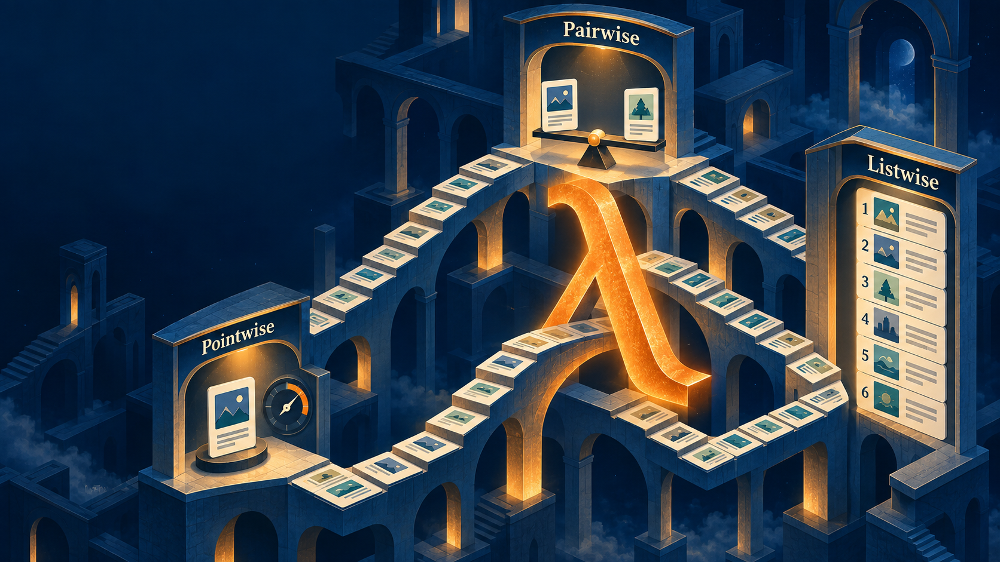

# 01 Workshop {background-color="#EF7C00"}

```{=html}
<div aria-labelledby="w07-changelog-title" style="margin:1.2em auto 0;max-width:72%;padding:.55em .8em;border-left:3px solid #003D7C;border-radius:0 6px 6px 0;background:rgba(255,255,255,.78);color:#003D7C;font-family:Arial,Helvetica,sans-serif;font-size:.42em;line-height:1.35;">
  <h5 id="w07-changelog-title" style="margin:0 0 .25em;font-size:1em;font-weight:700;letter-spacing:.04em;text-transform:uppercase;">Changelog</h5>
  <ul style="margin:0;padding-left:1.2em;">
    <li><strong class="cp-text--navy">24 Aug 2026</strong> — Refreshed the course slide deck and changelog.</li>
  </ul>
</div>
```

## Mastery Quiz: How it runs

```{=html}
<div class="cp-stack" style="margin-top:.20em;">
  <div style="display:flex;align-items:baseline;justify-content:space-between;gap:1em;">
    <span class="cp-chip cp-chip--navy">First 30 minutes · in class</span>
    <span class="cp-text--muted" style="font-size:.62em;font-weight:700;">Canvas Quiz · invigilated</span>
  </div>
  <div style="display:grid;grid-template-columns:1fr auto 1fr auto 1fr auto 1fr;align-items:stretch;gap:.18em;margin-top:.18em;">
    <div class="cp-flow-card"><strong>1 · Set up</strong><span>Sit apart, open Canvas Quiz, and screen-record your primary device.</span></div>
    <div class="cp-flow-arrow" aria-hidden="true">→</div>
    <div class="cp-flow-card"><strong>2 · Use notes</strong><span>Notes made before the quiz are allowed; a secondary device may hold them.</span></div>
    <div class="cp-flow-arrow" aria-hidden="true">→</div>
    <div class="cp-flow-card"><strong>3 · Answer fairly</strong><span>If you contributed a selected question, skip it. Your score uses the remaining questions.</span></div>
    <div class="cp-flow-arrow" aria-hidden="true">→</div>
    <div class="cp-flow-card"><strong>4 · Submit</strong><span>Submit both the Canvas Quiz and your screen recording to the assignment folder.</span></div>
  </div>
  <div class="cp-card cp-card--warning" style="margin-top:.10em;padding:.48em .72em;text-align:center;font-size:.78em;line-height:1.25;"><strong>Open book ≠ open internet.</strong> No consultation with AI, search engines, or public websites during the quiz.</div>

  <p class="cp-center" style="margin:.12em 0 0;color:#003D7C;font-size:.72em;font-weight:700;">After the quiz, we'll go over <code>e2</code> and then begin the <strong>project design critique</strong>.</p>

</div>
```

::: notes
Delivery: 2 minutes, immediately before the quiz starts. Walk through the sequence, then pause on the warning: students may use notes prepared before the quiz, but may not consult local or remote AI, search engines, or public websites. Confirm that students screen-record the primary test-taking device for the full quiz and submit the recording to the assignment folder after completing the Canvas Quiz. Remind students that a question selected from their contributed set should be skipped; grading is normalized over their remaining questions.

Source: Canvas announcement, “Week 07 - Mastery Quiz - first 25 minutes,” including the 28 Sep update. Canvas states the quiz takes about 30 minutes; use the live class instruction if timing changes.
:::

## Break — 5 minutes {background-color="#000000"}

```{=html}
<div class="cp-grid cp-grid--2-aside" style="min-height:62vh;align-items:center;color:#fff;">
  <div>
    <div class="cp-kicker cp-text--orange" style="margin-bottom:.8em;">Before critique resumes</div>
    <h2 style="color:#fff;margin:.1em 0 .45em;">☕ BREAK</h2>
    <p style="font-size:1.05em;line-height:1.42;margin:0;color:#d8d8d8;">Upload your quiz screen recording to Canvas by <strong style="color:#fff;">12:00 noon</strong>. Confirm that the file is saved, then take a short break before the project critique.</p>
  </div>
  <div class="cp-activity__timer">
    <div class="cp-timer">
      <svg width="180" height="180" viewBox="0 0 180 180" aria-label="Five-minute break timer">
        <circle cx="90" cy="90" r="75" fill="none" stroke="#333" stroke-width="14"></circle>
        <circle id="w07-break-ring" class="cp-timer__ring" cx="90" cy="90" r="75" fill="none" stroke="#EF7C00" stroke-width="14" stroke-dasharray="471.24" stroke-dashoffset="0" stroke-linecap="round" transform="rotate(-90 90 90)"></circle>
        <text id="w07-break-text" class="cp-timer__text" x="90" y="98" text-anchor="middle" font-family="Arial, Helvetica, sans-serif" font-size="32" font-weight="bold" fill="#00796B">05:00</text>
      </svg>
      <span id="w07-break-status" role="timer" aria-live="polite" class="cp-sr-only">05:00</span>
      <button id="w07-break-btn" type="button" class="cp-timer__button" data-cp-timer data-seconds="300" data-ring="w07-break-ring" data-text="w07-break-text" data-status="w07-break-status">▶ Start Timer</button>
    </div>
  </div>
</div>
```

::: notes
Delivery: 5 minutes. Announce the 12:00 noon Canvas screen-recording submission deadline, ask students to confirm their file is saved, then start the shared five-minute timer. Expected outcome: each student has submitted or has a verified recording ready to submit before the project critique begins. The timer pauses automatically if the slide is left.
:::

# 02 Announcements {background-color="#EF7C00"}

## Essay 2: Build a 10-15 minute reuseable course resource

```{=html}
<div style="display:grid;grid-template-columns:minmax(0,1fr) 2.2em minmax(0,1fr) 2.2em minmax(0,1fr);gap:.35em;align-items:stretch;margin:.55em 0;">
  <div class="cp-flow-card"><strong>Focus</strong><br>Choose a week from the two assigned weeks (one from the first half of the course, one from the second half) and reinforce one lecture example.</div>
  <div class="cp-flow-arrow" aria-hidden="true">→</div>
  <div class="cp-flow-card"><strong>Design</strong><br>Create a 15–20 minute tutorial question or programming exercise.</div>
  <div class="cp-flow-arrow" aria-hidden="true">→</div>
  <div class="cp-flow-card"><strong>Build</strong><br>Deliver the exercise in an iPython / Jupyter notebook for a future course cohort.</div>
</div>
```

- If you choose a week that has not yet run, use its description in the <strong class="cp-text--navy">course schedule</strong> to synthesise an appropriate example, explanation, and exercise flow.
  - Why choose something you haven't learned yet?  It can be helpful for your project!
- As with `e1`, you will be assigned to critique the outcome in <strong class="cp-text--teal">Week 09</strong>.
- A card-suit lens or ethics thread is <strong>optional</strong>: include one only if it genuinely strengthens the exercise.

::: notes
Delivery: 3 minutes. Announce Essay 2 as a reusable 20–30 minute learning activity for a future offering of CP4285. Students choose a week from either half of the course, then build either a tutorial question or programming exercise in an iPython / Jupyter notebook to reinforce an example from that lecture. For a future lecture, direct students to the week’s Schedule description—topics and learning outcomes—as the basis for their synthesis. Card-suit lenses and the ethics thread are optional, not requirements. Expected output: a runnable or guided notebook activity with a clear learning purpose, instructions, and solution or feedback path.

Source: Week 07 Canvas announcement and the course schedule.
:::

# 03 Project design review {background-color="#EF7C00"}

## Project Critique: How it runs

* (5 minutes per project team + 3 minutes staff critique) $\times$ 7 teams = ~1 hour
* Min will run the slides from his machine
* Zoom recording will allow you to review the feedback
* Assigned peer teams to give **constructive** comments on their assigned team on their assigned criterion category
  * Most teams have at least three members, you can assign a comment to each criterion.
  * Due by <strong class="cp-text--teal">Mon, 5 Oct 2026 · 23:59 SGT</strong>.

## Project Critique: your assigned lens

```{=html}
<div class="cp-stack" style="margin-top:.16em;">
  <div class="cp-card cp-card--prompt" style="padding:.48em .72em;font-size:.78em;">Give one <strong>constructive, specific</strong> comment on the criterion assigned to your peer team. Each team has a five-minute hard presentation limit; staff and peers ask questions afterwards.</div>
  <div class="cp-grid cp-grid--3" style="margin-top:.12em;">
    <article class="cp-card cp-card--soft" style="border-top:6px solid #EF7C00;min-height:8.5em;">
      <h3 class="cp-card__title" style="color:#003D7C;">1 · Presentation</h3>
      <ul style="margin:.36em 0 0;padding-left:1.05em;font-size:.74em;line-height:1.35;">
        <li>Clear motivation</li>
        <li>Logical structure and layout</li>
        <li>Appropriate images, plots, or figures</li>
      </ul>
    </article>
    <article class="cp-card cp-card--soft" style="border-top:6px solid #00796B;min-height:8.5em;">
      <h3 class="cp-card__title" style="color:#003D7C;">2 · Methodology</h3>
      <ul style="margin:.36em 0 0;padding-left:1.05em;font-size:.74em;line-height:1.35;">
        <li>Task, dataset, and related resources</li>
        <li>Proposed approach and evidence so far</li>
        <li>Current challenges or open questions</li>
      </ul>
    </article>
    <article class="cp-card cp-card--soft" style="border-top:6px solid #5C2D91;min-height:8.5em;">
      <h3 class="cp-card__title" style="color:#003D7C;">3 · Administration</h3>
      <ul style="margin:.36em 0 0;padding-left:1.05em;font-size:.74em;line-height:1.35;">
        <li>Distribution of workload</li>
        <li>Next steps, milestones, and timeline</li>
        <li>One actionable improvement</li>
      </ul>
    </article>
  </div>
  <p class="cp-center" style="margin:.18em 0 0;color:#00796B;font-size:.72em;font-weight:700;">Post your assigned peer comment on Canvas by Mon, 5 Oct 2026 · 23:59 SGT.</p>
</div>
```

::: notes
Delivery: 2 minutes, before the first presentation. Explain that each peer team comments through its assigned criterion lens, rather than trying to assess every aspect at once. Expected output: one specific, constructive, actionable Canvas comment grounded in an observable feature of the presentation. Instructor synthesis: make the distinction between a vague judgment and feedback that gives a team a concrete next step.

Source: Project Design Critique Template linked as Slide 8 in the Canvas Week 07 announcement; timing and peer-comment workflow are from that announcement.
:::
---

## {background-color="#ffffff"}

```{=html}
<div class="cp-frame-bg cp-frame-navy"></div>
<div class="cp-frame-content">
  <div class="cp-frame-label" style="background:#003D7C;color:#EF7C00;">Next Week Pre-Lecture Exercise</div>
  <div class="cp-frame-title cp-text--navy">One list, two plausible orders</div>
  <div class="cp-frame-body" style="color:#333;font-size:.86em;line-height:1.3;">
    <p style="margin:0 0 .50em;"><strong class="cp-text--navy">Canvas discussion board</strong> · complete by <strong class="cp-text--teal">Mon, 5 Oct 2026 · 23:59 SGT</strong></p>
    <div style="margin:0 0 .62em;padding:.78em .90em;border-left:7px solid #00796B;background:#F0F8F6;color:#003D7C;font-weight:bold;line-height:1.32;">Choose <strong>five items</strong> from a recommendation domain you used this week. Order the same set twice for different resasons.  Explain the reason by identifying one item whose position changes, and explaining why.</div>
    <p style="margin:.52em 0;"><strong>Your post:</strong> Name the domain, list both complete orders, and explain the changed position.</p>
    <p style="margin:.52em 0;">Then post a constructive reply to one classmate’s post. Name and apply one treatment lens in your comment: ♠ ♦ ♥ ♣.</p>
  </div>
</div>
```

::: notes
Delivery: 2 minutes. Direct students to Canvas and state the Monday deadline. Task: students select a recommendation domain and five items of their own, create two complete orders, write 80–120 words explaining one changed position and its trade-off, then post one 50–70 word reply using a named card-suit treatment lens. Expected output: two plausible rankings, a concrete trade-off, and one peer critique that tests the ordering through information/explanation, novelty/diversity, social influence/conformity, or gaming/robustness. Instructor synthesis next week: different ordering purposes make different errors matter; learning-to-rank makes those choices explicit.

The card suits are contextual design lenses, never labels for people or fixed groups.
:::

---

## {background-color="#002a26"}

```{=html}
<div class="cp-frame-bg cp-frame-teal" style="z-index:3;"></div>
<div class="cp-frame-content" style="inset:40px;padding:0;overflow:hidden;">
  
  <div style="position:absolute;inset:0;background:linear-gradient(90deg,rgba(0,42,38,.90) 0%,rgba(0,42,38,.58) 46%,rgba(0,42,38,.08) 78%);pointer-events:none;"></div>
  <div style="position:absolute;left:7%;right:7%;bottom:12%;color:#fff;pointer-events:none;">
    <div class="cp-frame-label" style="display:inline-block;margin:0 0 .45em;background:#00796B;color:#fff;">Next Week Preview — Week 08</div>
    <div class="cp-frame-title" style="max-width:65%;color:#80cbc4;line-height:1.05;">Learning-to-Rank</div>
  </div>
</div>
<div style="position:absolute;right:42px;bottom:42px;z-index:4;max-width:38%;padding:.34em .58em;background:rgba(0,42,38,.82);color:#d8fffa;font-family:Arial,Helvetica,sans-serif;font-size:.52em;line-height:1.3;text-align:right;pointer-events:none;">Image generated with GPT</div>
```

::: notes
Final slide.
Delivery: 1 minute. Transition from defining a defensible recommendation-system design to deciding which candidate items deserve the most visible positions. Tell students that Week 08 will compare pointwise, pairwise, and listwise objectives, then examine how position bias and fairness affect the resulting ranked list.

Image source: original CP4285 course visual generated for this deck, `assets/learning-to-rank-escher-staircase-v1.png`.
:::
